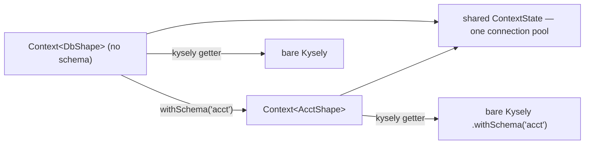

# SDK schema scoping — `Context.withSchema`


## Problem


SDK users working against schema-organized databases have no first-class way to scope a `Context` to one schema. Today every call site pays the qualification cost by hand:

- Query builder: `ctx.kysely.withSchema('accounting')` repeated per query, typed against the whole-database shape rather than the schema's slice.
- Routines: `ctx.proc('accounting.rebuild_ledger', …)` — manual string qualification on every `proc`/`func`/`tvf` call.
- Explore: per-call `schema?` args on `ctx.noorm.db.describe*`.

Missing one call site silently targets the default schema. The fix should be per-call-site sugar, not connection state — the connection layer stays schema-agnostic.


## Goals / Non-goals


- Goals:
    - `ctx.withSchema<SDB, SProcs, SFuncs, STvfs>(name)` returns a derived `Context` typed to the schema's table/routine shapes.
    - Same pool, same connection, same lifecycle — syntax sugar over Kysely's `withSchema` helper; no new connection state.
    - Query builder, transactions, and `proc`/`func`/`tvf` are all schema-scoped through the derived context.
    - Caller-supplied qualification still wins: a routine name already containing `.` passes through untouched.
- Non-goals:
    - No config/connection-level schema field. The connection does not care about schemas.
    - No raw-SQL rewriting. Unqualified names inside `` sql`…` `` fragments resolve to the connection default — inherent to Kysely's plugin model, documented, no workaround attempted.
    - No schema-defaulting of `ctx.noorm.db.describe*` args (possible follow-up, not this feature).
    - No per-dialect behavior. The qualifier means whatever the dialect says it means (see Recommendation).


## Approaches


| # | Approach | Pros | Cons |
|---|----------|------|------|
| A | Status quo, documented (`ctx.kysely.withSchema` per query) | Zero code | No typed schema slice; `proc`/`func`/`tvf` stay manual; per-query repetition; easy to miss a call site |
| B | Config-level default schema (`connection.schema` + pg `search_path` pool wiring) | Covers raw SQL on postgres | Connection layer absorbs a schema concern; mssql has no session-level default schema; per-dialect wiring; global rather than per-call-site |
| C | `Context.withSchema` derived context | Typed slice; same pool; composable per call site; no config or connection change; small surface | Raw SQL not covered (inherent to Kysely plugins); shared lifecycle state must be threaded (`#heldConnections`) |


## Recommendation


**C.** B was rejected on principle — the connection shouldn't care about schemas — and A leaves routines and typing unsolved. C is nearly fall-in because two pieces already exist:

- `quoteIdent` (`src/sdk/sql.ts:35`) already splits qualified names on the first `.` and quotes each segment per dialect (`dbo.sp_Get_Users` → `[dbo].[sp_Get_Users]`). The routine builders need zero changes; the derived context prefixes `${schema}.${name}` before delegating.
- Kysely's `Kysely.withSchema(schema)` returns a copy sharing the executor/pool, with a `WithSchemaPlugin` added at the front (`node_modules/kysely/dist/esm/kysely.js:394-398`, `withPluginAtFront`). Front position means the newest plugin qualifies identifiers first, so the last `withSchema` call wins and accidental stacking is benign. `Transaction` inherits the executor's plugins and carries its own `withSchema` (`kysely.js:507-512`), so transactions started from the wrapped instance are schema-scoped for free.

The derived context is the same `Context` class with fresh generics, sharing the parent's state. Decision rule:

```
withSchema(name):
    validate name as a sane identifier (same posture as impersonate's
        validateUsername, src/sdk/impersonate/dialect-strategy.ts) —
        quoting already prevents injection; validation fails earlier and clearer
    derived = Context sharing #state (same connection) and #heldConnections (same Set)
    derived schema = name           // replaces any parent schema — re-derive, never stack
    return derived

kysely getter:
    db = bare instance from #state.connection
    return schema set ? db.withSchema(schema) : db

proc / func / tvf:
    qualified = (schema set and name has no '.') ? schema + '.' + name : name
    delegate to the existing builders unchanged
```

Instance relationships — one pool, N typed views:



Load-bearing details:

- **`#heldConnections` must be shared.** It is per-instance today (`src/sdk/context.ts:68`); a derived context owning its own Set would let `disconnect()` strand an impersonation scope opened through the sibling instance. Both instances point at one Set.
- **The wrap always derives from the bare instance.** Core modules keep their own bare handle off the connection, so `noormDb(db).withSchema('noorm')` (`src/core/shared/tables.ts:132`) never sees the user's schema plugin. Kysely's last-wins semantics would tolerate stacking anyway; re-deriving keeps the contract obvious.
- **Impersonation composes.** `impersonate` pins a connection via `this.kysely.connection()` — called on a derived context, the pinned instance carries the schema plugin, so the impersonated scope is schema-scoped too. Coherent; worth an integration test; no extra code.
- **`noorm` namespace passes through unchanged.** Its operations are project-level (changes, run, lock, vault); a derived context exposes the same operations against the same state.
- **Dialect semantics are pass-through.** The qualifier is a schema on postgres/mssql, a database on mysql, an ATTACHed database name on sqlite. No dialect gating — Kysely's meaning is the meaning.


## Open questions


- None — shape decisions were settled in the originating session (2026-08-10): derived-context API over config-level schema; raw-SQL caveat accepted; explore schema-defaulting deferred.
