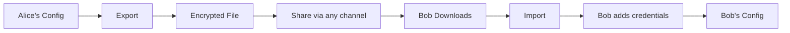
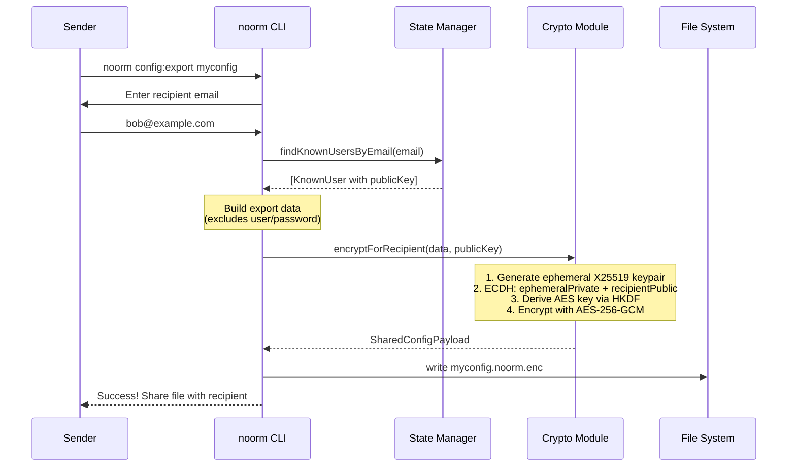
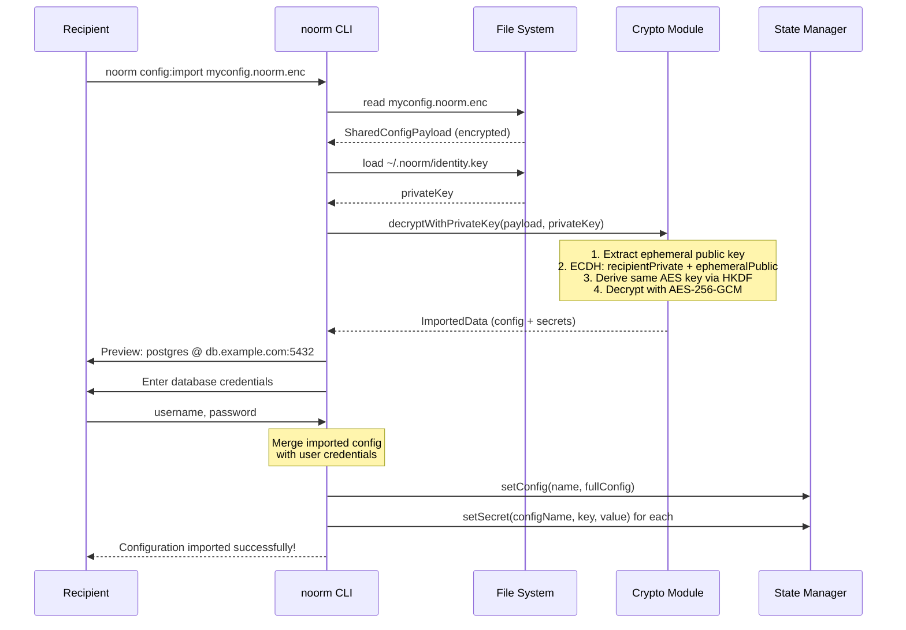
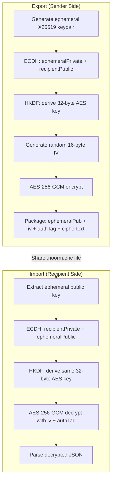

# Config Sharing


## The Problem

Database configurations contain sensitive connection details and secrets. Teams need to share these safely:

- New developer joins the team and needs database access
- CI/CD pipelines need the same config as local development
- Staging configs need to mirror production structure

Sharing configs via plaintext (email, Slack) exposes credentials. noorm solves this with encrypted config sharing using public key cryptography.


## How It Works

Config sharing uses X25519 key exchange with AES-256-GCM encryption. Each user has an identity keypair stored at `~/.noorm/`. When Alice exports a config for Bob, she encrypts it with Bob's public key. Only Bob's private key can decrypt it.

Credentials (user/password) are intentionally excluded from exports. The recipient provides their own database credentials during import. This ensures shared configs don't contain hardcoded passwords.




## Export Flow

When exporting a config, the sender:

1. Enters recipient's email address
2. noorm looks up the recipient's public key from known users
3. Config data (excluding credentials) is encrypted with recipient's public key
4. Encrypted file is written to current directory



### Export Data Structure

The exported data includes everything needed to recreate the config except credentials:

```typescript
{
    config: {
        name: 'production',
        type: 'remote',
        isTest: false,
        protected: true,
        connection: {
            dialect: 'postgres',
            host: 'db.example.com',
            port: 5432,
            database: 'myapp',
            ssl: true,
            // NO user/password
        },
        paths: {
            sql: './sql',
            changes: './changes',
        },
    },
    secrets: {
        'API_KEY': 'encrypted-value',
        'WEBHOOK_SECRET': 'another-value',
    },
}
```


## Import Flow

When importing a config, the recipient:

1. Selects or provides the `.noorm.enc` file
2. File is decrypted using recipient's private key
3. Preview shows config details (dialect, host, database, secrets count)
4. Recipient enters their database credentials
5. Config is saved with credentials, secrets are imported




## Encryption Details

noorm uses the ephemeral keypair pattern for perfect forward secrecy:



### SharedConfigPayload Structure

The encrypted file contains:

```typescript
interface SharedConfigPayload {
    version: 1;                    // Protocol version
    sender: string;                // Sender's email
    recipient: string;             // Intended recipient's email
    ephemeralPubKey: string;       // X25519 public key (hex)
    iv: string;                    // Initialization vector (hex)
    authTag: string;               // GCM authentication tag (hex)
    ciphertext: string;            // Encrypted data (hex)
}
```


## Error Handling

Import can fail at several points. Each has a specific error message:

| Error | Message | Cause |
|-------|---------|-------|
| File not found | `File not found: {path}` | Path doesn't exist |
| Invalid format | `Invalid file format. Not a valid noorm export file.` | File isn't JSON or wrong structure |
| No identity | `No private key found. Run "noorm init" first.` | Missing `~/.noorm/identity.key` |
| Wrong recipient | `Could not decrypt file. You may not be the intended recipient.` | Decryption failed - wrong key |
| Corrupted data | `Decrypted content is invalid. File may be corrupted.` | Decrypted JSON is malformed |


## Security Notes

### Why Ephemeral Keypairs?

Each export generates a fresh keypair. Even if someone obtains the recipient's private key later, they cannot decrypt old exports without the ephemeral private key (which is never stored).

### Why Exclude Credentials?

Database passwords are:
- Personal (each user has their own)
- Rotatable (change without re-sharing configs)
- Auditable (track who accessed what)

Forcing recipients to enter credentials ensures accountability.

### File Safety

The `.noorm.enc` file can be shared via any channel (email, Slack, git) because:
- Only the intended recipient can decrypt it
- Tampering is detected via GCM authentication tag
- Sender identity is verified via metadata


## Key Storage

Identity keys are stored in the user's home directory:

```
~/.noorm/
├── identity.key     # X25519 private key (0600 permissions)
├── identity.pub     # X25519 public key (0644 permissions)
└── identity.json    # Metadata (name, email, machine, os)
```

Identity is stored globally at `~/.noorm/`, separate from the project's encrypted state file (`.noorm/state.enc`). This separation means:
- Identity works across all noorm projects on your machine
- You can decrypt state files from any project with the same private key
- The private key never needs to be stored in project state


## Usage Examples

### Export a config

```bash
# Export 'production' config for a teammate
noorm config:export production
# Enter their email when prompted
# File created: production.noorm.enc
```

### Import a config

```bash
# Import a shared config
noorm config:import production.noorm.enc
# Enter your database credentials when prompted
# Config 'production' imported with your credentials
```

### Known Users

Before exporting, the recipient's public key must be known. Known users are discovered automatically when you activate a config:

```bash
# When Alice activates a shared database config, her identity syncs
noorm config use production

# Alice can now see Bob in her known users (if Bob has used this database)
noorm identity known
```

Identity sync happens automatically on `config use` - it registers your identity to the database and fetches other team members' public keys.
