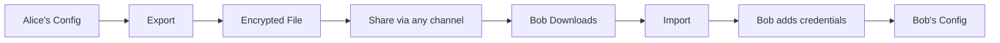
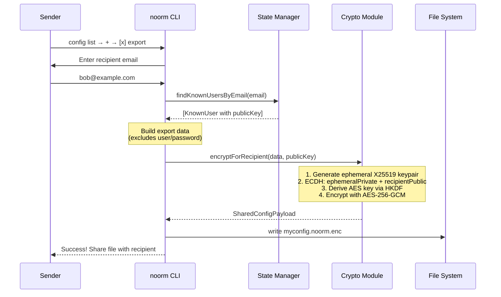
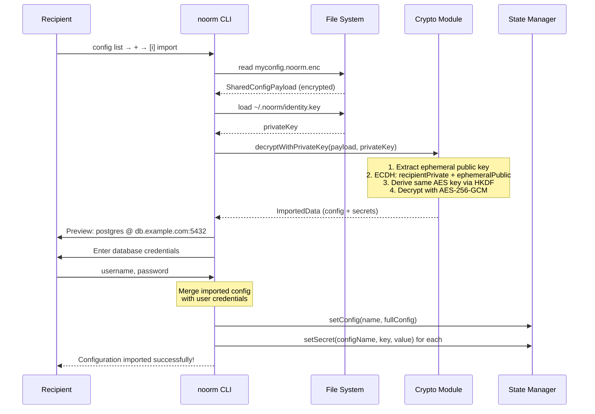
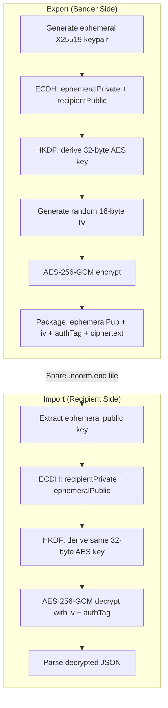

# Config Sharing


## The Problem

Database configurations contain sensitive connection details and secrets. Teams need to share these safely:

- New developer joins the team and needs database access
- CI/CD pipelines need the same config as local development
- Staging configs need to mirror production structure

Sharing configs via plaintext (email, Slack) exposes credentials. noorm solves this with encrypted config sharing using public key cryptography.


## How It Works

Config sharing uses X25519 key exchange with AES-256-GCM encryption. Each user has an identity keypair stored at `~/.noorm/`. When Alice exports a config for Bob, she encrypts it with Bob's public key. Only Bob's private key can decrypt it.

Credentials (user/password) are intentionally excluded from exports. The recipient provides their own database credentials during import. This ensures shared configs don't contain hardcoded passwords.

> **This flow is TUI-only.** It lives in `src/tui/screens/config/ConfigExportScreen.tsx` and `ConfigImportScreen.tsx`, reached from `noorm ui` → config list → `+` (more) → `[x]` export / `[i]` import.
>
> The `noorm config export` / `noorm config import` **CLI** commands are a different feature: plain, unencrypted JSON that *includes* the connection password, meant for backup and same-owner machine transfer. `config export` is gated on `secret:read` for exactly that reason. Do not send its output to a teammate.


```mermaid
flowchart LR
    A[Alice's Config] --> B[Export]
    B --> C[Encrypted File]
    C --> D[Share via any channel]
    D --> E[Bob Downloads]
    E --> F[Import]
    F --> G[Bob adds credentials]
    G --> H[Bob's Config]
```


## Export Flow

When exporting a config, the sender:

1. Enters recipient's email address
2. noorm looks up the recipient's public key from known users
3. Config data (excluding credentials) is encrypted with recipient's public key
4. Encrypted file is written to current directory


```mermaid
sequenceDiagram
    participant User as Sender
    participant CLI as noorm CLI
    participant State as State Manager
    participant Crypto as Crypto Module
    participant FS as File System

    User->>CLI: config list → + → [x] export
    CLI->>User: Enter recipient email
    User->>CLI: bob@example.com
    CLI->>State: findKnownUsersByEmail(email)
    State-->>CLI: [KnownUser with publicKey]

    Note over CLI: Build export data<br/>(excludes user/password)

    CLI->>Crypto: encryptForRecipient(data, publicKey)

    Note over Crypto: 1. Generate ephemeral X25519 keypair<br/>2. ECDH: ephemeralPrivate + recipientPublic<br/>3. Derive AES key via HKDF<br/>4. Encrypt with AES-256-GCM

    Crypto-->>CLI: SharedConfigPayload
    CLI->>FS: write myconfig.noorm.enc
    CLI-->>User: Success! Share file with recipient
```

### Export Data Structure

The exported data includes everything needed to recreate the config except credentials:

```typescript
{
    config: {
        name: 'production',
        type: 'remote',
        isTest: false,
        access: { user: 'operator', agent: 'viewer' },
        protected: true,        // legacy mirror of `access`, for old importers
        connection: {
            dialect: 'postgres',
            host: 'db.example.com',
            port: 5432,
            database: 'myapp',
            ssl: true,
            // NO user/password
        },
    },
    secrets: {
        'API_KEY': 'sk-live-...',        // plaintext inside the encrypted envelope
        'WEBHOOK_SECRET': 'whsec-...',
    },
}
```

`access` is the source of truth; `protected` rides along so an as-yet-unupgraded importer still reaches a safe (if coarser) access decision. `paths` is *not* exported — the recipient's project layout is their own.

The `secrets` map holds every config-scoped secret in the clear. It is protected only by the AES-256-GCM envelope around the whole JSON blob, so treat exporting as handing the recipient those values outright.


## Import Flow

When importing a config, the recipient:

1. Selects or provides the `.noorm.enc` file
2. File is decrypted using recipient's private key
3. Preview shows config details (dialect, host, database, secrets count)
4. Recipient enters their database credentials
5. Config is saved with credentials, secrets are imported


```mermaid
sequenceDiagram
    participant User as Recipient
    participant CLI as noorm CLI
    participant FS as File System
    participant Crypto as Crypto Module
    participant State as State Manager

    User->>CLI: config list → + → [i] import
    CLI->>FS: read myconfig.noorm.enc
    FS-->>CLI: SharedConfigPayload (encrypted)

    CLI->>FS: load ~/.noorm/identity.key
    FS-->>CLI: privateKey

    CLI->>Crypto: decryptWithPrivateKey(payload, privateKey)

    Note over Crypto: 1. Extract ephemeral public key<br/>2. ECDH: recipientPrivate + ephemeralPublic<br/>3. Derive same AES key via HKDF<br/>4. Decrypt with AES-256-GCM

    Crypto-->>CLI: ImportedData (config + secrets)

    CLI->>User: Preview: postgres @ db.example.com:5432
    CLI->>User: Enter database credentials
    User->>CLI: username, password

    Note over CLI: Merge imported config<br/>with user credentials

    CLI->>State: setConfig(name, fullConfig)
    CLI->>State: setSecret(configName, key, value) for each

    CLI-->>User: Configuration imported successfully!
```


## Encryption Details

noorm uses the ephemeral keypair pattern (ephemeral-static ECDH). HKDF is SHA-256 with an empty salt and the context string `noorm-config-share`; the IV is 16 random bytes per export:


```mermaid
flowchart TB
    subgraph Sender["Export (Sender Side)"]
        A[Generate ephemeral X25519 keypair] --> B[ECDH: ephemeralPrivate + recipientPublic]
        B --> C[HKDF: derive 32-byte AES key]
        C --> D[Generate random 16-byte IV]
        D --> E[AES-256-GCM encrypt]
        E --> F[Package: ephemeralPub + iv + authTag + ciphertext]
    end

    subgraph Recipient["Import (Recipient Side)"]
        G[Extract ephemeral public key] --> H[ECDH: recipientPrivate + ephemeralPublic]
        H --> I[HKDF: derive same 32-byte AES key]
        I --> J[AES-256-GCM decrypt with iv + authTag]
        J --> K[Parse decrypted JSON]
    end

    F -.->|"Share .noorm.enc file"| G
```

### SharedConfigPayload Structure

The encrypted file contains:

```typescript
interface SharedConfigPayload {
    version: 1;                    // Protocol version
    sender: string;                // Sender's email
    recipient: string;             // Intended recipient's email
    ephemeralPubKey: string;       // X25519 public key (hex)
    iv: string;                    // Initialization vector (hex)
    authTag: string;               // GCM authentication tag (hex)
    ciphertext: string;            // Encrypted data (hex)
}
```


## Error Handling

Import can fail at several points. Each has a specific error message:

| Error | Message | Cause |
|-------|---------|-------|
| File not found | `File not found: {path}` | Path doesn't exist |
| Unreadable | `Could not read file.` | Path exists but the read failed (permissions, directory) |
| Invalid format | `Invalid file format. Not a valid noorm export file.` | File isn't JSON or wrong structure |
| No identity | `No private key found. Run "noorm init" first.` | Missing `~/.noorm/identity.key` |
| Wrong recipient | `Could not decrypt file. You may not be the intended recipient.` | Decryption failed - wrong key |
| Corrupted data | `Decrypted content is invalid. File may be corrupted.` | Decrypted JSON is malformed |


## Security Notes

### Why Ephemeral Keypairs?

Each export generates a fresh keypair, so no two exports share a wrapping key and the sender needs no long-term secret of their own to encrypt.

**This is not forward secrecy.** The exchange is ephemeral-static: the recipient's key is long-lived, and `decryptWithPrivateKey` needs nothing but that key plus the `ephemeralPubKey` stored in the file itself. Anyone who obtains the recipient's private key can decrypt every `.noorm.enc` file ever sent to them, past and future. Treat a leaked `~/.noorm/identity.key` as a compromise of every shared config and every secret in them.

### Why Exclude Credentials?

Database passwords are:
- Personal (each user has their own)
- Rotatable (change without re-sharing configs)
- Auditable (track who accessed what)

Forcing recipients to enter credentials ensures accountability.

### File Safety

The `.noorm.enc` file can be shared via any channel (email, Slack, git) because:
- Only the intended recipient can decrypt it
- Tampering with the *ciphertext* is detected via the GCM authentication tag

The `sender` and `recipient` fields are **not** authenticated. They sit alongside the ciphertext as plain JSON, and no AAD is bound into the GCM tag, so anyone can edit them without breaking decryption. They are display metadata, not proof of origin — a successful decrypt tells you the file was sealed to your public key, and nothing about who sealed it.


## Key Storage

Identity keys are stored in the user's home directory:

```
~/.noorm/
├── identity.key     # X25519 private key, hex PKCS8 DER (0600 permissions)
├── identity.pub     # X25519 public key, hex SPKI DER (0644 permissions)
└── identity.json    # Metadata: identityHash, name, email, publicKey, machine, os, createdAt
```

`identityHash` is `SHA-256(email + '\0' + name + '\0' + machine + '\0' + os)` — the stable handle the database and the vault use to address a user.

Identity is stored globally at `~/.noorm/`, separate from the project's encrypted state file (`.noorm/state/state.enc`). This separation means:
- Identity works across all noorm projects on your machine
- You can decrypt state files from any project with the same private key
- The private key never needs to be stored in project state


## Usage Examples

### Export a config

```
noorm ui  →  config list  →  +  →  [x] export
# Pick 'production', enter the teammate's email
# File created in the cwd: production.noorm.enc
```

### Import a config

```
noorm ui  →  config list  →  +  →  [i] import
# Select production.noorm.enc, enter your own database credentials
# Config 'production' imported with your credentials
```

There is no headless equivalent. `noorm config export|import` is the unencrypted JSON backup path described above, not this one.

### Known Users

Before exporting, the recipient's public key must be known. Known users are discovered automatically when you activate a config:

```bash
# When Alice activates a shared database config, her identity syncs
noorm config use production

# Alice can now see Bob in her known users (if Bob has used this database)
noorm identity list
```

Identity sync happens automatically on `config use` - it registers your identity to the database and fetches other team members' public keys.
