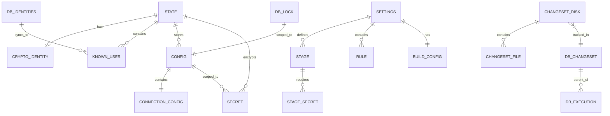

# Data Model Reference


## Overview

This document consolidates all data structures used across noorm. It serves as a single reference for types, database schemas, file formats, and their relationships.

noorm separates data into three tiers:

| Tier | Storage | Encryption | Versioned |
|------|---------|------------|-----------|
| **State** | `.noorm/state.enc` | AES-256-GCM | Git-ignored |
| **Settings** | `.noorm/settings.yml` | None | Committed |
| **Database** | Target database | N/A | Tracked in-db |

State holds secrets and credentials. Settings holds team-shared rules. Database tables track execution history.


## Entity Relationship Diagram




---


## State (Encrypted)


### State File

The encrypted state file at `.noorm/state.enc` contains all sensitive configuration.

| Field | Type | Description |
|-------|------|-------------|
| version | string | noorm version for migrations |
| identity | CryptoIdentity? | User's cryptographic identity |
| knownUsers | Map | Known users discovered from databases |
| activeConfig | string? | Currently selected config name |
| configs | Map | Database configurations by name |
| secrets | Map | Config-scoped secrets (configName → key → value) |
| globalSecrets | Map | App-level secrets shared across configs |


### Encrypted Payload

On-disk format for the state file.

| Field | Type | Description |
|-------|------|-------------|
| algorithm | string | Always `aes-256-gcm` |
| iv | string | Initialization vector (base64) |
| authTag | string | Authentication tag (base64) |
| ciphertext | string | Encrypted state JSON (base64) |

The encryption key derives from machine-specific identifiers or the user's cryptographic identity passphrase.


---


## Configuration


### Config

A database connection profile stored in encrypted state.

| Field | Type | Required | Description |
|-------|------|----------|-------------|
| name | string | Yes | Unique identifier (e.g., `dev`, `staging`, `prod`) |
| type | enum | Yes | `local` or `remote` |
| isTest | boolean | Yes | Marks database as disposable for testing |
| protected | boolean | Yes | Requires confirmation for dangerous operations |
| connection | ConnectionConfig | Yes | Database connection details |
| paths | PathConfig | Yes | File system paths for schema and changes |
| identity | string | No | Override identity for `executed_by` field |


### ConnectionConfig

Database connection parameters.

| Field | Type | Required | Description |
|-------|------|----------|-------------|
| dialect | enum | Yes | `postgres`, `mysql`, `sqlite`, or `mssql` |
| host | string | Network | Hostname (required for non-SQLite) |
| port | number | No | Port number (defaults by dialect) |
| database | string | Yes | Database name |
| filename | string | SQLite | File path for SQLite databases |
| user | string | No | Database username |
| password | string | No | Database password |
| ssl | boolean or object | No | SSL/TLS configuration |
| pool | object | No | Connection pool settings (`min`, `max`) |

**Default ports by dialect:**

| Dialect | Default Port |
|---------|--------------|
| postgres | 5432 |
| mysql | 3306 |
| mssql | 1433 |
| sqlite | N/A |


### PathConfig

File system paths for schema and changes.

| Field | Type | Description |
|-------|------|-------------|
| schema | string | Path to schema directory |
| changes | string | Path to changes directory |


### ConfigSummary

Lightweight config view for listings. Omits sensitive connection details.

| Field | Type | Description |
|-------|------|-------------|
| name | string | Config identifier |
| type | enum | `local` or `remote` |
| isTest | boolean | Test database flag |
| protected | boolean | Protection enabled |
| isActive | boolean | Currently selected config |


### Config Resolution Order

Configs merge from five sources in priority order:

```
CLI flags > Environment > Stored config > Stage defaults > Defaults
```

Higher priority sources override lower ones, enabling flexible overrides for CI/CD.


---


## Settings


### Settings File

The `.noorm/settings.yml` file configures project-wide behavior. Unlike state, this file is not encrypted and should be version controlled.

```yaml
# .noorm/settings.yml
build:
    include:
        - tables/**/*.sql
        - views/**/*.sql
    exclude:
        - '**/*.test.sql'

paths:
    sql: db/sql
    changes: db/changes

stages:
    dev:
        description: Development database
        defaults:
            dialect: postgres
            isTest: true
    prod:
        description: Production database
        locked: true
        defaults:
            dialect: postgres
            protected: true
        secrets:
            - key: DB_PASSWORD
              type: password
              required: true

rules:
    - match:
          protected: true
      exclude:
          - '**/*.seed.sql'

strict:
    enabled: true
    stages:
        - dev
        - staging
        - prod

logging:
    enabled: true
    level: info
    file: .noorm/noorm.log
    maxSize: 10mb
    maxFiles: 5
```


### BuildConfig

Controls which files are included in build operations.

| Field | Type | Description |
|-------|------|-------------|
| include | string[] | Glob patterns for included files (execution order) |
| exclude | string[] | Glob patterns for excluded files |

Files are executed in the order they appear in `include`. If not specified, all `.sql` files in the schema directory are included.


### PathConfig (Settings)

Override default file locations.

| Field | Type | Default | Description |
|-------|------|---------|-------------|
| schema | string | `schema` | Path to schema files |
| changes | string | `changes` | Path to change directories |


### Stage

A stage is a config template that provides defaults and enforces constraints.

| Field | Type | Description |
|-------|------|-------------|
| description | string? | Human-readable description |
| locked | boolean? | When true, linked configs cannot be deleted |
| defaults | StageDefaults? | Default values for new configs |
| secrets | StageSecret[] | Required secrets for completeness |


### StageDefaults

Initial values when creating a config from a stage.

| Field | Type | Description |
|-------|------|-------------|
| dialect | enum? | Default database dialect |
| host | string? | Default hostname |
| port | number? | Default port |
| database | string? | Default database name |
| user | string? | Default username |
| password | string? | Default password |
| ssl | boolean? | Default SSL setting |
| isTest | boolean? | Default test flag |
| protected | boolean? | Default protection (cannot be overridden if true) |


### StageSecret

Defines a required secret for configs linked to a stage.

| Field | Type | Default | Description |
|-------|------|---------|-------------|
| key | string | Required | Secret identifier |
| type | enum | `string` | `string`, `password`, `api_key`, or `connection_string` |
| description | string? | — | Human-readable description |
| required | boolean | `true` | Whether the secret must be set for completeness |


### Rule

Conditional file inclusion/exclusion based on config properties.

| Field | Type | Description |
|-------|------|-------------|
| match | RuleMatch | Conditions that trigger this rule |
| include | string[]? | Additional glob patterns to include |
| exclude | string[]? | Additional glob patterns to exclude |


### RuleMatch

Conditions for rule evaluation.

| Field | Type | Description |
|-------|------|-------------|
| name | string? | Match config by name |
| protected | boolean? | Match by protection status |
| isTest | boolean? | Match by test flag |
| type | enum? | Match by `local` or `remote` |

All specified conditions must match for the rule to apply.


### StrictConfig

Enforce stage usage.

| Field | Type | Description |
|-------|------|-------------|
| enabled | boolean? | Enable strict mode |
| stages | string[]? | Required stages (configs must link to one) |


### LoggingConfig

File logging configuration.

| Field | Type | Default | Description |
|-------|------|---------|-------------|
| enabled | boolean | `true` | Enable file logging |
| level | enum | `info` | `silent`, `error`, `warn`, `info`, or `verbose` |
| file | string | `.noorm/noorm.log` | Log file path |
| maxSize | string | `10mb` | Maximum file size before rotation |
| maxFiles | number | `5` | Maximum rotated files to keep |


---


## Identity


### Identity (Audit)

Simple identity used for tracking who executed database operations.

| Field | Type | Description |
|-------|------|-------------|
| name | string | Display name |
| email | string? | Email address |
| source | enum | How identity was resolved |

**Identity sources (in resolution order):**

| Priority | Source | Description |
|----------|--------|-------------|
| 1 | `config` | Override specified in config (for bots/services) |
| 2 | `state` | From encrypted state file (crypto identity) |
| 3 | `env` | `NOORM_IDENTITY` env var (CI pipelines) |
| 4 | `git` | From git user.name and user.email |
| 5 | `system` | From OS username |

The resolver tries each source until it finds a valid identity.


### CryptoIdentity

Full cryptographic identity for secure config sharing. Stored in encrypted state.

| Field | Type | Description |
|-------|------|-------------|
| identityHash | string | SHA-256 of canonical identity string |
| name | string | Display name |
| email | string | Email address |
| publicKey | string | X25519 public key (hex) |
| machine | string | Machine hostname |
| os | string | OS platform and version |
| createdAt | string | ISO 8601 timestamp |

**Identity hash calculation:**

```
SHA256(email + '\0' + name + '\0' + machine + '\0' + os)
```

The same user on different machines has different identities with different keypairs.


### KnownUser

Cached identity discovered from database sync. Enables secure config sharing with team members.

| Field | Type | Description |
|-------|------|-------------|
| identityHash | string | SHA-256 of canonical identity string |
| email | string | User email |
| name | string | Display name |
| publicKey | string | X25519 public key (hex) |
| machine | string | Machine hostname |
| os | string | OS platform and version |
| lastSeen | string | ISO 8601 timestamp of last activity |
| source | string | Config name where discovered |


### Key Files

Cryptographic keys are stored outside the project directory.

```
~/.noorm/
├── identity.key        # X25519 private key (hex, mode 600)
└── identity.pub        # X25519 public key (hex, mode 644)
```

The private key never leaves the user's machine. The public key is shared via database identity tables.


---


## Encrypted Sharing


### SharedConfigPayload

Format for encrypted config export files (`*.noorm.enc`).

| Field | Type | Description |
|-------|------|-------------|
| version | number | Payload format version |
| sender | string | Sender's email |
| recipient | string | Recipient's email |
| ephemeralPubKey | string | Ephemeral X25519 public key (hex) |
| iv | string | Initialization vector (hex) |
| authTag | string | Authentication tag (hex) |
| ciphertext | string | Encrypted config (hex) |


### ExportedConfig

The decrypted contents of a shared config.

| Field | Type | Description |
|-------|------|-------------|
| name | string | Config name |
| dialect | string | Database dialect |
| connection | object | Host, port, database, ssl, pool (no user/password) |
| paths | object | Schema and change directories |
| isTest | boolean | Test database flag |
| protected | boolean | Protection status |
| secrets | Map | Config-scoped secrets |

**Note:** `user` and `password` are intentionally omitted. Recipients provide their own credentials on import.


---


## Database Tables

noorm creates five tracking tables in the target database. All table names are prefixed with `__noorm_` to avoid conflicts.


### `__noorm_version__`

Tracks noorm CLI version for internal schema migrations.

| Column | Type | Constraints | Description |
|--------|------|-------------|-------------|
| id | serial | PK | Primary key |
| cli_version | varchar(50) | NOT NULL | noorm version (semver) |
| noorm_version | integer | NOT NULL | Tracking table schema version |
| state_version | integer | NOT NULL | State file format version |
| settings_version | integer | NOT NULL | Settings file format version |
| installed_at | timestamp | NOT NULL, DEFAULT NOW() | First installation |
| upgraded_at | timestamp | NOT NULL, DEFAULT NOW() | Last upgrade |

This table tracks noorm's internal schema, not the user's database schema.


### `__noorm_change__`

Tracks all operation batches—changes, builds, and ad-hoc runs.

| Column | Type | Constraints | Description |
|--------|------|-------------|-------------|
| id | serial | PK | Primary key |
| name | varchar(255) | NOT NULL | Operation identifier |
| change_type | varchar(50) | NOT NULL | `build`, `run`, or `change` |
| direction | varchar(50) | NOT NULL | `change` or `revert` |
| checksum | varchar(64) | NOT NULL | SHA-256 of sorted file checksums |
| executed_at | timestamp | NOT NULL, DEFAULT NOW() | When executed |
| executed_by | varchar(255) | NOT NULL | Identity string |
| config_name | varchar(255) | NOT NULL | Which config was used |
| cli_version | varchar(50) | NOT NULL | noorm version |
| status | varchar(50) | NOT NULL | `pending`, `success`, `failed`, `reverted` |
| error_message | text | NOT NULL | Error details (empty = no error) |
| duration_ms | integer | NOT NULL | Execution time (0 = never ran) |

**Name formats by change type:**

| Change Type | Format | Example |
|-------------|--------|---------|
| change | Folder name | `2024-01-15_add-users` |
| build | `build:{timestamp}` | `build:2024-01-15T10:30:00` |
| run | `run:{timestamp}` | `run:2024-01-15T10:30:00` |


### `__noorm_executions__`

Tracks individual file executions within an operation.

| Column | Type | Constraints | Description |
|--------|------|-------------|-------------|
| id | serial | PK | Primary key |
| change_id | integer | FK, NOT NULL | Parent operation |
| filepath | varchar(500) | NOT NULL | Executed file path |
| file_type | varchar(10) | NOT NULL | `sql` or `txt` |
| checksum | varchar(64) | NOT NULL | SHA-256 of file contents |
| cli_version | varchar(50) | NOT NULL | noorm version |
| status | varchar(50) | NOT NULL | `pending`, `success`, `failed`, `skipped` |
| error_message | text | NOT NULL | Error details (empty = no error) |
| skip_reason | varchar(100) | NOT NULL | Why skipped (empty = not skipped) |
| duration_ms | integer | NOT NULL | Execution time (0 = never ran) |


### `__noorm_lock__`

Prevents concurrent operations on the same database.

| Column | Type | Constraints | Description |
|--------|------|-------------|-------------|
| id | serial | PK | Primary key |
| config_name | varchar(255) | UNIQUE, NOT NULL | Lock scope |
| locked_by | varchar(255) | NOT NULL | Identity of holder |
| locked_at | timestamp | NOT NULL, DEFAULT NOW() | When acquired |
| expires_at | timestamp | NOT NULL | Auto-expiry time |
| reason | varchar(255) | NOT NULL | Lock reason (empty = none) |

Locks automatically expire to prevent deadlocks from crashed processes.


### `__noorm_identities__`

Stores user identities for team discovery.

| Column | Type | Constraints | Description |
|--------|------|-------------|-------------|
| id | serial | PK | Primary key |
| identity_hash | varchar(64) | UNIQUE, NOT NULL | SHA-256 of identity |
| email | varchar(255) | NOT NULL | User email |
| name | varchar(255) | NOT NULL | Display name |
| machine | varchar(255) | NOT NULL | Machine hostname |
| os | varchar(255) | NOT NULL | OS platform and version |
| public_key | text | NOT NULL | X25519 public key (hex) |
| registered_at | timestamp | NOT NULL, DEFAULT NOW() | First registration |
| last_seen_at | timestamp | NOT NULL, DEFAULT NOW() | Last activity |

Auto-populated on first database connection when cryptographic identity is configured.


---


## File System Structures


### Change Directory

Changes live on disk as directories with a specific structure.

```
changes/
└── 2024-01-15_add-email-verification/
    ├── change/
    │   ├── 001_add-column.sql
    │   ├── 002_update-data.sql
    │   └── 003_files.txt
    ├── revert/
    │   ├── 001_drop-column.sql
    │   └── 002_restore-data.sql
    └── changelog.md
```


### Change (Parsed)

When read from disk, changes are parsed into:

| Field | Type | Description |
|-------|------|-------------|
| name | string | Folder name (e.g., `2024-01-15_add-email-verification`) |
| path | string | Absolute path to directory |
| date | Date? | Parsed from name prefix (YYYY-MM-DD) |
| description | string | Human-readable, derived from name |
| changeFiles | ChangeFile[] | Files in `change/` subdirectory |
| revertFiles | ChangeFile[] | Files in `revert/` subdirectory |
| hasChangelog | boolean | Whether `changelog.md` exists |


### ChangeFile

Individual file within a change.

| Field | Type | Description |
|-------|------|-------------|
| filename | string | File name (e.g., `001_alter-users.sql`) |
| path | string | Absolute path |
| type | enum | `sql` or `txt` |
| resolvedPaths | string[]? | For `.txt` files, paths to referenced files |
| status | enum? | Runtime status after execution |
| skipReason | string? | Why file was skipped |

**File types:**

| Type | Extension | Purpose |
|------|-----------|---------|
| sql | `.sql`, `.sql.tmpl` | Direct SQL execution (with optional templating) |
| txt | `.txt` | Manifest file listing paths to execute |


### Change Naming

Change folder names follow a convention:

```
{date}_{description}
```

| Component | Format | Example |
|-----------|--------|---------|
| date | `YYYY-MM-DD` | `2024-01-15` |
| description | kebab-case | `add-email-verification` |

The date prefix ensures chronological ordering. The description provides context.


---


## Runtime Types


### Operation Status

Used in `__noorm_change__` and change results.

| Status | Meaning |
|--------|---------|
| pending | Not yet executed |
| success | Completed successfully |
| failed | Execution failed |
| reverted | Was applied, then rolled back |


### Execution Status

Used in `__noorm_executions__` and file results.

| Status | Meaning |
|--------|---------|
| pending | Not yet executed |
| success | Completed successfully |
| failed | Execution failed |
| skipped | Skipped (see skip reason) |


### Skip Reasons

| Reason | Meaning |
|--------|---------|
| unchanged | File checksum matches previous run |
| already-run | File was already executed successfully |
| change failed | Parent change failed |


### Lock

Active lock state returned by lock operations.

| Field | Type | Description |
|-------|------|-------------|
| lockedBy | string | Identity of holder |
| lockedAt | Date | When acquired |
| expiresAt | Date | Auto-expiry time |
| reason | string? | Why lock was acquired |


### Lock Options

Options for lock acquisition.

| Field | Type | Default | Description |
|-------|------|---------|-------------|
| timeout | number | 300,000 (5 min) | Lock duration in ms |
| wait | boolean | false | Block until available |
| waitTimeout | number | 30,000 (30 sec) | Maximum wait time in ms |
| pollInterval | number | 1,000 (1 sec) | Check interval in ms |
| reason | string? | — | Lock reason |


### Run Options

Options for file execution.

| Field | Type | Default | Description |
|-------|------|---------|-------------|
| force | boolean | false | Re-run even if unchanged |
| concurrency | number | 1 | Parallel file execution |
| abortOnError | boolean | true | Stop on first failure |
| dryRun | boolean | false | Render to temp without executing |
| preview | boolean | false | Output SQL without executing |
| output | string? | — | Write rendered SQL to file |

**Note:** Concurrency defaults to 1 (sequential) because DDL operations often cannot run in parallel.


---


## Template Context


### Template Context Object (`$`)

Available in `.sql.tmpl` templates via Eta.

| Property | Type | Description |
|----------|------|-------------|
| `$.<filename>` | any | Auto-loaded data from co-located files |
| `$.config` | object | Active config values |
| `$.secrets` | Map | Config-scoped secrets |
| `$.globalSecrets` | Map | App-level secrets |
| `$.env` | Map | Environment variables |


### Built-in Helpers

| Helper | Signature | Description |
|--------|-----------|-------------|
| `$.include(path)` | string → Promise\<string\> | Include another SQL file |
| `$.escape(value)` | string → string | SQL-escape a string |
| `$.quote(value)` | any → string | Escape and quote a value |
| `$.json(value)` | any → string | JSON stringify |
| `$.now()` | () → string | Current ISO timestamp |
| `$.uuid()` | () → string | Generate UUID v4 |


### Data File Auto-Loading

Files co-located with templates are automatically loaded.

| Extension | Loader | Result |
|-----------|--------|--------|
| .json, .json5 | JSON parser | Object |
| .yaml, .yml | YAML parser | Object |
| .csv | CSV parser | Array of objects |
| .js, .mjs, .ts | Dynamic import | Default export |
| .sql | File read | String |

Data files are available on `$` by filename without extension:

```
sql/
├── users.sql.tmpl      # Template
├── users.json          # Available as $.users
└── seed-data.csv       # Available as $.seedData
```


---


## Version Management


### Version Layers

noorm tracks versions across three layers:

| Layer | Storage | Purpose |
|-------|---------|---------|
| schema | Database table | Tracking table structure |
| state | State file | Encrypted state format |
| settings | Settings file | Settings YAML format |

Each layer has independent migrations that run automatically when version mismatches are detected.


### Current Versions

| Layer | Current Version |
|-------|-----------------|
| schema | 1 |
| state | 1 |
| settings | 1 |


---


## Lifecycle States


### Application States

| State | Meaning |
|-------|---------|
| idle | Not started |
| starting | Initialization in progress |
| running | Normal operation |
| shutting_down | Graceful shutdown in progress |
| stopped | Clean shutdown complete |
| failed | Error during startup or shutdown |


### Shutdown Phases

Shutdown proceeds through ordered phases:

| Phase | Order | Purpose |
|-------|-------|---------|
| stopping | 1 | Stop accepting new operations |
| completing | 2 | Wait for in-flight operations |
| releasing | 3 | Release database locks |
| flushing | 4 | Flush logger buffers |
| exiting | 5 | Final cleanup |


### Default Timeouts

| Phase | Default |
|-------|---------|
| Operations | 30 seconds |
| Locks | 5 seconds |
| Connections | 10 seconds |
| Logger | 10 seconds |


---


## Database Exploration

The explore module provides schema introspection across dialects.


### ExploreCategory

Object types that can be explored:

| Category | Description |
|----------|-------------|
| `tables` | Database tables |
| `views` | Views and materialized views |
| `procedures` | Stored procedures |
| `functions` | User-defined functions |
| `types` | Custom types, enums, domains |
| `indexes` | Table indexes |
| `foreignKeys` | Foreign key constraints |
| `triggers` | Table triggers |
| `locks` | Active database locks |
| `connections` | Active sessions |


### ExploreOverview

Count of objects in each category, returned by `getOverview()`.

| Field | Type | Description |
|-------|------|-------------|
| tables | number | Table count |
| views | number | View count |
| procedures | number | Stored procedure count |
| functions | number | Function count |
| types | number | Custom type count |
| indexes | number | Index count |
| foreignKeys | number | Foreign key count |
| triggers | number | Trigger count |
| locks | number | Active lock count |
| connections | number | Active connection count |


### Summary Types

Brief metadata for list views.

**TableSummary:**

| Field | Type | Description |
|-------|------|-------------|
| name | string | Table name |
| schema | string? | Schema/database name |
| columnCount | number | Number of columns |
| rowCountEstimate | number? | Estimated row count |

**ViewSummary:**

| Field | Type | Description |
|-------|------|-------------|
| name | string | View name |
| schema | string? | Schema/database name |
| columnCount | number | Number of columns |
| isUpdatable | boolean | Whether view is updatable |

**IndexSummary:**

| Field | Type | Description |
|-------|------|-------------|
| name | string | Index name |
| tableName | string | Parent table |
| columns | string[] | Indexed columns |
| isUnique | boolean | Unique constraint |
| isPrimary | boolean | Primary key index |

**ForeignKeySummary:**

| Field | Type | Description |
|-------|------|-------------|
| name | string | Constraint name |
| tableName | string | Source table |
| columns | string[] | Source columns |
| referencedTable | string | Target table |
| referencedColumns | string[] | Target columns |
| onDelete | string? | Delete action |
| onUpdate | string? | Update action |


### Detail Types

Full metadata for detail views.

**ColumnDetail:**

| Field | Type | Description |
|-------|------|-------------|
| name | string | Column name |
| dataType | string | SQL data type |
| isNullable | boolean | Allows NULL |
| defaultValue | string? | Default expression |
| isPrimaryKey | boolean | Part of primary key |
| ordinalPosition | number | Column order |

**TableDetail:**

| Field | Type | Description |
|-------|------|-------------|
| name | string | Table name |
| schema | string? | Schema name |
| columns | ColumnDetail[] | All columns |
| indexes | IndexSummary[] | Associated indexes |
| foreignKeys | ForeignKeySummary[] | Outgoing foreign keys |
| rowCountEstimate | number? | Estimated rows |


---


## SQL Terminal

The sql-terminal module provides ad-hoc SQL execution with history tracking.


### SqlHistoryEntry

A single query execution record.

| Field | Type | Description |
|-------|------|-------------|
| id | string | UUID v4 identifier |
| query | string | SQL query executed |
| executedAt | Date | Execution timestamp |
| durationMs | number | Execution duration in ms |
| success | boolean | Whether execution succeeded |
| errorMessage | string? | Error details if failed |
| rowCount | number? | Rows returned or affected |
| resultsFile | string? | Path to gzipped results |


### SqlExecutionResult

Full result from query execution.

| Field | Type | Description |
|-------|------|-------------|
| success | boolean | Execution status |
| errorMessage | string? | Error if failed |
| columns | string[]? | Column names from result set |
| rows | object[]? | Row data as key-value objects |
| rowsAffected | number? | Rows affected (INSERT/UPDATE/DELETE) |
| durationMs | number | Execution time in ms |


### SqlHistoryFile

Persistent history stored at `.noorm/sql-history/{configName}.json`.

| Field | Type | Description |
|-------|------|-------------|
| version | string | Schema version |
| entries | SqlHistoryEntry[] | History entries (newest first) |


### ClearResult

Result of clearing history.

| Field | Type | Description |
|-------|------|-------------|
| entriesRemoved | number | History entries deleted |
| filesRemoved | number | Result files deleted |


---


## Summary

noorm's data model spans three tiers with clear separation of concerns:

1. **Encrypted State** - Secrets, credentials, configs (`.noorm/state.enc`)
2. **Settings** - Team rules, stages, build config (`.noorm/settings.yml`)
3. **Database Tables** - Execution history, locks, identities (`__noorm_*`)

The change file system provides versioned migrations, while runtime types enable flexible execution modes (dry run, preview, force).

All types follow consistent patterns:
- Clear status enums for operation tracking
- Duration timing on all executions
- Error messages alongside status
- Checksum-based change detection
