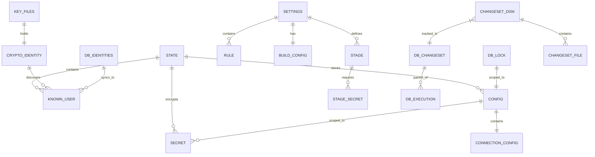

# Data Model Reference


## Overview

This document consolidates all data structures used across noorm. It serves as a single reference for types, database schemas, file formats, and their relationships.

noorm separates data into three tiers:

| Tier | Storage | Encryption | Versioned |
|------|---------|------------|-----------|
| **State** | `.noorm/state/state.enc` | AES-256-GCM | Git-ignored |
| **Settings** | `.noorm/settings.yml` | None | Committed |
| **Database** | Target database | N/A | Tracked in-db |

State holds secrets and credentials. Settings holds team-shared rules. Database tables track execution history.


## Entity Relationship Diagram


```mermaid
erDiagram
    STATE ||--o{ KNOWN_USER : contains
    STATE ||--o{ CONFIG : stores
    STATE ||--o{ SECRET : encrypts

    KEY_FILES ||--|| CRYPTO_IDENTITY : holds
    CRYPTO_IDENTITY ||--o{ KNOWN_USER : discovers

    CONFIG ||--|| CONNECTION_CONFIG : contains
    CONFIG ||--o{ SECRET : scoped_to

    SETTINGS ||--o{ STAGE : defines
    SETTINGS ||--o{ RULE : contains
    SETTINGS ||--|| BUILD_CONFIG : has
    STAGE ||--o{ STAGE_SECRET : requires

    DB_CHANGESET ||--o{ DB_EXECUTION : parent_of
    DB_LOCK ||--|| CONFIG : scoped_to
    DB_IDENTITIES ||--o{ KNOWN_USER : syncs_to

    CHANGESET_DISK ||--o{ CHANGESET_FILE : contains
    CHANGESET_DISK }|--|| DB_CHANGESET : tracked_in
```


---


## State (Encrypted)


### State File

The encrypted state file at `.noorm/state/state.enc` contains all sensitive configuration.

| Field | Type | Description |
|-------|------|-------------|
| version | string | Package version that last saved this state |
| schemaVersion | number | State schema version, driving the `core/version/state` migrations |
| knownUsers | Map | Known users discovered from databases (identityHash → KnownUser) |
| activeConfig | string \| null | Currently selected config name |
| configs | Map | Database configurations by name |
| secrets | Map | Config-scoped secrets (configName → key → value) |
| globalSecrets | Map | App-level secrets shared across configs |

The cryptographic identity is **not** in state—it lives in `~/.noorm/` (see [Key Files](#key-files)). State migration v1 still writes a vestigial `identity: null` key onto older files; nothing reads it.


### Encrypted Payload

On-disk format for the state file.

| Field | Type | Description |
|-------|------|-------------|
| algorithm | string | Always `aes-256-gcm`; rejected at decrypt if anything else |
| kdf | string? | Key derivation used. Absent on payloads written before the field existed, which are `hkdf-sha256` by definition |
| iv | string | Initialization vector (base64) |
| authTag | string | Authentication tag (base64) |
| ciphertext | string | Encrypted state JSON (base64) |

The AES key derives from the user's private key (`~/.noorm/identity.key`) via HKDF-SHA256. Recording `kdf` is what makes the derivation changeable later—without it, a build that changed the derivation would report every existing state file as "wrong key or corrupted".


---


## Configuration


### Config

A database connection profile stored in encrypted state.

| Field | Type | Required | Description |
|-------|------|----------|-------------|
| name | string | Yes | Unique identifier (e.g., `dev`, `staging`, `prod`) |
| type | enum | Yes | `local` or `remote` |
| isTest | boolean | Yes | Marks database as disposable for testing |
| access | ConfigAccess | Yes | Per-channel access roles (`{ user, agent }`) — replaces the legacy `protected` boolean |
| connection | ConnectionConfig | Yes | Database connection details |
| identity | string | No | Override identity for `executed_by` field |

File system paths are **not** on the config—they come from settings (`paths.sql`, `paths.changes`; see [PathConfig](#pathconfig-settings)).


### ConfigAccess

Per-channel access grant. `Role` is `'viewer' | 'operator' | 'admin'`; `Channel` is `'user' | 'agent'`.

| Field | Type | Description |
|-------|------|-------------|
| user | Role | A human at the keyboard—CLI, TUI, or SDK |
| agent | Role \| `false` | An AI agent, whichever binary it reached for. `false` hides the config entirely on this channel |

The channel describes *who is driving*, not which transport was used: an agent that shells out to the CLI after an MCP refusal is still `agent`. The field was named `mcp` until state migration v3 renamed it to `agent`.

`checkPolicy(channel, config, permission)` resolves a `ConfigAccess` + `Permission` into `allow`/`confirm`/`deny`, channel-aware (`confirm` prompts on `user`, collapses to `deny` on `agent`). See `docs/spec/config-access-roles.md` for the full permission matrix.


### ConnectionConfig

Database connection parameters.

| Field | Type | Required | Description |
|-------|------|----------|-------------|
| dialect | enum | Yes | `postgres`, `mysql`, `sqlite`, or `mssql` |
| host | string | Network | Hostname (required for non-SQLite) |
| port | number | No | Port number (defaults by dialect) |
| database | string | Yes | Database name |
| filename | string | SQLite | File path for SQLite databases |
| user | string | No | Database username |
| password | string | No | Database password |
| ssl | boolean or object | No | SSL/TLS configuration (`rejectUnauthorized`, `ca`, `cert`, `key`) |
| pool | object | No | Connection pool settings (`min`, `max`) |
| tlsServerName | string | No | Hostname the server's TLS certificate is issued for. Needed only when `host` is an IP address, since SNI cannot carry an IP literal. MSSQL is the only dialect that reads it |

**Default ports by dialect:**

| Dialect | Default Port |
|---------|--------------|
| postgres | 5432 |
| mysql | 3306 |
| mssql | 1433 |
| sqlite | N/A |


### ConfigSummary

Lightweight config view for listings. Omits credentials.

| Field | Type | Description |
|-------|------|-------------|
| name | string | Config identifier |
| type | enum | `local` or `remote` |
| isTest | boolean | Test database flag |
| access | ConfigAccess | Per-channel access roles |
| isActive | boolean | Currently selected config |
| dialect | Dialect | `postgres`, `mysql`, `sqlite`, or `mssql` |
| database | string | Database name |


### Config Resolution Order

Configs merge from five sources in priority order:

```
CLI flags > Environment > Stored config > Stage defaults > Defaults
```

Higher priority sources override lower ones, enabling flexible overrides for CI/CD.


---


## Settings


### Settings File

The `.noorm/settings.yml` file configures project-wide behavior. Unlike state, this file is not encrypted and should be version controlled.

```yaml
# .noorm/settings.yml
build:
    include:
        - tables/**/*.sql
        - views/**/*.sql
    exclude:
        - '**/*.test.sql'

paths:
    sql: db/sql
    changes: db/changes

stages:
    dev:
        description: Development database
        defaults:
            dialect: postgres
            isTest: true
    prod:
        description: Production database
        locked: true
        defaults:
            dialect: postgres
            protected: true   # access ceiling: clamps resolved access to at most operator/viewer
        secrets:
            - key: DB_PASSWORD
              type: password
              required: true

rules:
    - match:
          protected: true   # matches guarded(config), i.e. access.user !== 'admin'
      exclude:
          - '**/*.seed.sql'

strict:
    enabled: true
    stages:
        - dev
        - staging
        - prod

logging:
    enabled: true
    level: info
    file: .noorm/state/noorm.log
    maxSize: 10mb
    maxFiles: 5
```


### BuildConfig

Controls which files are included in build operations.

| Field | Type | Description |
|-------|------|-------------|
| include | string[] | Glob patterns for included files (filter only) |
| exclude | string[] | Glob patterns for excluded files |

Include acts as a filter, not an ordering mechanism. Files are executed in alphanumeric order—use numeric prefixes on directories and files to control the sequence. If not specified, all `.sql` files in the schema directory are included.


### PathConfig (Settings)

Override default file locations. This is the only place paths are configured—configs do not carry their own.

| Field | Type | Default | Description |
|-------|------|---------|-------------|
| sql | string | `./sql` | Path to SQL files |
| changes | string | `./changes` | Path to change directories |


### Stage

A stage is a config template that provides defaults and enforces constraints.

| Field | Type | Description |
|-------|------|-------------|
| description | string? | Human-readable description |
| locked | boolean? | When true, linked configs cannot be deleted |
| defaults | StageDefaults? | Default values for new configs |
| secrets | StageSecret[] | Required secrets for completeness |


### StageDefaults

Initial values when creating a config from a stage.

| Field | Type | Description |
|-------|------|-------------|
| dialect | enum? | Default database dialect |
| host | string? | Default hostname |
| port | number? | Default port |
| database | string? | Default database name |
| user | string? | Default username |
| password | string? | Default password |
| ssl | boolean? | Default SSL setting |
| isTest | boolean? | Default test flag |
| protected | boolean? | `true` becomes an access **ceiling** at resolution: resolved `access` is clamped to at most `{ user: 'operator', agent: 'viewer' }` — a stricter config-level `access` survives unchanged |


### StageSecret

Defines a required secret for configs linked to a stage.

| Field | Type | Default | Description |
|-------|------|---------|-------------|
| key | string | Required | Secret identifier |
| type | enum | `string` | `string`, `password`, `api_key`, or `connection_string` |
| description | string? | — | Human-readable description |
| required | boolean | `true` | Whether the secret must be set for completeness |


### Rule

Conditional file inclusion/exclusion based on config properties.

| Field | Type | Description |
|-------|------|-------------|
| description | string? | Human-readable label (e.g. "test seeds") |
| match | RuleMatch | Conditions that trigger this rule |
| include | string[]? | Additional glob patterns to include |
| exclude | string[]? | Additional glob patterns to exclude |


### RuleMatch

Conditions for rule evaluation.

| Field | Type | Description |
|-------|------|-------------|
| name | string? | Match config by name |
| protected | boolean? | Matches `guarded(config)` — `true` if `access.user !== 'admin'` — despite the field's legacy name, this reads current `access`, not a stored flag |
| isTest | boolean? | Match by test flag |
| type | enum? | Match by `local` or `remote` |

All specified conditions must match for the rule to apply.


### StrictConfig

Enforce stage usage.

| Field | Type | Description |
|-------|------|-------------|
| enabled | boolean? | Enable strict mode |
| stages | string[]? | Required stages (configs must link to one) |


### LoggingConfig

File logging configuration.

| Field | Type | Default | Description |
|-------|------|---------|-------------|
| enabled | boolean | `true` | Enable file logging |
| level | enum | `info` | `silent`, `error`, `warn`, `info`, or `verbose` |
| file | string | `.noorm/state/noorm.log` | Log file path |
| maxSize | string | `10mb` | Maximum file size before rotation |
| maxFiles | number | `5` | Maximum rotated files to keep |


### TeardownConfig

Controls database reset and teardown behavior. See [Teardown](/dev/teardown).

| Field | Type | Description |
|-------|------|-------------|
| preserveTables | string[]? | Tables always preserved during truncate operations |
| postScript | string? | SQL script run after schema teardown (relative to project root) |


### Universal Secrets

Top-level `secrets: StageSecret[]` on the settings file declares secrets required by **all** stages, using the same [StageSecret](#stagesecret) shape.


---


## Identity


### Identity (Audit)

Simple identity used for tracking who executed database operations.

| Field | Type | Description |
|-------|------|-------------|
| name | string | Display name |
| email | string? | Email address |
| source | enum | How identity was resolved |

**Identity sources (in resolution order):**

| Priority | Source | Description |
|----------|--------|-------------|
| 1 | `config` | Override specified in config (for bots/services) |
| 2 | `state` | From encrypted state file (crypto identity) |
| 3 | `env` | `NOORM_IDENTITY` env var (CI pipelines) |
| 4 | `git` | From git user.name and user.email |
| 5 | `system` | From OS username |

The resolver tries each source until it finds a valid identity.


### CryptoIdentity

Full cryptographic identity for secure config sharing. Stored in encrypted state.

| Field | Type | Description |
|-------|------|-------------|
| identityHash | string | SHA-256 of canonical identity string |
| name | string | Display name |
| email | string | Email address |
| publicKey | string | X25519 public key (hex) |
| machine | string | Machine hostname |
| os | string | OS platform and version |
| createdAt | string | ISO 8601 timestamp |

**Identity hash calculation:**

```
SHA256(email + '\0' + name + '\0' + machine + '\0' + os)
```

The same user on different machines has different identities with different keypairs.


### KnownUser

Cached identity discovered from database sync. Enables secure config sharing with team members.

| Field | Type | Description |
|-------|------|-------------|
| identityHash | string | SHA-256 of canonical identity string |
| email | string | User email |
| name | string | Display name |
| publicKey | string | X25519 public key (hex) |
| machine | string | Machine hostname |
| os | string | OS platform and version |
| lastSeen | string | ISO 8601 timestamp of last activity |
| source | string | Config name where discovered |


### Key Files

Cryptographic keys are stored outside the project directory.

```
~/.noorm/
├── identity.key        # X25519 private key (hex, mode 600)
├── identity.pub        # X25519 public key (hex, mode 644)
└── identity.json       # CryptoIdentity metadata (name, email, machine, os, hash)
```

The private key never leaves the user's machine. The public key is shared via database identity tables. The permission check on `identity.key` is a threat-model check, not strict equality—it passes when no group or other bits are set, so `0400` is accepted too.


---


## Encrypted Sharing


### SharedConfigPayload

Format for encrypted config export files (`*.noorm.enc`).

| Field | Type | Description |
|-------|------|-------------|
| version | number | Payload format version |
| sender | string | Sender's email |
| recipient | string | Recipient's email |
| ephemeralPubKey | string | Ephemeral X25519 public key (hex) |
| iv | string | Initialization vector (hex) |
| authTag | string | Authentication tag (hex) |
| ciphertext | string | Encrypted config (hex) |


### Exported Config Payload

The decrypted `ciphertext` is JSON of the shape `{ config, secrets }`. There is no named type for it—it is built inline in `src/tui/screens/config/ConfigExportScreen.tsx`.

| Field | Type | Description |
|-------|------|-------------|
| config.name | string | Config name |
| config.type | enum | `local` or `remote` |
| config.isTest | boolean | Test database flag |
| config.access | ConfigAccess | Per-channel access roles |
| config.protected | boolean | Compatibility echo of `guarded(config)`, so an older importer still makes a safe (if coarser) access decision |
| config.connection | object | `dialect`, `host`, `port`, `database`, `ssl` only |
| secrets | Map | Config-scoped secrets |

**Note:** `user` and `password` are intentionally omitted. Recipients provide their own credentials on import. `pool` and file system paths are not exported either.


---


## Database Tables

noorm creates six tracking tables in the target database, all in schema migration v1.

Their names depend on the dialect. PostgreSQL and SQL Server get a dedicated `noorm` schema with clean names (`noorm.version`, `noorm.change`, and so on). MySQL and SQLite have no schemas, so they keep the `__noorm_*__` prefixed forms in the default schema, which is what the headings below use.

Two column types are also dialect-dependent, and the tables below name the PostgreSQL form:

| Doc type | postgres | mssql | mysql / sqlite |
|----------|----------|-------|----------------|
| serial (PK) | `serial` | `int identity(1,1)` | `integer` + `autoIncrement()` |
| timestamp | `timestamp` | `datetime2` | `timestamp` |

Every timestamp type here is **naive**—it stores a wall clock with no offset. Code writing these columns must serialize UTC and parse back as UTC, or two clients in different timezones will disagree about what an instant means. The postgres and mysql drivers bind and parse a JS `Date` using the client's local offset, so passing a `Date` straight through is what breaks; see `formatDateForDialect`/`parseDateFromDialect` in `src/core/lock/manager.ts`.


### `__noorm_version__`

Tracks noorm CLI version for internal schema migrations.

| Column | Type | Constraints | Description |
|--------|------|-------------|-------------|
| id | serial | PK | Primary key |
| cli_version | varchar(50) | NOT NULL | noorm version (semver) |
| noorm_version | integer | NOT NULL | Tracking table schema version |
| state_version | integer | NOT NULL | State file format version |
| settings_version | integer | NOT NULL | Settings file format version |
| installed_at | timestamp | NOT NULL, DEFAULT CURRENT_TIMESTAMP | First installation |
| upgraded_at | timestamp | NOT NULL, DEFAULT CURRENT_TIMESTAMP | Last upgrade |

This table tracks noorm's internal schema, not the user's database schema. It is append-only: every migration and version-record update inserts a new row, so `installed_at` comes from the first row and everything else from the latest.


### `__noorm_change__`

Tracks all operation batches—changes, builds, and ad-hoc runs.

| Column | Type | Constraints | Description |
|--------|------|-------------|-------------|
| id | serial | PK | Primary key |
| name | varchar(255) | NOT NULL | Operation identifier |
| change_type | varchar(50) | NOT NULL | `build`, `run`, or `change` |
| direction | varchar(50) | NOT NULL | `change` or `revert` (see note below) |
| checksum | varchar(64) | NOT NULL, DEFAULT `''` | SHA-256 of sorted file checksums |
| executed_at | timestamp | NOT NULL, DEFAULT CURRENT_TIMESTAMP | When executed |
| executed_by | varchar(255) | NOT NULL, DEFAULT `''` | Identity string |
| config_name | varchar(255) | NOT NULL, DEFAULT `''` | Which config was used |
| cli_version | varchar(50) | NOT NULL, DEFAULT `''` | noorm version |
| status | varchar(50) | NOT NULL | `pending`, `success`, `failed`, `reverted`, `stale` |
| error_message | varchar(2000) | NOT NULL, DEFAULT `''` | Error details (empty = no error) |
| duration_ms | integer | NOT NULL, DEFAULT 0 | Execution time (0 = never ran) |

**Index:** `idx_change_name_config` on (`name`, `config_name`).

**Two `Direction` types exist.** The runner's in-memory `Direction` is `'commit' | 'revert'`; the column's is `'change' | 'revert'`. `Tracker` maps `commit` → `change` on write, so the database only ever holds `change` or `revert`. Query on those.

**Name formats by change type:**

| Change Type | Format | Example |
|-------------|--------|---------|
| change | Folder name | `2024-01-15-add-users` |
| build | `build:{ISO timestamp}` | `build:2024-01-15T10:30:00.000Z` |
| run | `run:{ISO timestamp}` | `run:2024-01-15T10:30:00.000Z` |


### `__noorm_executions__`

Tracks individual file executions within an operation.

| Column | Type | Constraints | Description |
|--------|------|-------------|-------------|
| id | serial | PK | Primary key |
| change_id | integer | FK → change(id) ON DELETE CASCADE, NOT NULL | Parent operation |
| filepath | varchar(500) | NOT NULL | Executed file path |
| file_type | varchar(10) | NOT NULL | `sql` or `txt` |
| checksum | varchar(64) | NOT NULL, DEFAULT `''` | SHA-256 of file contents |
| cli_version | varchar(50) | NOT NULL, DEFAULT `''` | noorm version |
| status | varchar(50) | NOT NULL | `pending`, `success`, `failed`, `skipped` |
| error_message | varchar(2000) | NOT NULL, DEFAULT `''` | Error details (empty = no error) |
| skip_reason | varchar(100) | NOT NULL, DEFAULT `''` | Why skipped (empty = not skipped); truncated to 100 chars on write |
| duration_ms | integer | NOT NULL, DEFAULT 0 | Execution time (0 = never ran) |

**Index:** `idx_executions_change_id` on (`change_id`).


### `__noorm_lock__`

Prevents concurrent operations on the same database.

| Column | Type | Constraints | Description |
|--------|------|-------------|-------------|
| id | serial | PK | Primary key |
| config_name | varchar(255) | UNIQUE, NOT NULL | Lock scope |
| locked_by | varchar(255) | NOT NULL | Identity of holder |
| locked_at | timestamp | NOT NULL, DEFAULT CURRENT_TIMESTAMP | When acquired |
| expires_at | timestamp | NOT NULL | Auto-expiry time |
| reason | varchar(255) | NOT NULL, DEFAULT `''` | Lock reason (empty = none) |

Locks automatically expire to prevent deadlocks from crashed processes.


### `__noorm_identities__`

Stores user identities for team discovery.

| Column | Type | Constraints | Description |
|--------|------|-------------|-------------|
| id | serial | PK | Primary key |
| identity_hash | varchar(64) | UNIQUE, NOT NULL | SHA-256 of identity |
| email | varchar(255) | NOT NULL | User email |
| name | varchar(255) | NOT NULL | Display name |
| machine | varchar(255) | NOT NULL | Machine hostname |
| os | varchar(255) | NOT NULL | OS platform and version |
| public_key | text | NOT NULL | X25519 public key (hex) |
| encrypted_vault_key | text | NULL | Vault key encrypted with this user's public key. NULL for users without vault access |
| registered_at | timestamp | NOT NULL, DEFAULT CURRENT_TIMESTAMP | First registration |
| last_seen_at | timestamp | NOT NULL, DEFAULT CURRENT_TIMESTAMP | Last activity |

Auto-populated on first database connection when cryptographic identity is configured. `encrypted_vault_key` is the only nullable column in any tracking table.


### `__noorm_vault__`

Team-shared secrets, encrypted with a vault key distributed via each member's public key. Full lifecycle in [Vault](/dev/vault).

| Column | Type | Constraints | Description |
|--------|------|-------------|-------------|
| id | serial | PK | Primary key |
| secret_key | varchar(255) | UNIQUE, NOT NULL | Secret key name (e.g. `API_KEY`) |
| encrypted_value | text | NOT NULL | AES-256-GCM encrypted value, JSON `{iv, authTag, ciphertext}` |
| set_by | varchar(255) | NOT NULL | Identity that set this secret |
| created_at | timestamp | NOT NULL, DEFAULT CURRENT_TIMESTAMP | When created |
| updated_at | timestamp | NOT NULL, DEFAULT CURRENT_TIMESTAMP | When last updated |

**Index:** `idx_vault_secret_key` on (`secret_key`).


---


## File System Structures


### Change Directory

Changes live on disk as directories with a specific structure.

```
changes/
└── 2024-01-15-add-email-verification/
    ├── change/
    │   ├── 001_add-column.sql
    │   ├── 002_update-data.sql
    │   └── 003_files.txt
    ├── revert/
    │   ├── 001_drop-column.sql
    │   └── 002_restore-data.sql
    └── changelog.md
```


### Change (Parsed)

When read from disk, changes are parsed into:

| Field | Type | Description |
|-------|------|-------------|
| name | string | Folder name (e.g., `2024-01-15-add-email-verification`) |
| path | string | Absolute path to directory |
| date | Date \| null | Parsed from name prefix (YYYY-MM-DD), null if no date prefix |
| description | string | Human-readable, derived from name |
| changeFiles | ChangeFile[] | Files in `change/` subdirectory |
| revertFiles | ChangeFile[] | Files in `revert/` subdirectory |
| hasChangelog | boolean | Whether `changelog.md` exists |


### ChangeFile

Individual file within a change.

| Field | Type | Description |
|-------|------|-------------|
| filename | string | File name (e.g., `001_alter-users.sql`) |
| path | string | Absolute path |
| type | enum | `sql` or `txt` |
| resolvedPaths | string[]? | For `.txt` files, paths to referenced files |
| status | enum? | Runtime status after execution |
| skipReason | string? | Why file was skipped |

**File types:**

| Type | Extension | Purpose |
|------|-----------|---------|
| sql | `.sql`, `.sql.tmpl` | Direct SQL execution (with optional templating) |
| txt | `.txt` | Manifest file listing paths to execute |


### Change Naming

Change folder names follow a convention:

```
{date}-{description}
```

| Component | Format | Example |
|-----------|--------|---------|
| date | `YYYY-MM-DD` | `2024-01-15` |
| description | kebab-case (slugified) | `add-email-verification` |

The date prefix ensures chronological ordering. The description provides context. The separator is a hyphen, matching the date's own separators—the parser's prefix regex is `/^(\d{4}-\d{2}-\d{2})-(.+)$/`.

Files *inside* `change/` and `revert/` use a different convention: `{sequence}_{slug}.{ext}`, with an underscore (e.g. `001_add-column.sql`).


---


## Runtime Types


### Operation Status

Used in `__noorm_change__` and change results.

| Status | Meaning |
|--------|---------|
| pending | Not yet executed |
| success | Completed successfully |
| failed | Execution failed |
| reverted | Was applied, then rolled back |
| stale | Schema objects were torn down; needs re-run |


### Execution Status

Used in `__noorm_executions__` and file results.

| Status | Meaning |
|--------|---------|
| pending | Not yet executed |
| success | Completed successfully |
| failed | Execution failed |
| skipped | Skipped (see skip reason) |


### Skip Reasons

Free-form text, not an enum. The values emitted today:

| Reason | Meaning |
|--------|---------|
| unchanged | File checksum matches previous run |
| already-run | File was already executed successfully |
| already applied | The change as a whole was already applied |
| change failed | Parent change failed with no single culprit file |
| `{file} failed: {error}` | Parent change failed at a named file; remaining files skipped |


### Lock

Active lock state returned by lock operations.

| Field | Type | Description |
|-------|------|-------------|
| lockedBy | string | Identity of holder |
| lockedAt | Date | When acquired |
| expiresAt | Date | Auto-expiry time |
| reason | string? | Why lock was acquired |


### Lock Options

Options for lock acquisition.

| Field | Type | Default | Description |
|-------|------|---------|-------------|
| dialect | enum | `postgres` | Dialect, used to pick the date format written to `locked_at`/`expires_at` |
| timeout | number | 300,000 (5 min) | Lock duration in ms |
| wait | boolean | false | Block until available |
| waitTimeout | number | 30,000 (30 sec) | Maximum wait time in ms |
| pollInterval | number | 1,000 (1 sec) | Check interval in ms |
| reason | string? | — | Lock reason |


### Run Options

Options for file execution.

| Field | Type | Default | Description |
|-------|------|---------|-------------|
| force | boolean | false | Re-run even if unchanged |
| concurrency | number | 1 | Parallel file execution |
| abortOnError | boolean | true | Stop on first failure |
| dryRun | boolean | false | Report what would run without executing |
| preview | boolean | false | Output rendered SQL without executing |
| output | string \| null | null | Write preview output to file instead of stdout |

**Note:** Concurrency defaults to 1 (sequential) because DDL operations often cannot run in parallel.


---


## Template Context


### Template Context Object (`$`)

Available in `.sql.tmpl` templates via Eta.

| Property | Type | Description |
|----------|------|-------------|
| `$.<filename>` | any | Auto-loaded data from co-located files (key is the camelCased filename) |
| `$.config` | object? | Active config values. Present only when no `config.*` data file exists in the template directory—a co-located file wins |
| `$.secrets` | Map | Config-scoped secrets |
| `$.globalSecrets` | Map | App-level secrets |
| `$.env` | Map | Environment variables |


### Built-in Helpers

| Helper | Signature | Description |
|--------|-----------|-------------|
| `$.include(path)` | string → Promise\<string\> | Include another SQL file |
| `$.escape(value)` | string → string | SQL-escape a string |
| `$.quote(value)` | any → string | Escape and quote a value |
| `$.json(value)` | any → string | JSON stringify |
| `$.now()` | () → string | Current ISO timestamp |
| `$.uuid()` | () → string | Generate UUID v4 |


### Data File Auto-Loading

Files co-located with templates are automatically loaded.

| Extension | Loader | Result |
|-----------|--------|--------|
| .json, .json5 | JSON5 parser | Object |
| .yaml, .yml | YAML parser | Object |
| .csv | CSV parser | Array of objects |
| .js, .mjs, .ts | Dynamic import | Default export |
| .sql | File read | String |
| .dt, .dtz | DT deserializer | Array of rows |

`.dtzx` is deliberately absent—there is no way to supply its passphrase from template context. The `.js`/`.mjs`/`.ts` loaders *execute* the file; the rest only parse.

Data files are available on `$` by filename without extension:

```
sql/
├── users.sql.tmpl      # Template
├── users.json          # Available as $.users
└── seed-data.csv       # Available as $.seedData
```


---


## Version Management


### Version Layers

noorm tracks versions across three layers:

| Layer | Storage | Purpose |
|-------|---------|---------|
| schema | Database table | Tracking table structure |
| state | State file | Encrypted state format |
| settings | Settings file | Settings YAML format |

Each layer has independent migrations that run automatically when version mismatches are detected.


### Current Versions

| Layer | Current Version |
|-------|-----------------|
| schema | 2 |
| state | 3 |
| settings | 1 |

Source of truth: `CURRENT_VERSIONS` in `src/core/version/types.ts`. See [Version](/dev/version).


---


## Lifecycle States


### Application States

| State | Meaning |
|-------|---------|
| idle | Not started |
| starting | Initialization in progress |
| running | Normal operation |
| shutting_down | Graceful shutdown in progress |
| stopped | Clean shutdown complete |
| failed | Error during startup or shutdown |


### Shutdown Phases

Shutdown proceeds through ordered phases:

| Phase | Order | Purpose |
|-------|-------|---------|
| stopping | 1 | Stop accepting new operations |
| completing | 2 | Wait for in-flight operations |
| releasing | 3 | Release database locks |
| flushing | 4 | Flush logger buffers |
| exiting | 5 | Final cleanup |


### Default Timeouts

| Phase | Default |
|-------|---------|
| Operations | 30 seconds |
| Locks | 5 seconds |
| Connections | 10 seconds |
| Logger | 10 seconds |


---


## Database Exploration

The explore module provides schema introspection across dialects.


### ExploreCategory

Object types that can be explored:

| Category | Description |
|----------|-------------|
| `tables` | Database tables |
| `views` | Views and materialized views |
| `procedures` | Stored procedures |
| `functions` | User-defined functions |
| `types` | Custom types, enums, domains |
| `indexes` | Table indexes |
| `foreignKeys` | Foreign key constraints |
| `triggers` | Table triggers |
| `locks` | Active database locks |
| `connections` | Active sessions |


### ExploreOverview

Count of objects in each category, returned by `getOverview()`.

| Field | Type | Description |
|-------|------|-------------|
| tables | number | Table count |
| views | number | View count |
| procedures | number | Stored procedure count |
| functions | number | Function count |
| types | number | Custom type count |
| indexes | number | Index count |
| foreignKeys | number | Foreign key count |
| triggers | number | Trigger count |
| locks | number | Active lock count |
| connections | number | Active connection count |


### Summary Types

Brief metadata for list views.

**TableSummary:**

| Field | Type | Description |
|-------|------|-------------|
| name | string | Table name |
| schema | string? | Schema/database name |
| columnCount | number | Number of columns |
| rowCountEstimate | number? | Estimated row count |

**ViewSummary:**

| Field | Type | Description |
|-------|------|-------------|
| name | string | View name |
| schema | string? | Schema/database name |
| columnCount | number | Number of columns |
| isUpdatable | boolean | Whether view is updatable |

**IndexSummary:**

| Field | Type | Description |
|-------|------|-------------|
| name | string | Index name |
| tableName | string | Parent table |
| columns | string[] | Indexed columns |
| isUnique | boolean | Unique constraint |
| isPrimary | boolean | Primary key index |

**ForeignKeySummary:**

| Field | Type | Description |
|-------|------|-------------|
| name | string | Constraint name |
| tableName | string | Source table |
| columns | string[] | Source columns |
| referencedTable | string | Target table |
| referencedColumns | string[] | Target columns |
| onDelete | string? | Delete action |
| onUpdate | string? | Update action |


### Detail Types

Full metadata for detail views.

**ColumnDetail:**

| Field | Type | Description |
|-------|------|-------------|
| name | string | Column name |
| dataType | string | SQL data type |
| isNullable | boolean | Allows NULL |
| defaultValue | string? | Default expression |
| isPrimaryKey | boolean | Part of primary key |
| ordinalPosition | number | Column order |

**TableDetail:**

| Field | Type | Description |
|-------|------|-------------|
| name | string | Table name |
| schema | string? | Schema name |
| columns | ColumnDetail[] | All columns |
| indexes | IndexSummary[] | Associated indexes |
| foreignKeys | ForeignKeySummary[] | Outgoing foreign keys |
| rowCountEstimate | number? | Estimated rows |


---


## SQL Terminal

The sql-terminal module provides ad-hoc SQL execution with history tracking.


### SqlHistoryEntry

A single query execution record.

| Field | Type | Description |
|-------|------|-------------|
| id | string | UUID v4 identifier |
| query | string | SQL query executed |
| executedAt | Date | Execution timestamp |
| durationMs | number | Execution duration in ms |
| success | boolean | Whether execution succeeded |
| errorMessage | string? | Error details if failed |
| rowCount | number? | Rows returned or affected |
| resultsFile | string? | Path to gzipped results |


### SqlExecutionResult

Full result from query execution.

| Field | Type | Description |
|-------|------|-------------|
| success | boolean | Execution status |
| errorMessage | string? | Error if failed |
| columns | string[]? | Column names from result set |
| rows | object[]? | Row data as key-value objects |
| rowsAffected | number? | Rows affected (INSERT/UPDATE/DELETE) |
| durationMs | number | Execution time in ms |


### SqlHistoryFile

Persistent history stored at `.noorm/state/history/{configName}.json`.

| Field | Type | Description |
|-------|------|-------------|
| version | string | Schema version |
| entries | SqlHistoryEntry[] | History entries (newest first) |


### ClearResult

Result of clearing history.

| Field | Type | Description |
|-------|------|-------------|
| entriesRemoved | number | History entries deleted |
| filesRemoved | number | Result files deleted |


---


## Summary

noorm's data model spans three tiers with clear separation of concerns:

1. **Encrypted State** - Secrets, credentials, configs (`.noorm/state/state.enc`)
2. **Settings** - Team rules, stages, build config (`.noorm/settings.yml`)
3. **Database Tables** - Execution history, locks, identities, vault (`noorm.*` on postgres/mssql, `__noorm_*__` on mysql/sqlite)

The change file system provides versioned changes, while runtime types enable flexible execution modes (dry run, preview, force).

All types follow consistent patterns:
- Clear status enums for operation tracking
- Duration timing on all executions
- Error messages alongside status
- Checksum-based change detection
