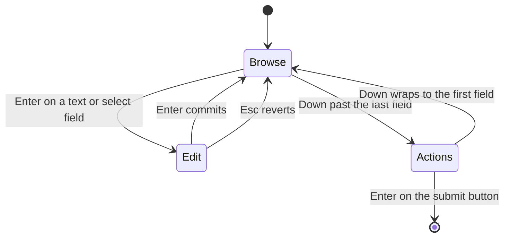

# Terminal UI


Launch the interactive terminal interface with:

```bash
noorm ui
```


Everything in noorm is accessible through keyboard shortcuts. The mouse works
too, in lists and grids — see [Mouse](#mouse) if you would rather it did not.

The TUI is a dedicated subcommand — every other `noorm` command runs as a non-interactive CLI. Running `noorm` on its own prints the command list (citty's `--help`) instead of opening the wizard, so the entry into the TUI is always explicit. See the [CLI Reference](/headless) for the headless surface.


## Home Screen


## Navigation Map

```
                              ┌─────────┐
                              │  Home   │
                              └────┬────┘
        ┌──────────┬──────────┬────┴────┬──────────┐
        │          │          │         │          │
     [c]│       [g]│       [r]│      [d]│       [s]│
        ▼          ▼          ▼         ▼          ▼
   ┌────────┐ ┌────────┐ ┌────────┐ ┌────────┐ ┌────────┐
   │ Config │ │ Change │ │  Run   │ │Database│ │Settings│
   │  List  │ │  List  │ │  Menu  │ │  Menu  │ │  Menu  │
   └────────┘ └────────┘ └────────┘ └────────┘ └────────┘
        │          │          │         │
        │          │          │         ├── Explore (tables, views...)
        │          │          │         └── Terminal (SQL REPL)
        │          │          │
        │          │          └── Build, File, Directory, Exec, Inspect
        │          │
        │          └── FF, Next, Run, Revert, Rewind, History
        │
        ├── Add, Edit, Delete, Copy, Use
        │
        └──[k]── Secrets List
```

Secrets hang off a config, so `k` opens them from the Config List, not from
Home. Export, import, and validate sit behind `[+] More` on the Config List.


## Keyboard Shortcuts


### Home Navigation

| Key | Screen | Description |
|-----|--------|-------------|
| `r` | Run | Execute schema files |
| `c` | Config | Manage database connections |
| `g` | Changes | View and apply changes |
| `d` | Database | Explore schema, run queries |
| `+` | More | Settings, vault, identity, lock |
| `s` | Settings | Project configuration |
| `v` | Vault | Team-shared encrypted secrets |
| `i` | Identity | View/edit your identity |
| `l` | Lock | View/manage database locks |
| `u` | Update | Check for a newer noorm |
| `q` | — | Quit noorm |

`s`, `v`, `i`, and `l` work from Home directly as well as from `[+] More`.
Three number keys run the quick actions listed on the home screen:

| Key | Action |
|-----|--------|
| `1` | Run build |
| `2` | Apply changes (fast-forward) |
| `3` | View lock status |

Per-config **secrets** are not on this list — they hang off a config rather
than the project, so you reach them with `k` from the config list.


### Common Actions (in sub-screens)

| Key | Action | Available In |
|-----|--------|--------------|
| `a` | Add new | Config, Changes, Secrets |
| `e` | Edit | Config, Changes, Secrets |
| `d` | Delete | Config, Changes, Secrets |
| `c` | Copy | Config |
| `k` | Secrets | Config (secrets for the highlighted config) |
| `+` | More | Config (export, import, validate) |
| `Enter` | Use/Activate | Config (set as active) |

Export, import, and validate live behind `[+] More` on the config list rather
than on the list itself, which keeps the destructive and the routine actions
apart.


### List Navigation

| Key | Action |
|-----|--------|
| `↑` | Move up |
| `↓` | Move down |
| `Enter` | Select |
| `Escape` | Go back |
| `1`-`9` | Quick select by number, on lists that show numbers |

Numbered selection is enabled per list — if a list renders numbers down its
left edge (Settings and the schema explorer do), the digits work there.

Every list sizes itself to the window, so a taller terminal shows more rows
rather than the same fixed count with the rest behind a scroll marker. A list
also keeps its cursor when you open an item and come back, so walking a long
list one entry at a time does not restart at the top.


### Form Navigation

Forms have two modes and `Enter` switches between them.

| Mode | Key | Effect |
|------|-----|--------|
| Browse | `↑` `↓` | Move between fields, every field type included |
| Browse | `Tab` / `Shift+Tab` | Same, forwards and backwards |
| Browse | `Enter` | Open the active field for editing |
| Browse | `Escape` | Cancel the form |
| Edit | `Enter` | Commit and return to browse |
| Edit | `Escape` | Restore the value the field held when edit opened |
| Edit | `Tab` | Commit and move to the next field |

Enter is the mode switch, so submitting is a place you navigate to rather than
a key you press:



Past the last field the cursor lands on the action row, where `←` `→` move
between the buttons and `Enter` activates one. The submit button carries the
screen's own label, `[ Create Config ]` on the add-config form.

Two field types never open into edit mode:

- A **checkbox** toggles in place on `Enter` or `Space`.
- A **select** expands on `Enter`, moves with `↑` `↓`, and takes the highlighted
  option on a second `Enter`. Collapsed, it shows its current value on one line
  like every other field.

A red `*` after a label marks a required field. Submitting with one empty puts
the cursor on it and shows the error beside the value.


### Mouse

On by default, in lists and result grids only:

| Action | Effect |
|--------|--------|
| Click a row | Move the cursor to it |
| Double-click a row | Same as `Enter` on that row |
| Wheel up / down | Move the cursor one row |

A click acts on whatever already has focus. Clicking a list that is not focused
does nothing — it does not move focus there, so the keyboard stays where you
left it.


#### Text selection stopped working

That is this feature, and it is the one thing it costs you. Any terminal
mouse-tracking mode hands the mouse to the application, so click-drag selection
needs a modifier held down: Option in macOS Terminal and iTerm2, Shift in most
others.

If you would rather have plain selection back, turn the mouse off in
`.noorm/settings.yml`:

```yaml
ui:
    mouse: false
```

`?` inside the TUI prints the same line, so you do not have to remember which
file it lives in. Nothing else changes: every screen is fully keyboard-driven
either way.


### Global Shortcuts

| Key | Action |
|-----|--------|
| `Shift+L` | Toggle log viewer overlay |
| `Shift+Q` | Open the SQL terminal |
| `?` | Show help |
| `Escape` | Go back / Cancel |
| `Ctrl+C` | Quit |


### Cancelling a Database Operation

A screen waiting on a database says so, and says that `Escape` will stop it:

```
Testing connection...  [Esc] Cancel
```

That appears while a config is being tested (add and edit), while the
force-release screen checks lock status, and while the SQL terminal connects or
runs a query. `Escape` returns the screen to a usable state; nothing is saved.

Two things are worth knowing about what "cancel" means here:

- **The client always stops waiting. The server usually does not stop working.**
  A cancelled query keeps running on PostgreSQL and MySQL only until noorm's
  cancel request reaches it, and on SQL Server and SQLite it is never told at
  all. The message names which happened, and
  [the SQL terminal guide](./guide/database/terminal.md) has the per-dialect
  table.
- **A connect that answers after you cancelled is closed, not adopted.** The
  screen keeps the state you cancelled into, and the connection is destroyed
  rather than left half-open.

A connection attempt also ends on its own after 15 seconds, with or without a
keypress. Raise `connection.connectTimeoutMs` for a link that is slow but
working.


## Screen Reference


### Config List


- `●` indicates active config
- `○` indicates inactive config
- `>` indicates cursor position
- `[user:<role> agent:<role|off>]` tag shows access roles for any config whose access differs from the default (`user: admin`, `agent: viewer`) — omitted entirely for configs still on the default
- `[test]` tag shows test configs
- Press `Enter` on a config to activate it

Press `a` to add one. Adding a config is the one operation that is interactive only — `noorm config add` on the CLI directs you here:


The two role fields set access per **channel** — who is *driving*. `User Role` covers a human on the CLI, TUI, or SDK; `Agent Role` covers an AI agent, over MCP and the CLI alike. They are independent, so a config can be wide open at your terminal and read-only — or invisible — to an agent. New configs default to `admin` for you and `viewer` for the agent. See [Configs](/guide/environments/configs#access-roles) for what each role permits.


### Changes List


- `✓` = Applied
- `○` = Pending
- `✗` = Failed

When no changes exist:

```
No changes found. Press [a] to create one.
```

Press `h` for the execution history — what ran, when, and who ran it:


### Run Menu


### Database Menu


### Schema Explorer


Press a number to drill into a category:


Select a table to see its full schema:


A detail longer than the window scrolls rather than running off the bottom:

| Key | Action |
|-----|--------|
| `↑` `↓` | Scroll one line |
| `Ctrl+U` / `Ctrl+D` | Half a page |
| `PageUp` / `PageDown` | A full page. On macOS these are `fn ↑` and `fn ↓`, which is what the footer says there |
| `Home` / `End` | Top, bottom |
| `v` | Redraw the same rows with nothing truncated |
| `r` | Read rows from the object |

The footer lists only the keys the current screen answers to, so a detail that
fits shows no scroll hints and a view shows no `[r] Rows`.


### Reading Rows

The explorer describes structure. `r` on a detail screen reads the rows
themselves, without leaving the explorer for the SQL terminal:


The peek reads both ends of the table rather than a page from the top, so the
last rows by primary key are as reachable as the first:


| Key | Action |
|-----|--------|
| `↑` `↓` | Move the cursor within a set |
| `Tab` | Swap between the first set and the last |
| `Enter` | Open the highlighted row as a document |
| `/` `s` `c` | Filter, sort, clear, on the focused set |
| `Escape` | Close the peek |

Three things decide what comes back:

- **Reading rows needs `sql:read`**, not the `explore` permission the rest of
  these screens use. A config an agent may inspect the schema of is not one it
  may read data from. See [Configs](/guide/environments/configs#access-roles).
- **The tail needs a primary key.** With one, the last rows ride the index.
  Without one, only the first rows appear.
- **A short table is one set.** When both ends meet, the peek says
  `All N rows` and draws a single table.

The table fits as many whole columns as the terminal holds and marks the rest
`… N more columns`. `Enter` on a row is what shows them all:


| Key | Action |
|-----|--------|
| `←` `→` | Previous row, next row, in the order the table was showing |
| `↑` `↓` | Scroll a document taller than the window |
| `f` | Swap YAML for JSON. The choice holds for the rest of the session |
| `Escape` | Back to the peek, on the row you were reading |


### SQL Terminal

Press `Shift+Q` anywhere to open the SQL terminal against the active config:


- `↑` `↓` walk your query history, and `h` opens it as a list
- A result wider than the terminal keeps whole columns and marks the remainder
  `… N more columns`, rather than cramming every column into a few characters
- `Enter` on a result row opens it as a document, the same YAML or JSON view the
  row peek uses, which is how you read the columns the grid left out


### Log Viewer

Press `Shift+L` anywhere to toggle the log overlay:


The overlay tails events as they happen, so you can watch an operation run.
`[/]` searches, `[g]` and `[G]` jump to the top and bottom, `[Space]` pauses the
tail, `[Enter]` opens a single entry in full, and `Shift+L` again closes it.


### More Options

Press `+` from home for the screens that aren't part of the day-to-day loop:


Each of these also has a direct key from home — `+` just groups them.


### Settings


Edits here write to `.noorm/settings.yml`. Press `i` to create that file if the
project doesn't have one yet. See [Configs](/guide/environments/configs) and
[SQL File Organization](/guide/sql-files/organization) for what each group
controls.


### Identity


Your identity signs your name to every change execution, which is what makes
[change history](/guide/changes/history) attributable across a team. It lives
in `~/.noorm/`, not in the project, so it follows you between repositories.


### Vault


The vault holds team-shared encrypted secrets in the database itself, so
teammates get them by connecting rather than by copying a `.env` around. It
starts uninitialized — press `i` to create it. See [Vault](/guide/environments/vault).


### Secrets

Per-config secrets are reached with `k` from the config list, not from home —
they belong to a config rather than to the project:


These are values a config needs at connection or render time. See
[Secrets](/guide/environments/secrets) for how they resolve against stages.


### Lock


noorm takes a lock around operations that write to the database, so two people
running a build against the same environment don't interleave. `[s]` shows
status, `[a]` acquires, `[r]` releases, and `[f]` force-breaks a stale lock.
See [Locking](/dev/lock).


## Tips


### Quick Config Switching

From home, press `c`, arrow to the config you want, then `Enter` to activate it.
The config list is not numbered, so the digits do nothing there:

```
c → ↓ → Enter
```

`Enter` on the config that is *already* active opens its edit form instead.


### Fast Forward All Changes

```
g → f
```


### Run Build

```
r → b
```


### Check Connection

Validate lives behind `[+] More` on the config list:

```
c → + → v (validate highlighted config)
```


## Color Coding

| Color | Meaning |
|-------|---------|
| Green | Success, applied, active |
| Yellow | Warning, pending, in progress |
| Red | Error, failed |
| Gray | Skipped, unchanged |
| Cyan | Info, links |
