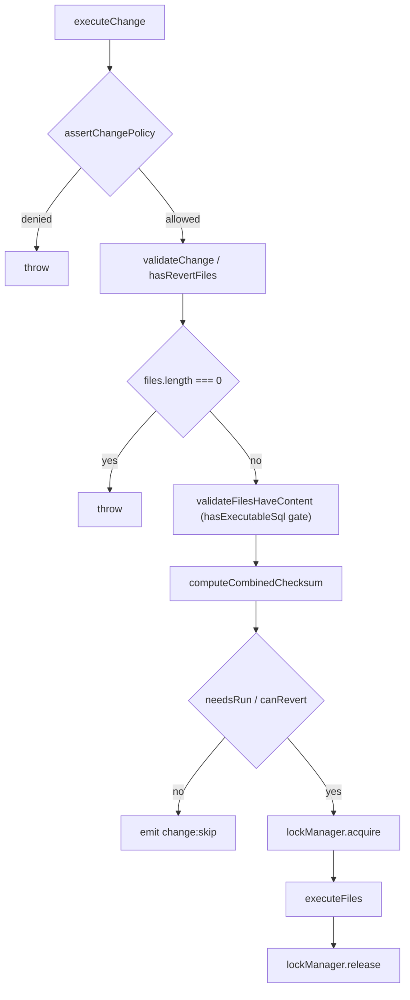
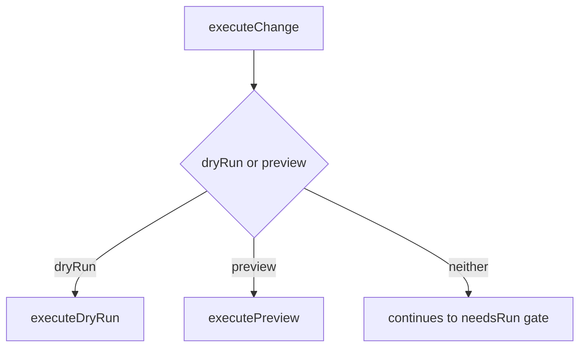
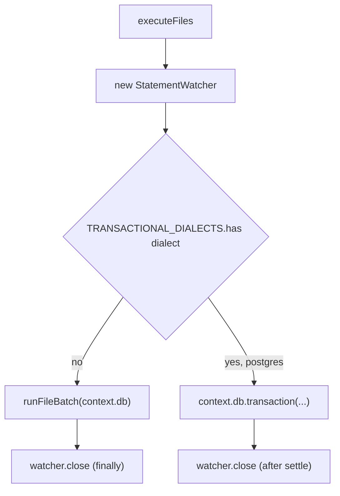
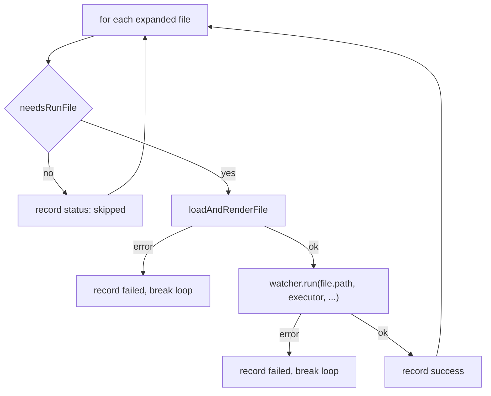
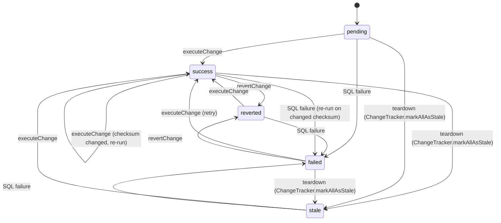

# core-change

## What it does

Changes are versioned, forward/revert SQL migrations tracked by checksum, so a change (or a single file inside it) that already ran with an unchanged checksum is skipped rather than re-executed. That makes `noorm change ff` safe to run repeatedly without re-applying finished work, and lets a database recover from a partial failure without an operator manually diagnosing what already happened.

## How it works

`executeChange` and `revertChange` ([`src/core/change/executor.ts`](../../src/core/change/executor.ts)) are the entry points every caller (CLI, TUI, SDK, RPC) funnels through.

`executeChange` passes the policy gate, the content gate, and the checksum gate before a lock is taken. `revertChange` has a different gate pair: the `hasRevertFiles` throw, then `tracker.canRevert`, which checks status rather than checksum.

A change directory holds a `change/` folder, an optional `revert/` folder, an optional `changelog.md`, and SQL or `.txt` manifest files. Execution state lives in the `__noorm_change__` and `__noorm_executions__` tables.

### Dry-run and preview bypass the run gate

`opts.dryRun`/`opts.preview` are checked before `history.needsRun`/`tracker.canRevert` (`executor.ts:174`), so both modes render every file's SQL regardless of whether the change already ran:

### File execution and the statement watcher

`executeFiles` picks a path by dialect: non-transactional dialects run `runFileBatch` directly against `context.db`; Postgres (`TRANSACTIONAL_DIALECTS` in `executor.ts`) wraps the same batch in `context.db.transaction()` so a failed change leaves neither DDL nor history rows behind, surfacing the failure only through the returned `ChangeResult` (unwrapped from a thrown `ChangeRollback` sentinel).

`executeFiles` creates one `StatementWatcher` per call and passes it into `runFileBatch`; each file's SQL runs through `watcher.run(file.path, executor, (conn) => sql.raw(sqlContent).execute(conn))`. The watcher is closed in a `finally` on the non-transactional path and explicitly after the transaction settles on Postgres.

Inside the transaction, `batchResult.status !== 'success'` is the rollback trigger.

### Per-file skip on retry

Per file inside `runFileBatch`, `history.needsRunFile` can still skip a file whose checksum already succeeded, even when the overall change checksum changed because a sibling file needed fixing:

### Change lifecycle

A change's `OperationStatus` moves between `pending`, `success`, `failed`, `reverted`, and `stale`, computed by `ChangeManager`/`ChangeHistory` from `__noorm_change__`/`__noorm_executions__` rows. `isPendingChange` ([`src/core/change/types.ts`](../../src/core/change/types.ts)) treats only `pending`, `reverted`, and `stale` as "needs a forward run" for `ff`/`next`, and only when the item is not orphaned; `failed` re-applies only through an explicit run, via `needsRun`'s own `failed` branch.

`ChangeTracker.markAllAsStale` (`tracker.ts:245`) flips every `success`, `failed`, and `pending` row to `stale` on teardown, not only `success` rows. `revertChange` marks the original as `reverted` only when the revert itself succeeds (`tracker.ts:171-172`, `executor.ts:411`), so a `failed` change can still be reverted (`canRevert` allows it) and the revert's own success is what moves the record to `reverted`.

`orphaned` is not a status: it is a boolean on `ChangeListItem`, set when a change has DB rows but no folder on disk. Because of the Postgres rollback above, a failed run there leaves the stored status at its prior value.

## Where it lives

| Path | Responsibility |
|------|-----------------|
| [`src/core/change/executor.ts`](../../src/core/change/executor.ts) | `executeChange`/`revertChange` entry points; policy gate; per-dialect transactional dispatch; `StatementWatcher` wiring; dry-run and preview modes |
| [`src/core/change/manager.ts`](../../src/core/change/manager.ts) | `ChangeManager`, public API combining parser, history, and executor (`list`, `run`, `next`, `ff`, `revert`, `rewind`) |
| [`src/core/change/parser.ts`](../../src/core/change/parser.ts) | `parseChange`/`discoverChanges`, scans a change folder, validates structure, resolves `.txt` manifests, parses sequence/date prefixes |
| [`src/core/change/scaffold.ts`](../../src/core/change/scaffold.ts) | Creates/deletes/renames/reorders change files and folders on disk |
| [`src/core/change/tracker.ts`](../../src/core/change/tracker.ts) | `ChangeTracker` (extends `Tracker`), `canRevert`, `markAsReverted`, `markAllAsStale` |
| [`src/core/change/history.ts`](../../src/core/change/history.ts) | `ChangeHistory`, `needsRun`/`needsRunFile`, operation/file record CRUD, `hydrateDate` UTC normalization |
| [`src/core/change/types.ts`](../../src/core/change/types.ts) | `Change`, `ChangeContext`, `ChangeOptions`, `ChangeResult`, error classes, `isPendingChange` |
| [`src/core/change/validation.ts`](../../src/core/change/validation.ts) | `validateChangeContent`/`SQL_TEMPLATE`, used only by TUI pre-flight checks, not by the executor's own content gate |
| [`src/cli/change/index.ts`](../../src/cli/change/index.ts) | `change` command group registration (`add`, `edit`, `rm`, `run`, `next`, `ff`, `revert`, `rewind`, `list`, `history`, `history-detail`) |
| [`src/cli/change/_prompt.ts`](../../src/cli/change/_prompt.ts) | Shared interactive change-name picker helper used across the CLI commands, not a command itself |
| `tests/core/change/*.test.ts` | Executor, manager, tracker, history, parser, scaffold, and type-contract tests, plus `executor-retry.test.ts` for per-file skip-on-retry |

## Constraints

- Only Postgres (`TRANSACTIONAL_DIALECTS` in `executor.ts`) wraps a change's file execution in a database transaction. MySQL's DDL implicitly commits, MSSQL's GO-batch execution is unverified under a wrapping transaction, and SQLite is excluded so per-file partial success (used by unit tests) keeps working. On MySQL, MSSQL, and SQLite, a change failing partway leaves earlier files' DDL applied and their history rows persisted, since nothing rolls either back.
- `executor.ts`'s pre-execution content gate (`hasExecutableSql`, preceded by the `files.length === 0` throw) checks for any non-blank, non-`--`-comment line; it does not call `validateChangeContent` from `validation.ts`, which is a stale check still used only by the TUI's `ChangeFFScreen`/`ChangeRunScreen`. A stub worded to pass `validateChangeContent` can still fail the executor's own gate, so TUI pre-flight and `noorm change run` can disagree about whether a change is runnable.
- `createChange` always scaffolds a stub file into both `change/` and `revert/`. An empty `change/`+`revert/` pair fails `parseChange`'s validation (`scaffold.ts:146-149`), and without the stub the caller sees that misreported as "change not found" instead of "needs editing".
- Change directory names follow `YYYY-MM-DD-<slugified-description>`; a name without a date prefix parses with `date: null`, and `discoverChanges` sorts by raw name (`a.name.localeCompare(b.name)`, `parser.ts:215`), so an undated `add-users` sorts after every `2024-...` change and moves in `ff`/`next` order. Files inside are ordered by `filename.localeCompare` (`parser.ts:440`), not by parsed sequence number, so an unpadded sequence prefix (`2_foo.sql` before `10_bar.sql`) sorts and runs out of numeric order.
- `ChangeHistory.needsRunFile` bounds its lookback at the most recent opposite-direction operation, so a prior success only licenses a per-file skip while no revert/re-apply has happened since. It also retires a prior success once the parent operation's own status is `reverted` or `stale` (`history.ts:494-509`); without both conditions, every apply -> revert -> apply cycle silently no-ops its files instead of re-running them.
- `RESET_MARKER = '__reset__'` is a reserved change name written by `ChangeHistory.recordReset` for teardown audit rows. A user change named `__reset__` collides with it: `getAllStatuses` filters that name out, so the change disappears from `change list` even though it still shows in `getHistory`/`getUnifiedHistory`.
- `history.ts`'s `hydrateDate` normalizes `executed_at` to UTC for Postgres/MySQL (reinterpreted field-by-field) and SQLite (text with `Z` appended); MSSQL is left unmodified on purpose, because its driver's behavior was never measured. On a host whose local zone isn't UTC, MSSQL's `executed_at` can render in the TUI's relative-time display shifted by the host's UTC offset.
- Add a new status to `isPendingChange` only. An inlined copy of the check drifts, and `ff` then reports success while work is still outstanding.
- `DEFAULT_OPTIONS`/`DEFAULT_BATCH` in `executor.ts`/`manager.ts` duplicate `DEFAULT_CHANGE_OPTIONS`/`DEFAULT_BATCH_OPTIONS` from `types.ts` rather than importing them, so a default changed in `types.ts` does not reach `executeChange`/`ChangeManager`.
- Change runs get `file:progress` reports but no server-side cancel: `executeFiles` passes no `signal` into `new StatementWatcher(...)` (`executor.ts:477`), so a running change cannot be aborted mid-file the way a runner-driven run with a signal can.

## Coupling

- **core-runner** ([`src/core/runner/`](../../src/core/runner)): `executeFiles` creates one `StatementWatcher` per call and runs every file's SQL through `watcher.run(...)`; the watcher's lifecycle, dialect probes, and cancel semantics belong there ([`src/core/runner/statement-watcher.ts`](../../src/core/runner/statement-watcher.ts)). Also calls `computeChecksum`/`computeCombinedChecksum` from [`src/core/runner/checksum.ts`](../../src/core/runner/checksum.ts), checksum algorithm changes propagate here. `ChangeTracker` extends `Tracker` from [`src/core/runner/tracker.ts`](../../src/core/runner/tracker.ts), base tracker changes affect revert/stale logic. Also pulls `processFile`/`isTemplate` from [`src/core/template/`](../../src/core/template) to render templated SQL files before execution.
- **core-policy** ([`src/core/policy/`](../../src/core/policy)): `executeChange`/`revertChange` call `assertPolicy`, gated on `change:run`/`change:revert`; [`src/cli/change/rm.ts`](../../src/cli/change/rm.ts) gates `change:rm` separately via `checkConfigPolicy`. Policy-matrix changes in [`src/core/policy/matrix.ts`](../../src/core/policy/matrix.ts) affect which roles can run/revert/rm changes.
- **core-state** ([`src/core/observer.ts`](../../src/core/observer.ts)): emits `change:*` events (`change:start`, `change:file`, `change:complete`, `change:skip`, `change:created`, `file:dry-run`) through the shared observer.
- **core-db**: writes to `__noorm_change__` and `__noorm_executions__` tables; `ChangeTracker.markAllAsStale` is called from [`src/core/teardown/operations.ts`](../../src/core/teardown/operations.ts) after a teardown.
- **tui**: the `useChangeProgress` hook ([`src/tui/hooks/useChangeProgress.ts`](../../src/tui/hooks/useChangeProgress.ts)) subscribes to the watcher's `file:progress` event, consumed by the `Change*Screen` components under [`src/tui/screens/change/`](../../src/tui/screens/change). Those screens import `ChangeHistory`, `discoverChanges`, and `validateChangeContent` directly for read-only status and pre-flight checks.
- **sdk**: [`src/sdk/namespaces/changes.ts`](../../src/sdk/namespaces/changes.ts) wraps `ChangeManager` and the scaffold functions for the programmatic SDK.
- **mcp-rpc**: [`src/rpc/commands/changes.ts`](../../src/rpc/commands/changes.ts) exposes change operations as MCP/RPC commands through the same SDK surface.
