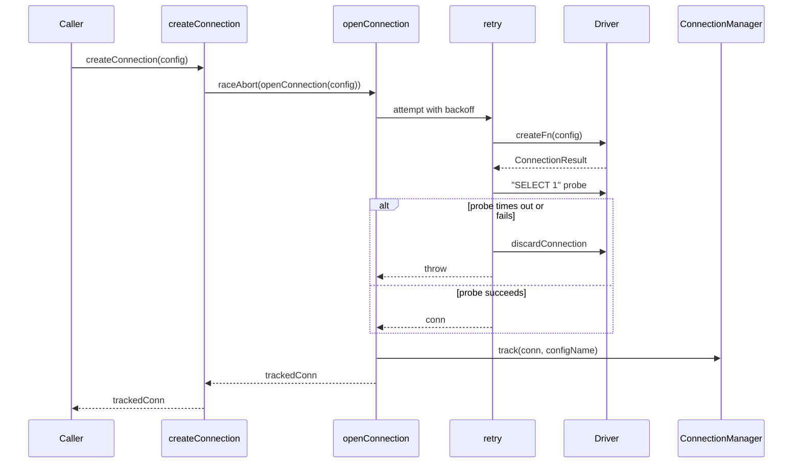
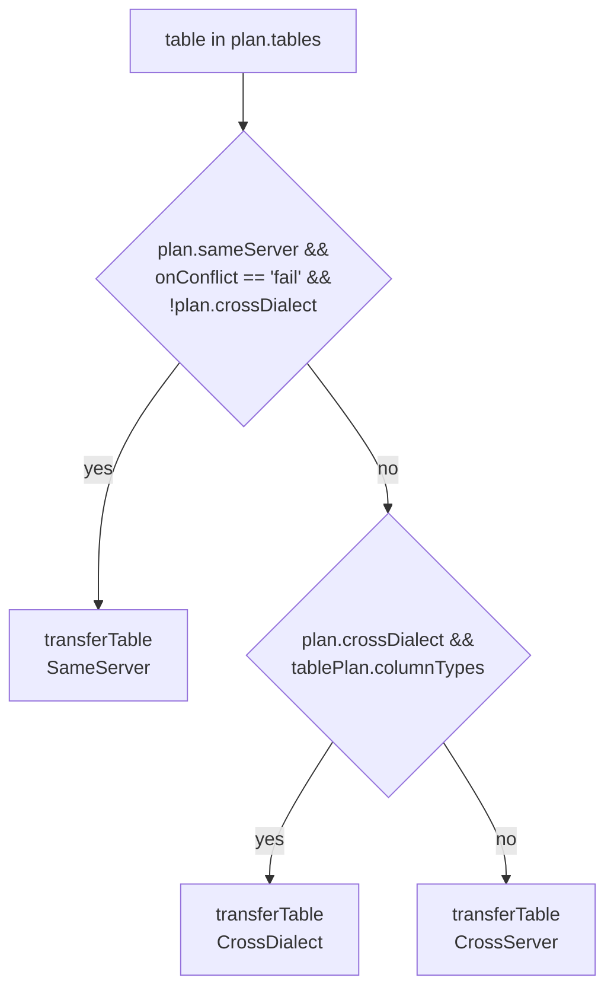
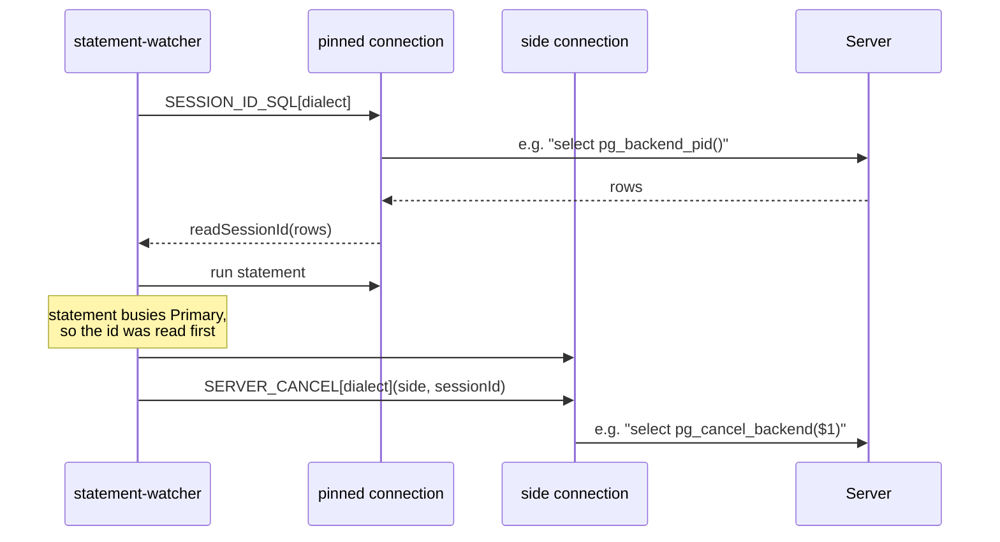

# core-db

## What it does

Every live-database command in noorm, from `noorm db create` to `noorm db transfer`, gets one retried, probed connection and a dialect-dispatched create/explore/teardown/transfer through this domain. It opens the connection ([`src/core/connection/`](../../src/core/connection)), creates or drops the database ([`src/core/db/`](../../src/core/db)), reads schema metadata ([`src/core/explore/`](../../src/core/explore)), wipes data or drops objects ([`src/core/teardown/`](../../src/core/teardown)), and moves rows between two databases ([`src/core/transfer/`](../../src/core/transfer)). No connection means nothing else in the domain can run.

Every operational module (`db`, `explore`, `teardown`, `transfer`) dispatches on `Dialect` (`'postgres' | 'mysql' | 'sqlite' | 'mssql'`, [`src/core/connection/types.ts`](../../src/core/connection/types.ts)) through one dialect-operations interface: one `types.ts` interface, one implementation file per dialect under `dialects/`, and a `dialects/index.ts` lookup. [`src/core/transfer/`](../../src/core/transfer) is the one exception: it supports only `postgres`, `mysql`, `mssql` (`TRANSFER_SUPPORTED_DIALECTS`, [`src/core/transfer/dialects/index.ts`](../../src/core/transfer/dialects/index.ts)); sqlite has no dialect module there.

## How it works

### Opening a connection

`createConnection` ([`src/core/connection/factory.ts`](../../src/core/connection/factory.ts)) is the one path every dialect connection takes. It lazy-imports the dialect driver, retries transient failures with backoff, and probes the socket with `SELECT 1` before handing the connection back, because a socket that opens and then goes quiet is invisible to any driver connect timeout.

`shouldRetry` ([`src/core/connection/factory.ts`](../../src/core/connection/factory.ts)) skips retries for auth, missing-driver, missing-database, and abort failures, and retries only `ECONNREFUSED`/`ETIMEDOUT`/`too many connections`/`connection reset`. Every failure passes through `explainConnectionError` ([`src/core/connection/errors.ts`](../../src/core/connection/errors.ts)), which rewords driver-specific codes into a message that never says "does not exist" unless the database itself is missing, because `testConnection`'s `testServerOnly` mode and the TUI's create-on-missing prompt both key off that exact phrase.

### Choosing a transfer strategy per table

`executeTransfer` ([`src/core/transfer/executor.ts`](../../src/core/transfer/executor.ts)) picks a code path for each table in the plan, in this order of preference. Same-server `INSERT ... SELECT` wins only when conflicts can't occur and dialects match; cross-dialect needs resolved `columnTypes`; everything else batches.

`transferTableSameServer` builds one direct `INSERT ... SELECT` statement. `transferTableCrossDialect` streams rows through `DtStreamer`, paged by `createKeysetPager`, converting column types along the way. `transferTableCrossServer` pages the same way but calls `insertBatch` against the destination, no type conversion involved.

`isSameServer` ([`src/core/transfer/same-server.ts`](../../src/core/transfer/same-server.ts)) rules PostgreSQL out unconditionally: without `dblink`/`postgres_fdw` it has no way to read a second database, and a same-database same-server statement would degenerate into `INSERT INTO t SELECT ... FROM t`. MySQL and MSSQL qualify when host and port both match after `normalizeHost` folds `127.0.0.1`/`::1`/`localhost.localdomain` into `localhost`. SQLite never qualifies; it has no server.

### Dropping a schema in dependency order

`teardownSchema` ([`src/core/teardown/operations.ts`](../../src/core/teardown/operations.ts)) drops objects in a fixed order because MSSQL schema-bound objects (`WITH SCHEMABINDING`) hold locks on the tables they reference, and a CHECK constraint referencing a scalar UDF blocks dropping that function while the table still exists (MSSQL error 3729):

1. Drop FK constraints.
2. Drop MSSQL CHECK constraints (`dropCheckConstraints`, mssql only), gated on `!keepFunctions` (`teardown/operations.ts:413`) since the CHECK-on-a-UDF dependency is exactly what step 4 needs cleared.
3. Drop procedures, unless `keepProcedures`.
4. Drop functions, unless `keepFunctions`.
5. Drop views, unless `keepViews`.
6. Drop tables.
7. Drop types, unless `keepTypes`. On MSSQL this step is skipped entirely when `keepFunctions` or `keepProcedures` is set (`teardown/operations.ts:504-507`), because the function → TVP → domain-type dependency chain can't be broken safely without `CASCADE`.

`truncateData` runs a separate sequence (disable FK checks, truncate, re-enable FK checks) and always runs the re-enable phase even when the truncate phase throws, so a mid-truncate failure never leaves FK enforcement off on the destination.

### Pinning a session to cancel a statement from outside it

[`src/core/connection/session.ts`](../../src/core/connection/session.ts) holds the per-dialect SQL for reading a connection's own server-side session id (`SESSION_ID_SQL`) and for cancelling a statement a file is running on a different connection (`SERVER_CANCEL`). The runner's statement watcher ([`src/core/runner/statement-watcher.ts`](../../src/core/runner/statement-watcher.ts)) and the SQL terminal ([`src/core/sql-terminal/executor.ts`](../../src/core/sql-terminal/executor.ts)) use it the same way: pin a connection, read its session id before running the statement, then act on that id from a second connection once the first is busy.

`readSessionId` returns `undefined` for anything that is not a positive integer. That check is what keeps the mysql path safe: `SERVER_CANCEL.mysql` builds `kill query <sessionId>` with `sql.raw`, because `KILL` cannot be prepared, and the id it interpolates has already been forced through this guard. `SESSION_ID_SQL` has an entry for every dialect except sqlite; sqlite is in-process and single-connection, so a second connection has no session to observe. `SERVER_CANCEL` additionally omits `mssql`: tedious exposes `request.cancel()`, but Kysely's `MssqlDialect` never hands out the `Request` object, and `KILL` would end the whole session rather than one statement. `hasServerSideCancel(dialect)` is what a caller checks before wording the outcome as "cancelled" versus "stopped waiting."

## Where it lives

| Path | Role |
|------|------|
| [`src/core/connection/factory.ts`](../../src/core/connection/factory.ts) | `createConnection`, `testConnection`, `discardConnection` — retry/backoff, liveness probe, abort handling |
| [`src/core/connection/manager.ts`](../../src/core/connection/manager.ts) | `ConnectionManager` singleton (`getConnectionManager`) — cached and tracked connections, `WorkerBridge` instances, closes everything on `app:shutdown` |
| [`src/core/connection/session.ts`](../../src/core/connection/session.ts) | `SESSION_ID_SQL`, `SERVER_CANCEL`, `readSessionId`, `hasServerSideCancel` — per-dialect session-id read and server-side cancel |
| [`src/core/connection/errors.ts`](../../src/core/connection/errors.ts) | `explainConnectionError`, `explainMssqlLoginFailure` — per-dialect error code tables, `DatabaseConnectionError` |
| [`src/core/connection/defaults.ts`](../../src/core/connection/defaults.ts) | `DEFAULT_PORTS`, `PortSchema` shared with `core/config` and `core/settings` |
| `src/core/connection/dialects/*.ts` | Per-dialect connection factories; `mssql.ts` builds TLS/SNI options and tedious login handling, `mssql-limit-plugin.ts` rewrites `LimitNode` to `TopNode` for Kysely's MSSQL compiler |
| [`src/core/db/operations.ts`](../../src/core/db/operations.ts) | `checkDbStatus`, `createDb`, `destroyDb` |
| [`src/core/db/policy.ts`](../../src/core/db/policy.ts) | `assertDbPolicy` — shared destructive-lifecycle gate for `core/db` and `core/teardown` |
| [`src/core/db/dual.ts`](../../src/core/db/dual.ts) | `withDualConnection` — generic two-connection lifecycle used by `transfer` and vault-copy |
| `src/core/db/dialects/*.ts` | Per-dialect `databaseExists`/`createDatabase`/`dropDatabase`/`getSystemDatabase` |
| [`src/core/explore/operations.ts`](../../src/core/explore/operations.ts) | `fetchOverview`, `fetchList`, `fetchDetail`, `fetchRowPeek` |
| [`src/core/explore/peek.ts`](../../src/core/explore/peek.ts) | `peekQuery`, `readPeekRows`, `MAX_PEEK_ROWS` — row-window query builder and cap used by `fetchRowPeek` |
| `src/core/explore/dialects/*.ts` | Per-dialect catalog queries (`information_schema`/`pg_catalog`, `INFORMATION_SCHEMA`, `sys.*`) |
| [`src/core/teardown/operations.ts`](../../src/core/teardown/operations.ts) | `truncateData`, `teardownSchema`, `previewTeardown`, `isNoormTable` |
| `src/core/teardown/dialects/*.ts` | Per-dialect DDL generation; only `mssql.ts` implements `dropCheckConstraints` |
| [`src/core/transfer/planner.ts`](../../src/core/transfer/planner.ts) | `planTransfer` — table metadata, FK dependency graph, topological sort, destination schema probe |
| [`src/core/transfer/executor.ts`](../../src/core/transfer/executor.ts) | `executeTransfer`, `transferTableSameServer`, `transferTableCrossDialect`, `transferTableCrossServer` |
| [`src/core/transfer/same-server.ts`](../../src/core/transfer/same-server.ts) | `isSameServer`, `getDefaultPort` |
| [`src/core/transfer/events.ts`](../../src/core/transfer/events.ts) | `TransferEvents` observer contract |
| `src/core/transfer/dialects/*.ts` | Per-dialect FK toggle, identity-insert toggle, sequence reset, conflict-aware INSERT (no sqlite module) |
| `src/cli/db/*.ts` | `noorm db <create\|drop\|explore\|reset\|teardown\|transfer\|truncate>` Citty subcommands; `create.ts`/`drop.ts` call `checkDbStatus`/`createDb`/`destroyDb` directly, bypassing the SDK layer |
| `tests/core/{connection,db,explore,teardown,transfer}/`, [`tests/integration/`](../../tests/integration) | Unit coverage per module plus cross-database integration runs |

## Constraints

| Constraint | What breaks if ignored |
|---|---|
| `PostgreSQL` is never same-server ([`src/core/transfer/same-server.ts`](../../src/core/transfer/same-server.ts)) | Treating it as same-server would run `INSERT INTO t SELECT ... FROM t`, copying the destination into itself instead of transferring data |
| `readSessionId` requires a positive integer | Skipping the guard would let a driver's unexpected result flow straight into the mysql `kill query <id>` raw SQL |
| Indexing `SESSION_ID_SQL[dialect]` (no sqlite entry) or `SERVER_CANCEL[dialect]` (no sqlite or mssql entry) without checking for `undefined` first | Throws; the watcher guards both lookups before use (`statement-watcher.ts:176-178`, `226-229`) |
| `explainConnectionError`'s messages never say "does not exist" except for a missing database | The TUI offers to create a database on that exact phrase, and `testConnection`'s server-only fallback keys off it too |
| `truncateData`'s FK-enable phase always executes, even after a disable/truncate failure | Stopping at the first failure would leave FK enforcement off on a dialect like MSSQL, where the per-table `NOCHECK` survives reconnects until manually repaired |
| `teardownSchema` drops FKs, then MSSQL CHECK constraints, then procedures/functions/views, before tables | Dropping tables first fails on MSSQL schema-bound objects, and a CHECK constraint on a scalar UDF blocks dropping that function while its table exists |
| `__noorm_*` prefix matching alone does not exclude noorm's tracking tables on postgres/mssql | On postgres and mssql, noorm's tracking tables live in a `noorm` schema without the `__noorm_` prefix. A prefix-only filter lists them in explore and makes transfer's `listUserTables` ([`src/core/transfer/planner.ts`](../../src/core/transfer/planner.ts)) copy them into the destination; `EXCLUDED_SCHEMAS` (explore) and the `!== 'noorm'` schema filter (transfer) keep them out |
| `policy` is optional on `core/db` and `core/teardown` options (`db/types.ts`, `teardown/types.ts`) | Omitting it skips `assertDbPolicy` entirely (`db/policy.ts:67`); callers that omit it (the SDK `db` namespace, the TUI `Db*Screen` components) gate with `checkConfigPolicy` themselves instead. `core/transfer` has no such gap: its options take `channel?` and every entry point always gates via `assertPolicy(options.channel ?? 'user', ...)` |

## Coupling

- **core-runner**: [`src/core/runner/statement-watcher.ts`](../../src/core/runner/statement-watcher.ts) imports `SESSION_ID_SQL`, `SERVER_CANCEL`, and `readSessionId` from [`src/core/connection/session.ts`](../../src/core/connection/session.ts) to pin a connection, read its session id, and cancel a running statement's file from a side connection; [`src/core/runner/statement-probes.ts`](../../src/core/runner/statement-probes.ts) polls through its own `STATEMENT_PROBES` table and does not reference `session.ts`.
- **core-identity**: [`src/core/sql-terminal/executor.ts`](../../src/core/sql-terminal/executor.ts) imports the same `session.ts` exports (plus `hasServerSideCancel`) to cancel a query the SQL terminal is running; [`src/core/vault/copy.ts`](../../src/core/vault/copy.ts) calls `withDualConnection` ([`src/core/db/dual.ts`](../../src/core/db/dual.ts)) to hold source and destination connections open for a vault copy.
- **core-policy**: `assertDbPolicy` ([`src/core/db/policy.ts`](../../src/core/db/policy.ts)), `checkConfigPolicy` ([`src/cli/db/create.ts`](../../src/cli/db/create.ts), [`src/cli/db/drop.ts`](../../src/cli/db/drop.ts)), and `assertPolicy` ([`src/core/transfer/index.ts`](../../src/core/transfer/index.ts)) resolve against `Permission` values (`db:create`, `db:reset`, `db:destroy`, `db:truncate`, `db:teardown`, `transfer:plan`) and the role matrix in [`src/core/policy/matrix.ts`](../../src/core/policy/matrix.ts) and [`src/core/policy/types.ts`](../../src/core/policy/types.ts); [`src/core/explore/operations.ts`](../../src/core/explore/operations.ts) calls `assertPolicy` to gate `fetchRowPeek` on `sql:read`.
- **core-state**: [`src/core/db/operations.ts`](../../src/core/db/operations.ts) and [`src/core/db/dual.ts`](../../src/core/db/dual.ts) call `bootstrapSchema`/`tablesExist`/`ensureSchemaVersion` from [`src/core/version/`](../../src/core/version); [`src/core/connection/manager.ts`](../../src/core/connection/manager.ts) subscribes to `app:shutdown` from [`src/core/observer.ts`](../../src/core/observer.ts); connection config types come from [`src/core/config/types.ts`](../../src/core/config/types.ts).
- **core-change**: [`src/core/teardown/operations.ts`](../../src/core/teardown/operations.ts) imports `ChangeHistory`/`ChangeTracker` from [`src/core/change/`](../../src/core/change) to mark changes stale and record a reset event.
- **sdk**: [`src/core/transfer/planner.ts`](../../src/core/transfer/planner.ts) and `executor.ts` depend on `buildDtSchema`, `DtStreamer`, `createKeysetPager`, `queryDatabaseVersion` from [`src/core/dt/`](../../src/core/dt) for cross-dialect type conversion and streaming; [`src/sdk/namespaces/db.ts`](../../src/sdk/namespaces/db.ts), `dt.ts`, `transfer.ts` wrap `core/explore`, `core/teardown`, `core/transfer`, `core/dt` directly, and `core/db` is reached only transitively, through `transfer/index.ts`'s use of `db/dual.ts`.
- **worker-bridge**: [`src/core/connection/manager.ts`](../../src/core/connection/manager.ts) tracks `WorkerBridge<ConnectionEvents>` instances so they shut down alongside regular connections; [`src/workers/connection.ts`](../../src/workers/connection.ts) imports `core/connection` to own the Kysely instance off the main thread.
- **tui**: [`src/tui/providers/ConnectionProvider.tsx`](../../src/tui/providers/ConnectionProvider.tsx) holds the connection lifecycle at runtime; [`src/tui/hooks/useConnection.ts`](../../src/tui/hooks/useConnection.ts) and `useVaultConnection.ts` import `core/connection` types only, delegating to the provider. [`src/tui/utils/connection.ts`](../../src/tui/utils/connection.ts), `run-context.ts`, `config-validation.ts`, `change-loader.ts` import `core/connection` directly.
- **mcp-rpc**: [`src/rpc/commands/explore.ts`](../../src/rpc/commands/explore.ts) calls into `core/explore` directly.
