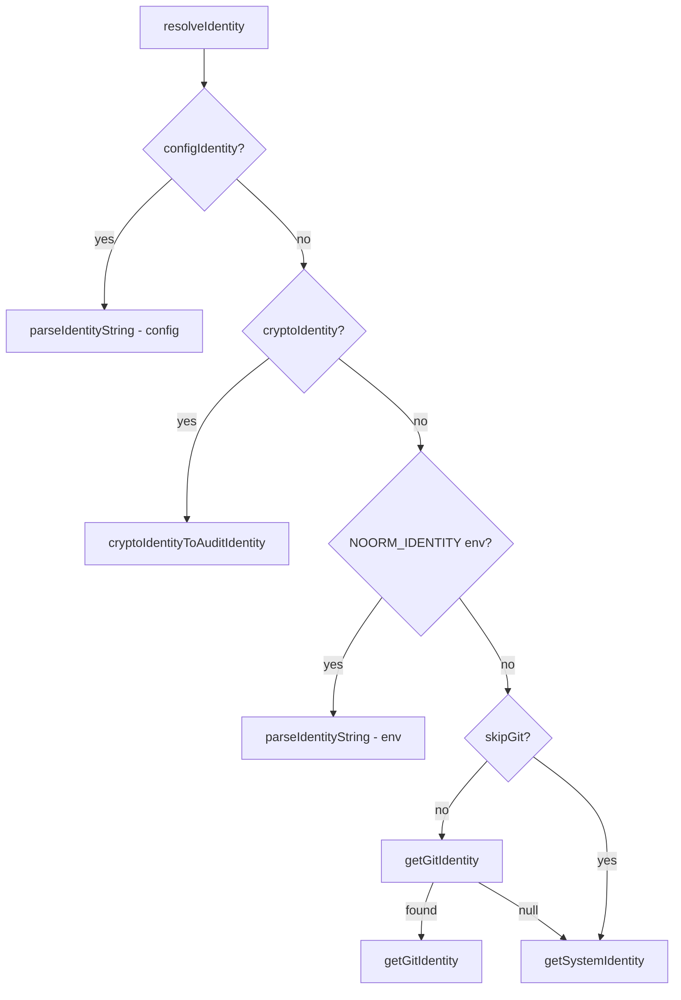
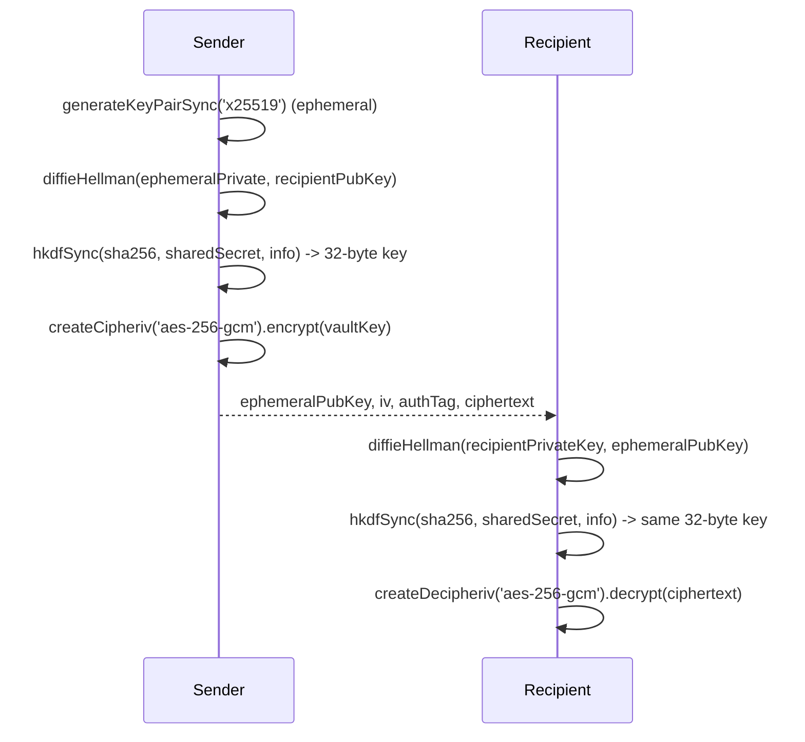
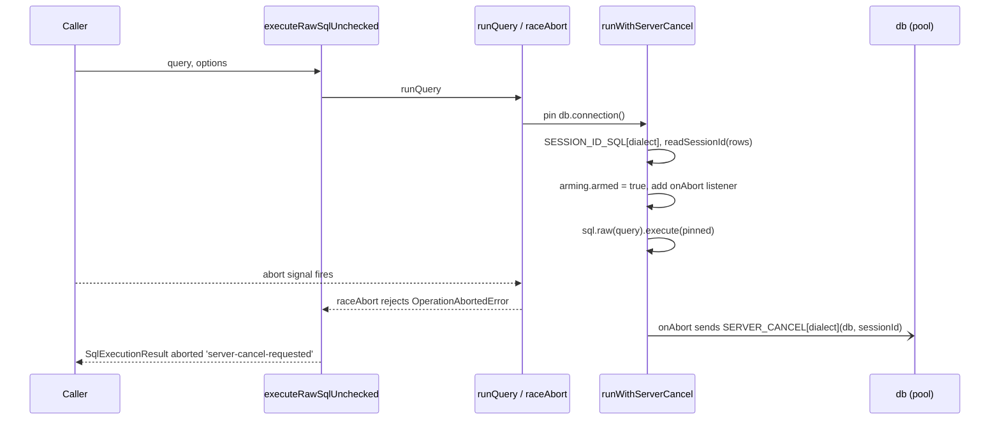
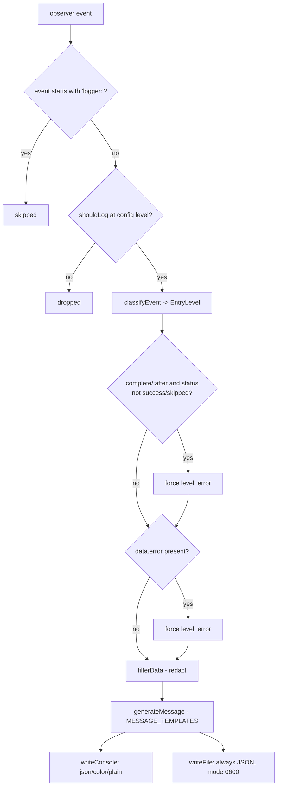

# core-identity

## What it does

Every write to the database needs an answer to "who did this", and every shared secret needs an answer to "who can read this". This domain answers both: [`src/core/identity/`](../../src/core/identity) resolves an audit identity (`executed_by` on rows) through a priority chain and, separately, holds the X25519 keypair used as the crypto identity for team-shared config. [`src/core/vault/`](../../src/core/vault) uses that same keypair to seal a database-wide secret so only registered users can unwrap it. [`src/core/logger/`](../../src/core/logger) records what every other domain did as redacted JSON-Lines. [`src/core/sql-terminal/`](../../src/core/sql-terminal) runs ad-hoc SQL through the same policy gate as every other write path.

The submodules share little code ([`src/core/vault/key.ts`](../../src/core/vault/key.ts) and [`src/core/identity/crypto.ts`](../../src/core/identity/crypto.ts) each implement their own `deriveSharedSecret`/`deriveEncryptionKey` pair, and the logger has its own event-handling path), but they group under one page because they back the `noorm identity`, `noorm secret`, `noorm vault`, and `noorm sql` command groups.

## How it works

### Audit identity resolution takes the first source present, in priority order

`resolveIdentity` ([`src/core/identity/resolver.ts`](../../src/core/identity/resolver.ts)) picks the name/email written to `executed_by`. It is a priority chain, not a merge: the first source present wins, and lower sources never mix in. `CryptoIdentity` ([`src/core/identity/types.ts`](../../src/core/identity/types.ts)) holds a public key and an `identityHash`; the matching private key loads separately, through `loadPrivateKey` ([`src/core/identity/storage.ts`](../../src/core/identity/storage.ts)). [`src/core/identity/factory.ts`](../../src/core/identity/factory.ts) creates a `CryptoIdentity`, [`src/core/identity/storage.ts`](../../src/core/identity/storage.ts) loads one from disk, and the object enters the resolution chain as one possible input, `cryptoIdentity`. It is also what [`src/core/vault/`](../../src/core/vault) and config-sharing encryption use instead of the audit identity.

### Vault key sealing repeats one ephemeral-ECDH pattern per recipient

[`src/core/vault/key.ts`](../../src/core/vault/key.ts)'s `encryptVaultKey` and [`src/core/identity/crypto.ts`](../../src/core/identity/crypto.ts)'s `encryptForRecipient` each implement this independently, with a distinct HKDF `info` string per use (`'noorm-vault-key'` vs `'noorm-config-share'`).

Secret values are encrypted once under the shared vault key (`encryptSecret`); only the vault key itself is sealed per recipient with the pattern above. Propagation cannot be revoked (`src/core/vault/types.ts:83`), so [`src/cli/vault/propagate.ts`](../../src/cli/vault/propagate.ts) shows the operator the identity being granted before sealing.

### SQL cancellation pins one connection, sends the kill from a second

`executeRawSql` ([`src/core/sql-terminal/executor.ts`](../../src/core/sql-terminal/executor.ts)) classifies the statement and asserts policy before delegating to `executeRawSqlUnchecked`, which calls `runQuery`. `runQuery` wraps the pinned-connection path in `raceAbort` ([`src/core/shared/abort.ts`](../../src/core/shared/abort.ts)), and when a dialect supports a server-side cancel, `runWithServerCancel` pins one Kysely connection so the cancel lands on the right backend, using `SESSION_ID_SQL`/`SERVER_CANCEL`/`readSessionId` imported from [`src/core/connection/session.ts`](../../src/core/connection/session.ts). On abort, `raceAbort` rejects with `OperationAbortedError` (`src/core/shared/abort.ts:95-98`); `executeRawSqlUnchecked` catches it and turns it into a `SqlExecutionResult` with `aborted: 'server-cancel-requested'` or `aborted: 'stopped-waiting'` rather than letting it propagate. A policy denial from `assertPolicy` still throws, so a caller only sees a thrown error before execution starts, never once it is running.

If `readSessionId` finds no usable id, or the dialect has no entry in `SERVER_CANCEL` (sqlite, mssql), `arming.armed` stays false and the result reports `aborted: 'stopped-waiting'` instead: the abort only stopped the client from waiting. `abortMessageFor` picks the wording for the UI from `hasServerSideCancel(dialect)` alone (a static per-dialect capability check); only `executeRawSqlUnchecked` checks `arming.armed`, the per-call fact of whether a cancel was sent.

### Every logged event except the logger's own passes one filter/classify/redact path before console and file output

`Logger#handleEvent` ([`src/core/logger/logger.ts`](../../src/core/logger/logger.ts)) subscribes to every event (`observer.queue(/./)`) but returns immediately on anything prefixed `logger:`, so the logger never logs itself into a loop.

`generateMessage` ([`src/core/logger/formatter.ts`](../../src/core/logger/formatter.ts)) has a template per known event, for example `'vault:propagated'` or `'vault:initialized'`; an event with no template falls back to a generic `key=value` join.

## Where it lives

| Path | Covers |
|------|--------|
| [`src/core/identity/factory.ts`](../../src/core/identity/factory.ts), `resolver.ts`, `crypto.ts`, `hash.ts`, `env.ts`, `provenance.ts`, `sync.ts`, `storage.ts` | keypair generation, audit-identity resolution chain, config-sharing/state encryption, `identityHash`, CI env bootstrap, provenance/harness lookup, `identities` table sync, private/public key file I/O |
| [`src/core/vault/key.ts`](../../src/core/vault/key.ts), `storage.ts`, `policy.ts`, `propagate.ts`, `resolve.ts`, `copy.ts` | vault key generation/sealing, secret CRUD, `*Checked` policy wrappers (`storage.ts`, `propagate.ts`: `propagateVaultKeyChecked`, `propagateVaultKeyToChecked`), `checkVaultPolicy`/`assertVaultPolicy`/`VaultPolicyGate` (`policy.ts`), propagation to pending users (`propagate.ts`), secret resolution/merge, cross-config copy |
| [`src/core/logger/logger.ts`](../../src/core/logger/logger.ts), `classifier.ts`, `formatter.ts`, `redact.ts`, `rotation.ts`, `queue.ts`, `reader.ts`, `init.ts` | the `Logger` class, event-name-to-level classification, message templates, field redaction, size/count rotation, ordered file writes, JSON-Lines reader, startup wiring against `Settings` |
| [`src/core/sql-terminal/executor.ts`](../../src/core/sql-terminal/executor.ts), `history.ts` | `executeRawSql`/`executeRawSqlUnchecked`, abort/server-cancel handling, per-config plain JSON history plus gzipped result files |
| [`src/cli/identity/`](../../src/cli/identity), [`src/cli/secret/`](../../src/cli/secret), [`src/cli/vault/`](../../src/cli/vault), [`src/cli/sql/`](../../src/cli/sql) | `noorm identity`, `noorm vault`, `noorm sql` command groups; [`src/cli/secret/`](../../src/cli/secret) reads and writes config-scoped secrets through core-state's `StateManager` rather than through [`src/core/vault/`](../../src/core/vault) |
| [`tests/core/identity/`](../../tests/core/identity), [`tests/core/vault/`](../../tests/core/vault), [`tests/core/logger/`](../../tests/core/logger), [`tests/core/sql-terminal/`](../../tests/core/sql-terminal) | unit coverage, including dedicated edge-case files (`key-file-corruption.test.ts`, `storage-key-permission-guard.test.ts`, `idempotent-init.test.ts`, `policy-gate.test.ts`, `redact-coverage.test.ts`, `rotation-reopen.test.ts`, `executor-abort.test.ts`) |

## Constraints

- Raw vault primitives (`getVaultKey`, `setVaultSecret`, `deleteVaultSecret`, `listVaultSecretKeys`, `propagateVaultKey`, `propagateVaultKeyTo`, `initializeVault`) are ungated; every production caller must use the `*Checked` wrapper. Surfaces holding a config (the CLI) use `*Checked`; the SDK gates through its own `#gate` method ([`src/sdk/namespaces/vault.ts`](../../src/sdk/namespaces/vault.ts)). The TUI vault screens (`VaultSetScreen`, `VaultRemoveScreen`, `VaultInitScreen`) call the raw primitives directly, unchecked; only `VaultScreen.tsx` gates its propagate action through `checkConfigPolicy(..., 'vault:propagate')`. Skipping the gate lets a `viewer` role write the vault. `executeRawSqlUnchecked` is the SQL-terminal equivalent, excluded from [`src/core/sql-terminal/index.ts`](../../src/core/sql-terminal/index.ts)'s barrel export so it is never one autocomplete away from a production call site.
- A propagated vault key cannot be revoked (`src/core/vault/types.ts:83`): once sealed to a recipient's public key, that user keeps decrypting every secret, and no key-rotation path exists.
- `isValidKeyHex` ([`src/core/identity/storage.ts`](../../src/core/identity/storage.ts)) requires 88 (SPKI public) or 96 (PKCS8 private) hex characters. A key that fails validation is a hard error at every write/derive site that reads it: `loadPrivateKey` throws, `setKeyOverride` throws, `deriveStateKey` throws. `loadIdentityFromEnv` is the exception: it returns `null` on an invalid key rather than throwing, since CI bootstrap treats a bad env key as "no override" rather than a fatal error.
- Key file permissions: `~/.noorm/identity.key` is written 0600, `identity.pub` 0644. `loadPrivateKey` throws "Insecure permissions on private key file" when the file's group/other bits are set, which blocks every identity-needing command until the file is `chmod 600`'d. `validateKeyPermissions` checks `mode & 0o077 === 0` and always returns `true` on `win32`, since Windows `stat` doesn't reliably report POSIX modes.
- CI identity bootstrap reads `NOORM_IDENTITY_PRIVATE_KEY`/`NOORM_IDENTITY_NAME`/`NOORM_IDENTITY_EMAIL` once via `loadIdentityFromEnv`, then installs the result through in-memory `setKeyOverride`/`setIdentityOverride` so the rest of the process skips disk reads. `computeIdentityHash` hashes `email + name + publicKey` (with `os: 'env'`) for this case instead of the hostname, so every CI runner sharing the same private key resolves to the same identity.
- `withAgentProvenance` ([`src/core/identity/provenance.ts`](../../src/core/identity/provenance.ts)) appends " (via <harness>)" to the audit identity when an agent harness is detected; `src/core/shared/operation-id.ts:146` calls it before every insert, so `executed_by` records the harness alongside the human or system identity.
- SQL history is a plain JSON file per config (`SqlHistoryManager`); result rows are gzip-compressed separately. Both are written 0600 (files) / 0700 (dirs) via `HISTORY_FILE_MODE`/`HISTORY_DIR_MODE`, the same permission discipline as `state.enc`. Dropping those modes makes result rows readable by other local users. `noorm sql query` (headless/CI) never writes history; only `sql repl` and the TUI SQL terminal do.
- `noorm sql repl` requires a TTY and rejects `--yes`/`NOORM_YES` outright, since a REPL is interactive by definition and pointing `--yes` at it would silently do nothing useful.
- Log event classification ([`src/core/logger/classifier.ts`](../../src/core/logger/classifier.ts)) is regex-pattern-based on event-name prefix/suffix, not a registry: a new event namespace defaults to `debug` level unless a suffix pattern or an `INFO_PATTERNS` prefix matches it.
- Vault has no local-disk history file; vault secrets live in DB rows only, unlike SQL history and local secrets (`state.enc`), so a lost vault key cannot be recovered from a local cache.

## Coupling

- **core-policy**: [`src/core/vault/policy.ts`](../../src/core/vault/policy.ts) and [`src/core/sql-terminal/executor.ts`](../../src/core/sql-terminal/executor.ts) gate every operation through `assertPolicy`/`checkConfigPolicy`/`classifyStatements` from [`src/core/policy/`](../../src/core/policy); [`src/core/identity/provenance.ts`](../../src/core/identity/provenance.ts) reads `AgentHarness` from [`src/core/policy/harness.ts`](../../src/core/policy/harness.ts); `resolveChannel` ([`src/core/policy/channel.ts`](../../src/core/policy/channel.ts), re-exported from [`src/core/policy/index.ts`](../../src/core/policy/index.ts)) resolves the acting channel used by policy checks throughout this domain, called from `src/cli/vault/{init,list,propagate,rm,set}.ts` and [`src/cli/secret/_policy.ts`](../../src/cli/secret/_policy.ts).
- **core-db**: [`src/core/connection/session.ts`](../../src/core/connection/session.ts) supplies `SESSION_ID_SQL`, `SERVER_CANCEL`, `hasServerSideCancel`, and `readSessionId`, which [`src/core/sql-terminal/executor.ts`](../../src/core/sql-terminal/executor.ts) imports to pin a connection and cancel a running statement from a second one; the runner's statement watcher shares the same module to poll and cancel a running file the same way. [`src/core/identity/sync.ts`](../../src/core/identity/sync.ts) and [`src/core/vault/copy.ts`](../../src/core/vault/copy.ts) open connections via `createConnection`/`withDualConnection` from [`src/core/connection/`](../../src/core/connection) and [`src/core/db/dual.ts`](../../src/core/db/dual.ts); vault and identity storage share the `NoormDatabase`/`noormDb`/`getNoormTables` helpers, which live in [`src/core/shared/tables.ts`](../../src/core/shared/tables.ts) outside any single owning domain.
- **core-state**: [`src/core/vault/resolve.ts`](../../src/core/vault/resolve.ts) takes a `StateManager` for local-secret resolution; [`src/core/logger/init.ts`](../../src/core/logger/init.ts) waits on `settings:loaded` and reads the `Settings` type from [`src/core/settings/`](../../src/core/settings); [`src/core/identity/sync.ts`](../../src/core/identity/sync.ts) calls `tablesExist`/`ensureSchemaVersion` from [`src/core/version/`](../../src/core/version). `StateManager`'s own encryption key is derived from the identity private key (`deriveStateKey`), so `core-state` cannot decrypt state until this domain has an identity available. [`src/core/logger/logger.ts`](../../src/core/logger/logger.ts) subscribes to every event through `observer.queue(/./)` ([`src/core/observer.ts`](../../src/core/observer.ts)); [`src/core/config/types.ts`](../../src/core/config/types.ts) imports `LogLevel` from [`src/core/logger/types.ts`](../../src/core/logger/types.ts).
- **sdk**: [`src/sdk/namespaces/vault.ts`](../../src/sdk/namespaces/vault.ts) imports `core/vault` directly and wraps each call behind its own `#gate` method rather than the CLI's `*Checked` wrappers; [`src/sdk/index.ts`](../../src/sdk/index.ts) calls `loadIdentityFromEnv`, `setKeyOverride`, `setIdentityOverride`, and `getIdentityForConfig` ungated. [`src/sdk/index.ts`](../../src/sdk/index.ts) re-exports the `Identity` type and the vault result/option types `VaultSecret`, `VaultStatus`, `VaultCopyOptions`, `VaultCopyResult`, `VaultPropagationResult`; `VaultAccessError` is the SDK's own class, defined in [`src/sdk/namespaces/vault.ts`](../../src/sdk/namespaces/vault.ts), not this domain.
- **mcp-rpc**: [`src/rpc/commands/query.ts`](../../src/rpc/commands/query.ts) calls `executeRawSql` directly, sharing the same `SqlPolicyGate` contract used by `noorm sql query` and the TUI SQL terminal.
- **tui**: [`src/tui/screens/identity/`](../../src/tui/screens/identity), [`src/tui/screens/vault/`](../../src/tui/screens/vault), [`src/tui/screens/db/SqlTerminalScreen.tsx`](../../src/tui/screens/db/SqlTerminalScreen.tsx), and [`src/tui/components/overlays/LogViewerOverlay.tsx`](../../src/tui/components/overlays/LogViewerOverlay.tsx) import these core modules directly. Only `VaultScreen.tsx` (`vault:propagate`) and `SqlTerminalScreen.tsx` (via `executeRawSql`) go through a policy check; the other vault screens call raw primitives unchecked.
- **cli**: shared plumbing (`withContext`/`withVaultContext`, `outputResult`/`outputError`, `sharedArgs`, `isYesMode`, exit codes) used throughout [`src/cli/identity/`](../../src/cli/identity), [`src/cli/secret/`](../../src/cli/secret), [`src/cli/vault/`](../../src/cli/vault), [`src/cli/sql/`](../../src/cli/sql) lives in [`src/cli/_utils.ts`](../../src/cli/_utils.ts) and [`src/cli/_exit.ts`](../../src/cli/_exit.ts), owned by the `cli` domain.
</content>
