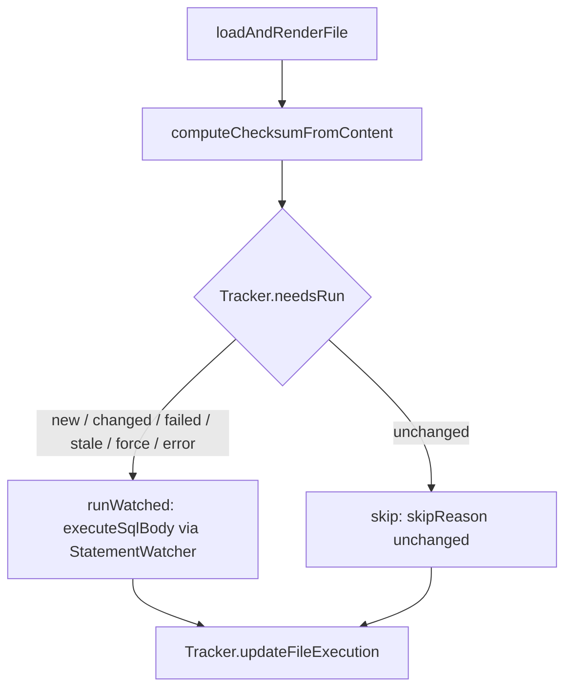
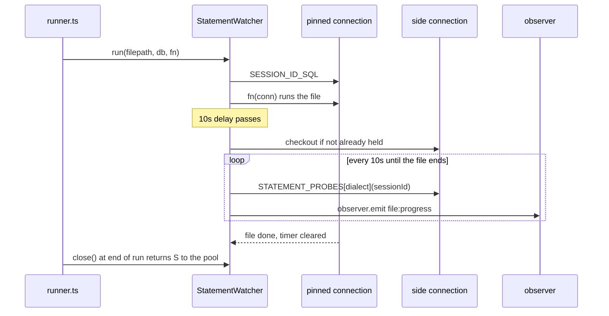

# core-runner

## What it does

Runs `.sql` and `.sql.tmpl` files against a Kysely connection with checksum-based change detection, so a build command run twice only re-executes what changed. `runBuild`, `runFile`, `runDir`, `runFiles`, `preview`, and `checkFilesStatus` in [`src/core/runner/runner.ts`](../../src/core/runner/runner.ts) are the policy-gated entrypoints. It also renders `.sql.tmpl` files through an Eta-based template engine before execution, and watches every file's SQL for how long it runs, so a slow `CREATE INDEX` and a file stuck behind another session's lock read differently to the caller instead of both looking like "still running."

## How it works

### Execution and change detection

A file's status decides whether it runs, and a run always records the outcome before moving to the next file.

`executeSingleFileWithUpdate` ([`src/core/runner/runner.ts`](../../src/core/runner/runner.ts)) loads and renders the file first, then recomputes the checksum from the rendered content, because comparing raw `.sql.tmpl` bytes would re-execute every template on every build. The raw `computeChecksum` only seeds the pending row that `createFileRecords` inserts for every file in the batch before the batch starts. [`src/core/runner/tracker.ts`](../../src/core/runner/tracker.ts)'s `Tracker.needsRun` excludes that pending row by its own operation id (`excludeOperationId`), or every file would read as "new" forever. A prior `skipped` row with `skip_reason: 'unchanged'` counts as a valid outcome and falls through to the stale and checksum comparison; any other `skipped` row (a cascade skip after an earlier failure, or a cancelled run) and any `pending` row re-runs with `reason: 'new'`.

### Long-running statement detection

`StatementWatcher` ([`src/core/runner/statement-watcher.ts`](../../src/core/runner/statement-watcher.ts)) pins one file's SQL to one connection, reads that connection's session id, and reports back only if the file is still running past a fixed delay.

`run()` uses the executor as is when it is already a transaction (a postgres change), otherwise pins a fresh connection with `.connection()` so the session id read up front is the session the SQL runs on. The side connection is checked out on first need and held until `close()`. If the checkout arrives after the file that asked for it has finished, the watcher returns it and resets `#side`, and the next slow file checks out again. `close()` (called once per run, in a `finally`) releases whatever side connection is held back to the pool.

`STATEMENT_PROBES` ([`src/core/runner/statement-probes.ts`](../../src/core/runner/statement-probes.ts)) supplies the per-dialect status query: postgres reads `pg_stat_activity`/`pg_blocking_pids()`/`pg_stat_progress_*`, mssql reads `sys.dm_exec_requests`, mysql reads `information_schema.processlist` plus the `sys` lock-wait views and `performance_schema.events_stages_current`. sqlite has no probe (in-process, single connection, nothing outside it to ask), so its `file:progress` events carry elapsed time only. Each piece of a probe (activity, blockers, progress) is attempted independently: a missing view or privilege drops that piece, not the whole report.

### Cancellation

Aborting `RunContext.signal` sends the dialect's `SERVER_CANCEL` from the side connection, which is checked out on demand if no report has claimed it yet. Nothing is sent when the dialect has no `SERVER_CANCEL` entry (mssql, sqlite) or the session id is null.

| Dialect | On abort |
|---------|----------|
| postgres | `pg_cancel_backend(pid)` from the side connection; the file fails, implicit transaction rolls back |
| mysql | `KILL QUERY id` from the side connection |
| mssql | Runs to completion; Kysely's `MssqlDialect` never exposes tedious's `Request`, and `KILL` would end the session, not the request |
| sqlite | Runs to completion; in-process, single connection, no second session to cancel from |

`SERVER_CANCEL` and `SESSION_ID_SQL` live in [`src/core/connection/session.ts`](../../src/core/connection/session.ts), a core-db artifact shared with the SQL terminal's cancel path. `readSessionId` only accepts a positive integer, which is what keeps the mysql `KILL QUERY ${id}` interpolation (not preparable) safe from an unexpected driver value. The runner stops starting new files on abort, marks the rest skipped, and returns `error: 'Run cancelled'`; a file whose SQL was never sent throws `OperationAbortedError` and is treated as not-started rather than failed.

## Where it lives

| Path | Role |
|------|------|
| [`src/core/runner/runner.ts`](../../src/core/runner/runner.ts) | `runBuild`/`runFile`/`runDir`/`runFiles`/`preview`/`checkFilesStatus`/`discoverFiles`/`executeFiles`; all except `discoverFiles`/`executeFiles` are gated. `createWatcher` builds one `StatementWatcher` per run and routes every file's SQL through `runWatched`. |
| [`src/core/runner/statement-watcher.ts`](../../src/core/runner/statement-watcher.ts) | `StatementWatcher` class: pins a file's connection, reads its session id, times the 10s delay and 10s report interval via `#report`/`#poll`, checks out and holds the side connection via `#sideConnection`, sends the cancel on abort via `#cancel`. |
| [`src/core/runner/statement-probes.ts`](../../src/core/runner/statement-probes.ts) | `STATEMENT_PROBES` (postgres/mssql/mysql `StatementProbe` functions) and the `StatementStatus`/`BlockingSession`/`OperationProgress` shapes a probe returns. |
| [`src/core/runner/tracker.ts`](../../src/core/runner/tracker.ts) | `Tracker` class: `needsRun`, `needsRunByName`, `createOperation`, `recordExecution`, `createFileRecords`, `updateFileExecution`, `finalizeOperation`, `skipRemainingFiles`, `priorSuccessfulExecutions`. |
| [`src/core/runner/checksum.ts`](../../src/core/runner/checksum.ts) | `computeChecksum`, `computeChecksumFromContent`, `computeCombinedChecksum` (SHA-256). |
| [`src/core/runner/mssql-batches.ts`](../../src/core/runner/mssql-batches.ts) | `executeSqlBody` (dialect dispatch: mssql splits on line-only `GO`, sqlite splits on statement boundaries, postgres/mysql execute the body whole), `splitMssqlBatches`. |
| [`src/core/runner/sqlite-statements.ts`](../../src/core/runner/sqlite-statements.ts) | `splitSqliteStatements`, a boundary scanner (not a SQL parser) tracking string/identifier quoting, comments, and `BEGIN`/`CASE`…`END` trigger bodies. |
| [`src/core/runner/types.ts`](../../src/core/runner/types.ts) | `RunOptions`, `RunContext` (including `signal?: AbortSignal`), `FileResult`, `BatchResult`, `NeedsRunResult`, `FileInput`, `ExecuteFilesOptions`, `FilesStatusResult`, `DEFAULT_RUN_OPTIONS`. |
| [`src/core/runner/index.ts`](../../src/core/runner/index.ts) | Public export surface for the domain. |
| [`src/core/template/engine.ts`](../../src/core/template/engine.ts) | `processFile`, `processFiles`, `renderTemplate`, `isTemplate`; owns the configured `Eta` instance (custom `` tags, `$` varName, `autoEscape: false`) and the `-- ` directive-line stripping convention. |
| [`src/core/template/context.ts`](../../src/core/template/context.ts) | `buildContext` assembles the `$` template context; `MissingSecretError` and the `$.secrets` proxy that throws on an unresolved key. |
| [`src/core/template/helpers.ts`](../../src/core/template/helpers.ts) | `findHelperFiles`/`loadHelpers` walk from a template's directory up to `projectRoot`, merging `$helpers.{ts,js,mjs}` files root-to-leaf. |
| [`src/core/template/loaders/`](../../src/core/template/loaders) | Per-extension data loaders: `json5.ts`, `yaml.ts`, `csv.ts`, `js.ts` (dynamic import, `Bun.build()` bundling for compiled binaries), `sql.ts`, `dt.ts` (`.dt`/`.dtz`). `loaders/index.ts` registers extensions and marks `.js`/`.mjs`/`.ts` as `isExecutableExtension`. |
| [`src/core/template/utils.ts`](../../src/core/template/utils.ts) | `toContextKey`, `sqlEscape`, `sqlQuote` (throws `UndefinedSqlValueError` on `undefined`), `isWithinRoot` (segment-aware path containment), `generateUuid`, `isoNow`. |
| [`src/core/template/types.ts`](../../src/core/template/types.ts) | `TemplateContext`, `BuiltInHelpers`, `RenderOptions`, `ProcessResult`, `Loader`/`LoaderRegistry`, `DATA_EXTENSIONS`, `TEMPLATE_EXTENSION` (`.tmpl`), `HELPER_FILENAME` (`$helpers`), `HELPER_EXTENSIONS`. |
| [`src/cli/run/index.ts`](../../src/cli/run/index.ts) | Registers the `run` command group: `build`, `dir`, `exec`, `file`, `files`, `inspect`, `preview`. |
| [`src/cli/run/build.ts`](../../src/cli/run/build.ts) | `run build`; runs `ctx.noorm.run.build`, reports `unmatchedInclude`/`unmatchedExclude` warnings and dry-run output. |
| [`src/cli/run/dir.ts`](../../src/cli/run/dir.ts) | `run dir <path>`; `EXIT.USAGE` when zero SQL files are found. |
| [`src/cli/run/exec.ts`](../../src/cli/run/exec.ts) | `run exec <path>`; a directory delegates to `discoverFiles`, a glob expands via `Bun.Glob` or Node's `fs/promises.glob`. |
| [`src/cli/run/file.ts`](../../src/cli/run/file.ts) | `run file <path>`; executes a single file via `ctx.noorm.run.file`. |
| [`src/cli/run/files.ts`](../../src/cli/run/files.ts) | `run files --paths <a,b,...>`; comma-separated file list via `ctx.noorm.run.files`. |
| [`src/cli/run/inspect.ts`](../../src/cli/run/inspect.ts) | `run inspect <path>`; builds the template `$` context without rendering, categorizes entries, reports helper load errors and secret counts. |
| [`src/cli/run/preview.ts`](../../src/cli/run/preview.ts) | `run preview <path>`; renders a `.sql.tmpl` and writes raw SQL to stdout or `--json`, without executing. |
| [`src/cli/run/_render-secrets.ts`](../../src/cli/run/_render-secrets.ts) | `resolveRenderSecrets` shared by `preview`/`inspect`: probes the vault tier with retry disabled so an offline render degrades to local-only secrets instead of hanging. |
| [`docs/dev/runner.md`](../dev/runner.md) | Runner design notes, including "Long-Running Statements". |
| [`docs/guide/sql-files/execution.md`](../guide/sql-files/execution.md) | End-user execution/change-detection and long-running-file guide. |
| [`tests/core/runner/`](../../tests/core/runner), [`tests/core/template/`](../../tests/core/template), [`tests/integration/runner/`](../../tests/integration/runner) | Unit and integration coverage, including the `StatementWatcher` tests. |

## Constraints

- Dropping `excludeOperationId` from `Tracker.needsRun` makes every file read as "new" forever, since the batch's own `pending` rows would be the latest record.
- Comparing raw `.sql.tmpl` bytes instead of the rendered checksum re-executes every template on every build.
- Skipping `StatementWatcher.close()` leaks any side connection checked out during the run; it never returns to the pool.
- With `connection.pool.max: 1`, the side connection checkout waits `SIDE_CONNECTION_WAIT_MS` (5s) then the watcher gives it up for the rest of the run: reports carry elapsed time only, and cancel can only act between files.
- Behind a transaction-mode pooler (PgBouncer `pool_mode = transaction`, RDS Proxy, Supabase port 6543), the session-id read and the file's SQL can land on different backends, so a report or a cancel can target another client's session. Point noorm at the database directly, or at a session-mode pooler.
- `include()` and the `$helpers` directory walk enforce project-root containment via `isWithinRoot` (segment-aware, not `startsWith`), so a sibling directory like `<root>-evil` cannot be traversed into.
- `$.secrets` is a `Proxy` that throws `MissingSecretError` on an unresolved key instead of resolving to `undefined`; `sqlQuote(undefined)` throws `UndefinedSqlValueError` rather than stringifying to the literal text `undefined`.
- Data-file auto-loading in `buildContext` skips `.js`/`.mjs`/`.ts` side-cars unless the template source textually references the resulting context key, so `preview`/`inspect`/`--dry-run` never execute arbitrary code without the user referencing it.
- MSSQL batch splitting and SQLite statement splitting are line/boundary scanners, not SQL parsers: a `GO` alone on a line inside a string literal or `/* */` block splits the MSSQL batch there ([`src/core/runner/mssql-batches.ts`](../../src/core/runner/mssql-batches.ts)), so the file fails or runs a truncated statement. Postgres and mysql receive the full file body via `sql.raw(...)` with no splitting.
- Dry-run output writes rendered SQL, including every resolved secret in plaintext, to `<projectRoot>/tmp/`; files and created directories are owner-only (`0o600`/`0o700`), and `tmp/` is not gitignored by `noorm init`.

## Coupling

- **core-db**: `SESSION_ID_SQL`, `SERVER_CANCEL`, `readSessionId` in [`src/core/connection/session.ts`](../../src/core/connection/session.ts) are imported by the runner's `StatementWatcher`; `hasServerSideCancel` from the same file is used by [`src/tui/utils/run-context.ts`](../../src/tui/utils/run-context.ts) (`runCancelMessage`) and the SQL terminal ([`src/core/sql-terminal/executor.ts`](../../src/core/sql-terminal/executor.ts)).
- **core-change**: [`src/core/change/executor.ts`](../../src/core/change/executor.ts) builds its own `StatementWatcher` (one per change) rather than sharing the runner's, and defines a private, same-named `executeFiles` with an unrelated signature; it also imports `processFile`/`isTemplate` from [`src/core/template/`](../../src/core/template). It shares `computeChecksum`, `computeCombinedChecksum`, and the `Tracker` base class with the runner. The change watcher gets no `signal` (`src/core/change/executor.ts:477`): progress reporting only, no cancel.
- **core-policy**: `runBuild` gates on `run:build`; `runFile`, `preview`, and `checkFilesStatus` gate on `run:file`; `runDir` and `runFiles` gate on `run:dir`. `discoverFiles`/`executeFiles` do not gate.
- **core-state**: `file:progress` (and `build:start`/`build:complete`, `run:file`/`run:dir`/`run:files`, `file:before`/`file:after`/`file:skip`/`file:dry-run`, `template:*`, `error`) are typed on the shared observer at [`src/core/observer.ts`](../../src/core/observer.ts).
- **core-identity**: `formatIdentity` stamps `executedBy` on every tracked operation.
- **sdk**: [`src/sdk/namespaces/run.ts`](../../src/sdk/namespaces/run.ts) wraps `runBuild`, `runFile`, `runDir`, `runFiles`, `preview`, and `discoverFiles`; it passes no `signal`, so SDK runs cannot be cancelled.
- **tui**: `src/tui/screens/run/*.tsx` and [`src/tui/utils/run-context.ts`](../../src/tui/utils/run-context.ts) consume the same runner/template functions as the CLI and SDK, and are the only callers that set `RunContext.signal` (`RunBuildScreen.tsx:164`, `RunExecScreen.tsx:159`). `StatementProgress` renders `file:progress` reports across both the run screens and the change screens. The TUI calls `checkFilesStatus` directly.
- **mcp-rpc**: [`src/rpc/commands/run.ts`](../../src/rpc/commands/run.ts) calls `ctx.noorm.run.build`/`ctx.noorm.run.file`, so MCP runs pass no `signal` and cannot be cancelled.
