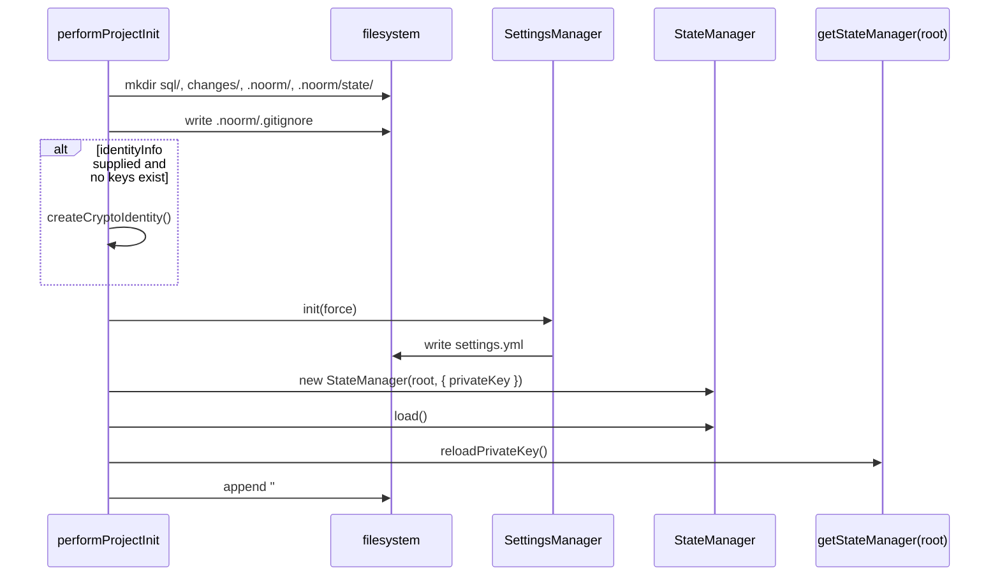
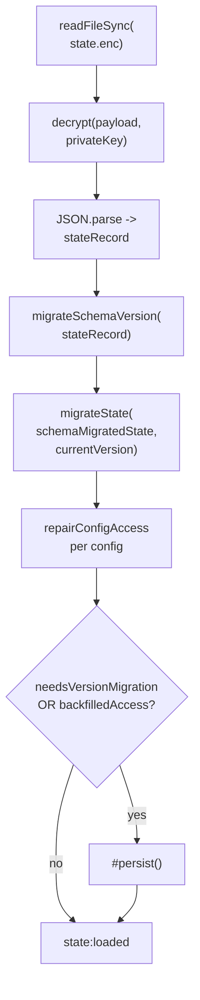
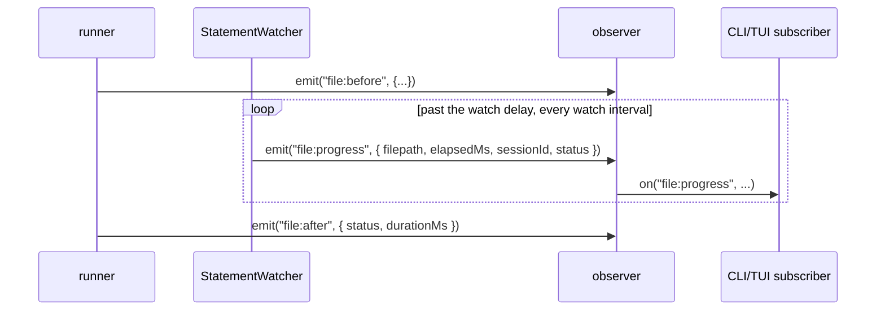

# core-state

## What it does

Every noorm command needs to know which database it is talking to, whether that config is locked down, and whether the on-disk data it is about to read still matches the shape the running build expects. This domain answers all three, split across storage with different trust levels: `.noorm/state/state.enc` (encrypted configs, secrets, known users), `.noorm/settings.yml` (version-controlled build/stage/rule config), and in-process `LifecycleManager` state (startup/shutdown coordination, not persisted). [`src/core/version/`](../../src/core/version) runs a schema-version migration and a semver migration in a fixed order so a project's on-disk data can move forward without forcing every layer to match the CLI's package version. [`src/core/observer.ts`](../../src/core/observer.ts) is the single `ObserverEngine` every other domain emits through, including the runner's `StatementWatcher`, which emits `file:progress` while a long-running statement is still executing, so a caller with no other signal for "it's still running" gets one.

## How it works

### Project initialization creates identity before StateManager is constructed

`performProjectInit` ([`src/core/project-init.ts`](../../src/core/project-init.ts)) is the one function both the TUI `InitScreen` and `noorm init` call. It creates identity before constructing either manager because `new StateManager(root, { privateKey })` needs the key `createCryptoIdentity` returns; `SettingsManager` takes no key and does not depend on identity at all.

Identity is optional input, not a side effect. `performProjectInit` only creates or updates identity when the caller passes `identityInfo`; when it is `null`, the function assumes a global identity already exists in `~/.noorm/` and proceeds straight to `SettingsManager.init` and `StateManager.load`. On a new project, `StateManager.load()` does not write `state.enc`: with no file on disk it builds `createEmptyState` in memory and returns (`src/core/state/manager.ts:151-166`), so `reloadPrivateKey()` on the process-wide singleton is what makes the just-created key available for later commands.

### Loading state runs two migration systems in a fixed order, then repairs access unconditionally

`StateManager.load()` ([`src/core/state/manager.ts`](../../src/core/state/manager.ts)) decrypts the file, then must reconcile two independent version numbers before the state is usable: the numeric `schemaVersion` field ([`src/core/version/state/index.ts`](../../src/core/version/state/index.ts)) and the semver-keyed `version` string ([`src/core/state/migrations.ts`](../../src/core/state/migrations.ts)). Schema-version migrations run first, on the raw record. The semver path (`migrateState`, [`src/core/state/migrations.ts`](../../src/core/state/migrations.ts)) then spreads every unknown top-level field through unchanged (`...carried`), so a downgrade does not destroy a field only a newer build knows about, and it drops exactly one field on purpose: `identity`, because that key moved to `~/.noorm/` and an old state file's copy of it holds private-key material that must never be re-persisted.

`repairConfigAccess` ([`src/core/state/access.ts`](../../src/core/state/access.ts)) runs on every config regardless of whether either migration fired, because a hand-edited or corrupted state file can reach this point with a malformed `access` even at the current schema version. It is fail-closed: an unrecognized `access.user` or `access.agent` value falls back to `viewer` (`MOST_RESTRICTIVE_ROLE`), and `access.agent: false` (invisible to the agent channel) survives untouched since it is already the strictest possible value.

### The runner's `file:before`/`file:after` bracket the watcher's repeating `file:progress`

[`src/core/observer.ts`](../../src/core/observer.ts) exports a single `ObserverEngine<NoormEvents>` instance. `NoormEvents` aggregates event-payload types from every domain that emits (`settings`, `update`, `vault`, `transfer`, `dt`), plus inline families such as `file:*`, `state:*`, `config:*`, `app:*`, `version:*` declared in this file, so the type surface of this one file is a dependency for anything in the repo that emits or subscribes. `file:before` and `file:after` are the runner's own events ([`src/core/runner/runner.ts`](../../src/core/runner/runner.ts), `executeSingleFileWithUpdate` and `executeSingleFile`); `StatementWatcher` ([`src/core/runner/statement-watcher.ts`](../../src/core/runner/statement-watcher.ts)) emits only `file:progress`, from inside its own `#report` loop.

The watcher waits out the watch delay before its first emission, then repeats on the watch interval until `file:after` closes the bracket.

`sessionId` is the server-side session or process id the watcher reads up front for the pinned connection; it is `null` on dialects with no session-id query (sqlite), when the id read itself fails (`statement-watcher.ts`'s `#readSessionId`: `if (err) return null`), and shows as `pid` in the TUI (`src/tui/components/status/StatementProgress.tsx:78`). Its payload's `status: StatementStatus | null` is `null` when the dialect has no probe or the server could not be asked, so a subscriber cannot treat a `null` status as "still fine": it means "no signal available," and `sessionId` lets a caller correlate repeats of the same in-flight statement.

## Where it lives

| Path | What |
|---|---|
| [`src/core/state/manager.ts`](../../src/core/state/manager.ts) | `StateManager` — load/persist, three-way merge reconciliation, config/secret/known-user CRUD |
| [`src/core/state/persistence.ts`](../../src/core/state/persistence.ts) | Atomic writes (`writeFileAtomicSync`), advisory lock (`acquireWriteLock`), backup (`backupExisting`), content fingerprinting |
| [`src/core/state/merge.ts`](../../src/core/state/merge.ts) | `mergeState` — per-field reconciliation rules for concurrent writers |
| [`src/core/state/access.ts`](../../src/core/state/access.ts) | `repairConfigAccess` — fail-closed backfill of a config's `access` field |
| [`src/core/state/migrations.ts`](../../src/core/state/migrations.ts) | Semver-keyed `migrateState`/`needsMigration`, keyed on `State.version` |
| [`src/core/state/encryption/crypto.ts`](../../src/core/state/encryption/crypto.ts), `.../index.ts` | AES-256-GCM encrypt/decrypt over `deriveStateKey` (derivation in [`src/core/identity/crypto.ts`](../../src/core/identity/crypto.ts)) |
| [`src/core/state/types.ts`](../../src/core/state/types.ts) | `State`, `EncryptedPayload`, `createEmptyState` |
| [`src/core/state/version.ts`](../../src/core/state/version.ts) | `getPackageVersion` — build-time-injected CLI version used to stamp `state.enc` |
| [`src/core/settings/manager.ts`](../../src/core/settings/manager.ts) | `SettingsManager` — `settings.yml` load/save, `#document` vs. env-overlaid `#settings` split |
| [`src/core/settings/rules.ts`](../../src/core/settings/rules.ts) | `evaluateRules`, `getEffectiveBuildPaths`, `isConfigGuarded` |
| [`src/core/settings/defaults.ts`](../../src/core/settings/defaults.ts) | `DEFAULT_SETTINGS`, `SETTINGS_DIR_PATH`, `createDefaultSettings` |
| [`src/core/settings/events.ts`](../../src/core/settings/events.ts), `.../schema.ts`, `.../types.ts` | `SettingsEvents`, zod schema, `Stage`/`Rule`/`BuildConfig` types |
| [`src/core/config/resolver.ts`](../../src/core/config/resolver.ts) | `resolveConfig` — merges defaults, stage, stored, env, and flags; `applyStageCeiling` |
| [`src/core/config/schema.ts`](../../src/core/config/schema.ts) | `ConfigSchema` (`.transform(withResolvedAccess)`), `DANGEROUS_DB_NAME_CHARS` |
| [`src/core/config/validate.ts`](../../src/core/config/validate.ts) | `validateConfigChecks` — the shared connection/name/database/host-presence check sequence used by [`src/cli/config/validate.ts`](../../src/cli/config/validate.ts) and `ConfigValidateScreen.tsx` |
| [`src/core/config/index.ts`](../../src/core/config/index.ts) | `getEnvConfig` — env-var config accessor |
| [`src/core/config/types.ts`](../../src/core/config/types.ts) | `Config`/`ConfigInput` types |
| [`src/core/lifecycle/manager.ts`](../../src/core/lifecycle/manager.ts) | `LifecycleManager` — phased shutdown (`stopping` → `completing` → `releasing` → `flushing` → `exiting`) |
| [`src/core/lifecycle/handlers.ts`](../../src/core/lifecycle/handlers.ts) | `registerSignalHandlers`, `registerExceptionHandlers` |
| [`src/core/lifecycle/types.ts`](../../src/core/lifecycle/types.ts) | `LifecycleConfig`, `ShutdownPhase`, `AppMode` |
| [`src/core/version/types.ts`](../../src/core/version/types.ts) | `CURRENT_VERSIONS` (`schema: 2`, `state: 3`, `settings: 1`), migration interfaces |
| [`src/core/version/schema/`](../../src/core/version/schema), `.../state/`, `.../settings/` | Numeric migration engines, each a `MIGRATIONS` array plus `up`/`down` steps; `schema/` tracks the DB-side tracking tables |
| [`src/core/project.ts`](../../src/core/project.ts) | `findProjectRoot`, `getOriginalCwd`/`setOriginalCwd` |
| [`src/core/project-init.ts`](../../src/core/project-init.ts) | `performProjectInit` — directory/settings/state/identity bootstrap |
| [`src/core/environment.ts`](../../src/core/environment.ts) | `isCi`, `isDev`, `isDebug`, `isEnvTruthy`, `shouldSkipConfirmations`, `getEnvConfigName` |
| [`src/core/observer.ts`](../../src/core/observer.ts) | `observer` singleton, `NoormEvents` (includes `file:progress`) |
| `.noorm/state/state.enc` | AES-256-GCM encrypted JSON, mode `0o600`; holds `configs`, `secrets`, `globalSecrets`, `knownUsers`, `activeConfig`, `version`, `schemaVersion` |
| `.noorm/state/state.enc.bak` | Previous-generation backup written before every overwrite |
| `.noorm/state/state.enc.lock` | Advisory `O_EXCL` lock file, 5s acquire timeout, 30s staleness threshold |
| `.noorm/settings.yml` | YAML, version controlled, parsed/written via the `yaml` package |
| `tests/core/{state,settings,config,lifecycle,version}/` | Unit coverage for state migration/access/persistence, settings load/save, config resolution, lifecycle phases, and version migration |

## Constraints

- `StateManager.load()` never writes on init: with no `state.enc` on disk, `load()` builds `createEmptyState` in memory and returns without calling `#persist()`. A caller that needs the file to exist on disk after init must trigger a later save.
- Migration order is fixed: schema-version migration (`migrateSchemaVersion`, numeric `schemaVersion`) must run before the semver `migrateState` (string `version`), on the raw record. `migrateState` ([`src/core/state/migrations.ts`](../../src/core/state/migrations.ts)) is the semver engine; [`src/core/version/`](../../src/core/version) holds the numeric engines (`schema/`, `state/`, `settings/`).
- Access repair is fail-closed on record-shaped `access`: `repairConfigAccess` can only make a record-shaped config more restrictive on an unrecognized channel value; it never loosens. `access.agent: false` (invisible) is distinct from any role and preserved as-is. A non-object `access` with no `protected` instead resolves to `DEFAULT_ACCESS` (`{ user: 'admin', agent: 'viewer' }`) via `resolveLegacyAccess`; a truthy `protected` maps to `GUARDED_ACCESS`.
- `DEFAULTS` omits `access` on purpose: `resolveConfig`'s merge base leaves `access` out so `parseConfig`'s `resolveLegacyAccess` fallback sees what the merged stored/env/flag input supplied instead of a pre-filled default. Pre-filling `access` in `DEFAULTS` would short-circuit `withResolvedAccess`, so a config that only sets legacy `protected: true` would silently resolve to `DEFAULT_ACCESS` (admin) instead of `GUARDED_ACCESS` (`src/core/config/resolver.ts:67-74`).
- Stage ceilings only clamp down: `applyStageCeiling`/`clampToCeiling` cap a `protected: true` stage's resolved access at `{ user: 'operator', agent: 'viewer' }`; a config already stricter than the ceiling is left alone.
- `#document` and `#settings` never merge back: `SettingsManager` mutators (`setStage`, `addRule`, etc.) read and write `#document` only; the env-overlaid `#settings` view is recomputed via `#refreshResolved` after every load and mutation, so ambient `NOORM_*` shell values never land in the version-controlled `settings.yml`.
- Env overlay reads live, not cached: `allSettingsEnv()` calls `makeNestedConfig` fresh per call with `memoizeOpts: false`, so `process.env` mutations after module load are still visible.
- Lock uses `O_EXCL`, not `flock`: `acquireWriteLock` opens with `wx` because `flock` silently no-ops on some network filesystems; a lock older than 30s is treated as abandoned and removed.
- `IV_LENGTH` is 16 bytes, a deliberate deviation from the NIST-recommended 12, noted in [`src/core/state/encryption/crypto.ts`](../../src/core/state/encryption/crypto.ts). `EncryptedPayload.kdf` is optional; absent means `hkdf-sha256`, so old payloads keep decrypting after a future derivation change.
- Secret keys follow one regex declared twice: `isValidSecretKey` (`/^[A-Za-z][A-Za-z0-9_]*$/`) in [`src/core/state/manager.ts`](../../src/core/state/manager.ts), and the same pattern as `SECRET_KEY_PATTERN` in `src/core/vault/storage.ts:35`. `setSecret` and TUI live-typing validators call one or the other rather than deriving a shared constant.
- `file:progress.status` can be `null`: it means no probe exists for the dialect (sqlite) or the server could not be asked. A subscriber must not read it as "healthy."
- [`.gitignore`](../../.gitignore) append is keyed on the entry string: `performProjectInit` checks for the literal `.noorm/state/` entry, not the `# noorm` header comment, because a [`.gitignore`](../../.gitignore) can carry a `# noorm` header with no `.noorm/state/` entry under it. Existing projects may carry a header-only `# noorm` block, so the append still fires for them.

## Coupling

- [`src/core/state/access.ts`](../../src/core/state/access.ts) and [`src/core/config/schema.ts`](../../src/core/config/schema.ts)/`resolver.ts` import `resolveLegacyAccess`, `ConfigAccess`, `Role` from **core-policy** to resolve and clamp per-config access roles: data resolution, not enforcement.
- `src/core/settings/rules.ts:isConfigGuarded` calls `guarded` from **core-policy** so rule matching on `match.protected` reflects actual access state rather than a stored flag.
- [`src/core/state/manager.ts`](../../src/core/state/manager.ts) imports `KnownUser` ([`src/core/identity/types.ts`](../../src/core/identity/types.ts)) and `loadPrivateKey` ([`src/core/identity/storage.ts`](../../src/core/identity/storage.ts)); [`src/core/state/encryption/crypto.ts`](../../src/core/state/encryption/crypto.ts) imports `deriveStateKey` and `isValidKeyHex`: state encryption is keyed off the user's identity private key (**core-identity**).
- [`src/core/config/types.ts`](../../src/core/config/types.ts) imports `ConnectionConfig`/`Dialect` from [`src/core/connection/types.ts`](../../src/core/connection/types.ts); [`src/core/config/validate.ts`](../../src/core/config/validate.ts) imports `testConnection` from [`src/core/connection/factory.ts`](../../src/core/connection/factory.ts); [`src/core/config/schema.ts`](../../src/core/config/schema.ts) and [`src/core/settings/schema.ts`](../../src/core/settings/schema.ts) both import `PortSchema` from [`src/core/connection/defaults.ts`](../../src/core/connection/defaults.ts), all **core-db**.
- [`src/core/config/types.ts`](../../src/core/config/types.ts) imports `LogLevel` from [`src/core/logger/types.ts`](../../src/core/logger/types.ts) (**core-identity**).
- [`src/core/lifecycle/manager.ts`](../../src/core/lifecycle/manager.ts) registers a default shutdown resource that calls `getConnectionManager().closeAll()` (**core-db**).
- [`src/core/version/schema/index.ts`](../../src/core/version/schema/index.ts) calls `waitForIdentityToLoad` from [`src/core/identity/index.ts`](../../src/core/identity/index.ts) (**core-identity**) after bootstrapping or migrating tracking tables.
- [`src/core/observer.ts`](../../src/core/observer.ts)'s `NoormEvents` imports event-payload types from [`src/core/vault/events.ts`](../../src/core/vault/events.ts) and [`src/core/logger/types.ts`](../../src/core/logger/types.ts) (**core-identity**), [`src/core/transfer/events.ts`](../../src/core/transfer/events.ts) and [`src/core/teardown/types.ts`](../../src/core/teardown/types.ts) (**core-db**), [`src/core/dt/events.ts`](../../src/core/dt/events.ts) (**sdk**), and `StatementStatus` from [`src/core/runner/statement-probes.ts`](../../src/core/runner/statement-probes.ts) (**core-runner**, which also emits `file:before`/`file:after` through this observer). [`src/core/update/`](../../src/core/update) has no owning domain, and its event-payload types are imported here too. Every domain that emits events depends on this file, and this file's type surface depends on those domains' event shapes.
