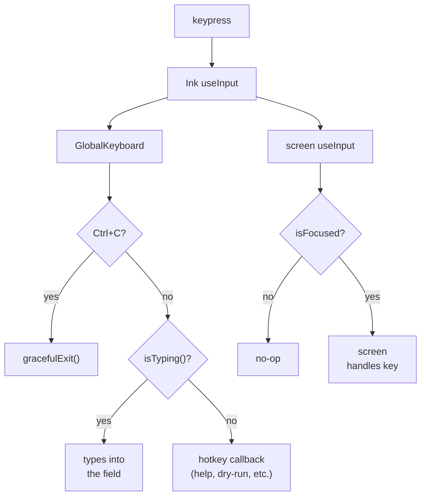
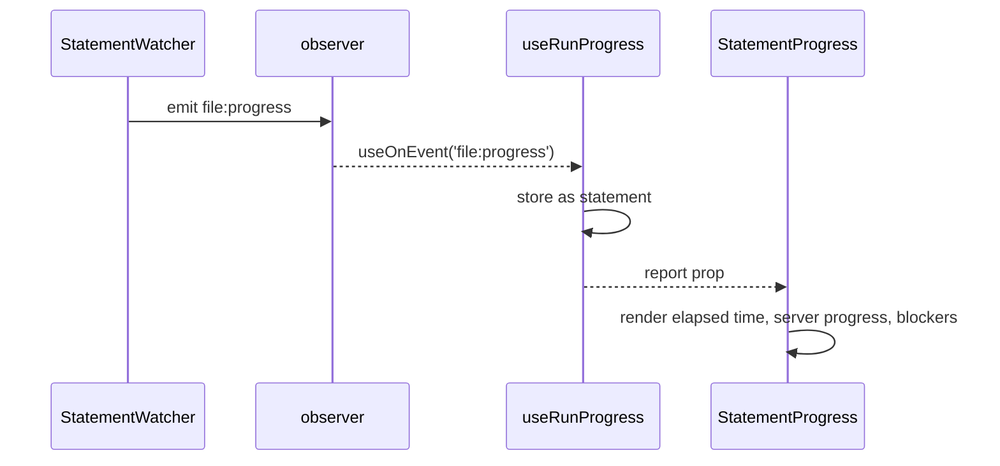
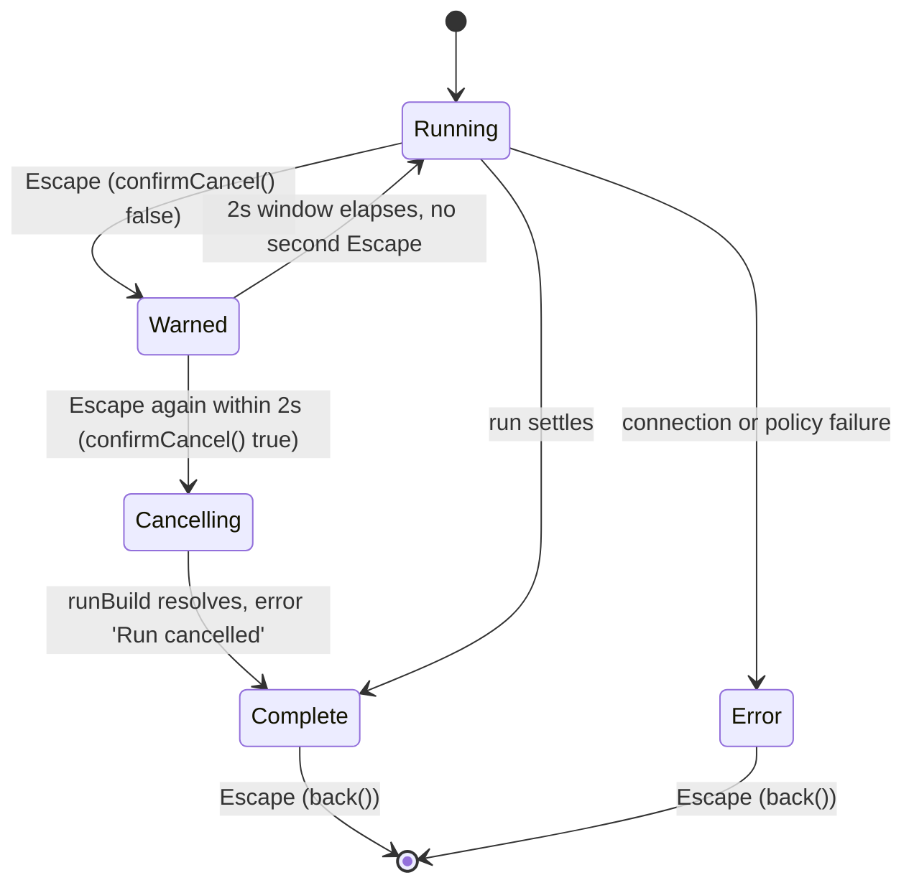

# tui

## What it does

- Renders the interactive terminal UI mounted by `noorm ui` ([`src/cli/ui.ts`](../../src/cli/ui.ts)) and the SQL REPL ([`src/cli/sql/repl.ts`](../../src/cli/sql/repl.ts)).
- Routes navigation through a string-union `Route` type ([`src/tui/types.ts`](../../src/tui/types.ts)); the flat `SCREENS` registry ([`src/tui/screens.tsx`](../../src/tui/screens.tsx)), keyed by route, maps routes to screen components — an unregistered route falls through to `NotFoundScreen`.
- Owns a custom focus stack ([`src/tui/focus.tsx`](../../src/tui/focus.tsx)) that gates which component receives keyboard input, used instead of `@inkjs/ui`'s incompatible internal focus system.
- Bridges core managers (`StateManager`, `SettingsManager`) and the `@logosdx/observer` event bus into React state via `AppContextProvider` ([`src/tui/app-context.tsx`](../../src/tui/app-context.tsx)).
- Surfaces what a long-running SQL statement is doing on the server (`StatementProgress`, [`src/tui/components/status/StatementProgress.tsx`](../../src/tui/components/status/StatementProgress.tsx)) on every run and change-apply screen: `RunBuildScreen`, `RunExecScreen`, `RunDirScreen`, `RunFileScreen`, and the `change/` screens. `RunBuildScreen`/`RunExecScreen` gate their cancel behind a double-`Escape` (`useDoublePress`, [`src/tui/hooks/useDoublePress.ts`](../../src/tui/hooks/useDoublePress.ts)); `RunDirScreen`/`RunFileScreen` cancel on a single `Escape`.

## How it works

Focus is a stack, not a DOM: `useFocusScope(label)` pushes an ID on mount and pops on unmount, and only the ID on top is `isFocused`. Every `useInput` handler in the tree receives every keystroke regardless of focus, so the handler itself is what has to check `isFocused` and no-op otherwise.

A keystroke reaches every registered handler; only `GlobalKeyboard`'s own checks and the focus stack decide which one acts on it.

`useFocusScope` pushes onto the stack inside a `useEffect`, so `isFocused` is `false` on the first render; `useFocusedInput` ([`src/tui/keyboard.tsx`](../../src/tui/keyboard.tsx)) wraps the guard correctly and is the preferred entry point over checking `isFocused` by hand.

### How a long-running statement's progress reaches the screen

`StatementWatcher` starts a timer when a file begins, and once that file has run past a watch delay it polls the dialect's status probe, emitting `file:progress` on the shared observer and repeating on a watch interval until the file finishes.

`StatementWatcher` ([`src/core/runner/statement-watcher.ts`](../../src/core/runner/statement-watcher.ts)) is core-runner's and emits the event; [`src/core/observer.ts`](../../src/core/observer.ts) declares the event's shape; `useRunProgress`/`useChangeProgress` in this domain are the only consumers that turn it into the `statement` field a screen reads.

Each run boundary clears `statement` back to `null` rather than letting a stale report survive past the file it described: `useRunProgress` clears it on `file:before`, `file:after`, and `build:complete`; `useChangeProgress` clears it on `change:file` and `change:complete`; both also clear it on their own `reset()`, called when a screen starts a new run.

### Cancelling a running build or exec

`RunBuildScreen` and `RunExecScreen` are the only screens wired to `useDoublePress`; a single `Escape` during their run only warns, and the abort needs a second press inside the window.

`back()` only fires once `phase !== 'running'` (`RunBuildScreen.tsx:196-217`); while `phase === 'running'` every `Escape` is consumed by the arm/confirm logic above, never by navigation.

`useDoublePress` ([`src/tui/hooks/useDoublePress.ts`](../../src/tui/hooks/useDoublePress.ts)) arms on the first call and returns `false`; a second call inside the 2000ms window returns `true`, and a call after the window re-arms rather than confirming. On confirmation the screen aborts its `AbortController` and shows `runCancelMessage(dialect)` ([`src/tui/utils/run-context.ts`](../../src/tui/utils/run-context.ts)). On Postgres and MySQL that message reads as an immediate stop, because the server is asked to cancel the running statement (`hasServerSideCancel`, [`src/core/connection/session.ts`](../../src/core/connection/session.ts)). Everywhere else it reads as "stopping after the current file finishes", since there is no server-side cancel to issue.

`RunDirScreen` and `RunFileScreen` take a different path: their `running`-phase view binds `<KeyHandler onCancel={cancelExecution} />` directly, so a single `Escape` (or `c`) calls `cancelExecution`, which destroys the active connection (`RunDirScreen.tsx:323-343`) with no arm-then-confirm step.

## Where it lives

### Core

| Path | What |
|------|------|
| [`src/tui/app.tsx`](../../src/tui/app.tsx) | Root `App`; wires the provider hierarchy (`ShutdownProvider` → `NoormObserver` → `AppContextProvider` → `ConnectionProvider` → `ToastProvider` → `FocusProvider` → `RouterProvider` → `AppShell`) |
| [`src/tui/app-context.tsx`](../../src/tui/app-context.tsx) | `AppContextProvider`/`useAppContext` and derived hooks (`useActiveConfig`, `useLockStatus`, `useGlobalModes`, `useDryRunMode`, `useForceMode`, `useExploreFilters`); also `LoadingGuard`, `ConfigGuard`, `IdentityGuard` |
| [`src/tui/focus.tsx`](../../src/tui/focus.tsx) | `FocusProvider`, `useFocusScope`, `useIsFocused`, `useActiveFocus`; stack-based, last-pushed-wins |
| [`src/tui/keyboard.tsx`](../../src/tui/keyboard.tsx) | `GlobalKeyboard` (Ctrl+C, Shift+L log viewer, Shift+Q SQL terminal, `?` help, `D`/`F` dry-run/force toggles); `useFocusedInput`, `useListKeys`, `useQuitHandler` |
| [`src/tui/router.tsx`](../../src/tui/router.tsx) | `RouterProvider`/`useRouter`: `navigate`/`back`/`replace`/`reset`, a history stack, `router:navigated`/`router:popped` observer events |
| [`src/tui/screens.tsx`](../../src/tui/screens.tsx) | `SCREENS` route registry and `ScreenRenderer`; `getRouteLabel`, `getRegisteredRoutes`, `isRouteRegistered`, `registerScreen` |
| [`src/tui/types.ts`](../../src/tui/types.ts) | `Route` union, `RouteParams`, `RouterContextValue`, `FocusContextValue`, `ScreenProps`/`ScreenEntry` |
| [`src/tui/shutdown.tsx`](../../src/tui/shutdown.tsx) | `ShutdownProvider`/`useShutdown`; `gracefulExit()` drives `LifecycleManager.shutdown()` and shows a phased `ShutdownScreen` before `app:exit` |
| [`src/tui/observer-context.ts`](../../src/tui/observer-context.ts) | `NoormObserver`/`useNoormObserver`, built via `@logosdx/react`'s `createObserverContext` over the shared `observer` singleton |
| [`src/tui/mouse.tsx`](../../src/tui/mouse.tsx) | The mouse transport: writes tracking escape sequences, parses SGR reports off `useInput`, restores the terminal on exit, hit-tests rows with `measureElement` |

### Components, hooks, utils

| Path | What |
|------|------|
| [`src/tui/components/`](../../src/tui/components) | Shared UI: `layout/`, `lists/`, `forms/`, `feedback/`, `dialogs/`, `status/` (`ConnectionStatus`, `LockStatus`, `StatementProgress`), `secrets/`, `overlays/`, `terminal/`. `components/index.ts` is the primary re-export surface |
| [`src/tui/components/status/StatementProgress.tsx`](../../src/tui/components/status/StatementProgress.tsx) | Renders one `file:progress` report: elapsed time, `describeProgress()` for the server's own progress line, and a line per session it is blocked on |
| [`src/tui/hooks/`](../../src/tui/hooks) | `useObserver.ts` (`useOnEvent`, `useOnceEvent`, `useEmit`, `useOnScreenPopped`), `useConnection.ts`, `useVaultConnection.ts`, `useVaultSecretKeys.ts`, `useLockStatus.ts`, `useLoadGuard.ts`, `useRunProgress.ts`, `useChangeProgress.ts`, `useTransferProgress.ts`, `useUpdateChecker.ts`, `useUpdateProgress.ts`, `useSettingsOperation.ts`, `useSecretSource.ts`, `useAsyncEffect.ts`, `useAbortableTask.ts`, `useViewportRows.ts`, `useDoublePress.ts`; re-exported from `hooks/index.ts` |
| [`src/tui/hooks/useRunProgress.ts`](../../src/tui/hooks/useRunProgress.ts) | Tracks `build:start`/`file:before`/`file:progress`/`file:after`/`file:skip`/`file:dry-run`/`build:complete`; exposes `state.statement` (the current file's latest `file:progress`, cleared on `file:before`/`file:after`/`build:complete`/`reset()`) |
| [`src/tui/hooks/useChangeProgress.ts`](../../src/tui/hooks/useChangeProgress.ts) | Tracks `change:start`/`change:file`/`change:complete`/`file:progress`; exposes `statement`, cleared on `change:file`/`change:complete`/`reset()` |
| [`src/tui/hooks/useDoublePress.ts`](../../src/tui/hooks/useDoublePress.ts) | Arm-then-confirm for a hard-to-undo key: first call arms and returns `false`, a second call within `windowMs` (default 2000) returns `true`, a call after the window re-arms |
| [`src/tui/hooks/useAbortableTask.ts`](../../src/tui/hooks/useAbortableTask.ts) | One cancellable database operation per screen; tracks whether a result that resolves after `Escape` still belongs on screen |
| [`src/tui/hooks/useUpdateProgress.ts`](../../src/tui/hooks/useUpdateProgress.ts) | Tracks `update:*` events for the update-download progress shown in `UpdateScreen` |
| [`src/tui/hooks/useViewportRows.ts`](../../src/tui/hooks/useViewportRows.ts) | Computes how many rows a windowed list may draw from the terminal size, so a list never renders past the visible frame |
| [`src/tui/utils/`](../../src/tui/utils) | `change-context.ts`, `change-loader.ts`, `clipboard.ts`, `config-validation.ts`, `connection.ts`, `date.ts`, `error.ts`, `identity.ts`, `paths.ts`, `progress.ts`, `run-context.ts`, `settings-validation.ts`, `string.ts`. All but `date.ts` are re-exported from `utils/index.ts` |
| [`src/tui/utils/run-context.ts`](../../src/tui/utils/run-context.ts) | `buildRunContext()` assembles a `RunContext` from screen state; `runCancelMessage(dialect)` picks the cancel-in-progress copy from `hasServerSideCancel(dialect)` |
| [`src/tui/utils/progress.ts`](../../src/tui/utils/progress.ts) | `progressPercentage(completed, total)` converts completed work into the 0-100 value Ink's `ProgressBar` expects, clamped for over-counted event streams |
| [`src/tui/providers/ConnectionProvider.tsx`](../../src/tui/providers/ConnectionProvider.tsx) | `ConnectionProvider`/`useConnectionContext`; one lazily-created Kysely connection keyed by `activeConfigName`, destroyed on config change or unmount |

### Screens and tests

| Path | What |
|------|------|
| [`src/tui/screens/`](../../src/tui/screens) | Per-domain screen components: `change/`, `config/`, `db/` (incl. `db/explore/`), `debug/`, `identity/`, `init/`, `lock/`, `run/`, `secret/`, `settings/`, `vault/`, plus top-level `home.tsx`, `MoreScreen.tsx`, `not-found.tsx`, `UpdateScreen.tsx` |
| [`src/tui/screens/run/RunBuildScreen.tsx`](../../src/tui/screens/run/RunBuildScreen.tsx), `RunExecScreen.tsx` | Render `StatementProgress` from the run progress hook's `statement`; on `Escape` while `phase === 'running'`, gate the abort behind `useDoublePress()` and show `[Esc Esc] Cancel` until confirmed |
| [`src/tui/screens/run/RunDirScreen.tsx`](../../src/tui/screens/run/RunDirScreen.tsx), `RunFileScreen.tsx` | Render `StatementProgress` the same way; the `running`-phase view binds `<KeyHandler onCancel={cancelExecution} />`, so `Escape` or `c` destroys the active connection immediately, no arm-then-confirm step |
| [`src/tui/screens/change/ChangeRunScreen.tsx`](../../src/tui/screens/change/ChangeRunScreen.tsx), `ChangeFFScreen.tsx`, `ChangeNextScreen.tsx`, `ChangeRevertScreen.tsx`, `ChangeRewindScreen.tsx` | Render `StatementProgress` from `useChangeProgress().statement`; none binds `useDoublePress` or an `Escape` cancel path during a run |
| [`.claude/rules/tui-development.md`](../../.claude/rules/tui-development.md) | Path-scoped rules for this domain: focus system, `@inkjs/ui` boundary, keyboard handling, screen focus ownership, UI patterns, Ink layout, observer hooks, testing conventions. Scoped to `src/tui/**/*.{ts,tsx}, tests/cli/**/*.{ts,tsx}` |
| [`tests/cli/components/`](../../tests/cli/components) | Component tests, one file per component family (`forms.test.tsx`, `dialogs.test.tsx`, `status.test.tsx`, and more), flat files, using `ink-testing-library` |
| [`tests/cli/hooks/`](../../tests/cli/hooks) | Hook tests, one file per tested hook (`useDoublePress`, `useRunProgress`, and `useChangeProgress` have no dedicated test file) |
| [`tests/cli/screens/`](../../tests/cli/screens) | Screen tests, in subdirectories named after their [`src/tui/screens/`](../../src/tui/screens) counterparts |
| [`docs/tui.md`](../tui.md) | User-facing keyboard/screen reference; "Long-Running Files" documents the same status block and the two-`Escape` cancel described above |

## Constraints

- Check `isFocused` inside the `useInput` handler body, never via `useInput`'s `isActive` option: the option skips handler registration when `false` on the first render (`isFocused` starts `false`, set in a `useEffect`), and the handler never recovers.
- `@inkjs/ui`'s `Select`, `MultiSelect`, and `ConfirmInput` are unused because they drive their own internal focus, invisible to this app's stack; `SelectList`, `Form`, `Confirm`/`SmartConfirm` are the replacements. `Spinner`, `Badge`, `ProgressBar`, `Alert`, `StatusMessage` from `@inkjs/ui` are used directly since they are display-only or externally controlled. `TextInput` is not one of them: [`src/tui/components/forms/TextInput.tsx`](../../src/tui/components/forms/TextInput.tsx) is a local copy of upstream's component plus a mouse-report guard, kept because `@inkjs/ui`'s exports map publishes only the package root.
- A screen whose primary content is a `Form` (or other self-focusing component) does not call `useFocusScope` at the screen level; two scopes would compete for one stack slot.
- Global hotkeys (`Shift+L`, `Shift+Q`, `?`, `D`, `F`) stand down while a text field is taking input (`useTextEntry`), and `?`/`D`/`F` additionally require `stack.length <= 1` to stay out of nested dialogs. `GlobalKeyboard` deliberately does not handle `Escape`; each screen owns its own, because a global handler firing alongside a screen handler would pop history twice.
- `useDoublePress`'s window is per-hook-instance state (a `ref`), so it resets whenever the owning screen unmounts; leaving `RunBuildScreen` mid-warning and returning re-arms rather than remembering the first press.
- The cancel warning toast (`RunBuildScreen.tsx:204`, `RunExecScreen.tsx:189`) hardcodes `duration: 2000` rather than reading `useDoublePress`'s `windowMs`; changing one without the other makes the toast outlive or undershoot the confirm window.
- Leaving a run screen does not cancel the run (`docs/tui.md:265`). `RunBuildScreen`/`RunExecScreen` cancel through double-`Escape` → `AbortController.abort()`; `RunDirScreen`/`RunFileScreen` through a single `Escape` → `destroy()` on the active connection.
- `useWindowSize()`, not `useStdout().stdout.rows`, is the only correct source for terminal size: Ink's resize handler re-paints existing output without a state update, so a component that reads `stdout.rows` at render time is frozen at mount.
- Tests wrap components in `<FocusProvider>`/`<NoormObserver>` (plus `RouterProvider`/`AppContextProvider` for screens) and poll with a `waitFor(predicate)` loop before writing to `stdin` rather than a fixed sleep, because the focus stack initializes in a `useEffect` and a fixed sleep flakes under load (`.claude/rules/tui-development.md:305-330`); tests call `unmount()` to release stdin handlers.

## Coupling

- **core-runner**: `StatementWatcher` ([`src/core/runner/statement-watcher.ts`](../../src/core/runner/statement-watcher.ts)) emits `file:progress`, the event `StatementProgress` renders; `run-context.ts` and the run/change screens call `discoverFiles`, `runBuild`, and the `RunContext`/`Dialect` types from [`src/core/runner/`](../../src/core/runner).
- **core-state**: [`src/core/observer.ts`](../../src/core/observer.ts) declares `NoormEvents['file:progress']` (and every other event this domain subscribes to); `app-context.tsx` instantiates `StateManager`/`SettingsManager` from [`src/core/state/`](../../src/core/state) and [`src/core/settings/`](../../src/core/settings) and subscribes to the shared `observer` singleton directly for state/config/connection/lock events, while screens consume domain wrapper hooks (`useRunProgress`, `useChangeProgress`, `useLockStatus`, `useConnection`, `useTransferProgress`, `useVaultConnection`, `useVaultSecretKeys`, `useLoadGuard`, `useUpdateChecker`) instead of calling `useOnEvent` directly.
- **core-state** also covers config resolution: [`src/core/config/`](../../src/core/config) (`SettingsProvider` from [`src/core/config/resolver.ts`](../../src/core/config/resolver.ts), used by config screens) is core-state's, not a separate domain.
- **core-change**: screens under [`src/tui/screens/change/`](../../src/tui/screens/change) import `ChangeHistory`, `discoverChanges`, and change types directly from [`src/core/change/`](../../src/core/change); `home.tsx` also reads `ChangeHistory` for the recent-activity panel.
- **core-db**: `ConnectionProvider` calls `createConnection` from [`src/core/connection/`](../../src/core/connection); `hasServerSideCancel` ([`src/core/connection/session.ts`](../../src/core/connection/session.ts)) decides the cancel message `run-context.ts` shows. `db/` screens import `fetchOverview` from [`src/core/explore/`](../../src/core/explore), plus transfer/teardown types.
- **sdk**: `db/` transfer screens import the DT serialization types from [`src/core/dt/`](../../src/core/dt), which belongs to the sdk domain rather than core-db.
- **core-identity / core-policy**: `identity/` and `vault/` screens use [`src/core/identity/`](../../src/core/identity) and [`src/core/vault/`](../../src/core/vault); mutation screens call `checkConfigPolicy`/`confirmationPhraseFor` from [`src/core/policy/`](../../src/core/policy) to choose plain `Confirm` vs. typed-phrase `ProtectedConfirm`. [`src/cli/sql/`](../../src/cli/sql) (the SQL REPL this domain mounts `App` from) is core-identity's, not cli's.
- **cli**: [`src/cli/ui.ts`](../../src/cli/ui.ts) and [`src/cli/sql/repl.ts`](../../src/cli/sql/repl.ts) are the only entry points that mount `App`; both independently suppress logger output and own the `app:exit` → `clear()`/`unmount()` teardown sequence.
</content>
