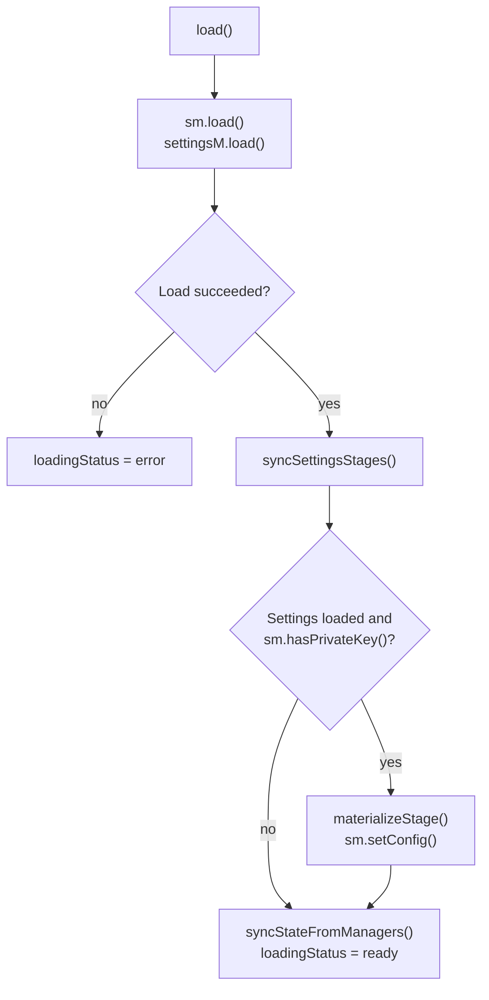
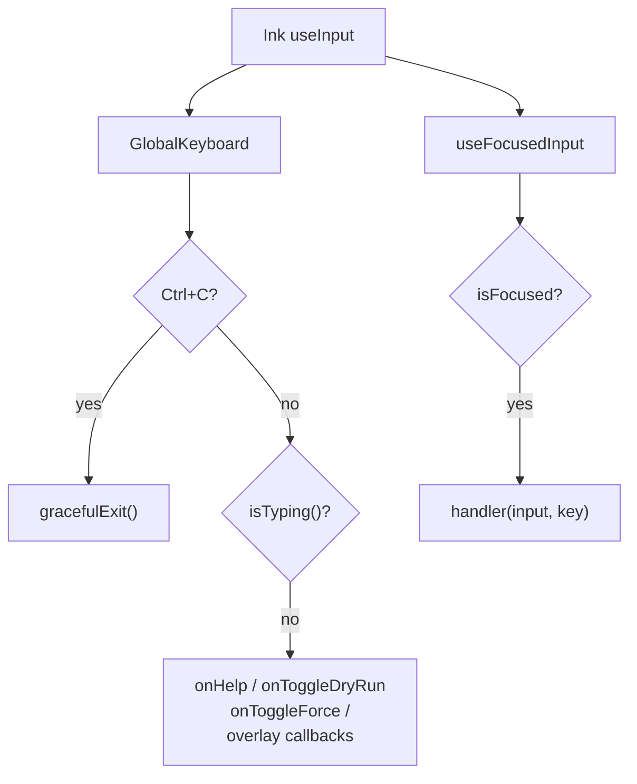
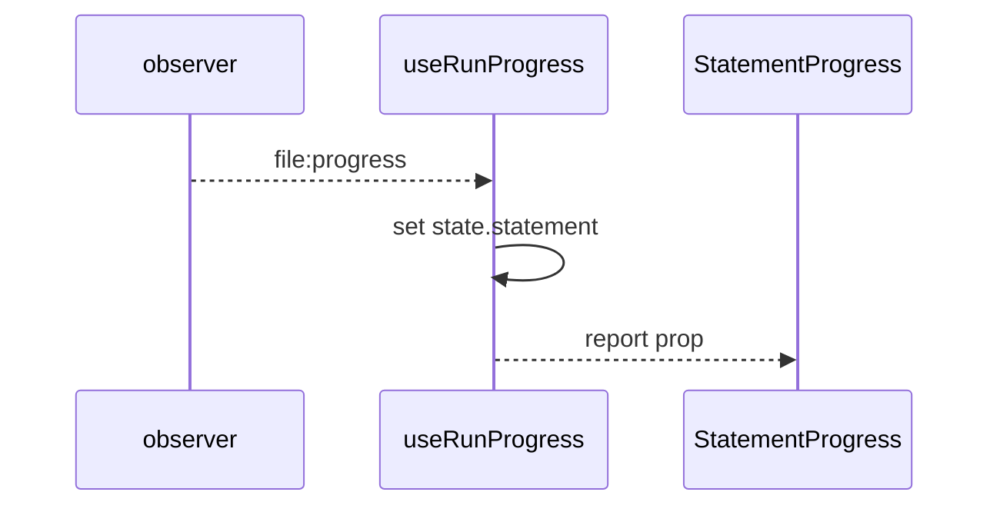
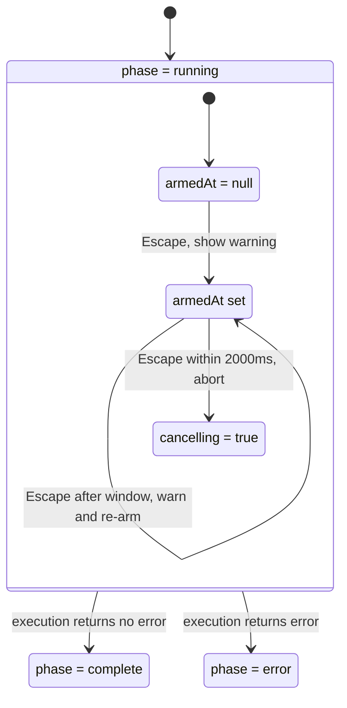
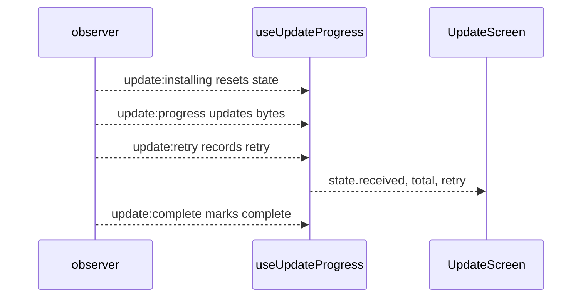
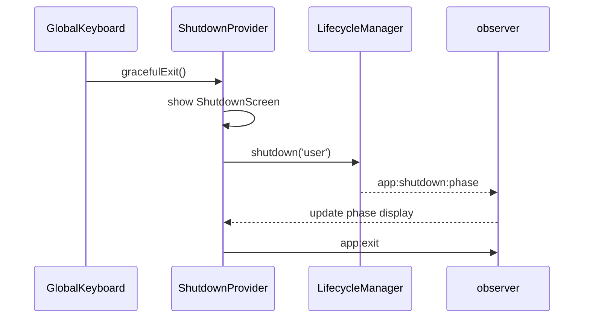

# tui

## What it does

The TUI gives users interactive screens for database configuration, SQL execution, changes, exploration, and secrets. `noorm ui` mounts the Ink/React `App`; the SQL REPL also uses this application shell. Shared providers keep navigation, keyboard focus, connection state, progress, and shutdown consistent across screens.

`RouterProvider` selects a route, and `ScreenRenderer` resolves it through `SCREENS`. A missing registry entry renders `NotFoundScreen` rather than leaving the application blank.

## How it works

### Startup and stage auto-seeding

`AppContextProvider` loads state and settings on mount unless `autoLoad` is false. It seeds missing stage configs before exposing the managers and marking startup ready. A manager-load failure sets `loadingStatus` to `error`.

Stage auto-seeding requires loaded settings and a state private key. It leaves existing same-name configs untouched and skips stages without `defaults.dialect`.

`syncSettingsStages` saves only eligible missing stage configs before the initial context synchronization.

```mermaid
flowchart TD
    %% source: src/tui/app-context.tsx
    Load["load()"] --> Managers["sm.load()<br/>settingsM.load()"]
    Managers --> Loaded{"Load succeeded?"}
    Loaded -->|no| Error["loadingStatus = error"]
    Loaded -->|yes| Sync["syncSettingsStages()"]
    Sync --> Eligible{"Settings loaded and<br/>sm.hasPrivateKey()?"}
    Eligible -->|yes| Seed["materializeStage()<br/>sm.setConfig()"]
    Eligible -->|no| Ready["syncStateFromManagers()<br/>loadingStatus = ready"]
    Seed --> Ready
```

For each eligible stage, the call is `materializeStage(stageName, stageName, stage.defaults, {}, stage.defaults.password)`. The stage name becomes the config name and the fallback database name. The explicit password argument preserves the original stage-default password in the config saved to state. This is deliberate TUI behavior, not a claim that every stage-materialization caller persists that secret.

The shared helper preserves connection defaults and the stage's `type`, `isTest`, and `access` metadata, derives a local or remote type when absent, and applies the protected-stage access ceiling. Core-state owns those materialization rules in [`docs/wiki/core-state.md`](core-state.md). CLI stage creation uses a different persisted-password contract; see [`docs/wiki/cli.md`](cli.md).

`syncStateFromManagers` refreshes the active config, config summaries, settings, and global identity. Observer subscriptions keep config activation, creation, deletion, connection status, and lock status reflected in React state. `refresh()` resynchronizes the context; it does not rerun stage seeding.

### Keyboard focus

Focus is a stack, not a DOM. `useFocusScope` pushes an ID in an effect and removes it on unmount; only the top ID is focused. Ink delivers keystrokes to registered handlers, so local handlers must guard their own actions. `useFocusedInput` supplies that guard.

`GlobalKeyboard` handles Ctrl+C independently of text entry, while local keyboard actions require their scope to be focused.

```mermaid
flowchart TD
    %% source: src/tui/keyboard.tsx, src/tui/focus.tsx
    Input["Ink useInput"] --> Global["GlobalKeyboard"]
    Input --> Local["useFocusedInput"]
    Global --> CtrlC{"Ctrl+C?"}
    CtrlC -->|yes| Exit["gracefulExit()"]
    CtrlC -->|no| Typing{"isTyping()?"}
    Typing -->|no| Hotkeys["onHelp / onToggleDryRun<br/>onToggleForce /<br/>overlay callbacks"]
    Local --> Focused{"isFocused?"}
    Focused -->|yes| Handler["handler(input, key)"]
```

`useTextEntry` registers active text fields. While typing, global printable shortcuts stand down. Shift+L opens the log viewer and Shift+Q opens the SQL terminal when not typing. Help (`?`) and mode toggles (`D`, `F`) additionally require `stack.length <= 1`, keeping them out of nested dialogs. `GlobalKeyboard` does not perform back navigation for Escape; screens own that action, with an optional `onEscape` notification callback.

Shared inputs participate in this stack rather than relying on an independent widget focus manager. `Form` owns its scope. The local `TextInput` copies the upstream input implementation to filter mouse reports and register text entry; the upstream package does not export the internal hooks needed to compose that behavior externally.

| Widget | Integration |
|---|---|
| `@inkjs/ui` `Select`, `MultiSelect`, `ConfirmInput` | Their independent focus system is not used; use local `SelectList`, `Form`, `Confirm`, or `SmartConfirm`. |
| `@inkjs/ui` `Spinner`, `Badge`, `ProgressBar`, `Alert`, `StatusMessage` | Used directly as display components. |
| Local [`src/tui/components/forms/TextInput.tsx`](../../src/tui/components/forms/TextInput.tsx) | Keeps the mouse-report guard and text-entry registration; the package exports map exposes only the upstream root, not the internal modules needed for an external wrapper. |

### Navigation

`navigate` pushes the current route and params onto history, except when the destination matches both. `back` restores the last entry and emits `router:popped`; empty history makes it a no-op. `replace` changes the current route without pushing history. `reset` returns home, clears history, and clears remembered list cursors. Initial routes receive ancestor history so direct entry can still navigate back through their parents.

`router:navigated` and `router:popped` let consumers react to pushes and pops. The router exposes `arrivedBy` so screens can distinguish initial entry, push, pop, and replacement.

### Statement progress

The run and change progress hooks convert `file:progress` into the `statement` report rendered by `StatementProgress`. The display shows elapsed time, server progress, and blocking sessions; core-runner owns the producer described in [`docs/wiki/core-runner.md`](core-runner.md).

A shared observer report reaches the display through a domain progress hook rather than a screen-level subscription.

```mermaid
sequenceDiagram
    %% source: src/tui/hooks/useRunProgress.ts, src/tui/hooks/useChangeProgress.ts, src/tui/components/status/StatementProgress.tsx
    participant Observer as observer
    participant Hook as useRunProgress
    participant UI as StatementProgress
    Observer-->>Hook: file:progress
    Hook->>Hook: set state.statement
    Hook-->>UI: report prop
```

`useRunProgress` clears the report on `file:before`, `file:after`, `build:complete`, and `reset()`. `useChangeProgress` clears it on `change:file`, `change:complete`, and `reset()`. These boundaries prevent a previous file's report from remaining visible during the next operation.

`RunBuildScreen`, `RunExecScreen`, `RunDirScreen`, and `RunFileScreen` render the run hook's report. `ChangeRunScreen`, `ChangeFFScreen`, `ChangeNextScreen`, `ChangeRevertScreen`, and `ChangeRewindScreen` render `useChangeProgress().statement`. The local `describeProgress` helper in `StatementProgress.tsx` formats the server's operation detail, and the display renders a separate line for each blocking session.

### Cancelling execution

`RunBuildScreen` and `RunExecScreen` require Escape confirmation through `useDoublePress`; their warning toast and confirmation window share `DOUBLE_PRESS_WINDOW_MS` (2000ms). Confirming aborts the run's `AbortController`. `runCancelMessage` selects immediate-server-cancel wording or stopping-after-the-current-file wording using the dialect's cancellation capability.

`useDoublePress` confirms only within its window; an expired warning requires arming again. Confirmation sets `cancelling` while the phase remains `running`. Execution settles in phase `complete` when no error is returned, or phase `error` when an error is returned, including after an abort request.

```mermaid
stateDiagram-v2
    %% source: src/tui/hooks/useDoublePress.ts, src/tui/screens/run/RunBuildScreen.tsx, src/tui/screens/run/RunExecScreen.tsx
    state "phase = running" as Running {
        state "armedAt = null" as Ready
        state "armedAt set" as Armed
        state "cancelling = true" as Cancelling
        [*] --> Ready
        Ready --> Armed: Escape, show warning
        Armed --> Armed: Escape after window, warn and re-arm
        Armed --> Cancelling: Escape within 2000ms, abort
    }
    state "phase = complete" as Complete
    state "phase = error" as Error
    [*] --> Running
    Running --> Complete: execution returns no error
    Running --> Error: execution returns error
```

`RunDirScreen` and `RunFileScreen` instead bind `KeyHandler.onCancel` while running: Escape or `c` invokes `cancelExecution`, which destroys the active connection. Navigation and cancellation are separate screen actions; leaving a screen is not a universal cancellation mechanism.

PostgreSQL and MySQL support server-side statement cancellation; MSSQL and SQLite use the stopping-after-the-current-file wording. Build/exec consume Escape while running, including repeated presses after cancellation has started, rather than navigating back. Once execution has settled, Escape can navigate back. The double-press warning is local to the hook instance: unmounting and returning does not preserve the first press.

Change-apply screens display statement progress without the build/exec double-press path or a running-phase Escape cancellation binding.

### Update download progress

`useUpdateChecker` owns checking and installing updates; `useUpdateProgress` independently subscribes to download events. `UpdateScreen` resets progress before an install. During installation it keeps the spinner, displays received megabytes, and adds a percentage and progress bar when the total is known. A retry displays the latest error and the next attempt number.

`useUpdateProgress` keeps byte and retry state separate from the installation command.

```mermaid
sequenceDiagram
    %% source: docs/design/update-download-progress.md, src/tui/hooks/useUpdateProgress.ts, src/tui/screens/UpdateScreen.tsx
    participant Observer as observer
    participant Hook as useUpdateProgress
    participant UI as UpdateScreen
    Observer-->>Hook: update:installing resets state
    Observer-->>Hook: update:progress updates bytes
    Observer-->>Hook: update:retry records retry
    Hook-->>UI: state.received, total, retry
    Observer-->>Hook: update:complete marks complete
```

### Application lifecycle

`App` nests `ShutdownProvider`, `NoormObserver`, `AppContextProvider`, the settings-driven mouse provider, `ConnectionProvider`, `ToastProvider`, `FocusProvider`, and `RouterProvider` around `AppShell`. `ConnectionProvider` manages the shared connection; the mouse transport restores terminal tracking on exit.

`gracefulExit` replaces the application with `ShutdownScreen` before releasing resources and emitting `app:exit`.

```mermaid
sequenceDiagram
    %% source: src/tui/shutdown.tsx, src/tui/keyboard.tsx
    participant Keyboard as GlobalKeyboard
    participant Shutdown as ShutdownProvider
    participant Lifecycle as LifecycleManager
    participant Observer as observer
    Keyboard->>Shutdown: gracefulExit()
    Shutdown->>Shutdown: show ShutdownScreen
    Shutdown->>Lifecycle: shutdown('user')
    Lifecycle-->>Observer: app:shutdown:phase
    Observer-->>Shutdown: update phase display
    Shutdown->>Observer: app:exit
```

A repeated exit request while shutting down calls Ink's `exit()` directly. Unmount also requests programmatic lifecycle shutdown when graceful shutdown has not already started.

## Where it lives

| Path | Role |
|------|------|
| [`src/tui/app.tsx`](../../src/tui/app.tsx) | Provider hierarchy, application shell, status bar, help, and overlays. |
| [`src/tui/app-context.tsx`](../../src/tui/app-context.tsx) | `AppContextProvider`/`useAppContext`; `useActiveConfig`, `useLockStatus`, `useGlobalModes`, `useDryRunMode`, `useForceMode`, `useExploreFilters`; `LoadingGuard`, `ConfigGuard`, `IdentityGuard`; startup, stage seeding, and manager synchronization. |
| [`src/tui/focus.tsx`](../../src/tui/focus.tsx) | `FocusProvider`, `useFocusScope`, `useIsFocused`, `useActiveFocus`, and text-entry registration. |
| [`src/tui/keyboard.tsx`](../../src/tui/keyboard.tsx) | `GlobalKeyboard`, `useFocusedInput`, `useListKeys`, and `useQuitHandler`. |
| [`src/tui/router.tsx`](../../src/tui/router.tsx) | `RouterProvider`/`useRouter`; `navigate`, `back`, `replace`, `reset`, history, and router events. |
| [`src/tui/types.ts`](../../src/tui/types.ts), [`src/tui/screens.tsx`](../../src/tui/screens.tsx) | `Route` string union, `RouteParams`, `RouterContextValue`, `FocusContextValue`, `ScreenProps`/`ScreenEntry`; `SCREENS`, `ScreenRenderer`, `getRouteLabel`, `getRegisteredRoutes`, `isRouteRegistered`, `registerScreen`. |
| [`src/tui/shutdown.tsx`](../../src/tui/shutdown.tsx), [`src/tui/mouse.tsx`](../../src/tui/mouse.tsx) | `ShutdownProvider`/`useShutdown`, phased `ShutdownScreen`; mouse tracking escape sequences, SGR parsing, `measureElement` hit tests, and terminal restoration. |
| [`src/tui/observer-context.ts`](../../src/tui/observer-context.ts), [`src/tui/hooks/useObserver.ts`](../../src/tui/hooks/useObserver.ts) | `NoormObserver`/`useNoormObserver` wrap the shared observer through `@logosdx/react`'s `createObserverContext`; `useOnEvent`, `useOnceEvent`, `useEmit`, `useOnScreenPopped`. |
| [`src/tui/providers/ConnectionProvider.tsx`](../../src/tui/providers/ConnectionProvider.tsx) | `ConnectionProvider`/`useConnectionContext`; shared lazily created Kysely connection keyed by `activeConfigName`, destroyed on config changes or unmount. |
| [`src/tui/components/`](../../src/tui/components) | Shared `layout/`, `lists/`, `forms/`, `dialogs/`, `feedback/`, `terminal/`, `status/` (`ConnectionStatus`, `LockStatus`, `StatementProgress`), `secrets/`, and `overlays/`; `components/index.ts` is the main export surface. |
| [`src/tui/components/status/StatementProgress.tsx`](../../src/tui/components/status/StatementProgress.tsx) | Current statement timing, `describeProgress` for server progress, and blockers. |
| [`src/tui/hooks/useRunProgress.ts`](../../src/tui/hooks/useRunProgress.ts), [`src/tui/hooks/useChangeProgress.ts`](../../src/tui/hooks/useChangeProgress.ts) | Run events: `build:start`, `file:before`, `file:progress`, `file:after`, `file:skip`, `file:dry-run`, `build:complete`. Change events: `change:start`, `change:file`, `change:complete`, `file:progress`; both expose the statement report and reset it at operation boundaries. |
| [`src/tui/hooks/useDoublePress.ts`](../../src/tui/hooks/useDoublePress.ts), [`src/tui/utils/run-context.ts`](../../src/tui/utils/run-context.ts) | First press returns `false`, a second within `DOUBLE_PRESS_WINDOW_MS` returns `true`, and an expired press re-arms. `buildRunContext` assembles screen state into `RunContext`; `runCancelMessage` uses dialect cancellation capability. |
| [`src/tui/hooks/`](../../src/tui/hooks) | `useConnection`, `useVaultConnection`, `useVaultSecretKeys`, `useLockStatus`, `useLoadGuard`, `useTransferProgress`, `useSettingsOperation`, `useSecretSource`, and `useAsyncEffect`; exported through `hooks/index.ts`. |
| [`src/tui/hooks/useAbortableTask.ts`](../../src/tui/hooks/useAbortableTask.ts) | Cancellable per-screen database tasks and suppression of stale results after cancellation. |
| [`src/tui/hooks/useViewportRows.ts`](../../src/tui/hooks/useViewportRows.ts) | Terminal-size-derived capacity for windowed lists. |
| [`src/tui/utils/`](../../src/tui/utils) | `change-context.ts`, `change-loader.ts`, `clipboard.ts`, `config-validation.ts`, `connection.ts`, `date.ts`, `error.ts`, `identity.ts`, `paths.ts`, `progress.ts`, `run-context.ts`, `settings-validation.ts`, and `string.ts`; `utils/index.ts` exports these helpers except `date.ts`. |
| [`src/tui/utils/progress.ts`](../../src/tui/utils/progress.ts) | `progressPercentage(completed, total)` returns the 0–100 value expected by Ink's `ProgressBar`, clamping over-counted event streams. |
| [`src/tui/hooks/useUpdateChecker.ts`](../../src/tui/hooks/useUpdateChecker.ts), [`src/tui/hooks/useUpdateProgress.ts`](../../src/tui/hooks/useUpdateProgress.ts), [`src/tui/screens/UpdateScreen.tsx`](../../src/tui/screens/UpdateScreen.tsx) | Update commands and event-driven download display. |
| [`src/tui/screens/`](../../src/tui/screens) | `change/`, `config/`, `db/` (including `db/explore/`), `debug/`, `identity/`, `init/`, `lock/`, `run/`, `secret/`, `settings/`, `vault/`; top-level `home.tsx`, `MoreScreen.tsx`, `not-found.tsx`, and `UpdateScreen.tsx`. |
| [`src/tui/screens/run/RunBuildScreen.tsx`](../../src/tui/screens/run/RunBuildScreen.tsx), [`src/tui/screens/run/RunExecScreen.tsx`](../../src/tui/screens/run/RunExecScreen.tsx) | Run progress and double-Escape abort; display `[Esc Esc] Cancel` until cancellation is confirmed. |
| [`src/tui/screens/run/RunDirScreen.tsx`](../../src/tui/screens/run/RunDirScreen.tsx), [`src/tui/screens/run/RunFileScreen.tsx`](../../src/tui/screens/run/RunFileScreen.tsx) | Run progress and single-Escape/`c` connection destruction through `KeyHandler.onCancel`. |
| [`src/tui/screens/change/ChangeRunScreen.tsx`](../../src/tui/screens/change/ChangeRunScreen.tsx), `src/tui/screens/change/Change{FF,Next,Revert,Rewind}Screen.tsx` | Change statement progress without a running-phase Escape cancellation path. |
| [`tests/cli/app-context.test.tsx`](../../tests/cli/app-context.test.tsx), [`tests/cli/app.test.tsx`](../../tests/cli/app.test.tsx), [`tests/cli/focus.test.tsx`](../../tests/cli/focus.test.tsx), [`tests/cli/keyboard.test.tsx`](../../tests/cli/keyboard.test.tsx), [`tests/cli/router.test.tsx`](../../tests/cli/router.test.tsx), [`tests/cli/screens.test.tsx`](../../tests/cli/screens.test.tsx) | Application infrastructure tests. |
| [`tests/cli/components/`](../../tests/cli/components), [`tests/cli/hooks/`](../../tests/cli/hooks), [`tests/cli/screens/`](../../tests/cli/screens) | `ink-testing-library` tests; component families use flat files such as `forms.test.tsx`, `dialogs.test.tsx`, and `status.test.tsx`, while screen subdirectories mirror source domains. `useDoublePress`, `useRunProgress`, and `useChangeProgress` have no dedicated hook-test file. |
| [`docs/design/update-download-progress.md`](../design/update-download-progress.md) | Download-display design and separation of command and event state. |
| [`.claude/rules/tui-development.md`](../../.claude/rules/tui-development.md) | Focus, widget boundaries, keyboard ownership, layout, observer hooks, and testing rules scoped to `src/tui/**/*.{ts,tsx}` and `tests/cli/**/*.{ts,tsx}`. |
| [`docs/tui.md`](../tui.md) | User-facing keyboard and screen reference, including long-running statement status and cancellation. |
| [`src/cli/ui.ts`](../../src/cli/ui.ts), [`src/cli/sql/repl.ts`](../../src/cli/sql/repl.ts) | Mount `App`, suppress logger output that would corrupt Ink rendering, and handle `app:exit` by calling `clear()` and `unmount()`. |

## Constraints

- Local keyboard handlers must check focus inside the callback. `useFocusScope` is initially unfocused until its effect runs; `useInput(handler, { isActive: isFocused })` can suppress registration permanently. Prefer `useFocusedInput` to guard the callback.
- A form that owns focus must not compete with a screen-level scope. Competing scopes leave the intended input below the top of the stack.
- Text-entry components must register through `useTextEntry`; otherwise printable global shortcuts can open overlays or toggle modes while the user types.
- `TextInput` must retain its mouse-report filter and text-entry registration. Replacing it with the upstream input lets terminal mouse reports reach field contents and bypasses the application's printable-shortcut guard.
- Escape navigation belongs to the screen. Adding global back navigation alongside a screen handler can pop history twice.
- Auto-seeding must retain its explicit `stage.defaults.password` argument. Omitting it changes the saved TUI config's secret contract because `materializeStage` excludes implicit passwords.
- Auto-seeding does not update an existing config. Changing a stage default does not by itself rewrite a saved same-name config.
- Progress consumers must clear reports at operation boundaries; retaining them shows server activity for a file that has already finished.
- Cancellation warning duration and confirmation timing share `DOUBLE_PRESS_WINDOW_MS`; diverging them makes the visible warning disagree with the accepted confirmation window.
- Terminal dimensions must come from `useWindowSize()` for resize-driven renders; reading mutable stdout dimensions alone does not subscribe a component to size changes.
- Keyboard tests wrap focusable components in `FocusProvider` and observer consumers in `NoormObserver`, adding `RouterProvider`/`AppContextProvider` for screens. Poll a rendered predicate with `waitFor` before sending input rather than relying on a fixed sleep; call `unmount()` to release stdin handlers.

## Coupling

- **core-state** owns settings, stored configs, stage materialization, and observer contracts. `AppContextProvider` orchestrates those managers; [`docs/wiki/core-state.md`](core-state.md) owns their implementation details.
- [`src/tui/app-context.tsx`](../../src/tui/app-context.tsx) subscribes to core observer events directly. Screens use domain hooks (`useRunProgress`, `useChangeProgress`, `useLockStatus`, `useConnection`, `useTransferProgress`, `useVaultConnection`, `useVaultSecretKeys`, `useLoadGuard`, `useUpdateChecker`) rather than duplicating those subscriptions. Config screens' `SettingsProvider` comes from core-state's [`src/core/config/resolver.ts`](../../src/core/config/resolver.ts).
- **cli** owns launching the interactive application and its terminal teardown. Its stage-creation password contract differs from TUI auto-seeding; see [`docs/wiki/cli.md`](cli.md).
- **core-runner** owns SQL execution and statement-progress production. Run/change screens and [`src/tui/utils/run-context.ts`](../../src/tui/utils/run-context.ts) consume `discoverFiles`, `runBuild`, and `RunContext` from [`src/core/runner/`](../../src/core/runner); [`src/core/runner/statement-watcher.ts`](../../src/core/runner/statement-watcher.ts) emits the status events. See [`docs/wiki/core-runner.md`](core-runner.md).
- **core-change**: [`src/tui/screens/change/`](../../src/tui/screens/change) imports `ChangeHistory`, `discoverChanges`, and change types; [`src/tui/screens/home.tsx`](../../src/tui/screens/home.tsx) also uses `ChangeHistory` for recent activity. See [`docs/wiki/core-change.md`](core-change.md).
- **core-db**: `ConnectionProvider` calls `createConnection`; [`src/tui/utils/run-context.ts`](../../src/tui/utils/run-context.ts) uses connection `hasServerSideCancel` to choose cancellation copy. Database screens import exploration `fetchOverview` and transfer/teardown types. See [`docs/wiki/core-db.md`](core-db.md).
- **sdk** owns DT serialization types consumed by transfer screens; see [`docs/wiki/sdk.md`](sdk.md).
- **core-identity** and **core-policy** own identity, vault access, and policy decisions that mutation screens use to choose confirmation behavior. See [`docs/wiki/core-identity.md`](core-identity.md) and [`docs/wiki/core-policy.md`](core-policy.md).
- Mutation screens consume `checkConfigPolicy` and `confirmationPhraseFor`; `SmartConfirm` chooses plain `Confirm` or typed-phrase `ProtectedConfirm`. The SQL REPL entrypoint under [`src/cli/sql/`](../../src/cli/sql) belongs to core-identity; mounting the TUI does not transfer ownership of SQL execution to this domain.
