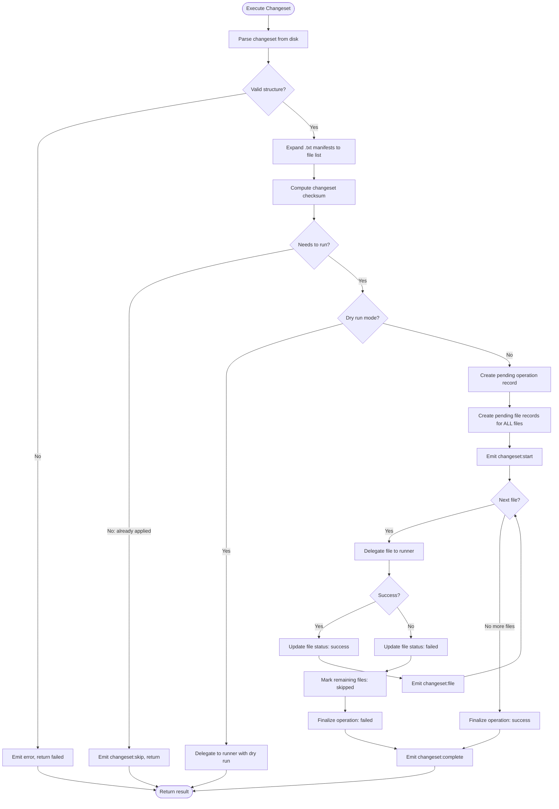
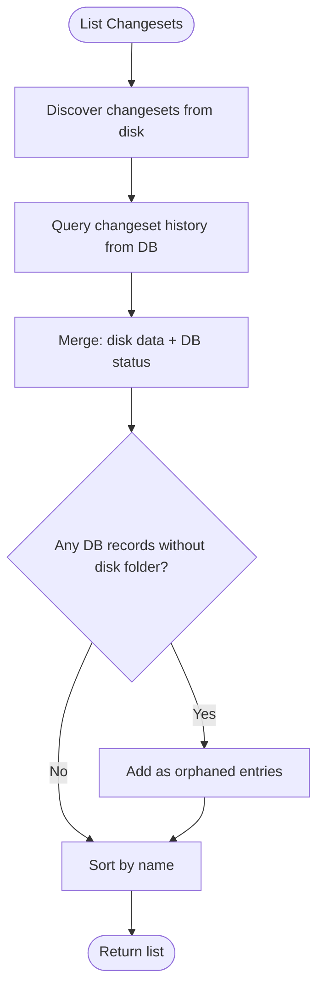

# Changeset


## Overview

Changesets are versioned database modifications applied after the initial schema build. Unlike "migrations", changesets acknowledge that you're modifying state, not moving data between locations.

**Core Capabilities:**

- Apply forward changes (`change/`)
- Rollback changes (`revert/`)
- Track execution history
- Reference existing build SQL files


## Concepts


### Changeset

A changeset is a folder containing modifications to apply to the database:

```
2024-01-15-add-email-verification/
├── change/           # Files to apply
├── revert/           # Files to undo
└── changelog.md      # Documentation
```

**Naming:** `YYYY-MM-DD-description` format ensures chronological ordering and practical uniqueness (same date + description is unlikely).


### File Types

| Extension | Purpose |
|-----------|---------|
| `.sql` | SQL statements to execute |
| `.sql.tmpl` | Template SQL (rendered via template engine) |
| `.txt` | Manifest referencing existing build SQL files (one path per line) |

**.txt Example:**

```
schema/tables/verification_tokens.sql
schema/views/active_users.sql
```

Paths are relative to the schema/build directory. Files are executed in **sorted order** (alphabetically), regardless of order in the manifest. User is responsible for writing corresponding revert logic.

**Important:** Changeset delegates file execution to the **runner module**. All runner features (templates, dry run, preview) are available to changesets.


### Execution Status

```
┌─────────┐
│ pending │ ── run ──► ┌─────────┐
└─────────┘            │ success │
     ▲                 └────┬────┘
     │                      │
  revert                 revert
     │                      │
     │                      ▼
┌──────────┐           ┌──────────┐
│  failed  │ ◄── fail  │ reverted │
└──────────┘           └──────────┘
```

| Status | Meaning |
|--------|---------|
| `pending` | Not yet applied |
| `success` | Applied successfully |
| `failed` | Execution failed (can retry) |
| `reverted` | Was applied, then rolled back (can re-apply) |


## CLI Commands Summary

| Command | Purpose |
|---------|---------|
| `add` | Create new changeset (interactive) |
| `edit` | Modify existing changeset (interactive) |
| `run` | Apply a changeset |
| `revert` | Undo a changeset |
| `next` | Apply next N pending |
| `ff` | Apply all pending |
| `rewind` | Revert to target |
| `list` | Show all changesets with status |
| `history` | Show execution audit trail |
| `rm` | Remove changeset from disk/database |


## Data Models


### Changeset (parsed from disk)

```
Changeset {
    name: string              # Folder name
    path: string              # Full path
    date: Date | null         # Parsed from name
    description: string       # Human-readable from name
    changeFiles: ChangesetFile[]
    revertFiles: ChangesetFile[]
    hasChangelog: boolean
}

ChangesetFile {
    filename: string          # e.g., "001_alter-users.sql"
    path: string              # Full path
    type: 'sql' | 'txt'
    resolvedPaths?: string[]  # For .txt files, the referenced paths
    status?: 'pending' | 'success' | 'failed' | 'skipped'
    skipReason?: string       # e.g., "changeset failed"
}
```


### ChangesetStatus (from database)

```
ChangesetStatus {
    name: string
    status: 'pending' | 'success' | 'failed' | 'reverted'
    appliedAt: Date | null
    appliedBy: string | null
    revertedAt: Date | null
    errorMessage: string | null
}
```


### ChangesetListItem (merged disk + DB)

```
ChangesetListItem {
    ...Changeset           # From disk (null if orphaned)
    ...ChangesetStatus     # From DB (or defaults if no record)
    isNew: boolean         # Exists on disk but no DB record
    orphaned: boolean      # Exists in DB but folder deleted from disk
}
```

**List sources both disk AND database:**

| Disk | DB | Result |
|------|----|--------|
| ✓ | ✓ | Normal changeset with status |
| ✓ | ✗ | New changeset (`isNew: true`, status: `pending`) |
| ✗ | ✓ | Orphaned (`orphaned: true`, disk fields null) |


## Tracking Tables

All database operations are tracked relationally. Every operation (build, run, changeset) creates a parent record, with individual file executions as children.


### `__noorm_changeset__`

Tracks all operation batches - explicit changesets, builds, and ad-hoc runs.

| Column | Type | Purpose |
|--------|------|---------|
| id | serial | Primary key |
| name | varchar | Operation identifier (see naming below) |
| change_type | varchar | `'build'`, `'run'`, `'changeset'` |
| direction | varchar | `'change'` or `'revert'` |
| checksum | varchar | SHA-256 of sorted file checksums (operation integrity) |
| executed_at | timestamp | When executed |
| executed_by | varchar | Identity string |
| config_name | varchar | Which config was used |
| cli_version | varchar | noorm version that created this operation |
| status | varchar | `'pending'`, `'success'`, `'failed'`, `'reverted'` |
| error_message | text | Error details if failed |
| duration_ms | integer | Execution time |

**Checksum calculation:**

```
changeset.checksum = SHA256(
    sorted(files.map(f => f.checksum)).join('')
)
```

This enables detection of:
- Modified files after execution
- Drift between environments
- Integrity verification on re-runs

**Name formats by change_type:**

| Type | Name Format | Example |
|------|-------------|---------|
| `changeset` | Folder name | `2024-01-15_add-users` |
| `build` | `build:{timestamp}` | `build:2024-01-15T10:30:00` |
| `run` | `run:{timestamp}` | `run:2024-01-15T10:30:00` |


### `__noorm_executions__`

Tracks individual file executions. Every file execution belongs to a parent changeset record.

| Column | Type | Purpose |
|--------|------|---------|
| id | serial | Primary key |
| changeset_id | integer | FK to `__noorm_changeset__` (required) |
| filepath | varchar | File that was executed |
| file_type | varchar | `'sql'` or `'txt'` |
| checksum | varchar | SHA-256 of file contents |
| cli_version | varchar | noorm version that executed this file |
| status | varchar | `'pending'`, `'success'`, `'failed'`, `'skipped'` |
| error_message | text | Error details if failed |
| skip_reason | varchar | Reason for skip (e.g., `'changeset failed'`, `'unchanged'`) |
| duration_ms | integer | Execution time |

**Relationship:** Every execution record has a parent changeset. No nullable foreign keys.

**Multiple records per changeset name:**

A single changeset folder can have multiple records in `__noorm_changeset__`:

| Scenario | Records |
|----------|---------|
| Run once | 1 record: `direction: 'change'`, `status: 'success'` |
| Run then revert | 2 records: change (status: `reverted`) + revert (status: `success`) |
| Run, revert, run again | 3 records: change (reverted) + revert (success) + change (success) |
| Failed revert | 2 records: change (success) + revert (failed) |

The most recent record determines current state. `history` command shows all records for audit.


## CLI Commands


### `noorm change add` (Interactive Only)

Creates a new changeset through a step-by-step form.

```
┌─────────────────────────────────────────────────────────┐
│  STEP 1: Scope                                          │
│                                                         │
│  What is the scope of this change?                      │
│  > add email verification                               │
│                                                         │
│  Creates: 2024-01-15-add-email-verification/            │
└─────────────────────────────────────────────────────────┘
                         │
                         ▼
┌─────────────────────────────────────────────────────────┐
│  STEP 2: Add File                                       │
│                                                         │
│  File name: > alter users table                         │
│                                                         │
│  Type:                                                  │
│    ○ New SQL (write new statements)                     │
│    ○ Rerun existing files (pick from build)            │
│                                                         │
└─────────────────────────────────────────────────────────┘
                         │
                         ▼
┌─────────────────────────────────────────────────────────┐
│  (if "Rerun existing files" selected)                   │
│                                                         │
│  FilePicker: Select SQL files to include                │
│    ☑ schema/tables/tokens.sql                          │
│    ☐ schema/tables/users.sql                           │
│    ☑ schema/views/active_users.sql                     │
│                                                         │
└─────────────────────────────────────────────────────────┘
                         │
                         ▼
┌─────────────────────────────────────────────────────────┐
│  Add another file?                                      │
│    ○ Yes  ○ No                                          │
└─────────────────────────────────────────────────────────┘
                         │
            ┌────────────┴────────────┐
            │ Yes                     │ No
            ▼                         ▼
    (loop back to Step 2)    ┌────────────────────┐
                             │  STEP 3: Review    │
                             │                    │
                             │  Structure:        │
                             │  ├── change/       │
                             │  │   ├── 001_...   │
                             │  │   └── 002_...   │
                             │  ├── revert/       │
                             │  │   ├── 001_...   │
                             │  │   └── 002_...   │
                             │  └── changelog.md  │
                             │                    │
                             │  Accept? [y/N]     │
                             └────────────────────┘
```

**Does not support headless mode.** Error if run in CI/non-TTY.


### `noorm change edit <name>` (Interactive Only)

Modify an existing changeset's file structure.

**Capabilities:**

| Action | Behavior |
|--------|----------|
| Sort | Reorder files → auto-renumbers `001_`, `002_`, etc. |
| Rename | Change descriptive part of filename |
| Remove | Delete from both `change/` and `revert/` |
| Add | Same flow as `add` command |

Actual SQL content is edited by user in their own editor.

**Does not support headless mode.**


### `noorm change run [name]`

Apply a changeset.

| Context | Behavior |
|---------|----------|
| `name` provided | Run that changeset |
| `name` omitted + interactive | FilePicker shows changeset folders |
| `name` omitted + headless | **Error** - name required |

**Options:**

| Flag | Default | Description |
|------|---------|-------------|
| `--force` | `false` | Re-run even if already applied |
| `--dry-run` | `false` | Render to `tmp/` without executing (see below) |
| `--preview` | `false` | Output rendered SQL to stdout without executing |
| `--yes` | `false` | Skip confirmation prompt |

**Dry run output:** Files are written to `{projectRoot}/tmp/` by default. The output directory is configurable in settings. Structure mirrors source paths with `.tmpl` extension stripped.

**Flow:**

```
1. Parse changeset from disk
2. Validate structure
3. Check status (error if applied, unless --force)
4. Show summary of files to execute
5. Prompt for confirmation (unless --yes)
6. Acquire lock (throws LockAcquireError if blocked)
7. Update changeset record status to pending
8. For each file:
   a. Create pending record in __noorm_executions__
   b. Execute SQL via runner
   c. Update file record (success/failed)
9. Update changeset record (success/failed)
10. Release lock
```


### `noorm change revert [name]`

Undo a changeset.

- Same name resolution rules as `run`
- Executes files from `revert/` folder in sorted order (001, 002, 003...)
- User is responsible for ordering revert files correctly
- **Creates new record** with `direction: 'revert'` to track revert files
- **On success, updates original record** - sets status to `reverted`, records `revertedAt`

**Options:**

| Flag | Default | Description |
|------|---------|-------------|
| `--force` | `false` | Re-run revert even if already reverted |
| `--dry-run` | `false` | Render to `tmp/` without executing |
| `--preview` | `false` | Output rendered SQL without executing |
| `--yes` | `false` | Skip confirmation prompt |

**Status requirements:**

| Current Status | Can Revert? |
|----------------|-------------|
| `pending` | No - not applied yet |
| `success` | Yes |
| `failed` | Yes - partial changes may exist |
| `reverted` | No - already reverted (unless `--force`) |


### `noorm change next [n]`

Apply next N pending changesets (default: 1).

- Interactive: Summary + confirmation
- Headless: Runs directly

**Options:**

| Flag | Default | Description |
|------|---------|-------------|
| `--dry-run` | `false` | Render to `tmp/` without executing |
| `--preview` | `false` | Output rendered SQL without executing |
| `--yes` | `false` | Skip confirmation prompt |
| `--abort-on-error` | `true` | Stop on first failure |


### `noorm change ff`

Fast-forward: Apply all pending changesets.

Same behavior as `next` with no limit. Same options apply.


### `noorm change rewind [n|name]`

Revert changesets in reverse chronological order.

| Argument | Behavior |
|----------|----------|
| `rewind 3` | Revert last 3 applied changesets |
| `rewind 2024-01-15-add-email` | Revert until (and including) this changeset |

**Options:**

| Flag | Default | Description |
|------|---------|-------------|
| `--dry-run` | `false` | Render to `tmp/` without executing |
| `--preview` | `false` | Output rendered SQL without executing |
| `--yes` | `false` | Skip confirmation prompt |
| `--abort-on-error` | `true` | Stop on first failure |

**Skip behavior:**

Already-reverted changesets in the rewind range are skipped with status "skipped (already reverted)". This allows partial recovery from failed rewinds without re-running successful reverts.


### `noorm change list`

List all changesets from disk AND database with their current status.

| Symbol | Status |
|--------|--------|
| `✓` | Success (applied) |
| `✗` | Failed |
| `↩` | Reverted |
| `○` | Pending (new, never run) |
| `⚠` | Orphaned (in DB but folder deleted) |

Sources both disk and database - new changesets (on disk, not in DB) show as pending, orphaned changesets (in DB, not on disk) are flagged.


### `noorm change history [name]`

Show execution history from the database (audit trail).

**Selection options:**

| Option | Behavior |
|--------|----------|
| `history` | All changeset executions |
| `history <name>` | Executions for specific changeset |
| `history --pick` | Interactive picker to select changeset |
| `history --last` | Most recent execution only |
| `history --last <n>` | Last N executions |

**Display options:**

| Flag | Effect |
|------|--------|
| `--files` | Show file-level execution details |

**Examples:**

| Command | Result |
|---------|--------|
| `history` | All executions |
| `history 2024-01-15-add-users` | History for specific changeset |
| `history --pick` | Picker, then show history |
| `history --pick --files` | Picker, then show file details |
| `history --last` | Most recent execution |
| `history --last 5` | Last 5 executions |
| `history --last 5 --files` | Last 5 with file details |

**Changeset-level output includes:**
- Changeset name
- Direction (change/revert)
- Status
- Executed at
- Executed by
- Duration
- Error message (if failed)

**File-level output (with `--files`) includes:**
- Filepath
- File type (sql/txt)
- Status
- Skip reason (if skipped)
- Duration
- Error message (if failed)


### `noorm change rm <name>`

Remove a changeset from disk, database, or both.

**Options:**

| Flag | Default | Description |
|------|---------|-------------|
| `--disk` | `false` | Remove from disk only |
| `--db` | `false` | Remove from database only |
| `--yes` | `false` | Skip confirmation prompt |

**Behavior:**

| Flags | Behavior |
|-------|----------|
| No flags (interactive) | Prompt: "Remove from disk, database, or both?" |
| No flags (headless) | Error - must specify `--disk`, `--db`, or both |
| `--disk` | Delete changeset folder from disk |
| `--db` | Delete records from `__noorm_changeset__` and `__noorm_executions__` |
| `--disk --db` | Remove from both |
| `--yes` | Skip confirmation (requires `--disk` and/or `--db`) |

**Safety:**

- Removing from DB while changeset is applied means the changeset will appear as "new" if folder still exists
- Removing from disk while DB record exists creates an orphaned changeset


## Execution Flow


### Running a Changeset

```
                    ┌──────────────┐
                    │ Parse from   │
                    │ disk         │
                    └──────┬───────┘
                           │
                           ▼
                    ┌──────────────┐
                    │ Validate     │──── invalid ────► Error
                    │ structure    │
                    └──────┬───────┘
                           │ valid
                           ▼
                    ┌──────────────────┐
                    │ Check status     │──── applied ────► Error (unless --force)
                    │ in DB            │
                    └──────┬───────────┘
                           │ pending/reverted/force
                           ▼
                    ┌──────────────────┐
                    │ Acquire lock     │──── blocked ────► throw LockAcquireError
                    └──────┬───────────┘
                           │
                           ▼
                    ┌──────────────┐
                    │ Create       │
                    │ pending      │
                    │ record       │
                    └──────┬───────┘
                           │
                           ▼
              ┌────────────────────────┐
              │ For each file:         │
              │                        │
              │  .sql → execute        │
              │  .txt → resolve paths, │
              │         execute each   │
              │                        │
              │  Record file result    │
              └────────────┬───────────┘
                           │
              ┌────────────┴────────────┐
              │                         │
         all success               any failed
              │                         │
              ▼                         ▼
       ┌────────────┐           ┌────────────────────────┐
       │ Status:    │           │ Changeset: failed      │
       │ success    │           │ Failed file: failed    │
       └────────────┘           │ Pending files: skipped │
                                │   (reason: changeset   │
                                │    failed)             │
                                └────────────────────────┘
```


### Reverting a Changeset

Same flow as running, except:

1. Uses `revert/` folder instead of `change/`
2. Files executed in sorted order (user controls ordering via filenames)
3. On success, original changeset marked `reverted`


## Module Structure

The changeset module is organized into logical components:

| Component | Responsibility |
|-----------|---------------|
| Types | Interfaces and type definitions |
| Parser | Read changesets from disk, resolve manifests |
| Scaffold | Create/edit changeset directories |
| History | Database tracking operations |
| Executor | Execute changesets via runner |
| Manager | High-level operations (list, run, revert, etc.) |


## Core Module Details


### Parser

Responsible for reading changesets from disk and resolving file references.

**Responsibilities:**

- Load a single changeset from a folder path
- Discover all changeset folders in a directory
- Resolve `.txt` manifest files to actual SQL paths
- Validate changeset structure

**Parse flow:**

1. Extract name from folder name
2. Parse date from name (YYYY-MM-DD prefix)
3. Scan `change/` folder for `.sql`, `.sql.tmpl`, and `.txt` files
4. Scan `revert/` folder for `.sql`, `.sql.tmpl`, and `.txt` files
5. For each `.txt` file:
   - Read lines (one path per line)
   - Resolve paths relative to schema directory
   - Validate referenced files exist
6. Check for `changelog.md`
7. Return parsed changeset

**Validation rules:**

| Rule | Error |
|------|-------|
| Folder exists | Changeset not found |
| Has `change/` or `revert/` | Invalid structure |
| `.txt` references exist | Missing reference |
| No duplicate filenames | Duplicate file |


### Scaffold

File system operations for creating and modifying changesets.

**Responsibilities:**

- Create new changeset directory structure
- Add files to `change/` or `revert/` folders
- Remove files from changeset
- Reorder files (renumber sequence)
- Rename file descriptions

**Reorder flow:**

1. Validate new order contains all existing files
2. For each file in new order:
   - Generate new name with updated sequence number
   - Rename file if name changed
3. Return updated changeset

**File naming convention:**

| Component | Format | Example |
|-----------|--------|---------|
| Sequence | 3 digits, zero-padded | `001`, `002`, `010` |
| Separator | Underscore | `_` |
| Description | Slugified text | `create-users-table` |
| Extension | File type | `.sql`, `.sql.tmpl`, `.txt` |

Full example: `001_create-users-table.sql`


### History

Database operations for tracking changeset execution.

**Responsibilities:**

- Query changeset status (single or all)
- Determine if changeset needs to run
- Create pending operation and file records
- Update file status as execution progresses
- Mark remaining files as skipped on failure
- Finalize operation status

**Change detection:**

Queries the **most recent** record with `direction: 'change'` for the changeset name. Revert records don't affect change detection - we care about the last time the changeset was applied, not reverted.

| Condition | Action | Reason |
|-----------|--------|--------|
| No DB record exists | Run | New changeset |
| Status is `failed` | Run | Retry after fix |
| Status is `reverted` | Run | Re-apply |
| Checksum differs | Run | Files changed |
| Status is `success` | Skip | Already applied |

**Checksum calculation:**

- Changeset checksum = SHA-256 of all file checksums (sorted, concatenated)
- For `.txt` manifest files: checksum includes both the manifest content AND checksums of all referenced files
- This ensures changes to referenced SQL files trigger re-execution


### Executor

Orchestrates changeset execution. Delegates actual file execution to the **runner module**.

**Responsibilities:**

- Parse and validate changeset structure
- Expand `.txt` manifests to actual file paths
- Compute changeset checksum
- Determine if changeset needs to run
- Create tracking records before execution
- Delegate file execution to runner
- Handle success/failure status updates
- Mark remaining files as skipped on failure

**Runner delegation:**

Changeset uses runner for file execution with `force: true` to bypass runner's file-level change detection (changeset handles change detection at the changeset level via checksum).

**Template context:** Same as runner - `config`, `secrets`, and `basePath`. No changeset-specific variables are added; templates work identically whether run via `change run` or `run file`.

**Execution flow:**




### Manager

High-level operations that combine parser, history, and executor.

**Responsibilities:**

- List all changesets (merge disk + DB status)
- Run a specific changeset by name
- Revert a specific changeset by name
- Run next N pending changesets
- Fast-forward (run all pending)
- Rewind to a target (revert multiple)
- Get changeset details for UI display


**List flow:**



**Merge logic:**

| Source | Provides |
|--------|----------|
| Disk | Changeset structure, files, path |
| DB | Status, appliedAt, appliedBy, revertedAt, errorMessage |
| Computed | `orphaned: true` if in DB but not on disk |


**Run next flow:**

1. List all changesets
2. Filter to `pending` or `reverted` status
3. Sort by name (chronological due to date prefix)
4. Take first N
5. Execute each sequentially
6. Stop on failure if `abortOnError` is set


**Rewind flow:**

| Target Type | Behavior |
|-------------|----------|
| Number (e.g., `3`) | Revert the last 3 applied changesets |
| Name (e.g., `2024-01-15-add-users`) | Revert from most recent back to (and including) named changeset |

1. List all changesets
2. Filter to `success` status (skip already-reverted)
3. Sort by appliedAt (most recent first)
4. Determine which to revert based on target
5. Revert each sequentially (skip if already reverted)
6. Stop on failure if `abortOnError` is set


## Observer Events

| Event | Payload | When Emitted |
|-------|---------|--------------|
| `changeset:created` | `{ name, path }` | New changeset directory created (scaffold) |
| `changeset:start` | `{ name, direction, files[] }` | Beginning changeset execution |
| `changeset:file` | `{ changeset, filepath, index, total }` | About to execute a file |
| `changeset:complete` | `{ name, direction, status, durationMs }` | Changeset execution finished |
| `changeset:skip` | `{ name, reason }` | Changeset skipped (already applied, etc.) |
| `error` | `{ source: 'changeset', error, context }` | Any error during execution |

These events already exist in `observer.ts` (except `changeset:created` and `changeset:skip` which need to be added).


## Error Cases

| Error | Cause | Resolution |
|-------|-------|------------|
| Already applied | Changeset status is `success` | Revert first, or use `--force` |
| Cannot revert | Changeset not applied (pending) | Run it first |
| Already reverted | Changeset already reverted | Run first, or use `--force` |
| Lock blocked | Another user holds the lock | Wait for lock release, or contact holder |
| No revert files | Missing `revert/` directory | Add revert scripts |
| Name required | Headless mode without name | Provide name argument |
| Empty .txt file | No valid paths in manifest | Add file references |
| Orphaned changeset | Trying to run orphaned changeset | Restore folder or remove from DB |


## Best Practices

1. **Date-prefix changesets** - `YYYY-MM-DD-description` for ordering
2. **Always write revert scripts** - Even if just DROP statements
3. **One logical change per changeset** - Don't bundle unrelated changes
4. **Test locally first** - Use test database before production
5. **Number files** - Use `001_`, `002_` for execution order
6. **Use .txt for existing SQL** - Reference build files instead of duplicating
7. **Document in changelog.md** - Business reason, side effects, impact
8. **Keep changesets small** - Easier to debug and revert
9. **Write idempotent SQL** - Changes should be safe to re-run


## Idempotent Changes

noorm does **not** automatically rollback on failure. If file 2 of 3 fails, file 1's changes persist. This is intentional—rollback complexity varies by database and change type.

**The solution:** Write idempotent SQL that can safely re-run.

| Pattern | Example |
|---------|---------|
| `CREATE TABLE IF NOT EXISTS` | Safe table creation |
| `DROP TABLE IF EXISTS` | Safe table removal |
| `CREATE OR REPLACE VIEW` | Safe view updates |
| `INSERT ... ON CONFLICT DO NOTHING` | Safe inserts (Postgres) |
| `INSERT IGNORE` | Safe inserts (MySQL) |
| Check before ALTER | `IF NOT EXISTS (SELECT ... FROM INFORMATION_SCHEMA)` |

**On failure:**
1. Fix the issue (typo, bad reference, constraint violation)
2. Re-run the changeset
3. Previously successful files re-execute (idempotent = no problem)
4. Failed file now succeeds
5. Remaining files execute

This approach gives developers control over error recovery while keeping noorm simple and database-agnostic.
