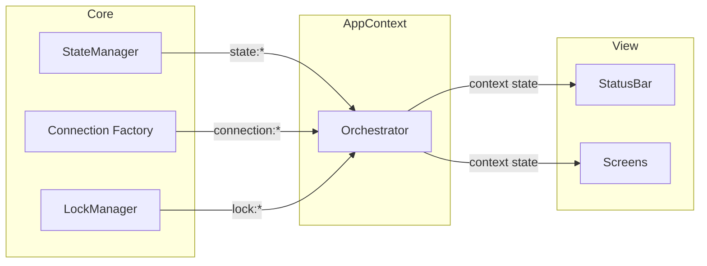
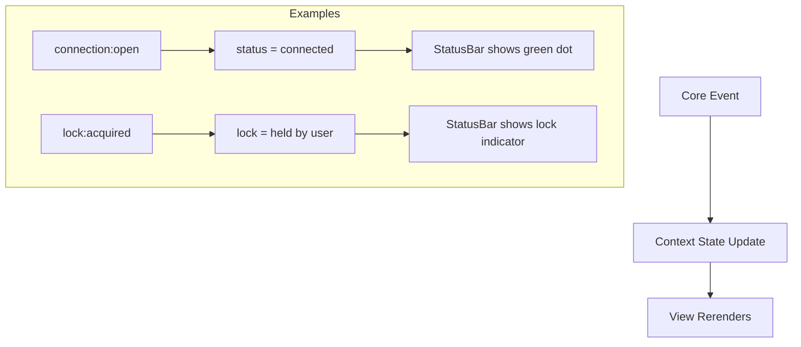
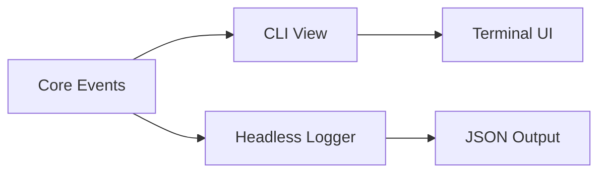

# CLI App Context & Status Bar


## Overview

The App Context is a **thin orchestration layer** that bridges core modules with the CLI view. It does not contain business logic—instead, it:

1. Instantiates core classes (StateManager, ConnectionManager, LockMonitor)
2. Subscribes to their events
3. Forwards/aggregates events for the view layer to consume

The CLI is purely reactive: components subscribe to events and render accordingly.


## Architecture


### Layer Separation

```
┌─────────────────────────────────────────────────────────────────┐
│  Core Layer (business logic, emits events)                      │
│  ├── StateManager     → state:loaded, state:persisted           │
│  ├── createConnection → connection:open, connection:close       │
│  └── LockManager      → lock:acquired, lock:released, lock:blocked
└─────────────────────────────────────────────────────────────────┘
                              │
                              │ events
                              ▼
┌─────────────────────────────────────────────────────────────────┐
│  App Context (orchestration, no logic)                          │
│  ├── Instantiates core classes                                  │
│  ├── Wires up event subscriptions                               │
│  └── Exposes reactive state derived from events                 │
└─────────────────────────────────────────────────────────────────┘
                              │
                              │ context/hooks
                              ▼
┌─────────────────────────────────────────────────────────────────┐
│  View Layer (reactive, subscribes to events)                    │
│  ├── StatusBar        → displays current state                  │
│  ├── Screens          → render based on state                   │
│  └── Guards           → conditional rendering                   │
└─────────────────────────────────────────────────────────────────┘
```


### Event Flow




## Core Responsibilities

Each core module is self-contained and emits events about its state changes:

| Module | Responsibility | Key Events |
|--------|----------------|------------|
| StateManager | Load/save encrypted state, manage configs | `state:loaded`, `state:persisted`, `state:migrated` |
| Connection (factory) | Database connections, lifecycle | `connection:open`, `connection:close`, `connection:error` |
| LockManager | Acquire/release/check locks | `lock:acquiring`, `lock:acquired`, `lock:released`, `lock:blocked`, `lock:expired` |


## App Context Responsibilities

The context is a **pass-through layer** with minimal logic:

```
AppContext
├── on(state:loaded)      → update context.state
├── on(connection:open)   → update context.connection status
├── on(connection:close)  → update context.connection status
├── on(lock:acquired)     → update context.lock
├── on(lock:released)     → update context.lock
└── expose reactive state for view consumption
```

**What it does NOT do:**
- Business logic (validation, retry, error handling)
- Direct database operations
- Lock management logic
- Polling or timers

All of that belongs in core modules.

## Core Module Integration

The App Context bridges CLI screens with these core modules (see `src/core/index.ts` for exports):

| Module | Pattern | Purpose |
|--------|---------|---------|
| StateManager | Singleton | Encrypted state, configs, secrets |
| SettingsManager | Singleton | Project settings from `settings.yml` |
| Connection | Factory | Database connections per-operation |
| LockManager | Singleton | Lock operations require db + identity |
| Runner | Functions | Execute SQL with context object |
| ChangesetManager | Instance | Changeset operations with context object |
| Identity | Resolver | Resolve user identity from multiple sources |

**Key Context Objects:**

| Context | Used By | Contains |
|---------|---------|----------|
| `RunContext` | Runner functions | db, configName, identity, projectRoot, secrets |
| `ChangesetContext` | ChangesetManager | RunContext fields + changesetsDir, schemaDir |

**Instantiation Flow:**

1. Load StateManager → get active config
2. Load SettingsManager → get paths
3. Resolve identity from state's crypto identity
4. Create connection from config
5. Build context objects for runner/changeset operations
6. Cleanup: destroy connection when done

See implementation references:
- `src/core/runner/types.ts` - RunContext definition
- `src/core/changeset/types.ts` - ChangesetContext definition
- `src/core/identity/resolver.ts` - Identity resolution


## View Reactivity

The view layer subscribes to context state and renders accordingly:




## Status Bar

Displays current state by reading from context:

```
┌─────────────────────────────────────────────────────────────────┐
│  noorm                              dev │ ● connected │ 🔓 free │
└─────────────────────────────────────────────────────────────────┘
     │                                 │         │           │
     app name                    config name  conn status  lock status
```

The StatusBar has no logic—it purely reflects context state.


## Connection Guard

A guard component for screens requiring database access:

```
ConnectionGuard
├── reads context.connectionStatus
├── renders appropriate UI based on status
└── passes db instance to children when connected
```

Guards are purely declarative—they don't trigger connections or manage state.


## Headless Integration

The headless mode subscribes directly to core events:



Both the CLI and headless mode are just different subscribers to the same event stream. The core doesn't know or care which is active.


## References

**Documentation:**
- `docs/state.md` - StateManager architecture and API
- `docs/config.md` - Config structure and validation
- `docs/lock.md` - Lock management patterns

**Core modules:**
- `src/core/state/` - StateManager, encryption, persistence
- `src/core/connection/` - Connection factory, dialects
- `src/core/lock/` - LockManager operations
- `src/core/identity/` - Identity resolution
- `src/core/observer.ts` - Event system

**CLI plans:**
- `plan/cli/userflow.md` - User journeys, screen mockups, shared components
