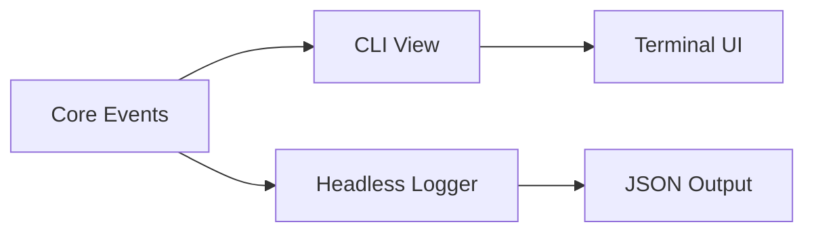

# CLI App Context & Status Bar


## Overview

The App Context is a **thin orchestration layer** that bridges core modules with the CLI view. It does not contain business logic—instead, it:

1. Instantiates core classes (StateManager, ConnectionManager, LockMonitor)
2. Subscribes to their events
3. Forwards/aggregates events for the view layer to consume

The CLI is purely reactive: components subscribe to events and render accordingly.


## Architecture


### Layer Separation

```
┌─────────────────────────────────────────────────────────────────┐
│  Core Layer (business logic, emits events)                      │
│  ├── StateManager     → state:loaded, state:error, state:changed│
│  ├── ConnectionManager→ connection:*, lock:*                    │
│  └── LockMonitor      → lock:status, lock:acquired, lock:released
└─────────────────────────────────────────────────────────────────┘
                              │
                              │ events
                              ▼
┌─────────────────────────────────────────────────────────────────┐
│  App Context (orchestration, no logic)                          │
│  ├── Instantiates core classes                                  │
│  ├── Wires up event subscriptions                               │
│  └── Exposes reactive state derived from events                 │
└─────────────────────────────────────────────────────────────────┘
                              │
                              │ context/hooks
                              ▼
┌─────────────────────────────────────────────────────────────────┐
│  View Layer (reactive, subscribes to events)                    │
│  ├── StatusBar        → displays current state                  │
│  ├── Screens          → render based on state                   │
│  └── Guards           → conditional rendering                   │
└─────────────────────────────────────────────────────────────────┘
```


### Event Flow


## Core Responsibilities

Each core module is self-contained and emits events about its state changes:

| Module | Responsibility | Key Events |
|--------|----------------|------------|
| StateManager | Load/save encrypted state, manage configs | `state:loaded`, `state:saved`, `state:error` |
| ConnectionManager | Database connections, lifecycle | `connection:connecting`, `connection:connected`, `connection:error` |
| LockMonitor | Poll lock status, acquire/release | `lock:status`, `lock:acquired`, `lock:released` |


## App Context Responsibilities

The context is a **pass-through layer** with minimal logic:

```
AppContext
├── on(state:loaded)      → update context.state
├── on(connection:*)      → update context.connection
├── on(lock:*)            → update context.lock
└── expose reactive state for view consumption
```

**What it does NOT do:**
- Business logic (validation, retry, error handling)
- Direct database operations
- Lock management logic
- Polling or timers

All of that belongs in core modules.


## View Reactivity

The view layer subscribes to context state and renders accordingly:

```mermaid
flowchart TD
    Event[Core Event] --> Context[Context State Update]
    Context --> Rerender[View Rerenders]

    subgraph Examples
        E1[connection:connected] --> S1[status = 'connected']
        S1 --> R1[StatusBar shows green dot]

        E2[lock:status] --> S2[lock = { holder, lockedAt }]
        S2 --> R2[StatusBar shows lock indicator]
    end
```


## Status Bar

Displays current state by reading from context:

```
┌─────────────────────────────────────────────────────────────────┐
│  noorm                              dev │ ● connected │ 🔓 free │
└─────────────────────────────────────────────────────────────────┘
     │                                 │         │           │
     app name                    config name  conn status  lock status
```

The StatusBar has no logic—it purely reflects context state.


## Connection Guard

A guard component for screens requiring database access:

```
ConnectionGuard
├── reads context.connectionStatus
├── renders appropriate UI based on status
└── passes db instance to children when connected
```

Guards are purely declarative—they don't trigger connections or manage state.


## Headless Integration

The headless mode subscribes directly to core events:



Both the CLI and headless mode are just different subscribers to the same event stream. The core doesn't know or care which is active.
