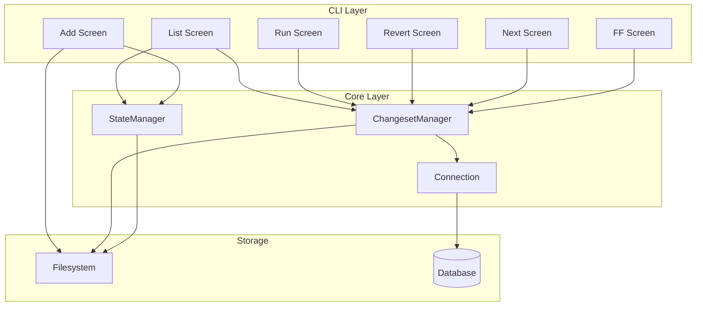

# CLI Change Screens


## Overview

The Change module provides screens for managing database changesets - the core unit of schema evolution in noorm. Users can view, create, apply, and revert changesets through these screens.


## Screens

| Screen | Route | Purpose |
|--------|-------|---------|
| List | `change` | View all changesets with applied/pending status |
| Add | `change/add` | Create new changeset folder structure |
| Edit | `change/edit` | Open changeset in system editor |
| Remove | `change/rm` | Delete changeset from filesystem |
| Run | `change/run` | Apply a specific changeset |
| Revert | `change/revert` | Rollback a specific changeset |
| Next | `change/next` | Apply next N pending changesets |
| FF | `change/ff` | Fast-forward all pending changesets |
| Rewind | `change/rewind` | Revert multiple changesets in reverse order |


## Data Model

```
Changeset
├── name: string              # Folder name (e.g., "2024-01-15_add-users")
├── path: string              # Absolute path to changeset folder
├── change/                   # SQL files to apply
│   └── *.sql
└── revert/                   # SQL files to rollback
    └── *.sql

ChangesetStatus
├── applied: boolean          # Whether changeset has been run
├── appliedAt: Date | null    # When it was applied
└── appliedBy: string | null  # Who applied it (identity)
```


## Architecture




## Screen Workflows


### List Screen

Shows all changesets with their status (applied/pending).

```
┌─────────────────────────────────────────┐
│ Changesets                              │
│                                         │
│ Total: 12  Applied: 8  Pending: 4       │
│                                         │
│ ✓ 2024-01-10_initial-schema    today    │
│ ✓ 2024-01-12_add-users         2d ago   │
│ ○ 2024-01-15_add-roles         pending  │
│ ○ 2024-01-16_add-permissions   pending  │
│                                         │
│ [a]dd [r]un [v]ert [n]ext [f]f [w]ind   │
└─────────────────────────────────────────┘
```

**Flow:**
1. Load active config from StateManager
2. Connect to database
3. Fetch changesets from filesystem
4. Fetch applied status from tracking table
5. Merge and display with status indicators

**Keyboard:**
- `a` → Navigate to Add screen
- `e` → Navigate to Edit screen (selected)
- `d` → Navigate to Remove screen (selected)
- `r` → Navigate to Run screen (if pending)
- `v` → Navigate to Revert screen (if applied)
- `n` → Navigate to Next screen
- `f` → Navigate to FF screen
- `w` → Navigate to Rewind screen
- `Enter` → Run or Revert based on status


### Add Screen

Creates a new changeset folder with template files.

**Flow:**
1. Prompt for changeset name
2. Generate folder name: `{date}_{sanitized-name}`
3. Create folder structure:
   ```
   changesets/{name}/
   ├── change/
   │   └── 001_change.sql
   └── revert/
       └── 001_revert.sql
   ```
4. Navigate back to List

**Naming Convention:**
- Date prefix: `YYYY-MM-DD`
- Name: lowercase, hyphens, alphanumeric only
- Example: `2024-01-15_add-user-roles`


### Run Screen

Applies a single changeset to the database.


**Protected Confirmation:**
For protected configs, requires typing the config name to confirm destructive operations.


### Revert Screen

Rolls back a previously applied changeset.

**Flow:**
1. Load config and verify changeset is applied
2. Show confirmation (protected or standard)
3. Execute revert SQL files
4. Remove from tracking table
5. Show result


### Next Screen

Applies the next N pending changesets in order.

**Flow:**
1. Prompt for count (default: 1)
2. Show confirmation for protected configs
3. Execute changesets sequentially
4. Show status list with results for each


### Fast-Forward Screen

Applies all pending changesets at once.

**Flow:**
1. Load pending changesets
2. Show list preview (first 5 + count of remaining)
3. Confirm (protected or standard)
4. Execute all sequentially
5. Show summary with success/failure counts


### Rewind Screen

Reverts multiple changesets in reverse chronological order.

**Arguments:**

| Argument | Behavior |
|----------|----------|
| `rewind 3` | Revert last 3 applied changesets |
| `rewind 2024-01-15-add-email` | Revert until (and including) this changeset |

**Flow:**
1. Parse argument (count or changeset name)
2. Determine changesets to revert (reverse chronological order)
3. Show list of changesets that will be reverted
4. Confirm (protected or standard)
5. Execute reverts sequentially
6. Show summary with success/failure counts

**Validation:**
- If count: Must have at least N applied changesets
- If name: Changeset must exist and be applied


## State Management

Each screen follows a phase-based state pattern:

```
Phase Flow:
┌─────────┐    ┌─────────┐    ┌─────────┐    ┌──────┐
│ loading │ -> │ confirm │ -> │ running │ -> │ done │
└─────────┘    └─────────┘    └─────────┘    └──────┘
                    │                             │
                    v                             v
               ┌─────────┐                   ┌─────────┐
               │ (cancel)│                   │  error  │
               └─────────┘                   └─────────┘
```

**Phases:**
- `loading` - Fetching config, connection, changeset data
- `confirm` - Awaiting user confirmation (especially for protected)
- `running` - Executing SQL, showing progress
- `done` - Showing results
- `error` - Displaying error message


## Observer Events

Screens subscribe to core events for progress updates:

```
changeset:before    { name, configName }
changeset:after     { name, status, durationMs, filesExecuted, error? }
changeset:progress  { name, current, total, message }
```

Progress is displayed via ProgressBar component during execution.


## Core Integration

### StateManager
- `getActiveConfig()` - Get current config for connection/paths

### ChangesetManager
- `list()` - Get all changesets with status
- `getPending()` - Get unapplied changesets
- `run(name)` - Apply single changeset
- `revert(name)` - Rollback single changeset
- `next(n)` - Apply next N changesets
- `fastForward()` - Apply all pending
- `rewind(target)` - Revert changesets (count or name)

### Connection
- Created per-operation, destroyed after
- Uses config's connection settings


## Protected Config Handling

Protected configs require explicit confirmation for destructive operations:

```
┌─────────────────────────────────────────┐
│ ⚠ Protected Configuration               │
│                                         │
│ You are about to run changeset          │
│ "add-user-roles" on "production".       │
│                                         │
│ Type "yes-production" to confirm:       │
│ > yes-prod_                             │
│                                         │
└─────────────────────────────────────────┘
```

This applies to: Run, Revert, Next, and FF screens.


## Error Handling

All async operations use `attempt()` pattern:

```
load config     -> error: "Failed to load state"
connect         -> error: "Connection failed: {message}"
execute         -> error: "{error message from DB}"
```

Errors transition screen to `error` phase with message display.
