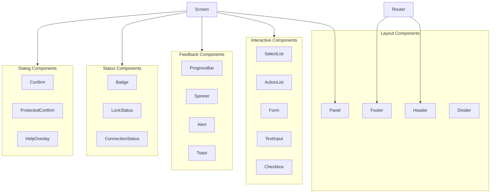
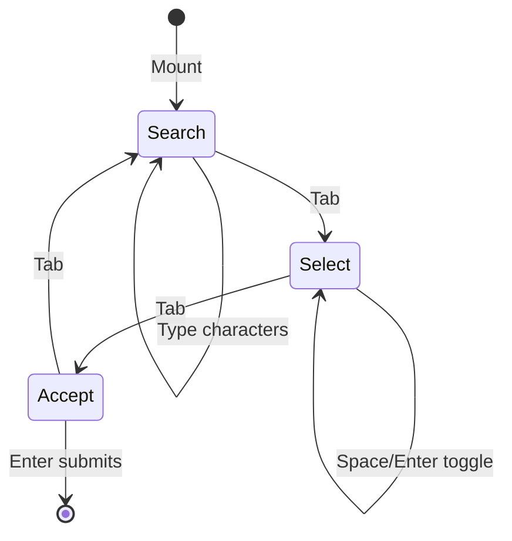
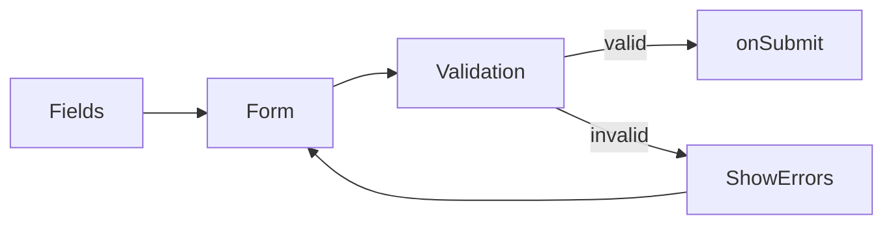
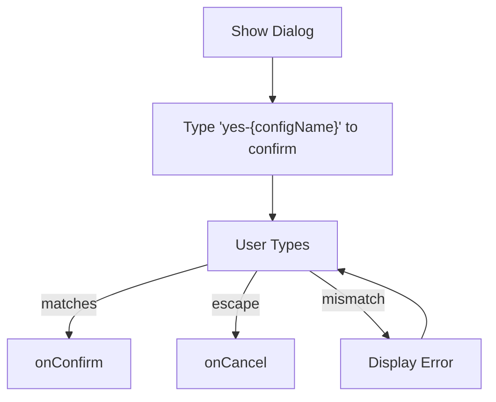
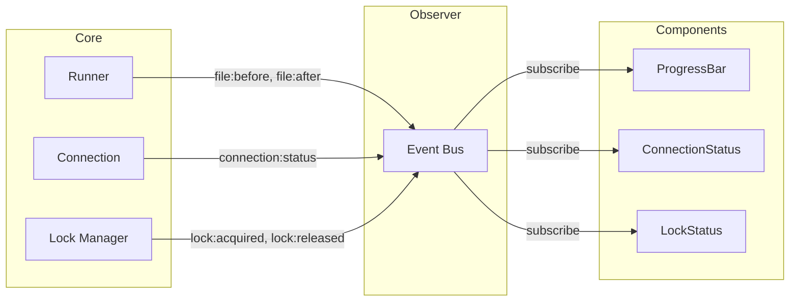
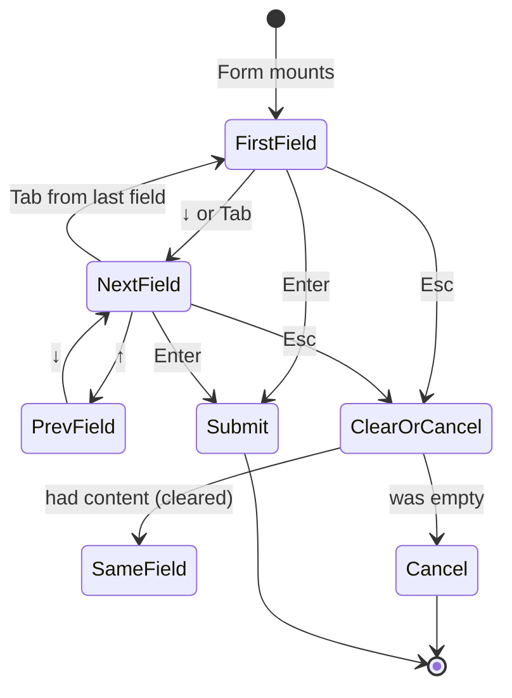

# CLI Components


## Overview

Shared UI components used across all screens in the noorm TUI. These provide consistent styling and behavior for:

- Layout (Header, Footer, Box containers)
- Lists and selection
- Forms and inputs
- Progress indicators
- Confirmations and alerts
- Status displays


## Component Architecture




## File Structure

```
src/cli/components/
├── index.ts               # Public exports
├── layout/
│   ├── Header.tsx
│   ├── Footer.tsx
│   ├── Panel.tsx
│   └── Divider.tsx
├── lists/
│   ├── SelectList.tsx
│   ├── ActionList.tsx
│   └── StatusList.tsx
├── forms/
│   ├── TextInput.tsx
│   ├── PasswordInput.tsx
│   ├── SelectInput.tsx
│   ├── Checkbox.tsx
│   └── Form.tsx
├── feedback/
│   ├── ProgressBar.tsx
│   ├── Spinner.tsx
│   ├── Alert.tsx
│   └── Toast.tsx
├── dialogs/
│   ├── Confirm.tsx
│   ├── ProtectedConfirm.tsx
│   └── HelpOverlay.tsx
└── status/
    ├── Badge.tsx
    ├── LockStatus.tsx
    └── ConnectionStatus.tsx
```


## Component Categories


### Layout Components

Provide consistent page structure across all screens.

| Component | Purpose |
|-----------|---------|
| **Header** | App title, section tabs, current route indicator |
| **Footer** | Context-aware keyboard shortcuts, global actions |
| **Panel** | Bordered container with optional title |
| **Divider** | Horizontal separator with optional label |

**Header behavior:**
- Displays section tabs: Config, Change, Run, DB, Lock
- Highlights active section based on current route
- Uses router context to determine current section

**Footer behavior:**
- Shows screen-specific actions passed via props
- Automatically includes global actions (back, help, quit)
- Conditionally shows "back" based on navigation history


### List Components

Handle item display and selection with keyboard navigation.

| Component | Purpose |
|-----------|---------|
| **SelectList** | Navigable list with selection callback |
| **ActionList** | Display available keyboard actions |
| **StatusList** | Show items with status indicators |
| **FilePicker** | File selection with search and multi-select |

**SelectList data model:**

```
SelectListItem<T>
├── key: string           # Unique identifier
├── label: string         # Display text
├── value: T              # Payload passed on select
├── description?: string  # Secondary text
├── disabled?: boolean    # Prevent selection
└── icon?: string         # Prefix icon
```

**SelectList behavior:**
- Arrow keys navigate items
- Enter triggers onSelect with item
- Disabled items are skipped during navigation
- Scrolling viewport when items exceed limit
- Optional onHighlight callback for preview


### FilePicker

Interactive file selector with search filtering and multi-select capability.

**Data model:**

```
FilePickerProps
├── basePath: string              # Directory to list files from
├── filter?: (path) => boolean    # Include file predicate
├── selected?: string[]           # Initially selected files
├── onSelect: (files) => void     # Callback with selected files
└── onCancel: () => void          # Cancel callback
```

**Mode state machine:**



| Mode | Behavior |
|------|----------|
| **Search** | Text input filters visible files |
| **Select** | Arrow navigation, Space/Enter toggles selection |
| **Accept** | Enter submits selected files |

**Search filtering:**

Each space-separated term applies as a sequential filter:

```
Input: "views auth/users.sql"

Step 1: Filter all files matching "views"
Step 2: From results, filter matching "auth/users.sql"
```

This enables progressive narrowing of results.

**Layout:**

```
┌─────────────────────────────────────────────────────────────────┐
│  Select Files                                    [Search Mode]  │
├─────────────────────────────────────────────────────────────────┤
│  Search: views auth█                                            │
├─────────────────────────────────────────────────────────────────┤
│  ☑ schema/views/auth/users.sql                                 │
│  ☐ schema/views/auth/roles.sql                                 │
│  ☑ schema/views/auth/permissions.sql                           │
│                                                                 │
│  3 files shown (2 selected)                                     │
├─────────────────────────────────────────────────────────────────┤
│  [Tab]switch mode  [Space]toggle  [Enter]accept  [Esc]cancel   │
└─────────────────────────────────────────────────────────────────┘
```

**Keyboard shortcuts:**

| Key | Search Mode | Select Mode | Accept Mode |
|-----|-------------|-------------|-------------|
| Tab | → Select | → Accept | → Search |
| Enter | → Select | Toggle file | Submit selection |
| Space | Type space | Toggle file | N/A |
| ↑/↓ | N/A | Navigate list | N/A |
| Esc | Clear input, or cancel if empty | Cancel | Cancel |
| Backspace | Delete char | N/A | N/A |

**ESC cascade in Search mode:** If search input has content, ESC clears it. If already empty, ESC cancels the picker.

**Focus behavior:** FilePicker pushes itself onto the focus stack on mount. It manages its own mode state internally and only pops from the stack when cancelled or submitted.


### Form Components

Handle user input with validation.

| Component | Purpose |
|-----------|---------|
| **TextInput** | Single-line text entry |
| **PasswordInput** | Masked text entry |
| **SelectInput** | Dropdown selection |
| **Checkbox** | Boolean toggle |
| **Form** | Multi-field form with validation |

**Form data flow:**



**Form field model:**

```
FormField
├── key: string                    # Field identifier
├── label: string                  # Display label
├── type: text|password|select|checkbox
├── required?: boolean
├── options?: { label, value }[]   # For select type
├── defaultValue?: any
└── validate?: (value) => error?   # Custom validation
```

**Form behavior:**
- `↑`/`↓` navigate between fields
- `Tab` advances to next field (cycles through fields)
- `Enter` submits form (from any field)
- `Esc` clears current field if has content, or cancels form if empty
- Validates all fields before submit
- Displays errors inline per field

**Focus behavior:** Form pushes itself onto the focus stack on mount. Individual text fields do NOT push separately - the Form manages focus internally via field index.


### Feedback Components

Communicate progress and status to users.

| Component | Purpose |
|-----------|---------|
| **ProgressBar** | Visual progress indicator |
| **Spinner** | Indeterminate loading state |
| **Alert** | Styled message box (info/success/warning/error) |
| **Toast** | Auto-dismissing notification |

**Alert types and styling:**

| Type | Icon | Color | Use Case |
|------|------|-------|----------|
| info | ℹ | blue | General information |
| success | ✓ | green | Completed operations |
| warning | ⚠ | yellow | Non-blocking issues |
| error | ✗ | red | Failed operations |


### Dialog Components

Handle confirmations and overlays.

| Component | Purpose |
|-----------|---------|
| **Confirm** | Yes/No confirmation dialog |
| **ProtectedConfirm** | Type-to-confirm for protected configs |
| **HelpOverlay** | Keyboard shortcut reference |

**ProtectedConfirm flow:**



This pattern prevents accidental destructive actions on protected configurations.


### Status Components

Display connection and lock state.

| Component | Purpose |
|-----------|---------|
| **Badge** | Colored label (default/success/warning/error/info) |
| **LockStatus** | Lock state with holder and expiry info |
| **ConnectionStatus** | Database connection state |

**LockStatus states:**

| State | Badge | Details Shown |
|-------|-------|---------------|
| Unlocked | UNLOCKED (green) | None |
| Locked | LOCKED (red) | Holder, since, expires |
| Expired | EXPIRED (yellow) | Holder, since, expired time |


## Keyboard Navigation Model

See [cli/core.md](./core.md) for the full keyboard architecture and focus stack system.

**Summary:**

```
Universal Keys (always available)
├── Esc → Cascade: clear input → cancel prompt → go back
├── Enter → Confirm / Submit / Select
├── Tab → Switch mode (in multi-mode components)
├── ? → Help overlay (when not in text input)
└── Ctrl+C → Quit

Context Keys (when component has focus)
├── List: ↑/↓ navigate, a/e/d actions
├── Form: ↑/↓ navigate fields, Tab next field
├── Text: printable chars, Backspace
└── FilePicker: Space toggle (in select mode)
```

**Focus rule:** Only the topmost component on the focus stack receives keyboard input. Modals and dialogs capture focus when open.


## Observer Integration

Components subscribe to observer events for reactive updates:



**Example subscriptions:**

| Component | Events | Purpose |
|-----------|--------|---------|
| ProgressBar | `file:before`, `file:after` | Update progress count |
| LockStatus | `lock:acquired`, `lock:released` | Refresh lock display |
| ConnectionStatus | `connection:status` | Show connected/disconnected |


## Component Composition

Screens compose components following a standard pattern:

```
Screen Layout
├── Header (from router context)
├── Panel (optional title)
│   ├── Status components
│   ├── Interactive components
│   └── Feedback components
├── Dialogs (conditional overlays)
└── Footer (with screen-specific actions)
```

**Screen pseudo-structure:**

```
function SomeScreen():
    state = useScreenState()

    if state.showConfirm:
        return <ConfirmDialog />

    if state.loading:
        return <Spinner label="Loading..." />

    return (
        <Panel title="Screen Title">
            <StatusIndicators />
            <MainContent />
        </Panel>
        <Footer actions={screenActions} />
    )
```


## Focus Management

Components use the focus stack system defined in [cli/core.md](./core.md).

**Form internal focus:**



**Focus stack integration:**

| Component | Pushes to Stack | Internal Focus |
|-----------|-----------------|----------------|
| Form | On mount | Tracks active field index |
| SelectList | On mount | Tracks selected item index |
| FilePicker | On mount | Tracks mode + search/selection state |
| Modal | On open | Captures all input |
| TextInput | When standalone | N/A (leaf component) |

Only the topmost component on the stack receives input. Child components (like TextInput inside Form) don't push separately - the parent manages internal focus.


## Dependencies

```json
{
    "ink": "^4.4.0",
    "ink-text-input": "^5.0.1",
    "ink-select-input": "^5.0.0",
    "ink-spinner": "^5.0.0",
    "react": "^18.2.0"
}
```
