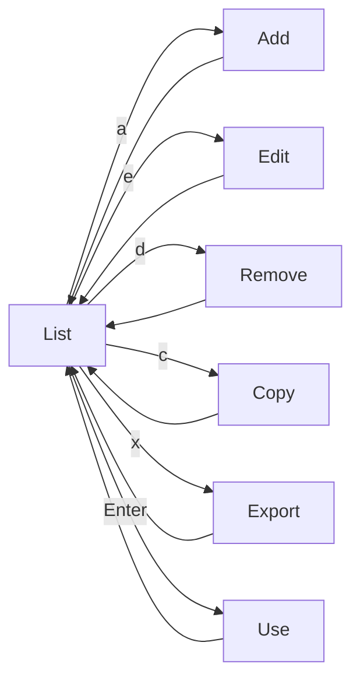
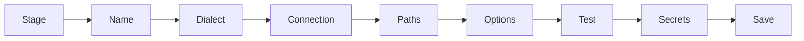
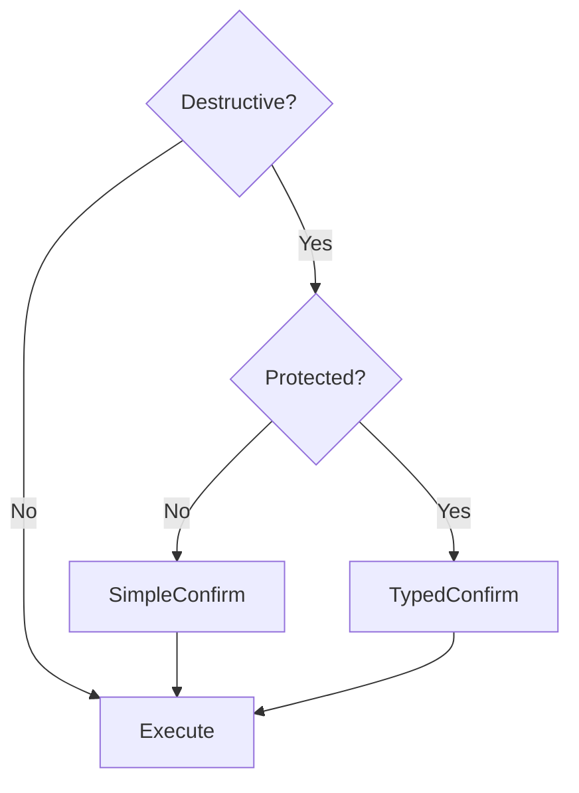
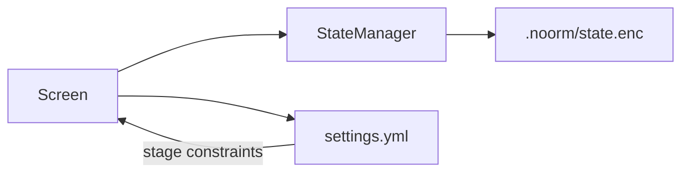

# CLI Config Screens


## Overview

Config screens provide CRUD operations for database configurations. Users can create, view, edit, copy, delete, and activate configurations through a set of interconnected screens.


## Screens

| Screen | Route | Purpose |
|--------|-------|---------|
| List | `config` | View all configs, navigate to actions |
| Add | `config/add` | Multi-step wizard to create config |
| Edit | `config/edit` | Modify existing config fields |
| Remove | `config/rm` | Delete a config |
| Copy | `config/cp` | Clone config with new name |
| Use | `config/use` | Set as active config |
| Validate | `config/validate` | Check config completeness |
| Export | `config/export` | Export encrypted config for sharing |
| Import | `config/import` | Import config from encrypted file |


## Navigation Flow




## Data Model

```
Config:
    name: string
    stage?: string                       # Linked stage from settings.yml
    dialect: 'postgres' | 'mysql' | 'sqlite' | 'mssql'
    isTest: boolean
    protected: boolean
    connection:
        host?: string
        port?: number
        database: string
        user?: string
        password?: string
    paths:
        schema: string
        changesets: string
```

**Dialect-specific fields:**
- SQLite only requires `database` (file path)
- Other dialects require host, port, user, password

**Stage linkage:**
- When `stage` is set, config inherits constraints from `settings.yml`
- Locked stages prevent config deletion
- Required secrets must be set for config to be usable


## Screen Behaviors


### Add Wizard

Multi-step flow to create a new configuration:



**Steps:**

1. **Stage** (if stages defined in settings) - Select from predefined stages or "Custom"
2. **Name** - Enter config name (defaults to stage name if selected)
3. **Dialect** - Select database type (pre-filled from stage defaults)
4. **Connection** - Enter connection details (pre-filled from stage defaults)
5. **Paths** - Schema/changeset paths (pre-filled from stage defaults)
6. **Options** - Set protected/test flags (constrained by stage)
7. **Test** - Verify connection works
8. **Secrets** - If stage has required secrets, prompt for each
9. **Save** - Create config

**Validation requirements:**
- Name must be unique
- Database is required
- Connection test must pass before save
- All required secrets must be provided (if stage-linked)


### Edit

Presents editable fields for modification.

**Constraints:**
- Dialect cannot be changed (recreate config instead)
- Stage-enforced `protected: true` cannot be disabled
- Stage-enforced `isTest: true` cannot be disabled
- Constrained fields are shown as read-only with explanation


### Remove

Requires confirmation before deletion.

**Blocking conditions:**
- Cannot delete the active configuration
- Cannot delete locked configs (stage has `locked: true`)

Locked configs show an error message explaining the constraint.


### Validate

Shows completeness status for a config:

```
+------------------------------------------+
| Config: staging                           |
|                                          |
| Stage: staging (locked)                  |
| Status: INCOMPLETE                       |
|                                          |
| Missing Secrets:                         |
|   ✗ DB_PASSWORD (password)               |
|   ✗ READONLY_PASSWORD (password)         |
|   ✓ READONLY_USER                        |
|                                          |
| [s]et secrets  [Esc]back                 |
+------------------------------------------+
```


### Copy

Clones source config with a new unique name.


### Use

Sets selected config as active. Emits `config:activated` event.


### Export

Exports a config (with its secrets) encrypted for a specific recipient.

**What's exported:**
- Config metadata (name, dialect, flags)
- Connection details (host, port, database) — **NOT user/password**
- Paths (schema, changesets)
- All config-scoped secrets (API keys, etc.)

**What's NOT exported:**
- `connection.user` — recipient uses their own
- `connection.password` — recipient uses their own

This lets you share application secrets (API keys for seeding, etc.) without accidentally sharing your personal database credentials.

**Flow:**

1. Select config to export (or use route param)
2. Enter recipient identifier (email or identity hash)
3. If multiple identities match email, show picker
4. Encrypt config + secrets with recipient's public key (omitting user/pass)
5. Output to file or stdout

**Interactive mode:**

```
┌─────────────────────────────────────────────────────────────────┐
│  Export Config                                                   │
├─────────────────────────────────────────────────────────────────┤
│                                                                 │
│  Config: staging                                                │
│                                                                 │
│  Recipient email: alice@company.com                             │
│                                                                 │
│  Found 2 machines for alice@company.com:                        │
│    ○ alice-macbook (darwin 24.5.0)                              │
│    ● alice-desktop (linux 6.1.0)                                │
│                                                                 │
│  Output: staging.noorm.enc                                      │
│                                                                 │
├─────────────────────────────────────────────────────────────────┤
│  [Enter]export  [Esc]cancel                                     │
└─────────────────────────────────────────────────────────────────┘
```

**Headless flags:**

```
noorm config export <name>
    --for <email>                  # Recipient email (prompts if multiple machines)
    --machine <name>               # Filter recipient by machine name
    --identity-hash <hash>         # Exact recipient identity
    --pubkey <key>                 # Manual public key override
    --output <file>                # Output path (default: <name>.noorm.enc)
```


### Import

Imports a config from an encrypted file.

**What you provide:**
- Database credentials (user, password) — **always prompted**
- Config name (if conflict exists)

**What's imported automatically:**
- Connection details (host, port, database, dialect)
- Paths (schema, changesets)
- All secrets from the export

**Flow:**

1. Select or specify encrypted file
2. Decrypt with local private key
3. Show config preview (name, dialect, database, secret count)
4. Prompt for database user/password
5. Prompt to rename if name conflicts
6. Test connection (optional)
7. Save config and secrets to state

**Interactive mode:**

```
┌─────────────────────────────────────────────────────────────────┐
│  Import Config                                                   │
├─────────────────────────────────────────────────────────────────┤
│                                                                 │
│  File: staging.noorm.enc                                        │
│  From: bob@company.com (bob-workstation)                        │
│                                                                 │
│  Config Preview:                                                │
│    Name:     staging                                            │
│    Dialect:  postgres                                           │
│    Host:     db.example.com:5432                                │
│    Database: myapp_staging                                      │
│    Secrets:  3 included                                         │
│                                                                 │
│  Enter your database credentials:                               │
│    User:     alice                                              │
│    Password: ••••••••                                           │
│                                                                 │
│  ⚠ Config "staging" already exists                              │
│  New name: staging-imported                                     │
│                                                                 │
├─────────────────────────────────────────────────────────────────┤
│  [Enter]import  [t]est connection  [Esc]cancel                  │
└─────────────────────────────────────────────────────────────────┘
```

**Headless flags:**

```
noorm config import <file>
    --name <name>                  # Override config name
    --user <user>                  # Database user (required)
    --password <pass>              # Database password (or via stdin)
    --force                        # Overwrite existing config
    --skip-test                    # Skip connection test
```


## Protected Configs

Configs marked as `protected` require typed confirmation (user must type config name) for destructive operations:




## Observer Events

| Event | Payload | When |
|-------|---------|------|
| `config:created` | `{ name, stage? }` | New config saved |
| `config:updated` | `{ name, fields }` | Config modified |
| `config:deleted` | `{ name }` | Config removed |
| `config:activated` | `{ name, previous }` | Active config changed |
| `config:validated` | `{ name, complete, missing }` | Config validation run |
| `config:delete-blocked` | `{ name, reason }` | Delete prevented (locked) |
| `config:exported` | `{ name, recipient, file }` | Config exported |
| `config:imported` | `{ name, from }` | Config imported |


## State Integration

All screens read/write through StateManager, with constraints from Settings:



**Integration points:**

| Source | Data |
|--------|------|
| StateManager | Config values, secrets, active config |
| Settings | Stage definitions, defaults, required secrets, lock status |
