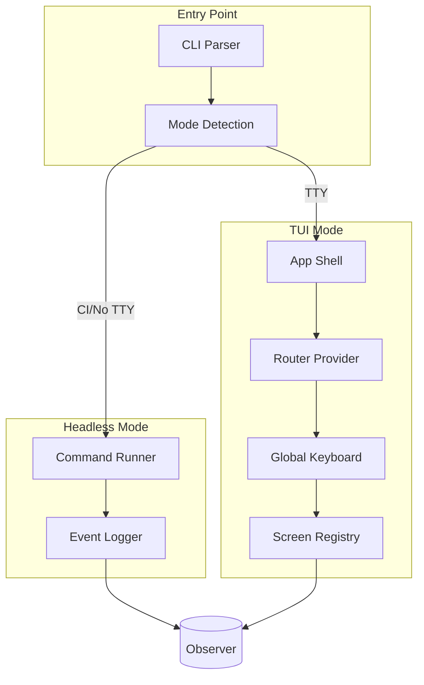
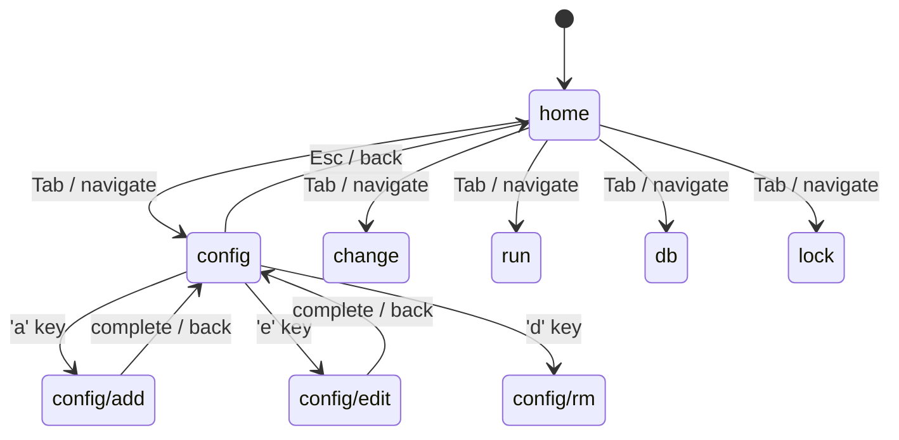
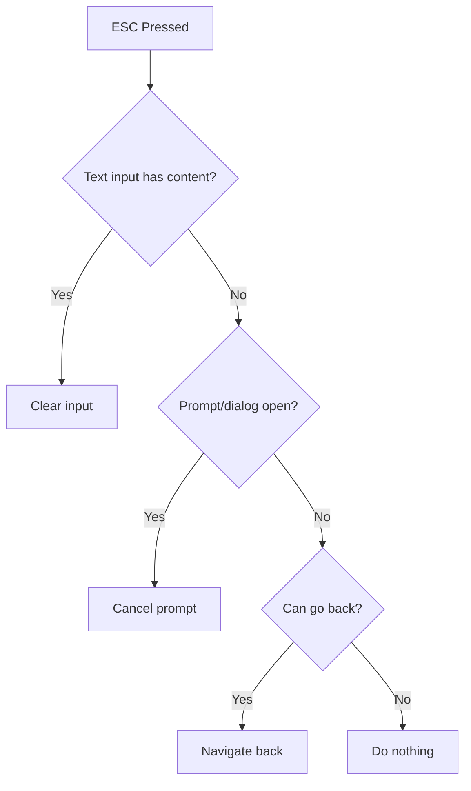
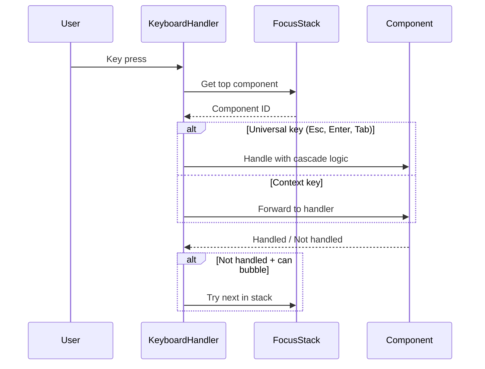
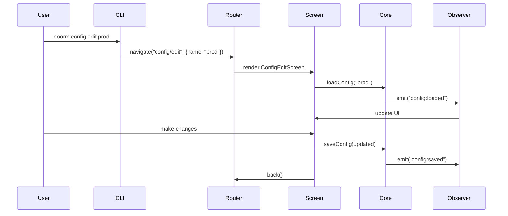
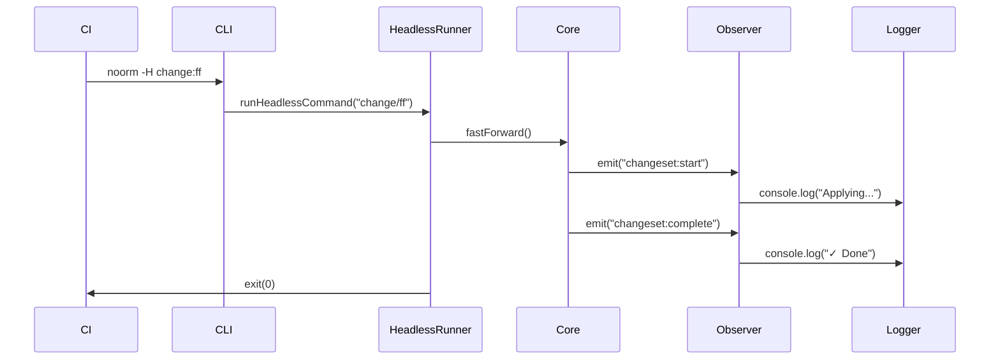

# CLI Core


## Overview

The CLI core provides the foundation for noorm's terminal interface:

- **Router** - Screen navigation with history
- **App Shell** - Root component wrapping all screens
- **Global Keyboard** - Consistent hotkeys across all screens
- **Headless Mode** - Non-interactive CI/CD support
- **Entry Point** - CLI argument parsing and mode detection


## Architecture




## File Structure

```
src/cli/
├── index.tsx              # Entry point
├── app.tsx                # Root App component
├── router.tsx             # Router context and provider
├── keyboard.tsx           # Global keyboard handler
├── headless.ts            # Headless mode setup
├── screens.tsx            # Screen registry and renderer
└── types.ts               # CLI types
```


## Routes

Routes follow a hierarchical pattern: `section` or `section/action`.

| Section | Routes |
|---------|--------|
| home | `home` |
| config | `config`, `config/add`, `config/edit`, `config/rm`, `config/cp`, `config/use`, `config/validate` |
| secret | `secret`, `secret/set`, `secret/rm` |
| settings | `settings`, `settings/edit`, `settings/init` |
| change | `change`, `change/add`, `change/edit`, `change/rm`, `change/run`, `change/revert`, `change/rewind`, `change/next`, `change/ff` |
| run | `run`, `run/list`, `run/build`, `run/exec`, `run/file`, `run/dir` |
| db | `db`, `db/create`, `db/destroy` |
| lock | `lock`, `lock/status`, `lock/acquire`, `lock/release`, `lock/force` |


### Route Parameters

Routes can carry parameters:

- `name` - Named entity (config name, changeset name)
- `count` - Numeric parameter (e.g., `change/next 5`)
- `path` - File or directory path


## Router

The router manages screen navigation with history support.



### Navigation Actions

| Action | Behavior |
|--------|----------|
| `navigate(route, params)` | Push current to history, go to new route |
| `back()` | Pop from history, restore previous route |
| `replace(route, params)` | Replace current route without history |
| `reset()` | Clear history, go to home |


## Keyboard Architecture


### Focus Stack

Keyboard input flows through a **focus stack** - only the topmost component receives input. This prevents parent screens from intercepting keys meant for child components.

```
Focus Stack (top receives input)
─────────────────────────────────
│ ProtectedConfirm (modal)     │  ← receives all input
├──────────────────────────────┤
│ FilePicker                   │  ← blocked while modal open
├──────────────────────────────┤
│ ExecScreen                   │  ← blocked
├──────────────────────────────┤
│ AppShell                     │  ← blocked
└──────────────────────────────┘
```

**Focus rules:**

| Component Type | Focus Behavior |
|----------------|----------------|
| Screen | Pushes on mount, pops on unmount |
| Modal/Dialog | Pushes on open, pops on close (captures all input) |
| TextInput | Pushes when active, pops when blurred |
| FilePicker | Pushes on mount, manages internal mode state |

**API:**

```
useFocus()
├── push(id)         # Claim focus
├── pop(id)          # Release focus
├── isActive(id)     # Check if this component has focus
└── onKey(handler)   # Register key handler (only called if focused)
```


### Universal Keys

These keys have consistent behavior everywhere:

| Key | Behavior |
|-----|----------|
| `Esc` | Cascade: clear input → cancel prompt → go back (see below) |
| `Enter` | Confirm / Submit / Select |
| `Tab` | Switch mode (search → select → accept) |
| `?` | Show help overlay (when not in text input) |
| `Ctrl+C` | Quit application |


### ESC Cascade

ESC follows a priority chain - it performs the **first applicable action**:

```
ESC pressed:
    1. If text input has content → clear the input
    2. Else if prompt/dialog is open → cancel the prompt
    3. Else if can go back → navigate back
    4. Else → do nothing (already at root)
```




### TAB Mode Switching

Components with multiple modes use TAB to cycle through them:

| Component | Modes |
|-----------|-------|
| FilePicker | Search → Select → Accept → Search... |
| Form | Field → Field → Submit → Field... |
| List with search | Search → Navigate → Search... |

**Mode indicator:** Components should display current mode visually (e.g., `[Search Mode]`).


### Context-Specific Keys

When a component has focus, it can register additional keys:

| Context | Keys | Actions |
|---------|------|---------|
| List (focused) | `↑`/`↓` | Navigate items |
| List (focused) | `a`, `e`, `d` | Add, Edit, Delete |
| Text input (focused) | Any printable | Type character |
| Text input (focused) | `Backspace` | Delete character |
| FilePicker (select mode) | `Space` | Toggle selection |


### Keyboard Event Flow




### Screen Key Registration

Screens register their keyboard handlers on mount:

```
Screen mounts:
    1. Push self onto focus stack
    2. Register key handlers with useFocus().onKey()
    3. Render children (which may push their own focus)

Screen unmounts:
    1. Pop self from focus stack
    2. Handlers automatically cleaned up
```

**Important:** A screen should only handle keys when it's the active focus. The focus system ensures this automatically.


## Screen Registry

Maps routes to lazy-loaded screen components.

```
Route String  →  Screen Component
─────────────────────────────────
"home"        →  HomeScreen
"config"      →  ConfigListScreen
"config/add"  →  ConfigAddScreen
...
```

When a route has no matching screen, a fallback error screen is shown.


## App Shell

The root component structure:

```
┌─────────────────────────────────────┐
│ Header (breadcrumb, active config)  │
├─────────────────────────────────────┤
│                                     │
│ Screen Content                      │
│ (from Screen Registry)              │
│                                     │
├─────────────────────────────────────┤
│ Footer (hotkey hints)               │
├─────────────────────────────────────┤
│ Help Overlay (when ? pressed)       │
└─────────────────────────────────────┘
```

Provider hierarchy:

```
RouterProvider
  └── GlobalKeyboard
        └── StateProvider
              └── ConfigProvider
                    └── Screen
```


## Mode Detection

The CLI operates in two modes:

### TUI Mode (Interactive)

- Full terminal UI with Ink/React
- Keyboard navigation
- Real-time feedback via observer events

### Headless Mode (Non-Interactive)

Activated when:
- `--headless` or `-H` flag is passed
- `NOORM_HEADLESS=1` environment variable
- `CI=1` or common CI environment variables detected
- No TTY available (`!process.stdout.isTTY`)

In headless mode:
- No TUI rendered
- Commands execute directly
- Output formats: human-readable or JSON (`--json`)
- Observer events logged to stdout/stderr


## Control Flow

### TUI Mode



### Headless Mode




## CLI Flags

| Flag | Short | Description |
|------|-------|-------------|
| `--headless` | `-H` | Force headless mode |
| `--json` | | Output JSON (headless) |
| `--yes` | `-y` | Skip confirmations |
| `--config <name>` | `-c` | Use specific config |
| `--force` | `-f` | Force operation |
| `--dry-run` | | Show without executing |


## Environment Variables

| Variable | Description |
|----------|-------------|
| `NOORM_HEADLESS=1` | Force headless mode |
| `NOORM_JSON=1` | Force JSON output |
| `NOORM_YES=1` | Skip confirmations |
| `NOORM_CONFIG=<name>` | Override active config |


## Headless Event Logging

In headless mode, observer events are translated to console output:

| Event Pattern | Human Output | JSON Output |
|---------------|--------------|-------------|
| `build:start` | "Building schema..." | `{"event":"build:start",...}` |
| `file:before` | "  Running file.sql..." | `{"event":"file:before",...}` |
| `file:after` | " ✓ (42ms)" | `{"event":"file:after",...}` |
| `error` | "Error [source]: message" | `{"event":"error",...}` |


## Usage Examples

### TUI Mode

```bash
# Open home screen
noorm

# Jump to specific screen
noorm config
noorm change
noorm run:build

# With parameters
noorm config:edit production
noorm change:run 2024-01-15_add-users
```

### Headless Mode

```bash
# Explicit headless
noorm -H run:build

# Auto-detected in CI
CI=1 noorm change:ff

# JSON output for scripting
noorm -H --json run:build | jq '.event'

# Skip confirmations on protected config
noorm -H -y change:run 2024-01-15_migration

# Dry run preview
noorm -H --dry-run change:ff
```
