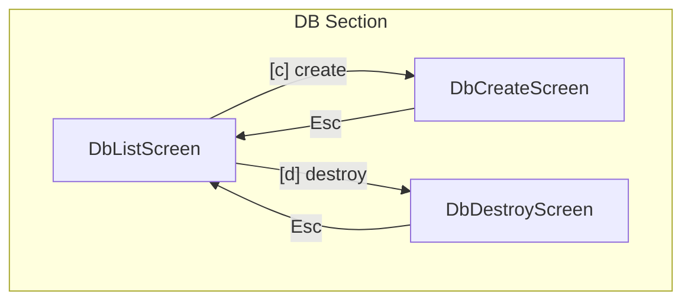
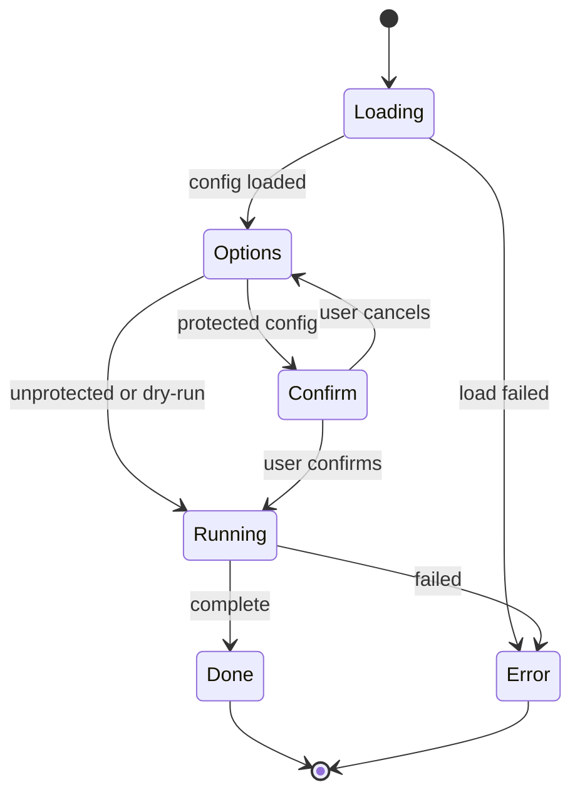
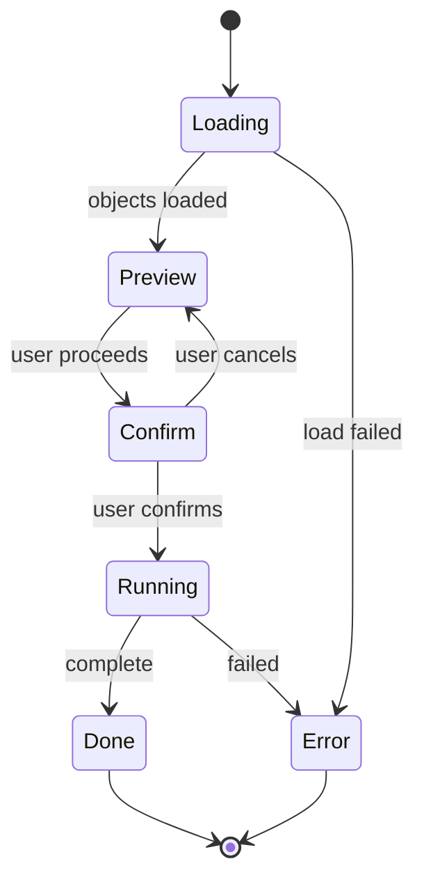

# CLI DB Screens


## Overview

The DB section provides database lifecycle management operations:

- **create** - Build database schema from SQL files
- **destroy** - Drop all managed objects and reset tracking

These are high-risk operations requiring protected confirmation for non-development environments.


## File Structure

```
src/cli/screens/
├── db/
│   ├── index.tsx            # DB section exports
│   ├── DbListScreen.tsx     # DB operations overview
│   ├── DbCreateScreen.tsx   # Create database schema
│   └── DbDestroyScreen.tsx  # Destroy database objects
```


## Screen Flow




## DB List Screen

Entry point showing database status and available actions.

### Data Requirements

- Active configuration name
- Connection status (can we reach the database?)
- Count of tracked objects in the database

### Display

```
┌─────────────────────────────────────────────────────┐
│ Database Operations                                 │
│                                                     │
│ Config: dev                                         │
│ Connection: [OK]                                    │
│ Tracked Objects: 15                                 │
└─────────────────────────────────────────────────────┘

┌─────────────────────────────────────────────────────┐
│ Available Actions                                   │
│                                                     │
│ [c] Create Schema - Build database from scratch     │
│ [d] Destroy Schema - Drop all managed objects       │
└─────────────────────────────────────────────────────┘

Warning: These operations modify the database schema directly.
```

### Keyboard

| Key | Action |
|-----|--------|
| `c` | Navigate to create screen |
| `d` | Navigate to destroy screen |
| `Esc` | Go back |


## DB Create Screen

Executes SQL files to build database schema.

### Phase Flow



### Options

| Option | Description |
|--------|-------------|
| `force` | Rebuild all files ignoring checksums |
| `dryRun` | Preview changes without executing |

### Logic Flow

```
loadConfig()
    -> get active config from state manager
    -> check if config is protected
    -> show options phase

handleConfirm()
    -> if protected AND not dry-run: show confirm phase
    -> else: proceed to run

runCreate()
    -> connect to database
    -> create Runner instance
    -> execute build operation
    -> emit completion events
    -> show results
```

### Protected Confirmation

For protected configurations (non-dev environments), users must type a confirmation phrase before proceeding:

```
Type "yes-{configName}" to confirm: _
```


## DB Destroy Screen

Drops all tracked database objects and optionally resets tracking tables.

### Phase Flow



### Options

| Option | Description |
|--------|-------------|
| `dropTables` | Drop the actual database objects |
| `resetTracking` | Clear the tracking tables |

### Logic Flow

```
loadPreview()
    -> get active config from state manager
    -> connect to database
    -> query tracking tables for object list
    -> group objects by type for display

handleConfirm()
    -> always show confirm phase (destroy is always protected)

runDestroy()
    -> connect to database
    -> if dropTables: drop objects in reverse dependency order
    -> if resetTracking: clear tracking tables
    -> emit completion events
    -> show results
```

### Object Type Inference

Objects are categorized by examining their file paths:

| Path Pattern | Type |
|--------------|------|
| `*view*` | view |
| `*function*`, `*func*` | function |
| `*procedure*`, `*proc*` | procedure |
| `*trigger*` | trigger |
| `*index*` | index |
| default | table |

### Drop Order

Objects are dropped in reverse creation order to handle dependencies correctly.


## Observer Events

```typescript
// Create events
'db:create:complete' -> { config, success, filesExecuted, duration }

// Destroy events
'db:destroy:object'   -> { config, path, success, error? }
'db:destroy:complete' -> { config, success, objectsDropped, trackingReset, duration }
```


## Headless Mode

Both operations support headless execution for CI/CD:

```bash
noorm db:create [config] [--force] [--dry-run]
noorm db:destroy [config] [--drop-tables] [--reset-tracking] [--yes]
```

The `--yes` flag bypasses protected confirmation (use with caution).


## Dependencies

- **StateManager** - Get active configuration
- **ConnectionFactory** - Create database connections
- **Runner** - Execute build operations (create only)
- **Observer** - Emit lifecycle events
- **ProtectedConfirm** - Confirmation for dangerous operations
