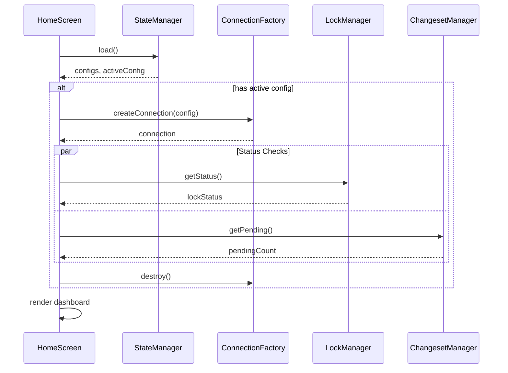

# CLI Home Screen


## Overview

The home screen is the default landing page when launching `noorm` without arguments. It provides:

- Active config display
- Quick status overview
- Section navigation via keyboard shortcuts
- Quick actions for common operations


## Screen Layout

```
┌─────────────────────────────────────────────────────────────────┐
│  noorm - Database Schema & Changeset Manager                    │
├─────────────────────────────────────────────────────────────────┤
│                                                                 │
│  Welcome to noorm                                               │
│                                                                 │
│  Active Config: dev          Configs: 3                         │
│                                                                 │
│  ┌─────────────────────────┐  ┌─────────────────────────────┐   │
│  │ Status                  │  │ Quick Actions               │   │
│  │                         │  │                             │   │
│  │ Connection: [OK]        │  │ [1] Run Build               │   │
│  │ Pending: [2 changesets] │  │ [2] Apply Changes           │   │
│  │ Lock: [FREE]            │  │ [3] View Status             │   │
│  └─────────────────────────┘  └─────────────────────────────┘   │
│                                                                 │
│  ┌──────────────────────────────────────────────────────────┐   │
│  │ Recent Activity                                          │   │
│  │                                                          │   │
│  │ ✓ Applied 2024-01-20_add-roles         2h ago            │   │
│  │ ✓ Applied 2024-01-15_add-email         1d ago            │   │
│  │ ✗ Reverted 2024-01-10_test             3d ago            │   │
│  └──────────────────────────────────────────────────────────┘   │
│                                                                 │
├─────────────────────────────────────────────────────────────────┤
│  [c]config  [h]change  [r]run  [d]db  [l]lock  [?]help  [q]quit │
└─────────────────────────────────────────────────────────────────┘
```


## Data Flow




## Components


### Welcome Section

Displays:
- Application title
- Active config name (or prompt to select one)
- Total config count

Conditional messaging:
- No configs → prompt to add first config
- Configs exist but none active → prompt to select one


### Quick Status Widget

Shows real-time status for the active config:

| Field | Source | Description |
|-------|--------|-------------|
| Connection | ConnectionFactory | Test connection health |
| Pending | ChangesetManager | Count of unapplied changesets |
| Lock | LockManager | Lock status and holder |

Status indicators use badges: `success`, `warning`, `error`


### Quick Actions

Shortcuts to common operations:

| Action | Route | Description |
|--------|-------|-------------|
| Run Build | `run/build` | Execute full schema build |
| Apply Changes | `change/ff` | Fast-forward pending changesets |
| View Status | `lock/status` | Check detailed lock status |


### Recent Activity Widget

Displays last N changeset executions from history:

```
direction: 'change' | 'revert'
status: 'success' | 'failed'
timestamp: relative time (2h ago, 1d ago)
```


## Keyboard Shortcuts

| Key | Action |
|-----|--------|
| `c` | Navigate to Config section |
| `h` | Navigate to Change section |
| `r` | Navigate to Run section |
| `d` | Navigate to DB section |
| `l` | Navigate to Lock section |
| `1-5` | Quick navigate to sections |
| `?` | Show help |
| `q` | Quit |


## State Management

Loading sequence:

1. Load `StateManager` → get active config and config count
2. If active config exists:
   - Create temporary connection
   - Fetch lock status
   - Count pending changesets
   - Fetch recent activity from history
   - Close connection immediately

Connections are short-lived to avoid holding database resources while idle on the home screen.


## Error States

| Condition | Display |
|-----------|---------|
| State load fails | Error message + hint to run `config:add` |
| No configs | Welcome + prompt to add first config |
| No active config | List exists + prompt to select one |
| Connection fails | Status widget shows `Connection: ERROR` |
