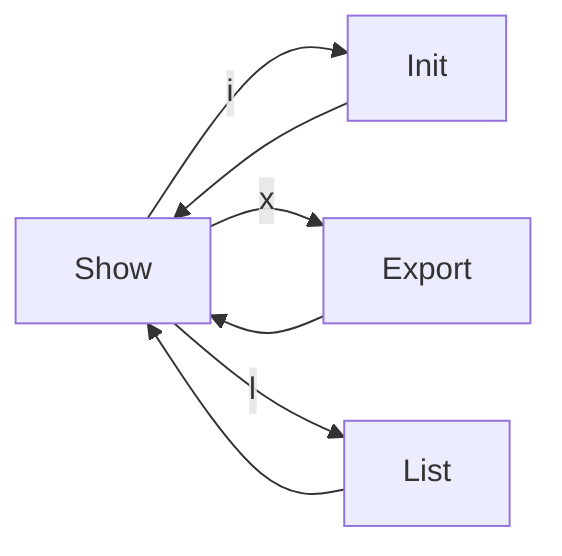

# CLI Identity Screens


## Overview

Identity screens manage the user's cryptographic identity and view known team members. Identity is used for:

- **Audit trails** - Who executed changesets
- **Config sharing** - Encrypting configs for specific recipients
- **Team discovery** - Syncing identities via shared databases


## Screens

| Screen | Route | Purpose |
|--------|-------|---------|
| Show | `identity` | Display current identity |
| Init | `identity/init` | Re-run identity setup |
| Export | `identity/export` | Output public key for sharing |
| List | `identity/list` | View known team members |


## Navigation Flow




## Screen Behaviors


### Show (Default)

Displays the current user's identity.

```
┌─────────────────────────────────────────────────────────────────┐
│  Your Identity                                                   │
├─────────────────────────────────────────────────────────────────┤
│                                                                 │
│  Name:     Alice Smith                                          │
│  Email:    alice@company.com                                    │
│  Machine:  alice-macbook-pro                                    │
│  OS:       darwin 24.5.0                                        │
│                                                                 │
│  Identity Hash: a1b2c3d4...                                     │
│  Public Key:    3f8a9b2c...                                     │
│  Created:       2024-01-15T10:30:00Z                            │
│                                                                 │
│  Known Users: 5                                                 │
│                                                                 │
├─────────────────────────────────────────────────────────────────┤
│  [i]nit  [x]export  [l]ist  [Esc]back                           │
└─────────────────────────────────────────────────────────────────┘
```


### Init

Re-runs identity setup. Useful when:
- Private key is corrupted
- User wants to regenerate keypair
- Machine name needs updating

**Warning:** Regenerating identity means:
- Old encrypted configs cannot be decrypted
- Team members need your new public key

**Pre-population:** Same as first-time setup - git config, hostname, OS are detected and pre-filled. All fields except OS are editable.

```
┌─────────────────────────────────────────────────────────────────┐
│  Regenerate Identity                                             │
├─────────────────────────────────────────────────────────────────┤
│                                                                 │
│  ⚠ WARNING: This will generate a new keypair.                   │
│                                                                 │
│  • Configs shared with you using your old key will be           │
│    unreadable                                                   │
│  • Team members will need your new public key to share          │
│    configs with you                                             │
│                                                                 │
│  Current identity will be replaced:                             │
│    alice@company.com (alice-macbook-pro)                        │
│                                                                 │
│  Pre-filled from system:                                        │
│  Name:    Alice Smith             (from git config)             │
│  Email:   alice@company.com       (from git config)             │
│  Machine: alice-macbook-pro       (from hostname)               │
│  OS:      darwin 24.5.0           (auto-detected)               │
│                                                                 │
├─────────────────────────────────────────────────────────────────┤
│  [Enter]regenerate  [Esc]cancel                                 │
└─────────────────────────────────────────────────────────────────┘
```


### Export

Outputs the public key for manual sharing (when database sync isn't available).

```
┌─────────────────────────────────────────────────────────────────┐
│  Export Public Key                                               │
├─────────────────────────────────────────────────────────────────┤
│                                                                 │
│  Share this with teammates who want to send you configs:        │
│                                                                 │
│  ┌────────────────────────────────────────────────────────────┐ │
│  │ 3f8a9b2c4d5e6f7a8b9c0d1e2f3a4b5c6d7e8f9a0b1c2d3e4f5a6b7c8 │ │
│  └────────────────────────────────────────────────────────────┘ │
│                                                                 │
│  They can use it with:                                          │
│    noorm config export <name> --pubkey <this-key>               │
│                                                                 │
│  [c]opy to clipboard  [Esc]back                                 │
│                                                                 │
└─────────────────────────────────────────────────────────────────┘
```

**Headless:**

```
noorm identity export
    --format <hex|base64>       # Output format (default: hex)
```


### List

Shows all known team members discovered via database syncs.

```
┌─────────────────────────────────────────────────────────────────┐
│  Known Users (5)                                                 │
├─────────────────────────────────────────────────────────────────┤
│                                                                 │
│  bob@company.com                                                │
│    ├─ bob-workstation (linux 6.1.0)         Last seen: 2h ago  │
│    └─ bob-laptop (darwin 23.0.0)            Last seen: 5d ago  │
│                                                                 │
│  carol@company.com                                              │
│    └─ carol-desktop (windows 10.0)          Last seen: 1d ago  │
│                                                                 │
│  dave@company.com                                               │
│    └─ dave-macbook (darwin 24.5.0)          Last seen: 3h ago  │
│                                                                 │
├─────────────────────────────────────────────────────────────────┤
│  [/]search  [Esc]back                                           │
└─────────────────────────────────────────────────────────────────┘
```

**Grouping:** Users are grouped by email, with each machine shown as a sub-entry.

**Headless:**

```
noorm identity list
    --json                      # Output as JSON
    --email <filter>            # Filter by email
```


## Headless Commands

```bash
# Show current identity
noorm identity

# Regenerate identity (dangerous)
noorm identity init
    --name <name>
    --email <email>
    --force                     # Skip confirmation

# Export public key
noorm identity export

# List known users
noorm identity list
```


## Data Model

```
Identity (local)
├── identityHash                # SHA-256(email + name + machine + os)
├── name                        # Display name
├── email                       # Email address
├── publicKey                   # X25519 public key (hex)
├── machine                     # Hostname
├── os                          # Platform + version
└── createdAt                   # ISO timestamp

KnownUser (from DB sync)
├── identityHash
├── email
├── name
├── publicKey
├── machine
├── os
├── lastSeen                    # ISO timestamp
└── source                      # Config where discovered
```


## Observer Events

| Event | Payload | When |
|-------|---------|------|
| `identity:viewed` | `{ identityHash }` | Identity screen opened |
| `identity:created` | `{ identityHash, name, email, machine }` | New identity generated |
| `identity:exported` | `{ format }` | Public key exported |
| `identity:list` | `{ count }` | Known users listed |


## Key File Locations

| File | Path | Purpose |
|------|------|---------|
| Private key | `~/.noorm/identity.key` | Decryption (chmod 600) |
| Public key | `~/.noorm/identity.pub` | Sharing (chmod 644) |

These are in the user's home directory, not the project directory.


## Error Cases

| Scenario | Behavior |
|----------|----------|
| No identity exists | Redirect to init flow |
| Corrupted private key | Error with init suggestion |
| No known users | Show empty state with explanation |
| Private key permission wrong | Warning with fix instructions |


## Integration Points

| Module | Relationship |
|--------|--------------|
| StateManager | Stores identity and knownUsers |
| Config Export | Uses identity for encryption |
| Connection | Syncs identities on connect |
| Init | Creates identity on first run |
