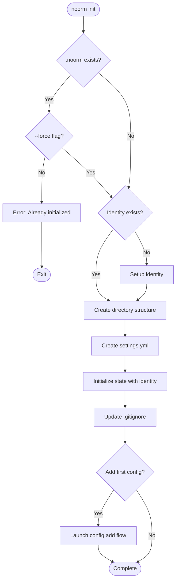
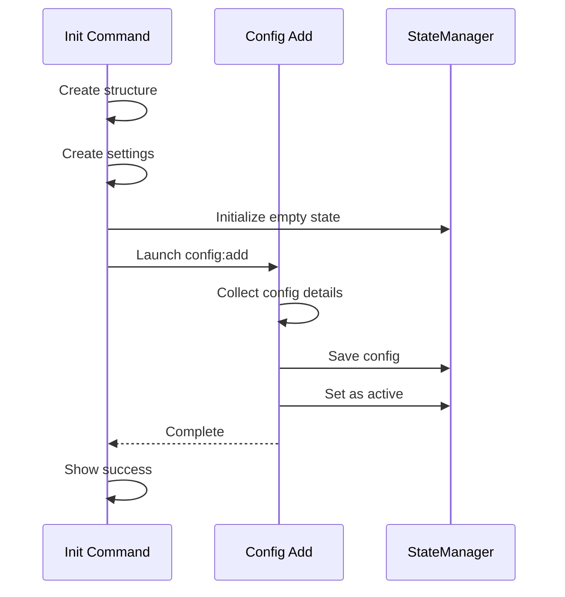

# CLI Init Command


## Overview

The `init` command bootstraps a new noorm project by creating the required directory structure, configuration files, and optionally setting up the first database config.


## What Init Creates

```
project/
├── schema/                    # SQL schema files
│   └── .gitkeep
├── changesets/                # Changeset directories
│   └── .gitkeep
└── .noorm/
    ├── settings.yml           # Project settings (committed)
    └── state.enc              # Encrypted state (gitignored)
```


## Init Flow




## Interactive Mode

In TUI mode, init walks through a guided setup.


### Step 1: Identity Setup (first time only)

If no identity exists in `~/.noorm/`, prompt for user details.

**Pre-population sources:**

| Field | Source | Editable |
|-------|--------|----------|
| Name | `git config user.name` or OS username | Yes |
| Email | `git config user.email` | Yes |
| Machine | `os.hostname()` | Yes |
| OS | `os.platform()` + `os.release()` | No (auto-detected) |

```
┌─────────────────────────────────────────────────────────────────┐
│  Welcome to noorm                                                │
├─────────────────────────────────────────────────────────────────┤
│                                                                 │
│  Let's set up your identity. This is used for:                  │
│    • Tracking who made changes (audit trail)                    │
│    • Securely sharing configs with teammates                    │
│                                                                 │
│  We've pre-filled what we could detect:                         │
│                                                                 │
│  Name:    Alice Smith             (from git config)             │
│  Email:   alice@company.com       (from git config)             │
│  Machine: alice-macbook-pro       (from hostname)               │
│  OS:      darwin 24.5.0           (auto-detected)               │
│                                                                 │
│  Edit any field above, or continue to generate your keypair.    │
│                                                                 │
├─────────────────────────────────────────────────────────────────┤
│  [Enter]continue  [Esc]cancel                                   │
└─────────────────────────────────────────────────────────────────┘
```

**Detection flow:**

```
detectIdentityDefaults():
    # Try git config first
    [gitName, err1] = await attempt(() => exec('git config user.name'))
    [gitEmail, err2] = await attempt(() => exec('git config user.email'))

    return {
        name: gitName?.trim() || os.userInfo().username,
        email: gitEmail?.trim() || '',
        machine: os.hostname(),
        os: `${os.platform()} ${os.release()}`
    }
```

On continue:
- Generate X25519 keypair (automatic, no user input)
- Write private key to `~/.noorm/identity.key` (chmod 600)
- Write public key to `~/.noorm/identity.pub`
- Compute identity hash from (email + name + machine + os)


### Step 2: Project Setup

```
┌─────────────────────────────────────────────────────────────────┐
│  Initialize noorm                                                │
├─────────────────────────────────────────────────────────────────┤
│                                                                 │
│  This will create the noorm directory structure in your         │
│  project.                                                       │
│                                                                 │
│  Schema path:     ./schema                                      │
│  Changesets path: ./changesets                                  │
│                                                                 │
│  Would you like to add a database configuration now?            │
│                                                                 │
│  ○ Yes, set up my first config                                  │
│  ○ No, I'll do it later                                         │
│                                                                 │
├─────────────────────────────────────────────────────────────────┤
│  [Enter]continue  [Esc]cancel                                   │
└─────────────────────────────────────────────────────────────────┘
```


## Headless Mode

For CI/scripts, all options via flags:

```
noorm init
    --schema-path <path>        # Default: ./schema
    --changesets-path <path>    # Default: ./changesets
    --force                     # Overwrite existing
    --no-gitignore              # Skip .gitignore update
    --name <name>               # Identity name (required if no identity)
    --email <email>             # Identity email (required if no identity)
```

In headless mode, if no identity exists and `--name`/`--email` are not provided, init will error.


## Settings Template

The generated `settings.yml`:

```yaml
# noorm project settings
# See: https://github.com/noorm/noorm#settings

build:
    include:
        - schema
    exclude: []

paths:
    schema: ./schema
    changesets: ./changesets

logging:
    enabled: true
    level: info
    file: .noorm/noorm.log

rules: []

stages: {}

strict:
    enabled: false
    stages: []
```


## State Initialization

The init command creates an encrypted state with identity:

```
Initial State
├── version: current CLI version
├── identity:
│   ├── identityHash: SHA-256(email + name + machine + os)
│   ├── name: "Alice Smith"
│   ├── email: "alice@company.com"
│   ├── publicKey: X25519 public key (hex)
│   ├── machine: "alice-macbook-pro"
│   ├── os: "darwin 24.5.0"
│   └── createdAt: ISO timestamp
├── knownUsers: {}
├── activeConfig: null
├── configs: {}
├── secrets: {}
└── globalSecrets: {}
```


## Gitignore Updates

Init appends to `.gitignore` if not already present:

```
# noorm
.noorm/state.enc
.noorm/*.log
```

Note: `~/.noorm/identity.key` is in the user's home directory, not the project, so it's not gitignored here.


## Error Cases

| Scenario | Behavior |
|----------|----------|
| Already initialized | Error unless `--force` |
| No write permission | Error with message |
| Parent dirs don't exist | Create them |
| Git not initialized | Warning only (not required) |


## Observer Events

| Event | Payload | When |
|-------|---------|------|
| `init:start` | `{ paths }` | Init beginning |
| `identity:created` | `{ identityHash, name, email, machine }` | Identity generated |
| `init:directory` | `{ path, created }` | Directory created/verified |
| `init:settings` | `{ path }` | Settings file created |
| `init:state` | `{ hasIdentity }` | State initialized |
| `init:complete` | `{ paths }` | Init finished |


## Integration with Config Add

If user chooses to add a config during init:


