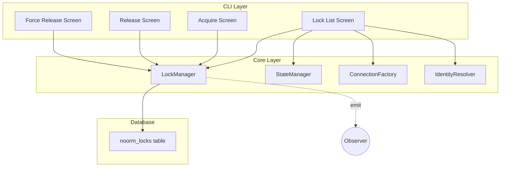
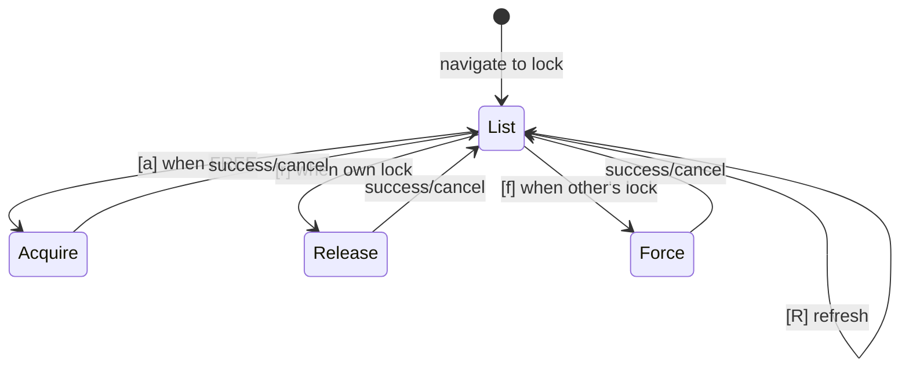

# CLI Lock Screens


## Overview

The Lock section provides database lock management for coordinating schema changes across teams. Locks prevent concurrent schema modifications that could cause conflicts or corruption.

**Operations:**

- **status** - View current lock status and holder information
- **acquire** - Acquire a lock for exclusive schema access
- **release** - Release a held lock
- **force-release** - Force release a stale or orphaned lock (dangerous)


## Architecture




## Data Model

```
LockStatus {
    lockedBy: string        // Identity of lock holder (user@hostname)
    lockedAt: Date          // When lock was acquired
    reason?: string         // Optional reason for acquiring lock
    configName: string      // Which config this lock is for
}
```

**Lock States:**

| State | Description | Available Actions |
|-------|-------------|-------------------|
| FREE | No lock held | acquire |
| LOCKED (own) | Current user holds lock | release |
| LOCKED (other) | Another user holds lock | force-release |


## Screen Flow




## Control Flow


### Lock Status Check

```
1. Load StateManager → get active config
2. Create connection to database
3. Query LockManager.getStatus()
4. Compare lock holder with current identity
5. Display status with context-appropriate actions
6. Cleanup connection
```


### Lock Acquisition

```
1. Validate: active config exists
2. Validate: no existing lock
3. Optionally collect reason from user
4. Confirm action
5. LockManager.acquire(reason?)
6. Emit 'lock:acquired' event
7. Return to list
```


### Lock Release

```
1. Validate: active config exists
2. Validate: lock exists AND is owned by current user
3. Confirm action
4. LockManager.release()
5. Emit 'lock:released' event
6. Return to list
```


### Force Release

```
1. Validate: active config exists
2. Validate: lock exists AND is NOT owned by current user
3. Show warning about consequences
4. Require protected confirmation (type config name)
5. LockManager.forceRelease()
6. Emit 'lock:force-released' event
7. Return to list
```


## Identity Resolution

Lock ownership is determined by comparing the current user's identity with the lock holder:

```
identity = "${USER}@${hostname}"

Examples:
- alice@dev-laptop
- deploy@ci-server
- root@prod-db-01
```


## Stale Lock Detection

Locks older than 24 hours are flagged as potentially stale:

```
lockAge = now - lockStatus.lockedAt
isStale = lockAge > 24 hours

Display warning if stale to encourage cleanup.
```


## Observer Events

| Event | Payload | When |
|-------|---------|------|
| `lock:acquired` | `{ config, reason? }` | Lock successfully acquired |
| `lock:released` | `{ config }` | Lock released by owner |
| `lock:force-released` | `{ config, previousHolder }` | Lock forcibly released |
| `lock:status` | `{ config, locked, holder? }` | Status check completed |


## Keyboard Shortcuts

| Context | Key | Action |
|---------|-----|--------|
| List (free) | `a` | Acquire lock |
| List (own lock) | `r` | Release lock |
| List (other's lock) | `f` | Force release |
| List | `R` | Refresh status |
| All | `Esc` | Go back / Cancel |
| Confirm dialogs | `Enter` | Confirm |


## Headless Mode

```bash
noorm lock:status [config]
noorm lock:acquire [config] [--reason "..."]
noorm lock:release [config]
noorm lock:force [config] [--yes]
```

All commands output JSON in headless mode for CI/CD integration.
