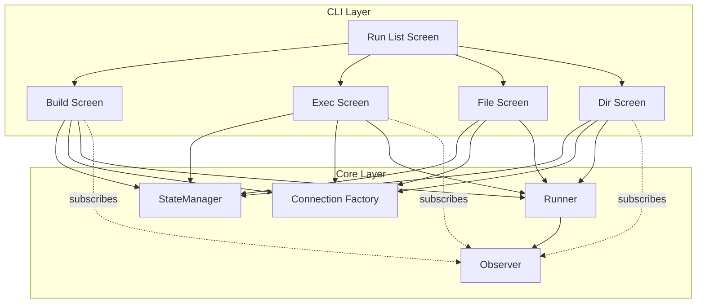
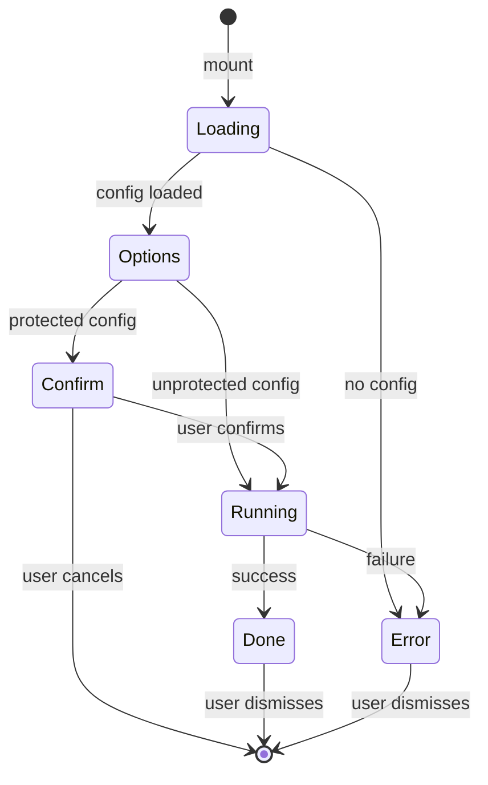
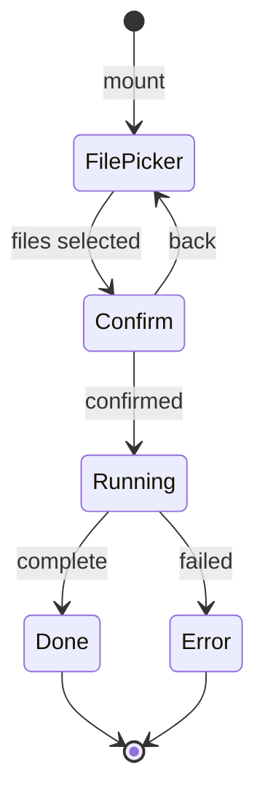

# CLI Run Screens


## Overview

Run screens execute SQL files against the database. They provide the user interface layer for the core Runner module, handling user input, confirmation flows, and progress display.


## Screen Hierarchy

```
run/
├── list      # Menu of run options
├── build     # Execute entire schema directory
├── exec      # Interactive multi-file selector
├── file      # Execute a single SQL file (headless/direct)
└── dir       # Execute all files in a directory
```


## Architecture


### Component Relationships




### Screen State Machine

All run screens follow a common state machine pattern:




## Data Flow


### Execution Flow

```
1. Load State
   └── StateManager.getActiveConfig()
        └── Returns Config or null

2. Validate Input
   └── Check file/directory exists
   └── Check file extension (.sql, .sql.eta)

3. Protection Check
   └── If config.protected && !dryRun
        └── Require ProtectedConfirm

4. Create Connection
   └── createConnection(config.connection)
        └── Returns Kysely instance

5. Execute
   └── Runner.build() | Runner.runFile() | Runner.runDir()
        └── Emits progress events
        └── Returns result

6. Cleanup
   └── connection.destroy()
```


### Observer Events

Run screens subscribe to observer events for real-time progress:

| Event | Data | Purpose |
|-------|------|---------|
| `build:start` | `{ total: number }` | Initialize progress bar |
| `file:before` | `{ filepath, checksum }` | Show current file |
| `file:after` | `{ filepath, status, durationMs }` | Update progress |
| `file:skip` | `{ filepath, reason }` | Track skipped files |
| `build:complete` | `{ results }` | Clear progress |


## Screen Specifications


### Run List

**Purpose**: Menu screen showing available run operations.

**Behavior**:
- Checks for active config on mount
- If no config: shows warning, blocks navigation
- If config exists: shows menu with keyboard shortcuts

**Navigation**:
| Key | Route |
|-----|-------|
| `b` | run/build |
| `e` | run/exec |
| `f` | run/file |
| `d` | run/dir |


### Build Schema

**Purpose**: Execute all SQL files in the schema directory.

**Options**:
- `force`: Re-run all files regardless of checksum
- `dryRun`: Validate without executing

**Result Display**:
- Summary: files run, skipped, failed, total duration
- File list with status indicators (first 10, with "and N more" truncation)


### Exec (Interactive File Selector)

**Purpose**: Select and execute multiple SQL files interactively.

**Flow**:



**FilePicker integration:**

Uses the FilePicker component (see [components.md](./components.md)) with:
- `basePath`: Schema directory from active config
- `filter`: Files ending in `.sql` or `.sql.eta`
- Multi-select enabled

**Layout:**

```
+----------------------------------------------------------+
| Run Files                                                 |
|                                                          |
| Search: views auth█                                       |
|                                                          |
| ☑ schema/views/auth/users.sql                            |
| ☐ schema/views/auth/roles.sql                            |
| ☑ schema/views/auth/permissions.sql                      |
|                                                          |
| 3 files shown (2 selected)                               |
|                                                          |
| [Tab]switch mode  [Space]toggle  [Enter]run  [Esc]cancel |
+----------------------------------------------------------+
```

**Options:**
- `force`: Re-run selected files regardless of checksum
- `dryRun`: Preview without executing

**Result Display**: Same as Build Schema


### Run File

**Purpose**: Execute a single SQL file.

**Input**: File path (text input or route param)

**Validation**:
- Path must be non-empty
- File must exist
- Extension must be `.sql` or `.sql.eta`

**Options**:
- `force`: Ignore checksum, re-run even if unchanged


### Run Directory

**Purpose**: Execute all SQL files in a directory.

**Input**: Directory path (text input or route param)

**Validation**:
- Path must be non-empty
- Path must exist
- Path must be a directory

**Options**:
- `force`: Re-run all files regardless of checksum

**Result Display**: Same as Build Schema


## Progress Integration

Run screens use a `useProgress` hook to display real-time execution progress:

```
┌─────────────────────────────────────────┐
│ Building Schema...                      │
│                                         │
│ ████████████░░░░░░░░░░░░░░░░  12/25    │
│ Running: 012_create_orders.sql          │
└─────────────────────────────────────────┘
```

The hook subscribes to observer events and provides:
- `current`: Number of files processed
- `total`: Total files to process
- `message`: Current file being processed


## Protection Flow

When a config is marked as protected and not doing a dry run:

```
┌─────────────────────────────────────────┐
│ ⚠ Protected Configuration               │
│                                         │
│ Config "production" is protected.       │
│                                         │
│ Type "production" to confirm:           │
│ > produ█                                │
│                                         │
│ [Esc] Cancel                            │
└─────────────────────────────────────────┘
```

The user must type the config name exactly to proceed.


## Environment Variables

Run screens respect environment variables for default options:

| Variable | Effect |
|----------|--------|
| `NOORM_FORCE=1` | Default force option to true |
| `NOORM_DRY_RUN=1` | Default dry-run option to true |


## Error Handling

All screens handle errors consistently:

1. **Connection errors**: Display with "Connection failed:" prefix
2. **Execution errors**: Display error message from Runner
3. **State errors**: "Failed to load state" or "No active configuration"

Error state shows:
- Error message in Alert component
- "Press Esc to go back" hint
