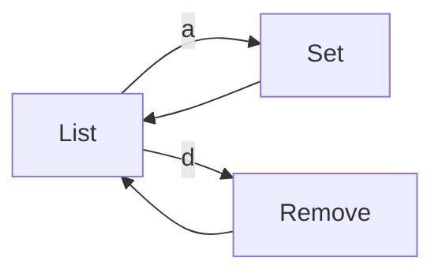

# CLI Secret Screens


## Overview

Secret screens manage encrypted key-value pairs used for SQL template interpolation. Secrets are stored per-config and are never exposed in plaintext outside of template rendering.

Secrets can be:
- **Required** - Defined by stage in `settings.yml`, must be set before config is usable
- **Optional** - User-defined, can be added/removed freely


## Screens

| Screen | Route | Purpose |
|--------|-------|---------|
| List | `secret` | View secret keys for active config |
| Set | `secret/set` | Create or update a secret |
| Remove | `secret/rm` | Delete a secret |


## Navigation Flow




## Data Model

```
Secret
    key: string           # Identifier (e.g., READONLY_PASSWORD)
    value: string         # Encrypted value (never displayed)
    configName: string    # Which config owns this secret
```

Secrets are stored in the encrypted state file, keyed by config name then secret key.


## Screen Behaviors


### List Screen

Displays secret keys (not values) for the active config, grouped by required/optional status.

```
+------------------------------------------+
| Secrets for "staging"                    |
| Stage: staging                           |
|                                          |
| Required (from stage):                   |
|   ✓ DB_PASSWORD (password)               |
|   ✗ READONLY_USER (string)     [missing] |
|   ✗ READONLY_PASSWORD (password)[missing]|
|                                          |
| Optional:                                |
|   ✓ CUSTOM_API_KEY                       |
|                                          |
| [a]dd  [d]elete  [Esc]back               |
+------------------------------------------+
```

**Display rules:**
- Required secrets show type hint and status (set/missing)
- Optional secrets show only key name
- Values are never displayed
- Missing required secrets highlighted


### Set Screen

Creates or updates a secret value.

**Flow:**

1. Prompt for key name (or use route param, or select from required list)
2. Show description if required secret (from stage definition)
3. Prompt for value with appropriate input type
4. Validate format if type is known (e.g., `api_key`, `connection_string`)
5. Confirm overwrite if key exists
6. Save to state
7. Return to list

**Input Types:**

| Type | Input Behavior |
|------|----------------|
| `string` | Plain text input |
| `password` | Masked input, no echo |
| `api_key` | Masked input, format validation |
| `connection_string` | Plain text, URI validation |

**Validation:**

- Key must be non-empty
- Key should be uppercase with underscores (convention, not enforced)
- Value must be non-empty
- Type-specific format validation for known types


### Remove Screen

Deletes a secret from the config.

**Flow:**

1. Check if secret is required (from stage definition)
2. If required: show error, cannot delete required secrets
3. If optional: show confirmation with key name
4. Remove from state
5. Return to list

**Note:** Required secrets (defined by stage) cannot be deleted, only updated. The user must modify `settings.yml` to remove a required secret definition.


## Headless Mode

```bash
# Config-scoped secrets
noorm secret set <key> <value> [--config <name>]
noorm secret rm <key> [--config <name>]
noorm secret list [--config <name>]

# Global secrets (shared across configs)
noorm secret set <key> <value> --global
noorm secret rm <key> --global
noorm secret list --global
```

In headless mode:
- `set` reads value from argument or stdin (for piping)
- `list` outputs keys only (JSON array in --json mode)
- `rm` requires --yes flag for non-interactive deletion


## Observer Events

| Event | Payload | When |
|-------|---------|------|
| `secret:set` | `{ configName, key }` | Config secret created/updated |
| `secret:deleted` | `{ configName, key }` | Config secret removed |
| `global-secret:set` | `{ key }` | Global secret created/updated |
| `global-secret:deleted` | `{ key }` | Global secret removed |


## Security Considerations

1. **Values never displayed** - List screen shows keys only
2. **Masked input** - Set screen uses password input field
3. **No logging** - Secret values are not emitted to observer
4. **Encrypted storage** - All secrets stored in encrypted state file


## Integration Points

| Module | Relationship |
|--------|--------------|
| StateManager | Stores/retrieves secrets |
| Settings | Defines required secrets per stage |
| Template Engine | Accesses secrets via `$.secrets` and `$.globalSecrets` |
| Config | Secrets are scoped to configs, completeness affects usability |
| Config Validate | Reports missing required secrets |
