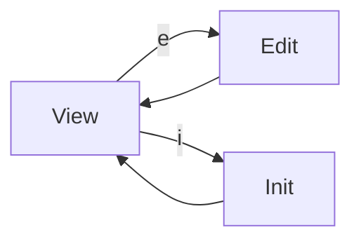

# CLI Settings Screens


## Overview

Settings screens manage project-wide build configuration stored in `.noorm/settings.yml`. Unlike encrypted configs, settings are version-controlled and shared across the team.


## Screens

| Screen | Route | Purpose |
|--------|-------|---------|
| View | `settings` | Display current settings |
| Edit | `settings/edit` | Modify settings interactively |
| Init | `settings/init` | Create default settings file |


## Navigation Flow




## Data Model

Settings are stored in `.noorm/settings.yml`:

```yaml
build:
    include: [...]        # Folders to include in builds
    exclude: [...]        # Folders to exclude

paths:
    schema: ./schema
    changesets: ./changesets

logging:
    enabled: true
    level: info
    file: .noorm/noorm.log

rules: [...]              # Stage-based include/exclude rules

stages: {}                # Predefined stage definitions

strict:
    enabled: false
    stages: []
```


## Screen Behaviors


### View Screen

Displays current settings in a readable format.

```
+------------------------------------------+
| Project Settings                         |
|                                          |
| Build:                                   |
|   Include: schema/                       |
|   Exclude: (none)                        |
|                                          |
| Paths:                                   |
|   Schema: ./schema                       |
|   Changesets: ./changesets               |
|                                          |
| Logging:                                 |
|   Level: info                            |
|   File: .noorm/noorm.log                 |
|                                          |
| Rules: 2 defined                         |
| Stages: dev, test, staging, prod         |
| Strict Mode: disabled                    |
|                                          |
| [e]dit  [i]nit  [Esc]back                |
+------------------------------------------+
```


### Edit Screen

Interactive editor for modifying settings. Presents editable sections:

1. **Build Configuration** - Add/remove include/exclude paths
2. **Paths** - Modify schema and changeset directories
3. **Logging** - Set level and output file
4. **Rules** - Add/edit/remove stage-based rules
5. **Stages** - Define predefined stages with faux credentials
6. **Strict Mode** - Enable/disable and configure required stages

Changes are validated before saving.


### Init Screen

Creates a default `settings.yml` file.

**Flow:**

1. Check if settings.yml exists
2. If exists, prompt for overwrite confirmation
3. Create default settings file
4. Show success message


## Headless Mode

```bash
noorm settings                    # Display current settings
noorm settings get <key>          # Get specific value (dot notation)
noorm settings set <key> <value>  # Set a value
noorm settings add <key> <value>  # Add to array
noorm settings rm <key> [value]   # Remove key or array item
noorm settings init [--force]     # Create default settings
```

**Examples:**

```bash
# Get nested value
noorm settings get build.include

# Set a value
noorm settings set paths.schema ./db/schema

# Add to array
noorm settings add build.exclude schema/archive

# Remove from array
noorm settings rm build.exclude schema/archive

# Initialize with force overwrite
noorm settings init --force
```


## Validation

Settings are validated on save:

| Field | Validation |
|-------|------------|
| `build.include` | Array of valid paths |
| `build.exclude` | Array of valid paths |
| `paths.schema` | Valid directory path |
| `paths.changesets` | Valid directory path |
| `logging.level` | One of: silent, error, warn, info, verbose |
| `rules[].match` | Valid match conditions |
| `stages` | Valid stage definitions |


## Observer Events

Settings-specific events are not currently emitted by the core module. The SettingsManager operates synchronously after initial load. If events are needed for CLI feedback, the following could be added:

| Event | Payload | When |
|-------|---------|------|
| `settings:loaded` | `{ path }` | Settings read from disk |
| `settings:saved` | `{ path }` | Settings written to disk |

Note: Validation errors are thrown as `SettingsValidationError` rather than emitted as events.


## Core Integration

### Dependencies

| Module | Source | Purpose |
|--------|--------|---------|
| SettingsManager | `src/core/settings/` | Read/write settings.yml |

### SettingsManager Operations

| Operation | Purpose |
|-----------|---------|
| `load()` | Load settings from disk |
| `save()` | Write settings to disk |
| `get(key)` | Get value by dot notation path |
| `set(key, value)` | Set value at path |
| `getPaths()` | Get paths configuration |
| `getBuildConfig()` | Get build include/exclude |
| `getStages()` | Get stage definitions |

See: `src/core/settings/manager.ts` for full API.

### Integration Points

| Consumer | Relationship |
|----------|--------------|
| Runner | Uses build.include/exclude for file discovery |
| Config Screens | Paths provide defaults for new configs |
| Template Engine | Stage secrets requirements |
| Init Command | Creates initial settings file |


## References

**Documentation:**
- `docs/settings.md` - Settings file structure and validation

**Core modules:**
- `src/core/settings/` - SettingsManager, schema, defaults

**CLI plans:**
- `plan/cli/userflow.md` - User journeys, screen mockups, shared components
