# CLI User Flow & Screen Mockups

**Goal:** Identify all flows, screens, and components before implementation.


## Navigation Map

```
noorm (entry)
│
├── First Run ──────────────────────────────────────────────────────┐
│   └── init ─── identity setup ─── project setup ─── config add ──┘
│
└── Normal Run
    │
    └── home ───────────────────────────────────────────────────────┐
        │                                                           │
        ├── [c] config ─┬─ list                                     │
        │               ├─ add                                      │
        │               ├─ edit                                     │
        │               ├─ rm                                       │
        │               ├─ cp                                       │
        │               ├─ use                                      │
        │               ├─ export                                   │
        │               └─ import                                   │
        │                                                           │
        ├── [h] change ─┬─ list                                     │
        │               ├─ add                                      │
        │               ├─ run                                      │
        │               ├─ revert                                   │
        │               ├─ next                                     │
        │               ├─ ff                                       │
        │               ├─ rewind                                   │
        │               └─ rm                                       │
        │                                                           │
        ├── [r] run ────┬─ list                                     │
        │               ├─ build                                    │
        │               ├─ file                                     │
        │               └─ dir                                      │
        │                                                           │
        ├── [d] db ─────┬─ list                                     │
        │               ├─ create                                   │
        │               └─ destroy                                  │
        │                                                           │
        ├── [l] lock ───┬─ status                                   │
        │               ├─ acquire                                  │
        │               ├─ release                                  │
        │               └─ force                                    │
        │                                                           │
        ├── [s] settings ─ view/edit                                │
        │                                                           │
        ├── [x] secret ─┬─ list                                     │
        │               ├─ set                                      │
        │               └─ rm                                       │
        │                                                           │
        └── [i] identity ┬─ show                                    │
                         ├─ init                                    │
                         ├─ export                                  │
                         └─ list                                    │
```


---


## User Journey Flows

Detailed interaction flows for each feature.


### Init Flow

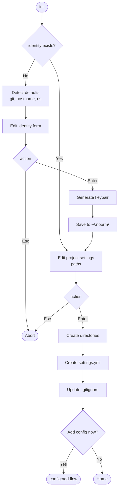


### Config Flows

**config:add**

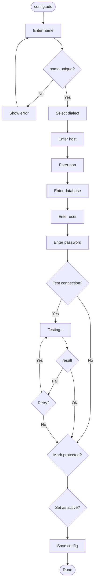

**config:edit**

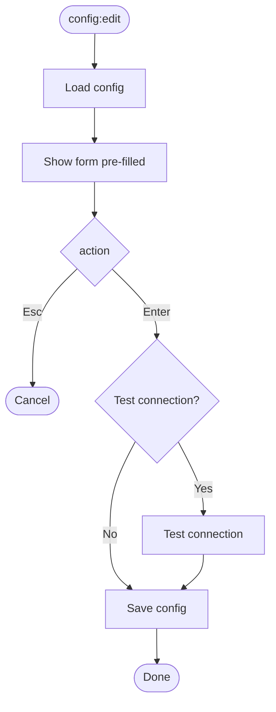

**config:rm**

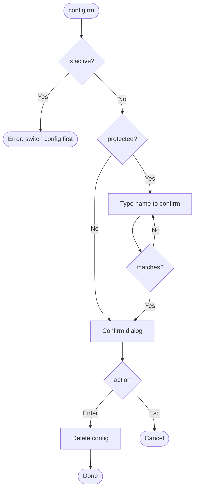

**config:export**

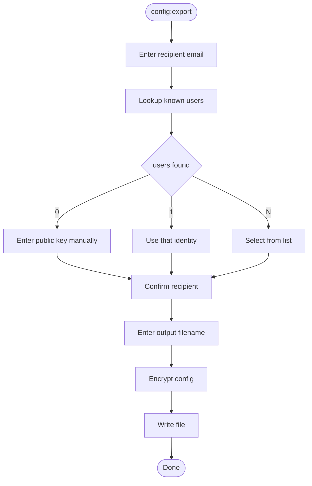

**config:import**

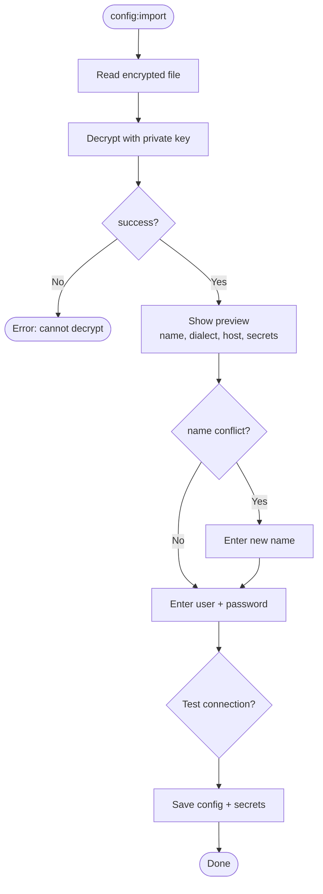


### Changeset Flows

**change:list**

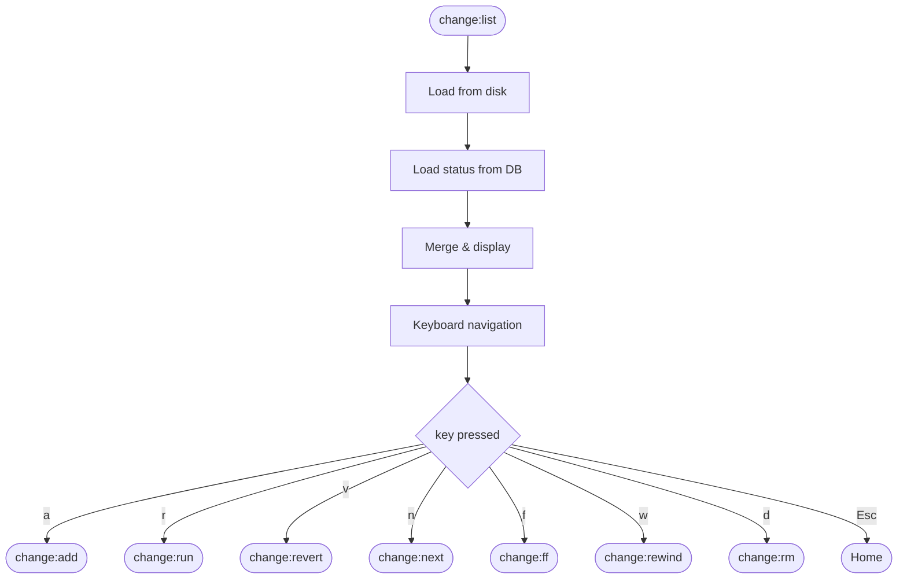

**change:add**

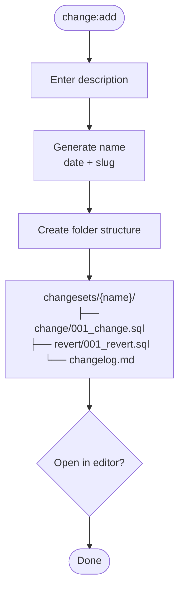

**change:run**

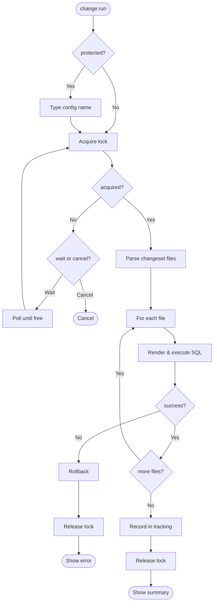

**change:revert**

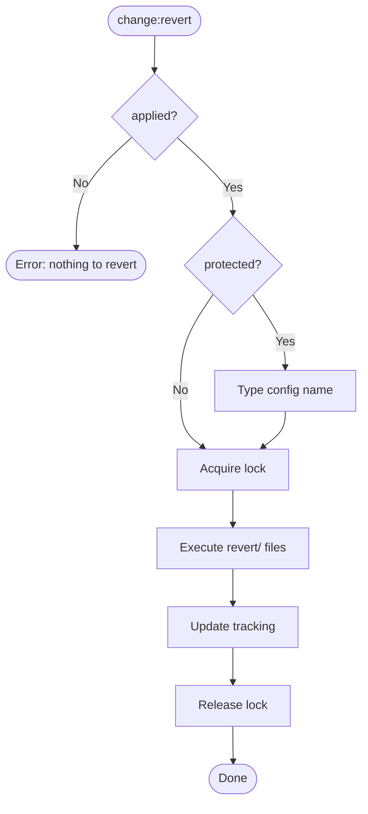

**change:next**

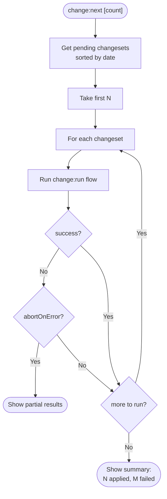

**change:ff** (fast-forward)

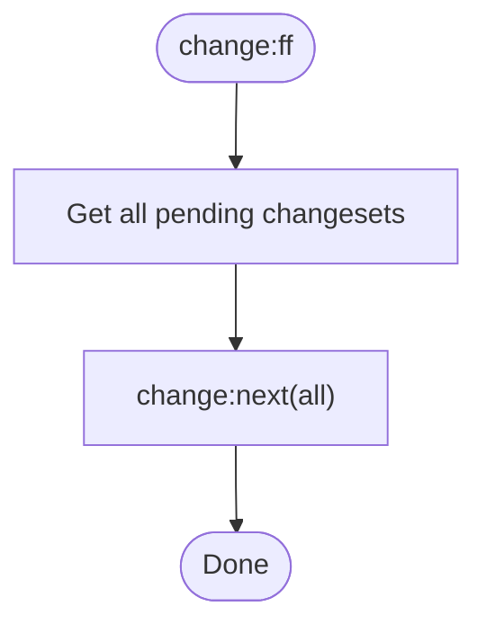

**change:rewind**

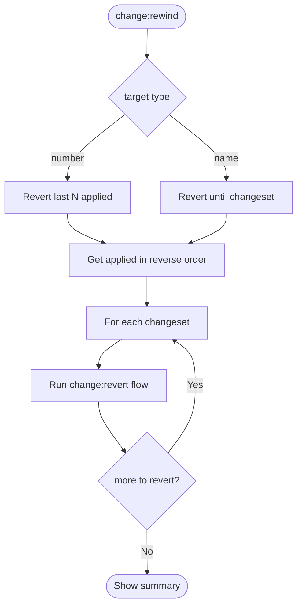

**change:rm**

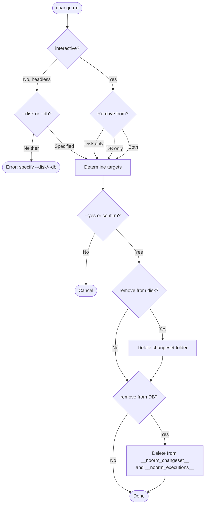

**Note:** Removing from DB while folder exists makes changeset appear "new". Removing folder while DB record exists creates an "orphaned" changeset.


### Run Flows

**run:build**

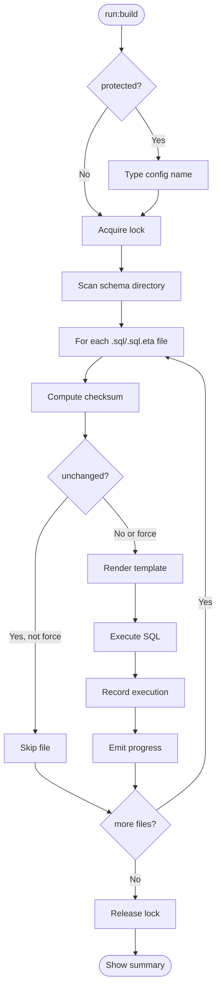

**run:file**

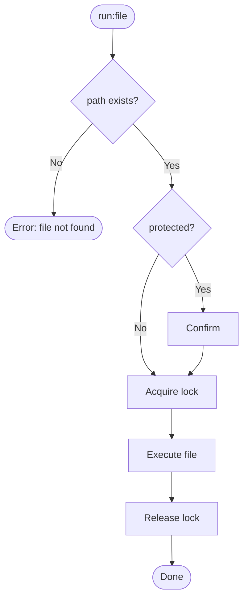

**run:dir**

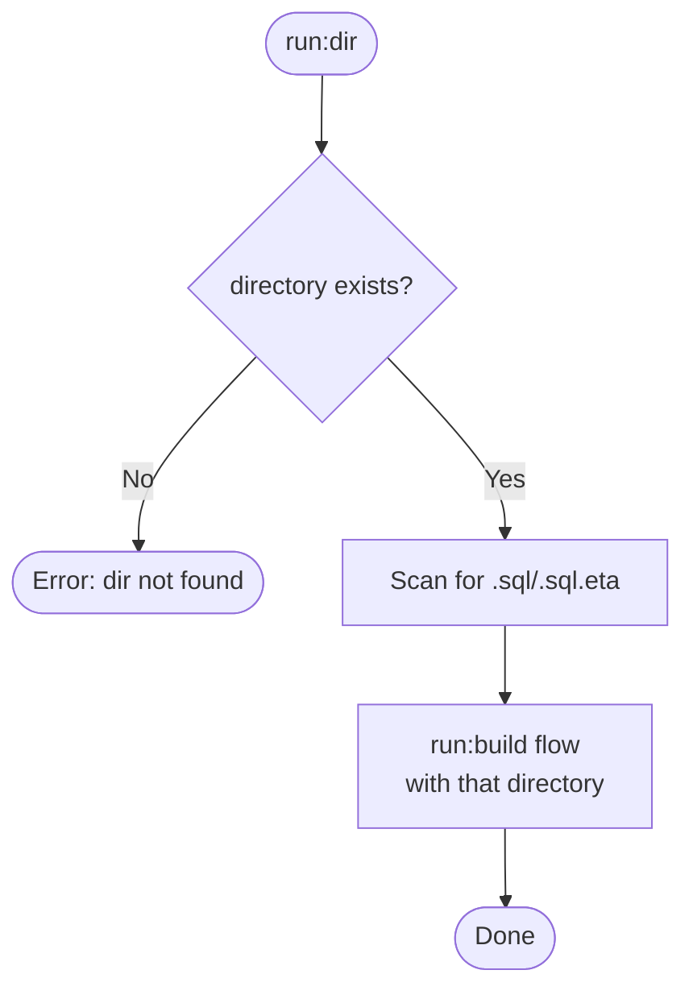


### DB Flows

**db:create**

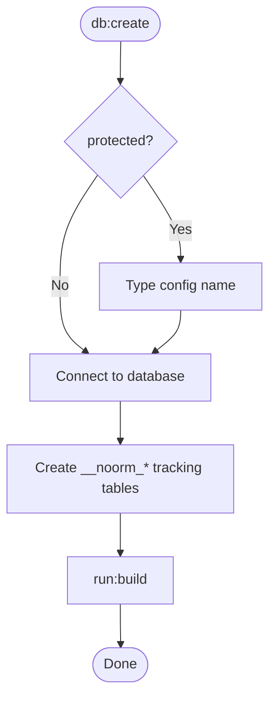

**db:destroy**

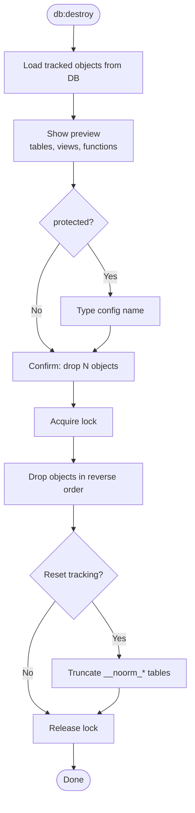


### Lock Flows

**lock:status**

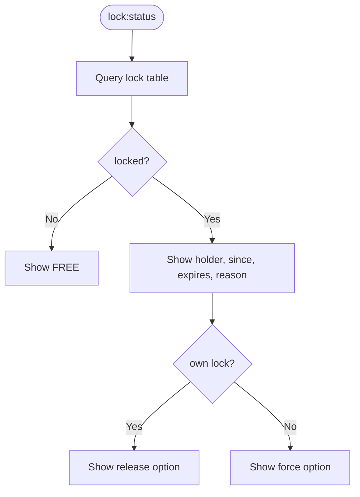

**lock:acquire**

```mermaid
flowchart TD
    Start([lock:acquire]) --> Reason[Enter reason<br/>optional]
    Reason --> Attempt[Attempt acquire]
    Attempt --> Result{success?}
    Result -->|Yes| Done([Show expiry])
    Result -->|No| ShowHolder[Show holder info]
    ShowHolder --> Wait{wait?}
    Wait -->|Yes| Poll[Poll until free] --> Attempt
    Wait -->|No| Cancel([Cancel])
```

**lock:release**

```mermaid
flowchart TD
    Start([lock:release]) --> Holding{holding lock?}
    Holding -->|No| Error([Error: no lock to release])
    Holding -->|Yes| Release[Release lock]
    Release --> Done([Done])
```

**lock:force**

```mermaid
flowchart TD
    Start([lock:force]) --> Own{own lock?}
    Own -->|Yes| NormalRelease([Just release normally])
    Own -->|No| Warning[Show warning:<br/>will release holder's lock]
    Warning --> TypeConfirm[Type config name]
    TypeConfirm --> Force[Force release]
    Force --> Done([Done])
```


### Secret Flows

**secret:list**

```mermaid
flowchart TD
    Start([secret:list]) --> Load[Load secrets for active config]
    Load --> Display[Display keys only<br/>values hidden]
    Display --> Keys{key pressed}
    Keys -->|s| Set([secret:set])
    Keys -->|d| Rm([secret:rm])
    Keys -->|g| Toggle[Toggle global view] --> Display
    Keys -->|Esc| Back([Back])
```

**secret:set**

```mermaid
flowchart TD
    Start([secret:set]) --> Key[Enter key name]
    Key --> Value[Enter value<br/>masked input]
    Value --> Scope{global?}
    Scope -->|Yes| SaveGlobal[Save to globalSecrets]
    Scope -->|No| SaveConfig[Save to config secrets]
    SaveGlobal --> Done([Done])
    SaveConfig --> Done
```

**secret:rm**

```mermaid
flowchart TD
    Start([secret:rm]) --> Required{required by stage?}
    Required -->|Yes| Error([Error: cannot delete required])
    Required -->|No| Confirm[Confirm deletion]
    Confirm --> Delete[Delete secret]
    Delete --> Done([Done])
```


### Settings Flow

**settings:view**

```mermaid
flowchart TD
    Start([settings]) --> Load[Load settings.yml]
    Load --> Display[Display as tree/form]
    Display --> Keys{key pressed}
    Keys -->|e| Edit([settings:edit])
    Keys -->|Esc| Back([Back])
```

**settings:edit**

```mermaid
flowchart TD
    Start([settings:edit]) --> Nav[Navigate tree]
    Nav --> Select[Select value]
    Select --> Edit[Edit inline]
    Edit --> Action{action}
    Action -->|Esc| Cancel([Cancel])
    Action -->|Enter| Validate{valid?}
    Validate -->|No| Error[Show error] --> Edit
    Validate -->|Yes| Write[Write file]
    Write --> Done([Done])
```


### Identity Flows

**identity:show**

```mermaid
flowchart TD
    Start([identity]) --> Load[Load from state]
    Load --> Display[Display identity details]
    Display --> Keys{key pressed}
    Keys -->|i| Init([identity:init])
    Keys -->|x| Export([identity:export])
    Keys -->|l| List([identity:list])
    Keys -->|Esc| Back([Back])
```

**identity:init**

```mermaid
flowchart TD
    Start([identity:init]) --> Existing{existing identity?}
    Existing -->|Yes| Warning[Show warning:<br/>will lose access to shared configs]
    Existing -->|No| Detect
    Warning --> Detect
    Detect[Detect defaults] --> Form[Show form]
    Form --> Edit[Edit fields]
    Edit --> Action{action}
    Action -->|Esc| Cancel([Cancel])
    Action -->|Enter| Generate[Generate new keypair]
    Generate --> Save[Save to ~/.noorm/]
    Save --> Done([Done])
```

**identity:export**

```mermaid
flowchart TD
    Start([identity:export]) --> Display[Display public key]
    Display --> Keys{key pressed}
    Keys -->|c| Copy[Copy to clipboard]
    Keys -->|Esc| Back([Back])
    Copy --> Display
```

**identity:list**

```mermaid
flowchart TD
    Start([identity:list]) --> Load[Load known users from state]
    Load --> Display[Display grouped by email]
    Display --> Keys{key pressed}
    Keys -->|Esc| Back([Back])
```


---


## First Run Flow


### Step 1: Identity Setup

First-time users see identity setup before anything else.

```
┌─────────────────────────────────────────────────────────────────┐
│  Welcome to noorm                                                │
├─────────────────────────────────────────────────────────────────┤
│                                                                 │
│  Let's set up your identity. This is used for:                  │
│    • Tracking who made changes (audit trail)                    │
│    • Securely sharing configs with teammates                    │
│                                                                 │
│  We've pre-filled what we could detect:                         │
│                                                                 │
│  Name:    Alice Smith             (from git config)             │
│  Email:   alice@company.com       (from git config)             │
│  Machine: alice-macbook-pro       (from hostname)               │
│  OS:      darwin 24.5.0           (auto-detected)               │
│                                                                 │
│  Edit any field above, or continue to generate your keypair.    │
│                                                                 │
├─────────────────────────────────────────────────────────────────┤
│  [Enter] continue  [Esc] cancel                                 │
└─────────────────────────────────────────────────────────────────┘
```


### Step 2: Project Setup

After identity, initialize the project structure.

```
┌─────────────────────────────────────────────────────────────────┐
│  Initialize noorm                                                │
├─────────────────────────────────────────────────────────────────┤
│                                                                 │
│  This will create the noorm directory structure in your         │
│  project.                                                       │
│                                                                 │
│  Schema path:     ./schema                                      │
│  Changesets path: ./changesets                                  │
│                                                                 │
│  Would you like to add a database configuration now?            │
│                                                                 │
│  ● Yes, set up my first config                                  │
│  ○ No, I'll do it later                                         │
│                                                                 │
├─────────────────────────────────────────────────────────────────┤
│  [Enter] continue  [Esc] cancel                                 │
└─────────────────────────────────────────────────────────────────┘
```


---


## Home Screen

The main dashboard after initialization.

```
┌─────────────────────────────────────────────────────────────────┐
│  noorm - Database Schema & Changeset Manager                    │
├─────────────────────────────────────────────────────────────────┤
│                                                                 │
│  Welcome to noorm                                               │
│                                                                 │
│  Active Config: dev          Configs: 3                         │
│                                                                 │
│  ┌─────────────────────────┐  ┌─────────────────────────────┐   │
│  │ Status                  │  │ Quick Actions               │   │
│  │                         │  │                             │   │
│  │ Connection: ● OK        │  │ [1] Run Build               │   │
│  │ Pending:    2 changes   │  │ [2] Apply Changes           │   │
│  │ Lock:       FREE        │  │ [3] View Status             │   │
│  └─────────────────────────┘  └─────────────────────────────┘   │
│                                                                 │
│  ┌──────────────────────────────────────────────────────────┐   │
│  │ Recent Activity                                          │   │
│  │                                                          │   │
│  │ ✓ Applied 2025-01-20-add-roles         2h ago            │   │
│  │ ✓ Applied 2025-01-15-add-email         1d ago            │   │
│  │ ✗ Reverted 2025-01-10-test             3d ago            │   │
│  └──────────────────────────────────────────────────────────┘   │
│                                                                 │
├─────────────────────────────────────────────────────────────────┤
│  [c]onfig  [h]ange  [r]un  [d]b  [l]ock  [?]help  [q]uit        │
└─────────────────────────────────────────────────────────────────┘
```


---


## Config Screens


### Config List

```
┌─────────────────────────────────────────────────────────────────┐
│  Configurations                                                  │
├─────────────────────────────────────────────────────────────────┤
│                                                                 │
│  ● dev        localhost:5432/myapp_dev      (active)            │
│  ○ staging    db.example.com:5432/staging   protected           │
│  ○ prod       db.example.com:5432/prod      protected           │
│                                                                 │
├─────────────────────────────────────────────────────────────────┤
│  [a]dd [e]dit [d]elete [c]opy [u]se [x]port [i]mport [Esc]back  │
└─────────────────────────────────────────────────────────────────┘
```


### Config Export

```
┌─────────────────────────────────────────────────────────────────┐
│  Export Config                                                   │
├─────────────────────────────────────────────────────────────────┤
│                                                                 │
│  Config: staging                                                │
│                                                                 │
│  Recipient email: alice@company.com                             │
│                                                                 │
│  Found 2 machines for alice@company.com:                        │
│    ○ alice-macbook (darwin 24.5.0)                              │
│    ● alice-desktop (linux 6.1.0)                                │
│                                                                 │
│  Output: staging.noorm.enc                                      │
│                                                                 │
├─────────────────────────────────────────────────────────────────┤
│  [Enter] export  [Esc] cancel                                   │
└─────────────────────────────────────────────────────────────────┘
```


### Config Import

```
┌─────────────────────────────────────────────────────────────────┐
│  Import Config                                                   │
├─────────────────────────────────────────────────────────────────┤
│                                                                 │
│  File: staging.noorm.enc                                        │
│  From: bob@company.com (bob-workstation)                        │
│                                                                 │
│  Config Preview:                                                │
│    Name:     staging                                            │
│    Dialect:  postgres                                           │
│    Host:     db.example.com:5432                                │
│    Database: myapp_staging                                      │
│    Secrets:  3 included                                         │
│                                                                 │
│  Enter your database credentials:                               │
│    User:     █                                                  │
│    Password: ********                                           │
│                                                                 │
├─────────────────────────────────────────────────────────────────┤
│  [Enter] import  [Esc] cancel                                   │
└─────────────────────────────────────────────────────────────────┘
```


---


## Changeset Screens


### Changeset List

```
┌─────────────────────────────────────────────────────────────────┐
│  Changesets                                                      │
├─────────────────────────────────────────────────────────────────┤
│                                                                 │
│  Total: 12  Applied: 8  Pending: 4                              │
│                                                                 │
│  ✓ 2025-01-10-initial-schema             today                  │
│  ✓ 2025-01-12-add-users                  2d ago                 │
│  ✓ 2025-01-13-add-posts                  3d ago                 │
│  ○ 2025-01-15-add-roles                  pending                │
│  ○ 2025-01-16-add-permissions            pending                │
│                                                                 │
├─────────────────────────────────────────────────────────────────┤
│  [a]dd [r]un [v]ert [n]ext [f]f [w]ind [Esc]back                │
└─────────────────────────────────────────────────────────────────┘
```

**Legend:**
- `✓` = Applied (can revert)
- `○` = Pending (can run)
- `✗` = Failed (needs attention)


### Changeset Execution (Run/Revert/Next/FF)

```
┌─────────────────────────────────────────────────────────────────┐
│  Applying Changeset                                              │
├─────────────────────────────────────────────────────────────────┤
│                                                                 │
│  2025-01-15-add-roles                                           │
│                                                                 │
│  ████████████████░░░░░░░░░░░░░░░░  3/6 files                    │
│                                                                 │
│  Running: 003_create_role_permissions.sql                       │
│                                                                 │
│  ✓ 001_create_roles_table.sql           42ms                    │
│  ✓ 002_add_role_columns.sql             18ms                    │
│  ◐ 003_create_role_permissions.sql      ...                     │
│  ○ 004_seed_default_roles.sql                                   │
│                                                                 │
├─────────────────────────────────────────────────────────────────┤
│  [Esc] cancel (will rollback)                                   │
└─────────────────────────────────────────────────────────────────┘
```


---


## Run Screens


### Run Menu

```
┌─────────────────────────────────────────────────────────────────┐
│  Run Operations                                                  │
├─────────────────────────────────────────────────────────────────┤
│                                                                 │
│  Config: dev                                                    │
│  Schema: ./schema (25 files)                                    │
│                                                                 │
│  [b] Build Schema    - Execute all SQL in schema directory      │
│  [f] Run File        - Execute a single SQL file                │
│  [d] Run Directory   - Execute all SQL in a directory           │
│                                                                 │
├─────────────────────────────────────────────────────────────────┤
│  [Esc] back                                                     │
└─────────────────────────────────────────────────────────────────┘
```


### Build Progress

```
┌─────────────────────────────────────────────────────────────────┐
│  Building Schema                                                 │
├─────────────────────────────────────────────────────────────────┤
│                                                                 │
│  ████████████░░░░░░░░░░░░░░░░░░░░  12/25 files                  │
│                                                                 │
│  Running: 012_create_orders.sql                                 │
│                                                                 │
│  Elapsed: 4.2s                                                  │
│                                                                 │
├─────────────────────────────────────────────────────────────────┤
│  [Esc] cancel                                                   │
└─────────────────────────────────────────────────────────────────┘
```


### Build Complete

```
┌─────────────────────────────────────────────────────────────────┐
│  Build Complete                                                  │
├─────────────────────────────────────────────────────────────────┤
│                                                                 │
│  ✓ SUCCESS                                                      │
│                                                                 │
│  Files run:     23                                              │
│  Files skipped: 2 (unchanged)                                   │
│  Files failed:  0                                               │
│  Duration:      8.4s                                            │
│                                                                 │
├─────────────────────────────────────────────────────────────────┤
│  [Enter] done  [v] view details                                 │
└─────────────────────────────────────────────────────────────────┘
```


---


## DB Screens


### DB Menu

```
┌─────────────────────────────────────────────────────────────────┐
│  Database Operations                                             │
├─────────────────────────────────────────────────────────────────┤
│                                                                 │
│  Config: dev                                                    │
│  Connection: ● OK                                               │
│  Tracked Objects: 15                                            │
│                                                                 │
│  [c] Create Schema  - Build database from scratch               │
│  [d] Destroy Schema - Drop all managed objects                  │
│                                                                 │
│  ⚠ These operations modify the database schema directly.        │
│                                                                 │
├─────────────────────────────────────────────────────────────────┤
│  [Esc] back                                                     │
└─────────────────────────────────────────────────────────────────┘
```


---


## Lock Screens


### Lock Status

```
┌─────────────────────────────────────────────────────────────────┐
│  Lock Status                                                     │
├─────────────────────────────────────────────────────────────────┤
│                                                                 │
│  Config: dev                                                    │
│                                                                 │
│  Status: 🔒 LOCKED                                              │
│                                                                 │
│  Holder:    bob@company.com (bob-workstation)                   │
│  Since:     2025-01-20 14:30:00 (2h ago)                        │
│  Reason:    Running migrations                                  │
│  Expires:   2025-01-20 15:30:00 (in 58m)                        │
│                                                                 │
├─────────────────────────────────────────────────────────────────┤
│  [f] force release  [R] refresh  [Esc] back                     │
└─────────────────────────────────────────────────────────────────┘
```


### Lock Free

```
┌─────────────────────────────────────────────────────────────────┐
│  Lock Status                                                     │
├─────────────────────────────────────────────────────────────────┤
│                                                                 │
│  Config: dev                                                    │
│                                                                 │
│  Status: 🔓 FREE                                                │
│                                                                 │
│  No active lock on this configuration.                          │
│                                                                 │
├─────────────────────────────────────────────────────────────────┤
│  [a] acquire lock  [R] refresh  [Esc] back                      │
└─────────────────────────────────────────────────────────────────┘
```


---


## Identity Screens


### Identity Show

```
┌─────────────────────────────────────────────────────────────────┐
│  Your Identity                                                   │
├─────────────────────────────────────────────────────────────────┤
│                                                                 │
│  Name:     Alice Smith                                          │
│  Email:    alice@company.com                                    │
│  Machine:  alice-macbook-pro                                    │
│  OS:       darwin 24.5.0                                        │
│                                                                 │
│  Identity Hash: a1b2c3d4...                                     │
│  Public Key:    3f8a9b2c...                                     │
│  Created:       2025-01-15T10:30:00Z                            │
│                                                                 │
│  Known Users: 5                                                 │
│                                                                 │
├─────────────────────────────────────────────────────────────────┤
│  [i]nit  [x]export  [l]ist  [Esc] back                          │
└─────────────────────────────────────────────────────────────────┘
```


### Identity Regenerate Warning

```
┌─────────────────────────────────────────────────────────────────┐
│  Regenerate Identity                                             │
├─────────────────────────────────────────────────────────────────┤
│                                                                 │
│  ⚠ WARNING: This will generate a new keypair.                   │
│                                                                 │
│  • Configs shared with you using your old key will be           │
│    unreadable                                                   │
│  • Team members will need your new public key to share          │
│    configs with you                                             │
│                                                                 │
│  Current identity will be replaced:                             │
│    alice@company.com (alice-macbook-pro)                        │
│                                                                 │
│  Pre-filled from system:                                        │
│    Name:    Alice Smith             (from git config)           │
│    Email:   alice@company.com       (from git config)           │
│    Machine: alice-macbook-pro       (from hostname)             │
│    OS:      darwin 24.5.0           (auto-detected)             │
│                                                                 │
├─────────────────────────────────────────────────────────────────┤
│  [Enter] regenerate  [Esc] cancel                               │
└─────────────────────────────────────────────────────────────────┘
```


### Known Users List

```
┌─────────────────────────────────────────────────────────────────┐
│  Known Users (5)                                                 │
├─────────────────────────────────────────────────────────────────┤
│                                                                 │
│  bob@company.com                                                │
│    ├─ bob-workstation (linux 6.1.0)         Last seen: 2h ago  │
│    └─ bob-laptop (darwin 23.0.0)            Last seen: 5d ago  │
│                                                                 │
│  carol@company.com                                              │
│    └─ carol-desktop (windows 10.0)          Last seen: 1d ago  │
│                                                                 │
│  dave@company.com                                               │
│    └─ dave-macbook (darwin 24.5.0)          Last seen: 3d ago  │
│                                                                 │
├─────────────────────────────────────────────────────────────────┤
│  [Esc] back                                                     │
└─────────────────────────────────────────────────────────────────┘
```


---


## Common Patterns


### Protected Configuration Warning

Shown before destructive operations on protected configs.

```
┌─────────────────────────────────────────────────────────────────┐
│  ⚠ Protected Configuration                                      │
├─────────────────────────────────────────────────────────────────┤
│                                                                 │
│  Config "production" is protected.                              │
│                                                                 │
│  Type "production" to confirm:                                  │
│  > produ█                                                       │
│                                                                 │
├─────────────────────────────────────────────────────────────────┤
│  [Esc] cancel                                                   │
└─────────────────────────────────────────────────────────────────┘
```


### Error State

```
┌─────────────────────────────────────────────────────────────────┐
│  Error                                                           │
├─────────────────────────────────────────────────────────────────┤
│                                                                 │
│  ✗ Connection failed                                            │
│                                                                 │
│  Could not connect to database:                                 │
│  ECONNREFUSED 127.0.0.1:5432                                    │
│                                                                 │
│  Check that PostgreSQL is running and the connection            │
│  details in your config are correct.                            │
│                                                                 │
├─────────────────────────────────────────────────────────────────┤
│  [r] retry  [Esc] back                                          │
└─────────────────────────────────────────────────────────────────┘
```


### Status Bar (always visible at bottom)

```
┌─────────────────────────────────────────────────────────────────┐
│  noorm                              dev │ ● connected │ 🔓 free │
└─────────────────────────────────────────────────────────────────┘
     │                                 │         │           │
     app name                    config name  connection   lock status
```


---


## Screen Dimensions

All screens are designed for minimum terminal size:
- **Width**: 65 characters minimum
- **Height**: 20 lines minimum

Content area (inside borders): 63 characters wide.


## Keyboard Conventions

| Key | Meaning |
|-----|---------|
| `Enter` | Confirm / Submit / Primary action |
| `Esc` | Cancel / Go back |
| `Tab` | Next field (in forms) |
| `↑/↓` | Navigate list items |
| `?` | Show help |
| `q` | Quit (from home only) |
| Letters | Shortcut keys shown in brackets |


## Color Conventions

| Element | Color |
|---------|-------|
| Success / OK | Green |
| Warning | Yellow |
| Error | Red |
| Pending | Dim/Gray |
| Active selection | Cyan/highlight |
| Protected | Yellow badge |


---


## Components Inventory

All UI components identified from the flows and screen mockups.


### Layout Components

| Component | Purpose | Used In |
|-----------|---------|---------|
| `Screen` | Wrapper with header, content area, footer | All screens |
| `Header` | Screen title with optional breadcrumb | All screens |
| `Footer` | Keyboard shortcuts bar | All screens |
| `StatusBar` | Persistent bar: config, connection, lock | All screens |
| `Panel` | Bordered content section | Home dashboard |
| `Split` | Side-by-side panels | Home (status + quick actions) |


### Navigation Components

| Component | Purpose | Used In |
|-----------|---------|---------|
| `Router` | Screen routing based on path | App root |
| `FocusStack` | Modal/overlay focus management | Dialogs, confirmations |
| `Breadcrumb` | Navigation path display | Nested screens |


### Form Components

| Component | Purpose | Used In |
|-----------|---------|---------|
| `TextInput` | Single-line text entry | Config add/edit, identity, secret |
| `PasswordInput` | Masked text entry (no echo) | Credentials, secrets |
| `SelectInput` | Radio-style single selection | Dialect picker, Yes/No prompts |
| `Form` | Form container with Tab navigation | Config, identity, settings |
| `FormField` | Label + input wrapper | All forms |


### List Components

| Component | Purpose | Used In |
|-----------|---------|---------|
| `List` | Navigable list with keyboard | Config list, changeset list |
| `ListItem` | Single list entry | All lists |
| `SelectableList` | List with selection state | Config use, changeset run |
| `TreeView` | Hierarchical display | Settings, known users |
| `GroupedList` | Items grouped by category | Known users (by email), secrets |


### Feedback Components

| Component | Purpose | Used In |
|-----------|---------|---------|
| `ProgressBar` | Visual progress indicator | Build, changeset execution |
| `Spinner` | Loading/working indicator | Connection test, file execution |
| `Badge` | Status label (protected, active) | Config list |
| `Alert` | Warning/error/info message | Error states, warnings |
| `Toast` | Temporary notification | After operations |


### Dialog Components

| Component | Purpose | Used In |
|-----------|---------|---------|
| `ConfirmDialog` | Yes/No confirmation | Delete, destructive actions |
| `ProtectedConfirm` | Type name to confirm | Protected config operations |
| `ErrorDialog` | Error display with retry option | Connection failures |
| `InputDialog` | Single input prompt | Lock reason, export filename |


### Status Indicators

| Component | Purpose | Used In |
|-----------|---------|---------|
| `ConnectionIndicator` | ●/○ connection status | Status bar, home |
| `LockIndicator` | 🔒/🔓 lock status | Status bar, lock screens |
| `ChangesetIndicator` | ✓/○/✗ changeset status | Changeset list |
| `FileStatus` | ✓/◐/○/✗ file execution | Build progress |


### Shared Patterns

Reusable patterns across multiple screens.


**Protected Confirmation**

Used in: config:rm, change:run, change:revert, run:build, run:file, run:dir, db:create, db:destroy, lock:force

```mermaid
flowchart LR
    Check{protected?} -->|No| Continue
    Check -->|Yes| Type[Type config name]
    Type --> Match{matches?}
    Match -->|No| Type
    Match -->|Yes| Continue
```

Component: `ProtectedConfirm` - Text input that validates against config name.


**Lock Acquisition**

Used in: change:run, change:revert, run:build, run:file, run:dir, db:destroy

```mermaid
flowchart LR
    Acquire[Acquire lock] --> Result{acquired?}
    Result -->|Yes| Continue
    Result -->|No| Blocked[Show holder info]
    Blocked --> Choice{wait?}
    Choice -->|Yes| Poll[Poll until free] --> Acquire
    Choice -->|No| Cancel
```

Hook: `useLockGuard` - Handles acquisition, polling, and holder display.


**Connection Test**

Used in: config:add, config:edit, config:import

```mermaid
flowchart LR
    Prompt{Test connection?} -->|No| Continue
    Prompt -->|Yes| Test[Testing...]
    Test --> Result{success?}
    Result -->|Yes| Continue
    Result -->|No| Retry{retry?}
    Retry -->|Yes| Test
    Retry -->|No| Continue
```

Component: `ConnectionTest` - Test button with spinner and result display.


**Keyboard Navigation List**

Used in: config:list, change:list, secret:list, identity:list, settings:view

```mermaid
flowchart LR
    List[Display items] --> Nav[↑/↓ navigate]
    Nav --> Select[Highlight item]
    Select --> Keys{action key}
    Keys --> Action[Dispatch to screen]
```

Hook: `useListNavigation` - Manages selection state, key bindings, and action dispatch.


### Shared Execution Components

The runner and changeset modules share file execution UI.

| Component | Purpose | Used In |
|-----------|---------|---------|
| `ExecutionProgress` | File-by-file execution display | run:build, run:file, run:dir, change:run, change:revert |
| `ExecutionSummary` | Results after operation | Build complete, changeset done |

**ExecutionProgress** composes:
- `ProgressBar` - overall progress (N/M files)
- `FileStatus` list - per-file status with duration
- Current file indicator (spinner)
- Cancel handler (Esc → rollback for changesets)

**Event subscriptions:** `file:before`, `file:after` from runner module.


### Specialized Components

| Component | Purpose | Used In |
|-----------|---------|---------|
| `KeyValueDisplay` | Key-value pairs display | Identity, config details |
| `ActivityLog` | Recent activity list | Home screen |
| `QuickActions` | Numbered action buttons | Home screen |
| `ConfigSummary` | Config preview (host, dialect) | Config list items |
| `IdentityCard` | Identity details display | Identity show |
| `UserEntry` | Known user with machines | Identity list |
| `SecretList` | Keys with hidden values | Secret list |


### Component Hierarchy

```
App
├── StatusBar
├── Router
│   ├── HomeScreen
│   │   ├── Header
│   │   ├── Split
│   │   │   ├── Panel (Status)
│   │   │   │   ├── ConnectionIndicator
│   │   │   │   ├── LockIndicator
│   │   │   │   └── KeyValueDisplay
│   │   │   └── Panel (Quick Actions)
│   │   │       └── QuickActions
│   │   ├── Panel (Activity)
│   │   │   └── ActivityLog
│   │   └── Footer
│   │
│   ├── ConfigScreens
│   │   ├── ConfigList
│   │   │   └── SelectableList → ConfigSummary
│   │   ├── ConfigAdd/Edit
│   │   │   └── Form → FormField → TextInput/PasswordInput/SelectInput
│   │   └── ConfigExport/Import
│   │       └── Form + SelectableList
│   │
│   ├── ChangesetScreens
│   │   ├── ChangesetList
│   │   │   └── List → ChangesetIndicator
│   │   └── ChangesetExecution
│   │       └── ExecutionProgress + ExecutionSummary
│   │
│   ├── RunScreens
│   │   └── BuildProgress
│   │       └── ExecutionProgress + ExecutionSummary
│   │
│   ├── DBScreens
│   │   └── DestroyConfirm
│   │       └── List + ProtectedConfirm
│   │
│   ├── LockScreens
│   │   └── LockStatus
│   │       └── KeyValueDisplay + LockIndicator
│   │
│   ├── SettingsScreens
│   │   └── SettingsEdit
│   │       └── TreeView + Form
│   │
│   ├── SecretScreens
│   │   └── SecretList
│   │       └── GroupedList + SecretList
│   │
│   └── IdentityScreens
│       ├── IdentityShow
│       │   └── IdentityCard
│       └── IdentityList
│           └── GroupedList → UserEntry
│
└── FocusStack
    ├── ConfirmDialog
    ├── ProtectedConfirm
    ├── ErrorDialog
    └── InputDialog
```


### Shared Hooks

| Hook | Purpose | Used In |
|------|---------|---------|
| `useKeyboard` | Keyboard shortcut handling | All screens |
| `useFocus` | Focus management | Forms, lists |
| `useObserver` | Subscribe to core events | Progress, status updates |
| `useConfig` | Active config access | Most screens |
| `useConnection` | Connection state | Status bar, operations |
| `useLock` | Lock state | Operations, status |
| `useForm` | Form state management | All forms |
| `useList` | List navigation state | All lists |


### Event Subscriptions

| Component | Events | Purpose |
|-----------|--------|---------|
| StatusBar | `connection:*`, `lock:*` | Real-time status |
| ExecutionProgress | `file:before`, `file:after` | File-by-file progress |
| ExecutionSummary | `build:complete`, `changeset:complete` | Operation results |
| ActivityLog | `changeset:applied`, `changeset:reverted` | Recent activity |
| ConnectionIndicator | `connection:open`, `connection:close` | Connection state |
| LockIndicator | `lock:acquired`, `lock:released` | Lock state |


---


## CLI Utility Patterns

Shared utilities beyond core modules, specific to CLI layer.


### Data Formatting Utilities

| Utility | Purpose | Examples |
|---------|---------|----------|
| `formatDuration` | Execution time display | "42ms", "1.2s", "2m 15s" |
| `formatBytes` | File/data sizes | "1.2 KB", "3.5 MB" |
| `truncateHash` | Shorten hashes/keys | "a1b2c3d4..." (first 8 + ellipsis) |
| `truncatePath` | Shorten long paths | "...schema/views/auth.sql" |
| `truncateText` | Fit text to width | "Long description th..." |

**Time thresholds:**

| Age | Display |
|-----|---------|
| < 1 minute | "just now" |
| < 1 hour | "Xm ago" |
| < 24 hours | "Xh ago" |
| < 7 days | "Xd ago" |
| < 30 days | "Xw ago" |
| >= 30 days | "YYYY-MM-DD" |


### Error Handling Pattern

Errors from core modules are caught and displayed using consistent UI:

```mermaid
flowchart TD
    Operation[Execute operation] --> Result{result}
    Result -->|Success| Done[Show success]
    Result -->|Error| Classify{error type}

    Classify -->|Connection| ConnError[ConnectionErrorDialog]
    Classify -->|Validation| ValError[Inline field error]
    Classify -->|Execution| ExecError[ErrorDialog with details]
    Classify -->|Lock| LockError[LockBlockedDialog]

    ConnError --> Retry{retry?}
    Retry -->|Yes| Operation
    Retry -->|No| Back

    ExecError --> Back[Go back]
    LockError --> Wait{wait?}
    Wait -->|Yes| Poll[Poll lock] --> Operation
    Wait -->|No| Back
```

**Error categories:**

| Category | Source | Display | Actions |
|----------|--------|---------|---------|
| Connection | `connection:error` | Modal with details | Retry, Edit config, Cancel |
| Validation | Form validation | Inline per-field | Fix and retry |
| Execution | SQL errors | Modal with SQL context | View details, Cancel |
| Lock | `lock:blocked` | Modal with holder info | Wait, Cancel |
| Permission | File system | Alert banner | Fix permissions |


### Screen State Machine

Most operation screens follow this phase pattern:

```mermaid
stateDiagram-v2
    [*] --> Loading: mount
    Loading --> Options: data loaded
    Loading --> Error: load failed

    Options --> Confirm: protected config
    Options --> Running: unprotected OR dry-run

    Confirm --> Running: confirmed
    Confirm --> Options: cancelled

    Running --> Done: success
    Running --> Error: failed

    Done --> [*]: back
    Error --> [*]: back
    Error --> Options: retry
```

**Phase responsibilities:**

| Phase | Renders | User Actions |
|-------|---------|--------------|
| Loading | Spinner + label | Wait or Esc to cancel |
| Options | Form/checkboxes | Configure, Enter to proceed |
| Confirm | ProtectedConfirm | Type to confirm, Esc to cancel |
| Running | ExecutionProgress | Esc to cancel (with rollback) |
| Done | ExecutionSummary | Enter to dismiss, View details |
| Error | ErrorDialog | Retry, View details, Back |


### Dry Run Pattern

Preview operations without execution. Used in: run:build, change:run, change:ff

```mermaid
flowchart LR
    Start[Start operation] --> Mode{dry run?}
    Mode -->|No| Execute[Execute normally]
    Mode -->|Yes| Preview[Show preview]
    Preview --> List[List actions]
    List --> Summary["Would execute: N files"]
```

**Preview display:**

```
┌─────────────────────────────────────────────────────────────────┐
│  Dry Run Preview                                                 │
├─────────────────────────────────────────────────────────────────┤
│                                                                 │
│  The following would be executed:                               │
│                                                                 │
│    ○ schema/tables/users.sql                                    │
│    ○ schema/tables/posts.sql                                    │
│    ○ schema/views/user_stats.sql                                │
│                                                                 │
│  Would execute: 3 files                                         │
│  Would skip: 12 files (unchanged)                               │
│                                                                 │
├─────────────────────────────────────────────────────────────────┤
│  [Enter] done  [r] run for real                                 │
└─────────────────────────────────────────────────────────────────┘
```


### Cancel/Abort Pattern

Operations can be cancelled, with rollback for transactional operations.

**Cancel flow:**

```mermaid
flowchart TD
    Running[Operation running] --> Esc[User presses Esc]
    Esc --> Transactional{transactional?}
    Transactional -->|Yes| Rollback[Rollback changes]
    Transactional -->|No| Stop[Stop immediately]
    Rollback --> Cancelled
    Stop --> Cancelled[Show cancelled state]
    Cancelled --> Summary["Completed: X, Cancelled: Y"]
```

**Transactional operations:** change:run, change:revert (within single changeset)

**Non-transactional operations:** run:build, change:ff (each file/changeset is independent)


### Help System

The `?` key shows a context-aware help overlay.

**Global help content:**

| Section | Content |
|---------|---------|
| Navigation | Esc (back), Tab (switch), ↑/↓ (navigate) |
| Actions | Enter (confirm), Space (toggle in lists) |
| Global | q (quit from home), ? (this help), Ctrl+C (force quit) |

**Per-screen help:** Each screen can provide additional contextual help entries shown below the global ones.

**Help overlay layout:**

```
┌─────────────────────────────────────────────────────────────────┐
│  Keyboard Shortcuts                                              │
├─────────────────────────────────────────────────────────────────┤
│                                                                 │
│  Navigation                                                     │
│    Esc         Go back / Cancel                                 │
│    Tab         Switch mode                                      │
│    ↑/↓         Navigate items                                   │
│                                                                 │
│  This Screen                                                    │
│    a           Add new config                                   │
│    e           Edit selected config                             │
│    d           Delete selected config                           │
│    u           Set as active config                             │
│                                                                 │
├─────────────────────────────────────────────────────────────────┤
│  Press any key to close                                         │
└─────────────────────────────────────────────────────────────────┘
```


### Batch Operation Summary

For operations affecting multiple items (ff, rewind, next).

**Progress display:**

```
┌─────────────────────────────────────────────────────────────────┐
│  Fast Forward                                                    │
├─────────────────────────────────────────────────────────────────┤
│                                                                 │
│  Applying 4 pending changesets...                               │
│                                                                 │
│  ████████████░░░░░░░░░░░░░░░░░░░░  2/4 changesets               │
│                                                                 │
│  ✓ 2025-01-15-add-roles           (3 files, 124ms)              │
│  ✓ 2025-01-16-add-permissions     (2 files, 89ms)               │
│  ◐ 2025-01-17-add-audit           Running...                    │
│  ○ 2025-01-18-add-logging         Pending                       │
│                                                                 │
├─────────────────────────────────────────────────────────────────┤
│  [Esc] stop after current                                       │
└─────────────────────────────────────────────────────────────────┘
```

**Summary on complete:**

```
┌─────────────────────────────────────────────────────────────────┐
│  Fast Forward Complete                                           │
├─────────────────────────────────────────────────────────────────┤
│                                                                 │
│  ✓ SUCCESS                                                      │
│                                                                 │
│  Changesets applied: 4                                          │
│  Files executed:     12                                         │
│  Total duration:     1.4s                                       │
│                                                                 │
│  ✓ 2025-01-15-add-roles           (3 files, 124ms)              │
│  ✓ 2025-01-16-add-permissions     (2 files, 89ms)               │
│  ✓ 2025-01-17-add-audit           (4 files, 856ms)              │
│  ✓ 2025-01-18-add-logging         (3 files, 312ms)              │
│                                                                 │
├─────────────────────────────────────────────────────────────────┤
│  [Enter] done                                                   │
└─────────────────────────────────────────────────────────────────┘
```

**Partial success (on error or cancel):**

| Outcome | Applied | Summary |
|---------|---------|---------|
| Full success | All | "✓ SUCCESS - N changesets applied" |
| Partial (error) | Some | "⚠ PARTIAL - X applied, 1 failed, Y skipped" |
| Partial (cancelled) | Some | "⚠ CANCELLED - X applied, Y remaining" |
| Full failure | None | "✗ FAILED - Error on first changeset" |


### Clipboard Utility

Used in identity:export for copying public key.

```
copyToClipboard(text: string): Promise<boolean>
```

**Platform handling:**

| Platform | Method |
|----------|--------|
| macOS | `pbcopy` |
| Linux | `xclip` or `xsel` |
| Windows | `clip` |
| Fallback | Return false, show "copy manually" message |

**UI feedback:**

```
[c] copy to clipboard

After copy:
✓ Copied to clipboard
```


### Prerequisite Guards

Screens check prerequisites before rendering main content.

| Guard | Checks | Fallback |
|-------|--------|----------|
| `RequireConfig` | Active config exists | Redirect to config:add |
| `RequireConnection` | Can connect to database | Show ConnectionErrorDialog |
| `RequireIdentity` | Identity exists | Redirect to identity:init |
| `RequireSettings` | settings.yml exists | Redirect to init |

**Guard composition:**

```mermaid
flowchart TD
    Mount[Screen mounts] --> Config{has config?}
    Config -->|No| AddConfig[Redirect: config:add]
    Config -->|Yes| Connect{can connect?}
    Connect -->|No| ConnError[Show connection error]
    Connect -->|Yes| Render[Render screen content]
```


### Activity Log Pattern

Home screen shows recent activity from the current config's database.

**Data source:** Query `__noorm_changeset__` and `__noorm_executions__` tables on home screen mount.

**Activity types:**

| Type | Icon | Source Table |
|------|------|--------------|
| Changeset applied | ✓ | `__noorm_changeset__` (appliedAt not null) |
| Changeset reverted | ✗ | `__noorm_changeset__` (revertedAt not null) |
| Build executed | ✓ | `__noorm_executions__` (grouped by batch) |

**Display format:**

```
Recent Activity

  ✓ Applied 2025-01-20-add-roles         2h ago
  ✓ Applied 2025-01-15-add-email         1d ago
  ✗ Reverted 2025-01-10-test             3d ago
  ✓ Build (12 files)                     5d ago
```

**Limit:** Show last 5 activities. Link to full history in change:list.

**Empty state:** "No recent activity" with hint to run first build.


### Terminal Size Utilities

Handle responsive behavior for different terminal sizes.

```
getTerminalSize(): { columns: number, rows: number }
```

**Minimum supported:** 65 columns × 20 rows

**Responsive strategies:**

| Content | Strategy |
|---------|----------|
| Paths | Truncate from start: "...schema/auth.sql" |
| Descriptions | Truncate with ellipsis |
| Tables | Hide optional columns first |
| Lists | Enable scrolling, show scroll indicator |
| Progress bar | Adjust bar width to fit |

**Scroll indicator:**

```
│  ▲ 2 more above                        │
│  item 3                                │
│  item 4                                │
│  item 5 (selected)                     │
│  item 6                                │
│  ▼ 3 more below                        │
```


---


## Context Providers

React contexts used to share state across the CLI. All application state is consolidated into `AppContext` for simplicity.

| Context | Provides | Source |
|---------|----------|--------|
| `AppContext` | All state below via hooks | `app-context.tsx` |
| `RouterContext` | navigate, back, route, params | `router.tsx` |
| `FocusContext` | push, pop, isActive, onKey | `focus.tsx` |

**AppContext hooks** (exported from `app-context.tsx`):

| Hook | Returns |
|------|---------|
| `useAppContext()` | Full context value |
| `useLoadingStatus()` | `{ loadingStatus, error }` |
| `useActiveConfig()` | `{ activeConfig, activeConfigName, configs }` |
| `useConnectionStatus()` | `{ connectionStatus, connectedConfig }` |
| `useLockStatus()` | `{ lockStatus }` |
| `useIdentity()` | `{ identity, hasIdentity }` |
| `useSettings()` | `{ settings, settingsManager }` |

**Guard components** (exported from `app-context.tsx`):

| Guard | Purpose |
|-------|---------|
| `LoadingGuard` | Show loading content until ready |
| `ConfigGuard` | Require active config selected |
| `IdentityGuard` | Require identity setup |

**Provider hierarchy:**

```
<AppContextProvider>
  <FocusProvider>
    <RouterProvider>
      <GlobalKeyboard>
        <AppShell />
      </GlobalKeyboard>
    </RouterProvider>
  </FocusProvider>
</AppContextProvider>
```


---


## CLI File Structure

```
src/cli/
├── index.tsx                   # Entry point, mode detection
├── app.tsx                     # Root App component, provider hierarchy
├── app-context.tsx             # AppContextProvider, hooks, guards
├── router.tsx                  # Router context + provider
├── focus.tsx                   # Focus stack context + provider
├── keyboard.tsx                # Global keyboard handler
├── screens.tsx                 # Screen registry
├── headless.ts                 # Headless mode for CI/CD
├── types.ts                    # Route, params, keyboard types
│
├── utils/                      # (created during components phase)
│   ├── index.ts
│   ├── format.ts               # formatRelativeTime, formatDuration, etc.
│   ├── truncate.ts             # truncateHash, truncatePath, truncateText
│   ├── clipboard.ts            # copyToClipboard
│   └── terminal.ts             # Terminal size utilities
│
├── components/                 # (created during components phase)
│   ├── index.ts                # Public exports
│   ├── layout/                 # Header, Footer, Panel, Divider
│   ├── lists/                  # SelectList, ActionList, StatusList
│   ├── forms/                  # TextInput, PasswordInput, Form
│   ├── feedback/               # ProgressBar, Spinner, Alert, Toast
│   ├── dialogs/                # Confirm, ProtectedConfirm, HelpOverlay
│   ├── status/                 # Badge, LockStatus, ConnectionStatus
│   └── shared/                 # ExecutionProgress, ExecutionSummary, ConnectionTest
│
└── screens/
    ├── home.tsx                # HomeScreen
    ├── not-found.tsx           # 404 screen
    ├── config/                 # ConfigList, ConfigAdd, ConfigEdit, etc.
    ├── change/                 # ChangeList, ChangeRun, ChangeRevert, etc.
    ├── run/                    # RunMenu, BuildScreen, etc.
    ├── db/                     # DbMenu, DbCreate, DbDestroy
    ├── lock/                   # LockStatus, LockAcquire, etc.
    ├── settings/               # SettingsView, SettingsEdit
    ├── secret/                 # SecretList, SecretSet, etc.
    └── identity/               # IdentityShow, IdentityList, etc.
```

**Notes:**
- Guards (LoadingGuard, ConfigGuard, IdentityGuard) are in `app-context.tsx`
- Hooks (useActiveConfig, useLockStatus, etc.) are in `app-context.tsx`
- Screen-specific hooks (useListNavigation, useForm) will be in `components/`


---


## Implementation Notes

1. **Component Library**: Use Ink's built-in components (`Box`, `Text`, `useInput`, `useFocus`) as primitives
2. **State Management**: React context for global state (config, connection, lock)
3. **Event-Driven Updates**: Observer pattern for real-time UI updates from core
4. **Keyboard-First**: All interactions accessible via keyboard
5. **Headless Mode**: All screens have corresponding headless (JSON) output
