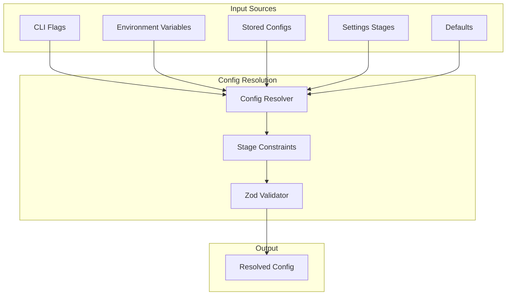
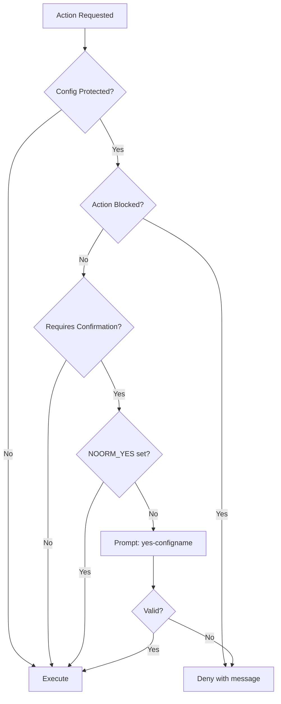
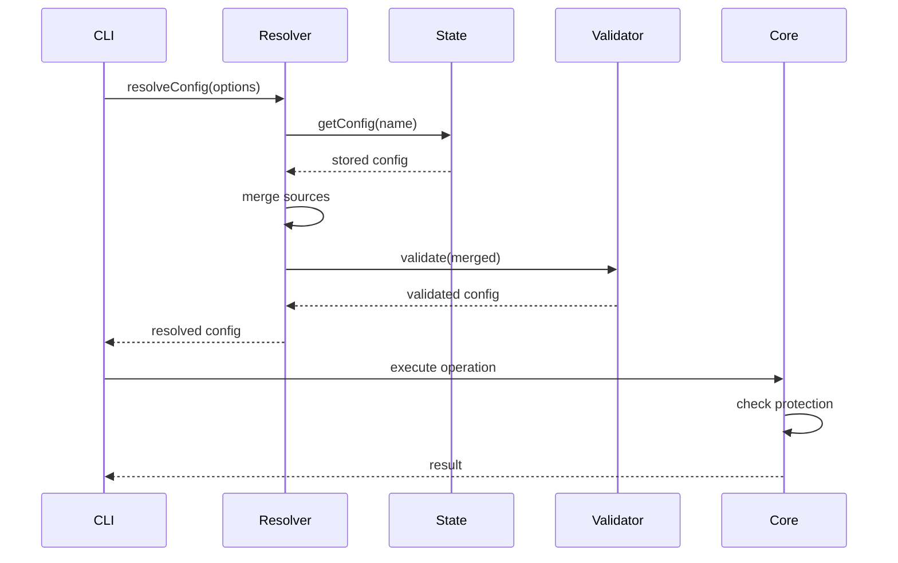

# Config Management


## Overview

Configs define how noorm connects to databases and where to find schema/changeset files. They support multiple environments, environment variable overrides, and protected configs for production safety.


## Data Model

```yaml
Config:
    name: string              # Identifier (dev, staging, prod)
    type: local | remote      # Connection type
    isTest: boolean           # Test database flag
    protected: boolean        # Requires confirmation for dangerous ops

    connection:
        dialect: postgres | mysql | sqlite | mssql
        host: string          # Required for non-SQLite
        port: number
        database: string
        user: string
        password: string
        ssl: boolean
        pool: { min, max }

    paths:
        schema: string        # Relative to project root
        changesets: string

    identity: string          # Optional override for executed_by
```

**ConfigSummary** (for listings):

```yaml
ConfigSummary:
    name: string
    type: local | remote
    isTest: boolean
    protected: boolean
    isActive: boolean
    dialect: string
    database: string
```


## Architecture




## Resolution Priority

Configs are resolved by merging multiple sources. Higher priority sources override lower ones:

```
1. CLI flags           (highest)
2. Environment vars
3. Stored config
4. Stage defaults      (from settings.yml)
5. Defaults            (lowest)
```

**Stage Constraints:**

When a config is linked to a stage (via `--stage` flag or matching name), certain stage-defined constraints are enforced:

| Constraint | Behavior |
|------------|----------|
| `locked: true` | Config cannot be deleted |
| `protected: true` in defaults | Cannot be overridden to false |
| `isTest: true` in defaults | Cannot be overridden to false |
| `secrets` defined | Required secrets must be set before config is usable |

**Resolution Flow:**

```
resolveConfig(options):

    1. Determine config name from:
       - options.name (explicit)
       - NOORM_CONFIG env var
       - Active config in state

    2. If no name found:
       - Check if env vars provide enough to run (dialect + database)
       - If yes, build config from env only
       - If no, return null

    3. Load stored config by name
       - Throw if name provided but not found

    4. Merge sources:
       defaults <- stored <- env <- flags

    5. Validate merged result

    6. Return resolved config
```


## Environment Variables

All config properties can be overridden via `NOORM_*` environment variables. The variable name maps directly to the nested config structure using underscore (`_`) as the separator.

**Naming Convention:**

```
NOORM_{PATH}_{TO}_{VALUE}  ->  { path: { to: { value: '' } } }
```

**Connection variables:**

| Variable | Maps To | Example |
|----------|---------|---------|
| `NOORM_CONNECTION_DIALECT` | connection.dialect | `postgres` |
| `NOORM_CONNECTION_HOST` | connection.host | `localhost` |
| `NOORM_CONNECTION_PORT` | connection.port | `5432` |
| `NOORM_CONNECTION_DATABASE` | connection.database | `myapp` |
| `NOORM_CONNECTION_USER` | connection.user | `admin` |
| `NOORM_CONNECTION_PASSWORD` | connection.password | `secret` |
| `NOORM_CONNECTION_SSL` | connection.ssl | `true` |
| `NOORM_CONNECTION_POOL_MIN` | connection.pool.min | `2` |
| `NOORM_CONNECTION_POOL_MAX` | connection.pool.max | `20` |

**Path variables:**

| Variable | Maps To | Example |
|----------|---------|---------|
| `NOORM_PATHS_SCHEMA` | paths.schema | `./db/schema` |
| `NOORM_PATHS_CHANGESETS` | paths.changesets | `./db/changesets` |

**Top-level variables:**

| Variable | Maps To | Example |
|----------|---------|---------|
| `NOORM_NAME` | name | `production` |
| `NOORM_TYPE` | type | `remote` |
| `NOORM_PROTECTED` | protected | `true` |
| `NOORM_IDENTITY` | identity | `deploy-bot` |
| `NOORM_isTest` | isTest | `true` |

**Note on camelCase properties:** For properties like `isTest`, preserve the camelCase in the env var name: `NOORM_isTest` (not `NOORM_IS_TEST`). The underscore separator splits words, so `IS_TEST` becomes `{ is: { test: '' } }`.

**Type coercion:**

- Numbers: `'5432'` → `5432`
- Booleans: `'true'`/`'false'` → `true`/`false` (use strings, not `'1'`/`'0'`)
- Passwords: Always kept as strings (never converted)

**Behavior variables** (not mapped to config):

| Variable | Purpose |
|----------|---------|
| `NOORM_CONFIG` | Which config to use |
| `NOORM_YES` | Skip confirmations |
| `NOORM_JSON` | JSON output mode |


## Validation

Configs are validated using Zod schemas. Key rules:

- `name` - Required, alphanumeric with hyphens/underscores
- `connection.dialect` - Must be postgres, mysql, sqlite, or mssql
- `connection.host` - Required for non-SQLite dialects
- `connection.port` - Integer between 1-65535
- `connection.database` - Required
- `paths.schema` - Required
- `paths.changesets` - Required

**Default Ports:**

| Dialect | Port |
|---------|------|
| postgres | 5432 |
| mysql | 3306 |
| mssql | 1433 |
| sqlite | N/A |


## Config Completeness

A config is considered "complete" when all required secrets (defined by its stage) are set. Incomplete configs have limited functionality:

| State | Allowed Operations |
|-------|-------------------|
| Complete | All operations |
| Incomplete | `config edit`, `secret set`, `config validate` |

**Checking Completeness:**

```bash
noorm config validate [name]    # Check if config is complete
```

Output shows:
- Missing required secrets
- Invalid secret types
- Stage constraint violations


## Protected Config Behavior

Protected configs add safety checks for dangerous operations:



**Action Classification:**

| Action | Protected Behavior |
|--------|-------------------|
| change:run | Requires confirmation |
| change:revert | Requires confirmation |
| change:ff | Requires confirmation |
| change:next | Requires confirmation |
| run:build | Requires confirmation |
| run:file | Requires confirmation |
| run:dir | Requires confirmation |
| db:create | Requires confirmation |
| db:destroy | **Blocked entirely** |
| config:rm | Requires confirmation |


## CI/CD Mode

When running in CI (`CI=1` or `-H` flag), configs can be built entirely from environment variables. No stored config or settings.yml required.

```bash
# Example CI pipeline
export NOORM_CONNECTION_DIALECT=postgres
export NOORM_CONNECTION_HOST=db.ci.example.com
export NOORM_CONNECTION_PORT=5432
export NOORM_CONNECTION_DATABASE=myapp_test
export NOORM_CONNECTION_USER=ci_user
export NOORM_CONNECTION_PASSWORD=$DB_PASSWORD
export NOORM_PATHS_SCHEMA=./db/schema
export NOORM_isTest=true

# Run directly - no config file needed
noorm run build
```

**How it works:**

1. Set `NOORM_*` environment variables
2. noorm detects env-only mode when no stored config exists
3. Config is built from env vars + defaults
4. Run any noorm command

**Minimum required env vars:**

- `NOORM_CONNECTION_DIALECT` (postgres, mysql, sqlite, mssql)
- `NOORM_CONNECTION_DATABASE`

**Optional: Create named config from env vars:**

```bash
noorm config ci [name]     # Creates stored config from env vars
    --set-active           # Default: true
```


## CLI Commands

### config add

Create a new config interactively or via flags.

```
noorm config add [name]
    --stage <stage>       # Use stage defaults from settings.yml
    --dialect <dialect>
    --host <host>
    --port <port>
    --database <db>
    --user <user>
    --password <pass>
    --protected
    --test
```

When `--stage` is provided:
- Stage defaults are applied first
- CLI flags override stage defaults
- Required secrets are prompted after creation
- Config is linked to the stage (inherits constraints)

### config edit

Edit an existing config interactively.

```
noorm config edit [name]
```

Stage-linked configs cannot modify constrained fields (e.g., `protected: true` cannot be changed to false).

### config rm

Remove a config. Protected configs require confirmation. Locked configs (from stage settings) cannot be deleted.

```
noorm config rm [name]
```

### config validate

Check if a config is complete and usable.

```
noorm config validate [name]
```

Returns:
- Missing required secrets
- Stage constraint violations
- Connection test result (optional)

### config list

Display all configs with summary info.

```
noorm config list
```

### config use

Set the active config.

```
noorm config use [name]
```

### config copy

Clone a config to a new name.

```
noorm config copy [source] --to <target>
```

New config starts unprotected regardless of source.

### config ci

Create config from environment variables (for CI pipelines).

```
noorm config ci [name]
    --set-active    # Default: true
```


## Secrets

Secrets are stored encrypted and used for **SQL template interpolation**, not CLI configuration.


### Config-Scoped Secrets

Per-config secrets are tied to a specific database configuration:

```sql
-- schema/users/create-readonly-user.sql.eta
CREATE USER <%~ $.secrets.READONLY_USER %>
WITH PASSWORD '<%~ $.secrets.READONLY_PASSWORD %>';
```

**Management:**

```
noorm secret set <key> <value> [--config <name>]
noorm secret rm <key> [--config <name>]
noorm secret list [--config <name>]
```


### Global Secrets

App-level secrets shared across all configs:

```sql
-- Access global secrets in templates
<%~ $.globalSecrets.SHARED_API_KEY %>
```

**Management:**

```
noorm secret set <key> <value> --global
noorm secret rm <key> --global
noorm secret list --global
```

See `plan/state.md` for secret storage details.


## Observer Events

```
config:added     { name, config }
config:updated   { name, changes }
config:removed   { name }
config:copied    { source, target }
config:activated { name, previous }
config:ci        { name, config }
```


## Component Interactions


