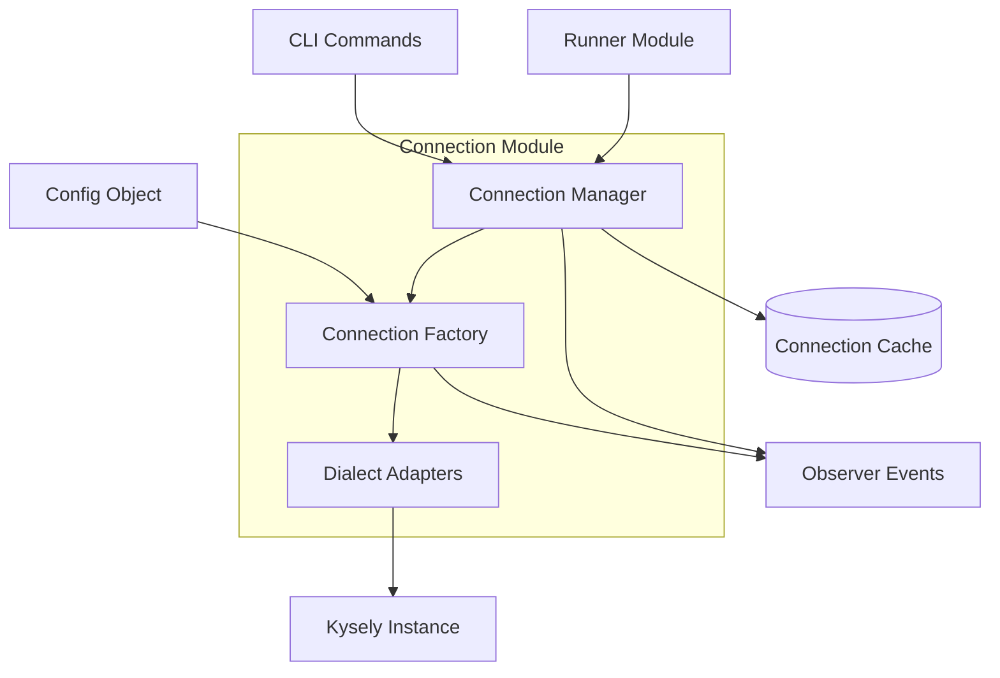
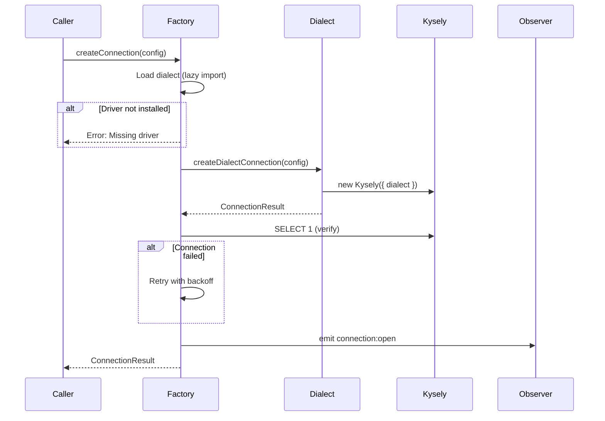
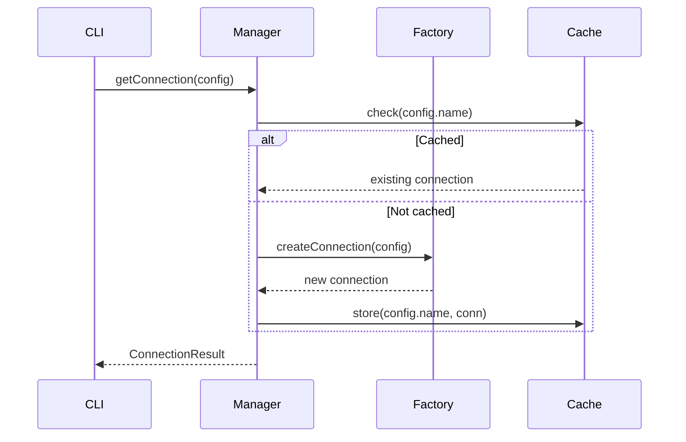

# Connection Management


## Overview

The connection module provides a thin abstraction layer between noorm and the underlying database. Its responsibilities are:

- Map config objects to Kysely database instances
- Handle connection pooling per dialect
- Provide retry logic for transient failures
- Cache connections for reuse within a session
- Emit lifecycle events for observability


## Architecture




## Components


### Connection Factory

Creates database connections from config. Handles:

- Dialect resolution (lazy-loaded to avoid requiring all drivers)
- Driver validation (helpful error if driver not installed)
- Connection verification (test query before returning)
- Retry logic for transient failures

```
createConnection(config, name) -> ConnectionResult
    1. Load dialect factory (lazy import)
    2. Create Kysely instance with dialect
    3. Verify connection with test query
    4. Emit connection:open event
    5. Return { db, dialect, destroy }
```


### Connection Manager

Singleton that caches connections by config name. Prevents creating multiple connections to the same database within a session.

```
getConnection(config) -> ConnectionResult
    if cached(config.name):
        return cache[config.name]
    else:
        conn = createConnection(config)
        cache[config.name] = conn
        return conn

closeConnection(configName) -> void
    conn = cache[configName]
    await conn.destroy()
    delete cache[configName]
    emit connection:close

closeAll() -> void
    for each configName in cache:
        await closeConnection(configName)
```


### Dialect Adapters

Each supported dialect has an adapter that:

- Maps ConnectionConfig to dialect-specific options
- Creates the appropriate Kysely dialect
- Handles dialect-specific defaults (ports, pool sizes, etc.)

Supported dialects:
- `postgres` - PostgreSQL via pg
- `mysql` - MySQL via mysql2
- `sqlite` - SQLite via better-sqlite3
- `mssql` - SQL Server via tedious


## Data Models


### ConnectionConfig

```
ConnectionConfig:
    dialect: 'postgres' | 'mysql' | 'sqlite' | 'mssql'

    # Network (not sqlite)
    host?: string
    port?: number

    # Auth
    user?: string
    password?: string

    # Database
    database: string
    filename?: string    # sqlite alternative to database

    # Pool
    pool?:
        min?: number
        max?: number

    # SSL
    ssl?: boolean | SSLConfig
```


### ConnectionResult

```
ConnectionResult:
    db: Kysely          # The database instance
    dialect: Dialect    # Which dialect was used
    destroy: () -> Promise<void>  # Cleanup function
```


## Control Flow


### Creating a Connection




### Using the Manager




## Retry Strategy

Connection creation uses exponential backoff for transient failures:

| Attempt | Delay |
|---------|-------|
| 1       | 0ms (immediate) |
| 2       | ~1s |
| 3       | ~2s |
| 4       | ~4s |

**Retryable errors:**
- ECONNREFUSED - database not ready
- ETIMEDOUT - network issues
- Too many connections - pool exhausted
- Connection reset - network interruption

**Non-retryable errors:**
- Authentication failures
- Missing drivers
- Invalid config


## Observer Events

| Event | Payload | When |
|-------|---------|------|
| `connection:open` | `{ configName, dialect }` | Connection established |
| `connection:close` | `{ configName }` | Connection destroyed |
| `connection:error` | `{ configName, error }` | Connection failed (after retries) |


## Error Handling

| Error | Cause | Resolution |
|-------|-------|------------|
| Unsupported dialect | Unknown dialect string | Use postgres, mysql, sqlite, or mssql |
| Missing driver | DB driver not installed | Install the appropriate driver |
| Connection refused | DB not running or wrong host/port | Verify database is accessible |
| Authentication failed | Wrong credentials | Check user/password |


## Design Decisions


### Lazy Driver Loading

Dialect adapters are dynamically imported to avoid requiring all database drivers at startup. Users only need to install the driver for their chosen database.


### Connection Caching

The ConnectionManager caches by config name, not by connection details. This means:
- Same config name = same connection
- Different config name = different connection (even if same DB)

This aligns with how configs are used (one active config at a time).


### Singleton Manager

The manager is a singleton because:
- Connections are expensive resources
- Multiple managers would defeat connection reuse
- Cleanup happens at process exit (one place to close all)


### Test Before Return

The factory runs `SELECT 1` before returning a connection. This catches:
- Bad credentials
- Network issues
- Database not running

...before the caller tries to use the connection.


## Integration Points

The connection module integrates with:

| Module | Relationship |
|--------|--------------|
| Config | Receives ConnectionConfig from stored configs |
| Runner | Provides db instance for SQL execution |
| State | Manager uses config name as cache key |
| Observer | Emits connection lifecycle events |
