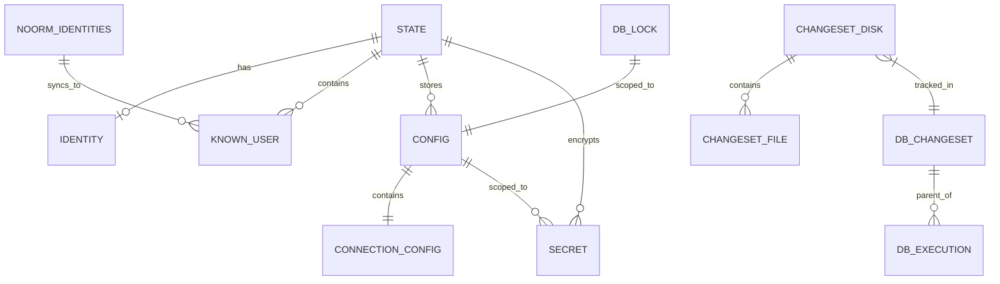

# Data Model Reference


## Overview

This document consolidates all data structures used across noorm. It serves as a single reference for types, database schemas, and their relationships.


## Entity Relationship Diagram




---


## Local State


### State

Top-level encrypted state stored in `.noorm/state.enc`.

| Field | Type | Description |
|-------|------|-------------|
| version | string | Package version for migrations |
| identity | Identity \| null | User's cryptographic identity |
| knownUsers | Map\<identityHash, KnownUser\> | Cached identities from DB syncs |
| activeConfig | string \| null | Currently selected config name |
| configs | Map\<name, Config\> | Database configurations |
| secrets | Map\<configName, Map\<key, value\>\> | Config-scoped secrets |
| globalSecrets | Map\<key, value\> | App-level secrets |


### Identity

User's cryptographic identity for config sharing.

| Field | Type | Description |
|-------|------|-------------|
| identityHash | string | SHA-256(email + name + machine + os) |
| name | string | Display name ("Alice Smith") |
| email | string | Email address |
| publicKey | string | X25519 public key (hex) |
| machine | string | Machine hostname |
| os | string | OS platform and version |
| createdAt | string | ISO timestamp |


### KnownUser

Cached identity discovered from database sync. Keyed by identity_hash in state.

| Field | Type | Description |
|-------|------|-------------|
| identityHash | string | SHA-256(email + name + machine + os) |
| email | string | User email |
| name | string | Display name |
| publicKey | string | X25519 public key (hex) |
| machine | string | Machine hostname |
| os | string | OS platform and version |
| lastSeen | string | ISO timestamp of last DB activity |
| source | string | Config name where discovered |


### Config

Database connection profile.

| Field | Type | Description |
|-------|------|-------------|
| name | string | Identifier (dev, staging, prod) |
| type | 'local' \| 'remote' | Connection type |
| isTest | boolean | Test database flag |
| protected | boolean | Requires confirmation for dangerous ops |
| connection | ConnectionConfig | Database connection details |
| paths | PathConfig | Schema and changeset directories |
| identity | string? | Optional identity override for executed_by |


### ConfigSummary

Lightweight config view for listings.

| Field | Type | Description |
|-------|------|-------------|
| name | string | Config identifier |
| type | 'local' \| 'remote' | Connection type |
| isTest | boolean | Test database flag |
| protected | boolean | Protection enabled |
| isActive | boolean | Currently active |
| dialect | string | Database dialect |
| database | string | Database name |


### ConnectionConfig

Database connection parameters.

| Field | Type | Description |
|-------|------|-------------|
| dialect | 'postgres' \| 'mysql' \| 'sqlite' \| 'mssql' | Database type |
| host | string? | Hostname (not for sqlite) |
| port | number? | Port number |
| database | string | Database name |
| filename | string? | SQLite file path |
| user | string? | Username |
| password | string? | Password |
| ssl | boolean \| SSLConfig? | SSL configuration |
| pool | { min?, max? }? | Connection pool settings |


### PathConfig

File system paths for schema and changesets.

| Field | Type | Description |
|-------|------|-------------|
| schema | string | Path to schema directory |
| changesets | string | Path to changesets directory |


### EncryptedPayload

On-disk format for encrypted state.

| Field | Type | Description |
|-------|------|-------------|
| version | number | Payload format version |
| algorithm | string | Always 'aes-256-gcm' |
| iv | string | Initialization vector (hex) |
| authTag | string | Authentication tag (hex) |
| ciphertext | string | Encrypted state (hex) |


---


## Database Tables


### `__noorm_version__`

Tracks noorm CLI version and internal schema version for migrations.

| Column | Type | Constraints | Description |
|--------|------|-------------|-------------|
| id | serial | PK | Primary key |
| cli_version | varchar(50) | NOT NULL | Semver (e.g., "1.2.3") |
| schema_version | integer | NOT NULL | Tracking table schema version |
| installed_at | timestamp | NOT NULL, DEFAULT NOW() | First installation |
| upgraded_at | timestamp | NOT NULL, DEFAULT NOW() | Last upgrade |

**Note:** This tracks noorm's internal tables, not the user's schema.


### `__noorm_changeset__`

Tracks all operation batches—changesets, builds, and ad-hoc runs.

| Column | Type | Constraints | Description |
|--------|------|-------------|-------------|
| id | serial | PK | Primary key |
| name | varchar(255) | NOT NULL | Operation identifier |
| change_type | varchar(50) | NOT NULL | 'build', 'run', or 'changeset' |
| direction | varchar(50) | NOT NULL | 'change' or 'revert' |
| checksum | varchar(64) | NOT NULL, DEFAULT '' | SHA-256 of sorted file checksums |
| executed_at | timestamp | NOT NULL, DEFAULT NOW() | When executed |
| executed_by | varchar(255) | NOT NULL, DEFAULT '' | Identity string |
| config_name | varchar(255) | NOT NULL, DEFAULT '' | Which config was used |
| cli_version | varchar(50) | NOT NULL, DEFAULT '' | noorm version |
| status | varchar(50) | NOT NULL | 'pending', 'success', 'failed', 'reverted' |
| error_message | text | NOT NULL, DEFAULT '' | Error details (empty = no error) |
| duration_ms | integer | NOT NULL, DEFAULT 0 | Execution time (0 = never ran) |

**Name formats:**

| change_type | Format | Example |
|-------------|--------|---------|
| changeset | Folder name | `2024-01-15_add-users` |
| build | `build:{timestamp}` | `build:2024-01-15T10:30:00` |
| run | `run:{timestamp}` | `run:2024-01-15T10:30:00` |


### `__noorm_executions__`

Tracks individual file executions within an operation.

| Column | Type | Constraints | Description |
|--------|------|-------------|-------------|
| id | serial | PK | Primary key |
| changeset_id | integer | FK, NOT NULL | Parent operation |
| filepath | varchar(500) | NOT NULL | File that was executed |
| file_type | varchar(10) | NOT NULL | 'sql' or 'txt' |
| checksum | varchar(64) | NOT NULL, DEFAULT '' | SHA-256 of file contents |
| cli_version | varchar(50) | NOT NULL, DEFAULT '' | noorm version |
| status | varchar(50) | NOT NULL | 'pending', 'success', 'failed', 'skipped' |
| error_message | text | NOT NULL, DEFAULT '' | Error details (empty = no error) |
| skip_reason | varchar(100) | NOT NULL, DEFAULT '' | 'unchanged', 'already-run', 'changeset failed' |
| duration_ms | integer | NOT NULL, DEFAULT 0 | Execution time (0 = never ran) |


### `__noorm_lock__`

Prevents concurrent operations on the same database.

| Column | Type | Constraints | Description |
|--------|------|-------------|-------------|
| id | serial | PK | Primary key |
| config_name | varchar(255) | UNIQUE, NOT NULL | Lock scope |
| locked_by | varchar(255) | NOT NULL | Identity of holder |
| locked_at | timestamp | NOT NULL, DEFAULT NOW() | When acquired |
| expires_at | timestamp | NOT NULL | Auto-expiry time |
| reason | varchar(255) | NOT NULL, DEFAULT '' | Lock reason (empty = none) |


### `__noorm_identities__`

Stores user identities for team discovery. Auto-populated on first connect when identity is set up.

| Column | Type | Constraints | Description |
|--------|------|-------------|-------------|
| id | serial | PK | Primary key |
| identity_hash | varchar(64) | UNIQUE, NOT NULL | SHA-256(email + name + machine + os) |
| email | varchar(255) | NOT NULL | User email |
| name | varchar(255) | NOT NULL | Display name |
| machine | varchar(255) | NOT NULL | Machine hostname |
| os | varchar(255) | NOT NULL | OS platform and version |
| public_key | text | NOT NULL | X25519 public key (hex) |
| registered_at | timestamp | NOT NULL, DEFAULT NOW() | First registration |
| last_seen_at | timestamp | NOT NULL, DEFAULT NOW() | Last activity |

**Identity hash calculation:**

```
identity_hash = SHA256(email + '\0' + name + '\0' + machine + '\0' + os)
```

Same user on different machines = different identities with different keypairs.


---


## File System Structures


### Changeset (on disk)

Parsed from changeset directory.

| Field | Type | Description |
|-------|------|-------------|
| name | string | Folder name |
| path | string | Full path |
| date | Date \| null | Parsed from name (YYYY-MM-DD) |
| description | string | Human-readable from name |
| changeFiles | ChangesetFile[] | Files in `change/` |
| revertFiles | ChangesetFile[] | Files in `revert/` |
| hasChangelog | boolean | changelog.md exists |


### ChangesetFile

Individual file within a changeset.

| Field | Type | Description |
|-------|------|-------------|
| filename | string | e.g., "001_alter-users.sql" |
| path | string | Full path |
| type | 'sql' \| 'txt' | File type |
| resolvedPaths | string[]? | For .txt files, referenced paths |
| status | 'pending' \| 'success' \| 'failed' \| 'skipped'? | Runtime status |
| skipReason | string? | e.g., "changeset failed" |


### Changeset Directory Structure

```
changesets/
└── 2024-01-15-add-email-verification/
    ├── change/
    │   ├── 001_add-column.sql
    │   └── 002_update-data.sql
    ├── revert/
    │   ├── 001_drop-column.sql
    │   └── 002_restore-data.sql
    └── changelog.md
```


---


## Runtime Types


### ConnectionResult

Returned when creating a database connection.

| Field | Type | Description |
|-------|------|-------------|
| db | Kysely | Database instance |
| dialect | Dialect | Which dialect was used |
| destroy | () => Promise\<void\> | Cleanup function |


### FileResult

Returned after executing a single file.

| Field | Type | Description |
|-------|------|-------------|
| filepath | string | Absolute path |
| checksum | string | SHA-256 of contents |
| status | 'success' \| 'failed' \| 'skipped' | Execution result |
| skipReason | 'unchanged' \| 'already-run'? | Why skipped |
| durationMs | number | Execution time |
| error | string? | Error message if failed |


### RunOptions

Options for runner operations.

| Field | Type | Default | Description |
|-------|------|---------|-------------|
| force | boolean | false | Re-run even if unchanged |
| concurrency | number | 1 | Parallel file execution |
| abortOnError | boolean | true | Stop on first failure |
| dryRun | boolean | false | Report without executing |
| preview | boolean | false | Output rendered SQL |
| output | string? | null | Write rendered SQL to file |


### Lock

Active lock state.

| Field | Type | Description |
|-------|------|-------------|
| lockedBy | string | Identity of holder |
| lockedAt | Date | When acquired |
| expiresAt | Date | Auto-expiry time |


### LockOptions

Options for lock acquisition.

| Field | Type | Default | Description |
|-------|------|---------|-------------|
| timeout | number | 300000 | Lock duration (ms) |
| wait | boolean | false | Block until available |
| waitTimeout | number | 30000 | Max wait time (ms) |
| pollInterval | number | 1000 | Check interval (ms) |


### ChangesetStatus

Changeset state from database.

| Field | Type | Description |
|-------|------|-------------|
| name | string | Changeset name |
| status | 'pending' \| 'success' \| 'failed' \| 'reverted' | Current state |
| appliedAt | Date | When applied |
| appliedBy | string | Who applied it (empty = unknown) |
| revertedAt | Date | When reverted (epoch 0 = never) |
| errorMessage | string | Error if failed (empty = no error) |


---


## Template Context


### $ (Template Context Object)

Available in `.sql.eta` templates.

| Property | Type | Description |
|----------|------|-------------|
| $.\<filename\> | any | Auto-loaded data from co-located files |
| $.config | Config | Active configuration |
| $.secrets | Record\<string, string\> | Config-scoped secrets |
| $.globalSecrets | Record\<string, string\> | App-level secrets |
| $.env | Record\<string, string\> | Environment variables |
| $.include(path) | (path: string) => Promise\<string\> | Include SQL file |
| $.escape(value) | (v: string) => string | SQL-escape string |
| $.quote(value) | (v: string) => string | Escape and quote |
| $.json(value) | (v: any) => string | JSON stringify |
| $.now() | () => string | Current ISO timestamp |
| $.uuid() | () => string | Generate UUID |


### Loader Registry

Supported data file formats for auto-loading.

| Extension | Loader | Result Type |
|-----------|--------|-------------|
| .json | JSON.parse | any |
| .yaml, .yml | yaml.parse | any |
| .csv | csv-parse | Record\<string, string\>[] |
| .js, .mjs | dynamic import | module.default |
| .sql | readFile | string |


---


## Encrypted Sharing


### SharedConfigPayload

Format for exported config files (`*.noorm.enc`).

| Field | Type | Description |
|-------|------|-------------|
| version | number | Payload format version |
| sender | string | Sender's email |
| recipient | string | Recipient's email |
| ephemeralPubKey | string | Ephemeral X25519 public key (hex) |
| iv | string | Initialization vector (hex) |
| authTag | string | Authentication tag (hex) |
| ciphertext | string | Encrypted payload (hex) |

**Encrypted payload contains:**

```
ExportedConfig
├── name                        # Config name
├── dialect                     # postgres, mysql, etc.
├── connection
│   ├── host                    # Included
│   ├── port                    # Included
│   ├── database                # Included
│   ├── ssl                     # Included
│   └── pool                    # Included
│   # NOTE: user/password are OMITTED
├── paths
│   ├── schema
│   └── changesets
├── isTest
├── protected
└── secrets                     # Map<key, value> - the main payload
```

**Not exported:** `connection.user`, `connection.password` — recipient provides their own credentials on import.


### Key Files

```
~/.noorm/
├── identity.key        # X25519 private key (hex, chmod 600)
└── identity.pub        # X25519 public key (hex, chmod 644)
```


---


## Status Enums


### Operation Status

Used in `__noorm_changeset__` and changesets.

| Status | Meaning |
|--------|---------|
| pending | Not yet executed |
| success | Completed successfully |
| failed | Execution failed |
| reverted | Was applied, then rolled back |


### File Execution Status

Used in `__noorm_executions__`.

| Status | Meaning |
|--------|---------|
| pending | Not yet executed |
| success | Completed successfully |
| failed | Execution failed |
| skipped | Skipped (see skip_reason) |


### Skip Reasons

| Reason | Meaning |
|--------|---------|
| unchanged | File checksum matches previous run |
| already-run | File was already executed successfully |
| changeset failed | Parent changeset failed, remaining files skipped |
