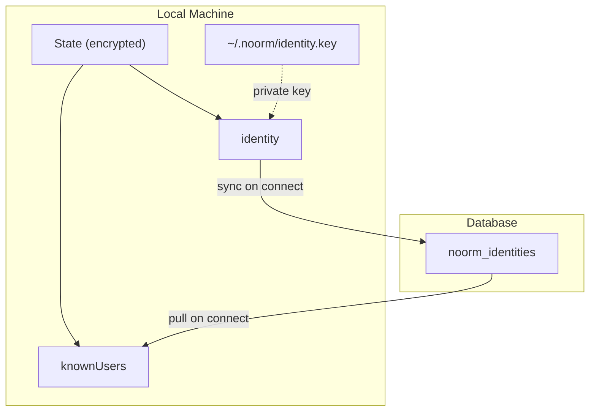
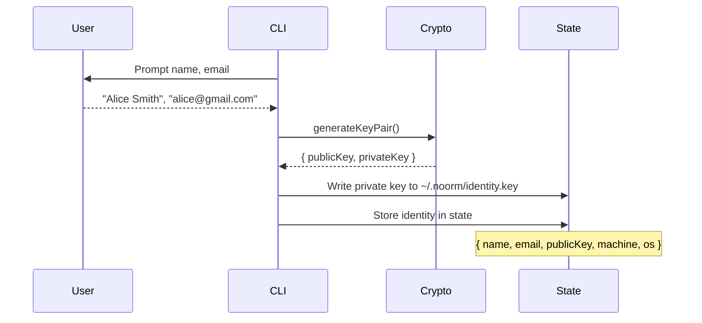
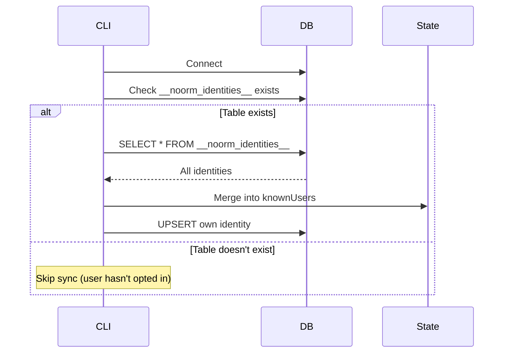

# Identity


## Overview

Identity in noorm serves two purposes:

1. **Audit Identity** - Who executed a changeset (for tracking tables)
2. **Cryptographic Identity** - Keypair for encrypted config sharing

The cryptographic identity is established on first run and persists across sessions. It enables secure config sharing between team members via asymmetric encryption.


## Architecture


### Component Relationships




### Data Flow: First Run




### Data Flow: Database Sync




## Data Model


### Local Identity

Stored in encrypted state:

```
Identity
├── identityHash            # SHA-256(email + name + machine + os)
├── name                    # "Alice Smith"
├── email                   # "alice@gmail.com"
├── publicKey               # X25519 public key (hex)
├── machine                 # "alice-macbook-pro"
├── os                      # "darwin 24.5.0"
└── createdAt               # ISO timestamp
```

**Identity hash calculation:**

```
identityHash = SHA256(email + '\0' + name + '\0' + machine + '\0' + os)
```

Same user on different machines = different identities with different keypairs.


### Known Users

Cached in state from database syncs:

```
KnownUsers: Map<identityHash, KnownUser>

KnownUser
├── identityHash            # SHA-256(email + name + machine + os)
├── email                   # "bob@company.com"
├── name                    # "Bob Jones"
├── publicKey               # X25519 public key (hex)
├── machine                 # "bob-workstation"
├── os                      # "linux 5.15.0"
├── lastSeen                # ISO timestamp
└── source                  # Which DB we discovered them from
```


### Private Key Storage

The private key lives outside encrypted state for bootstrapping:

```
~/.noorm/
├── identity.key            # X25519 private key (hex, chmod 600)
└── identity.pub            # Public key for easy sharing
```

Why separate? The state file is encrypted. We need the private key to decrypt it. Chicken-and-egg.


### Database Table

```sql
CREATE TABLE __noorm_identities__ (
    id              SERIAL PRIMARY KEY,
    identity_hash   VARCHAR(64) UNIQUE NOT NULL,
    email           VARCHAR(255) NOT NULL,
    name            VARCHAR(255) NOT NULL,
    machine         VARCHAR(255) NOT NULL,
    os              VARCHAR(255) NOT NULL,
    public_key      TEXT NOT NULL,
    registered_at   TIMESTAMP NOT NULL DEFAULT NOW(),
    last_seen_at    TIMESTAMP NOT NULL DEFAULT NOW()
);
```

**Identity hash:** `SHA256(email + '\0' + name + '\0' + machine + '\0' + os)`


## Operations


### First Run Setup

Triggered when no identity exists in state.

**Pre-population sources:**

| Field | Primary Source | Fallback | Editable |
|-------|----------------|----------|----------|
| Name | `git config user.name` | OS username | Yes |
| Email | `git config user.email` | (empty) | Yes |
| Machine | `os.hostname()` | - | Yes |
| OS | `os.platform()` + `os.release()` | - | No |

```
setupIdentity():
    # Detect defaults from system
    defaults = detectIdentityDefaults()

    # Present form with pre-filled values (user can edit name, email, machine)
    name = prompt("Name:", default: defaults.name)
    email = prompt("Email:", default: defaults.email)
    machine = prompt("Machine:", default: defaults.machine)
    osInfo = defaults.os  # Not editable

    # Compute identity hash
    identityHash = SHA256(email + '\0' + name + '\0' + machine + '\0' + osInfo)

    # Generate keypair (automatic, no user input)
    { publicKey, privateKey } = generateX25519KeyPair()

    # Store private key (outside state)
    writeFile(~/.noorm/identity.key, privateKey, mode: 0o600)
    writeFile(~/.noorm/identity.pub, publicKey, mode: 0o644)

    # Store identity in state
    state.identity = { identityHash, name, email, publicKey, machine, os: osInfo, createdAt: now() }

    emit('identity:created', { identityHash, name, email, machine })


detectIdentityDefaults():
    # Try git config first (most reliable for name/email)
    [gitName, _] = await attempt(() => exec('git config user.name'))
    [gitEmail, _] = await attempt(() => exec('git config user.email'))

    return {
        name: gitName?.trim() || os.userInfo().username,
        email: gitEmail?.trim() || '',
        machine: os.hostname(),
        os: `${os.platform()} ${os.release()}`
    }
```


### Sync on Connect

Called after successful database connection:

```
syncIdentities(db):
    # Check if table exists
    if not tableExists(db, '__noorm_identities__'):
        return  # User hasn't opted into identity sharing

    # Pull all identities
    rows = db.select('__noorm_identities__')

    for row in rows:
        if row.identity_hash == state.identity.identityHash:
            continue  # Skip self

        state.knownUsers[row.identity_hash] = {
            name: row.name,
            publicKey: row.public_key,
            machine: row.machine,
            os: row.os,
            lastSeen: row.last_seen_at,
            source: currentConfigName
        }

    # Upsert own identity (by identity_hash)
    db.upsert('__noorm_identities__', {
        identity_hash: state.identity.identityHash,
        email: state.identity.email,
        name: state.identity.name,
        machine: state.identity.machine,
        os: state.identity.os,
        public_key: state.identity.publicKey,
        last_seen_at: now()
    })

    emit('identity:synced', {
        discovered: rows.length - 1,
        configName: currentConfigName
    })
```


### Resolve Recipient

For config export. Since one email can have multiple machines, we need to handle disambiguation:

```
resolveRecipient(emailOrHash):
    # Direct hash lookup (exact match)
    if state.knownUsers[emailOrHash]:
        return state.knownUsers[emailOrHash]

    # Search by email (may return multiple)
    matches = Object.values(state.knownUsers)
        .filter(u => u.email == emailOrHash)

    if matches.length == 0:
        throw new UnknownRecipientError(
            `Unknown recipient: ${emailOrHash}. ` +
            `Connect to a shared database to discover team members, ` +
            `or use --pubkey to specify manually.`
        )

    if matches.length == 1:
        return matches[0]

    # Multiple machines for same email - prompt user to pick
    # In headless mode, error with list of options
    throw new AmbiguousRecipientError(
        `Multiple identities found for ${emailOrHash}:`,
        matches.map(m => `  ${m.identityHash.slice(0,8)} - ${m.machine} (${m.os})`)
    )
```

**CLI behavior:**

| Mode | Multiple matches |
|------|------------------|
| Interactive | Show picker: "Alice has 2 machines. Which one?" |
| Headless | Error with identity hashes to use with `--identity-hash` |

**Export flags:**

```
noorm config export prod --for alice@gmail.com          # Works if 1 match
noorm config export prod --for alice@gmail.com --machine alice-macbook  # Filter by machine
noorm config export prod --identity-hash abc123...      # Direct hash
noorm config export prod --pubkey <key>                 # Manual override
```


## Encryption Module


### Key Generation (X25519)

```ts
import { generateKeyPairSync } from 'crypto'

function generateKeyPair(): { publicKey: string, privateKey: string } {

    const { publicKey, privateKey } = generateKeyPairSync('x25519', {
        publicKeyEncoding: { type: 'spki', format: 'der' },
        privateKeyEncoding: { type: 'pkcs8', format: 'der' }
    })

    return {
        publicKey: publicKey.toString('hex'),
        privateKey: privateKey.toString('hex')
    }
}
```


### Encrypt for Recipient (X25519 + AES-256-GCM)

```ts
function encryptForRecipient(
    plaintext: string,
    recipientPubKey: string
): EncryptedPayload {

    // Generate ephemeral keypair
    const ephemeral = generateKeyPair()

    // Derive shared secret via ECDH
    const sharedSecret = deriveSharedSecret(
        ephemeral.privateKey,
        recipientPubKey
    )

    // Derive encryption key from shared secret
    const key = hkdf(sharedSecret, 32, 'noorm-config-share')

    // Encrypt with AES-256-GCM
    const iv = randomBytes(16)
    const cipher = createCipheriv('aes-256-gcm', key, iv)
    const ciphertext = Buffer.concat([
        cipher.update(plaintext, 'utf8'),
        cipher.final()
    ])
    const authTag = cipher.getAuthTag()

    return {
        version: 1,
        ephemeralPubKey: ephemeral.publicKey,
        iv: iv.toString('hex'),
        authTag: authTag.toString('hex'),
        ciphertext: ciphertext.toString('hex')
    }
}
```


### Decrypt with Private Key

```ts
function decryptWithPrivateKey(
    payload: EncryptedPayload,
    privateKey: string
): string {

    // Derive shared secret from ephemeral pub + our private
    const sharedSecret = deriveSharedSecret(
        privateKey,
        payload.ephemeralPubKey
    )

    // Derive decryption key
    const key = hkdf(sharedSecret, 32, 'noorm-config-share')

    // Decrypt
    const decipher = createDecipheriv(
        'aes-256-gcm',
        key,
        Buffer.from(payload.iv, 'hex')
    )
    decipher.setAuthTag(Buffer.from(payload.authTag, 'hex'))

    const plaintext = Buffer.concat([
        decipher.update(Buffer.from(payload.ciphertext, 'hex')),
        decipher.final()
    ])

    return plaintext.toString('utf8')
}
```


## CLI Commands


### Identity Management

| Command | Description |
|---------|-------------|
| `noorm identity` | Show current identity |
| `noorm identity init` | Re-run first-time setup |
| `noorm identity export` | Output public key for manual sharing |
| `noorm identity list` | List all known users |


### Config Sharing

| Command | Description |
|---------|-------------|
| `noorm config export <name> --for <email>` | Export encrypted config (prompts if multiple machines) |
| `noorm config export <name> --for <email> --machine <name>` | Export to specific machine |
| `noorm config export <name> --identity-hash <hash>` | Export to exact identity |
| `noorm config export <name> --pubkey <key>` | Export with manual pubkey |
| `noorm config import <file>` | Import encrypted config |


## Observer Events

| Event | Payload | When |
|-------|---------|------|
| `identity:created` | `{ name, email, machine }` | First-time setup complete |
| `identity:synced` | `{ discovered, configName }` | Identities pulled from DB |
| `identity:registered` | `{ configName }` | Own identity pushed to DB |
| `config:exported` | `{ configName, recipient }` | Config exported for sharing |
| `config:imported` | `{ configName, from }` | Config imported from share |


## Audit Identity (Legacy)

For tracking tables, identity resolution still follows the priority chain:

| Priority | Source | Description |
|----------|--------|-------------|
| 1 | State | Use `state.identity.name` + `state.identity.email` |
| 2 | Config | Explicit override in config (for bots) |
| 3 | Environment | `NOORM_IDENTITY` variable |
| 4 | Git | `git config user.name` + `user.email` |
| 5 | System | OS username via `os.userInfo()` |

The cryptographic identity (priority 1) is preferred when available.


## Security Considerations

| Concern | Mitigation |
|---------|------------|
| Private key theft | File permissions (600), never transmitted |
| Key compromise | Generate new keypair, old shares unaffected |
| Impersonation | Public keys verified via shared DB |
| Man-in-the-middle | Direct DB sync, no external key servers |


## Edge Cases

| Scenario | Behavior |
|----------|----------|
| No identity on export | Error: "Run `noorm identity init` first" |
| Recipient not found | Error with instructions to connect or use --pubkey |
| Corrupted private key | Error: "Identity corrupted. Run `noorm identity init`" |
| Machine change | Identity persists (tied to ~/.noorm/, not machine ID) |
| Multiple machines | Same user can have different keypairs per machine |
