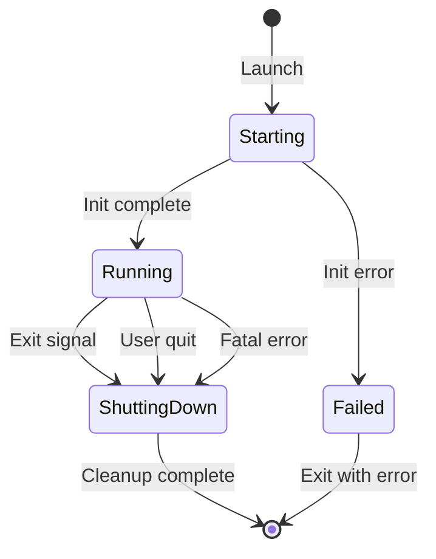
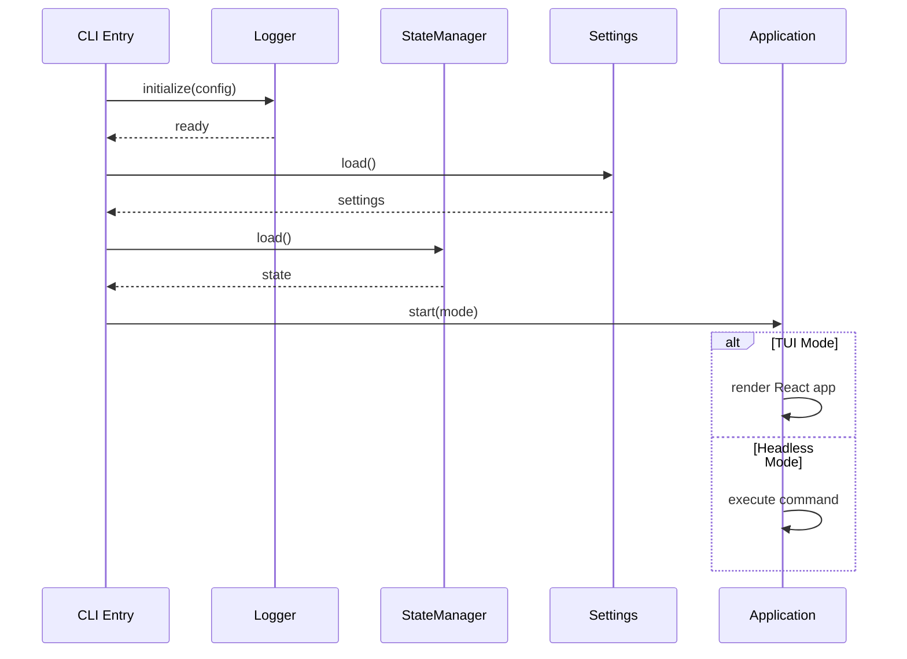
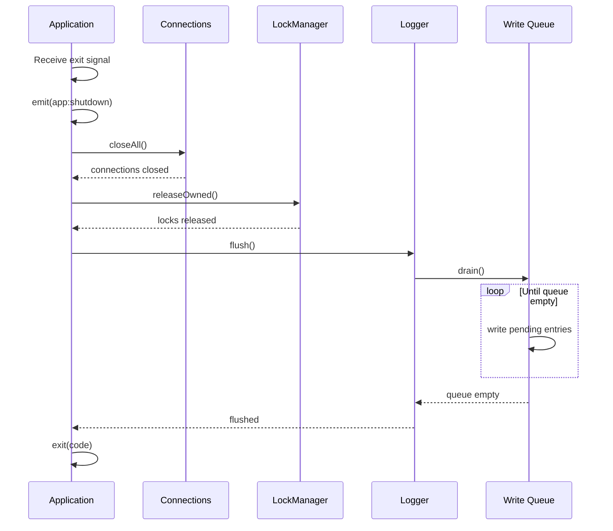

# Application Lifecycle


## Overview

noorm manages application startup and shutdown to ensure:

- Clean initialization of all subsystems
- Graceful shutdown with resource cleanup
- No data loss from pending writes (logger queue)
- Proper connection closure


## Lifecycle Phases




## Startup Sequence




## Shutdown Sequence




## Shutdown Checks

Before exiting, the application must verify:

| Check | Purpose | Action if Pending |
|-------|---------|-------------------|
| Logger queue | Ensure all log entries written | Wait for drain |
| Connections | Clean disconnect from databases | Force close after timeout |
| Locks | Release owned locks | Release or warn |
| State | Persist any unsaved changes | Save state |


## Exit Handlers

The application registers handlers for various exit signals:

```
Exit Signals
├── SIGINT (Ctrl+C)     → Graceful shutdown
├── SIGTERM             → Graceful shutdown
├── SIGHUP              → Graceful shutdown
├── uncaughtException   → Log error, emergency shutdown
└── unhandledRejection  → Log error, emergency shutdown
```


## Graceful Shutdown Flow

```
on shutdown signal:
    emit('app:shutdown')

    # Phase 1: Stop accepting new work
    stop accepting new commands
    cancel pending operations (if safe)

    # Phase 2: Complete in-flight work
    wait for active operations (with timeout)

    # Phase 3: Release resources
    release all owned locks
    close all database connections

    # Phase 4: Flush pending writes
    await logger.flush()

    # Phase 5: Exit
    exit(exitCode)
```


## Emergency Shutdown

For unrecoverable errors:

```
on fatal error:
    log error (sync if possible)
    emit('app:fatal', { error })

    # Skip graceful cleanup
    # Resources will be reclaimed by OS
    exit(1)
```


## Timeout Handling

Each shutdown phase has a maximum timeout:

| Phase | Timeout | On Timeout |
|-------|---------|------------|
| Active operations | 30s | Force cancel |
| Lock release | 5s | Abandon (will expire) |
| Connection close | 10s | Force close |
| Logger flush | 10s | Warn and continue |


## Observer Events

| Event | Payload | When |
|-------|---------|------|
| `app:starting` | `{ mode }` | Application starting |
| `app:ready` | `{ mode, config }` | Initialization complete |
| `app:shutdown` | `{ reason }` | Shutdown initiated |
| `app:shutdown:phase` | `{ phase, status }` | Shutdown phase status |
| `app:exit` | `{ code }` | About to exit |
| `app:fatal` | `{ error }` | Fatal error occurred |


## Integration Points

| Component | Startup | Shutdown |
|-----------|---------|----------|
| Logger | First to init | Last to cleanup (flush queue) |
| Settings | Load from disk | N/A |
| State | Load and decrypt | Persist if changed |
| Connections | Lazy (on demand) | Close all |
| Locks | N/A | Release owned |
