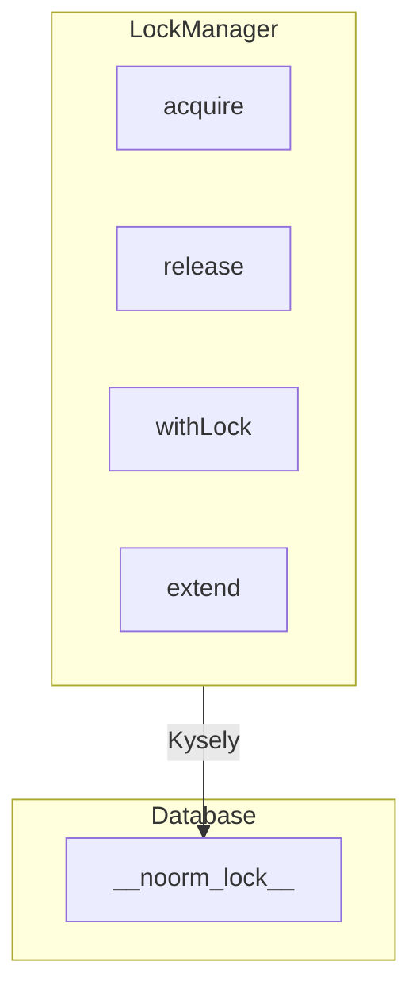
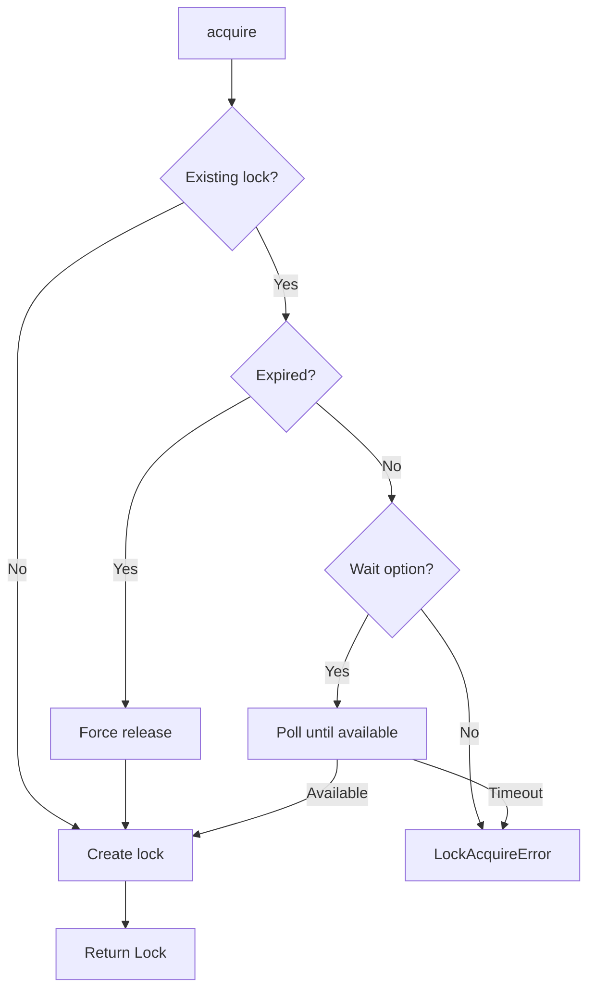
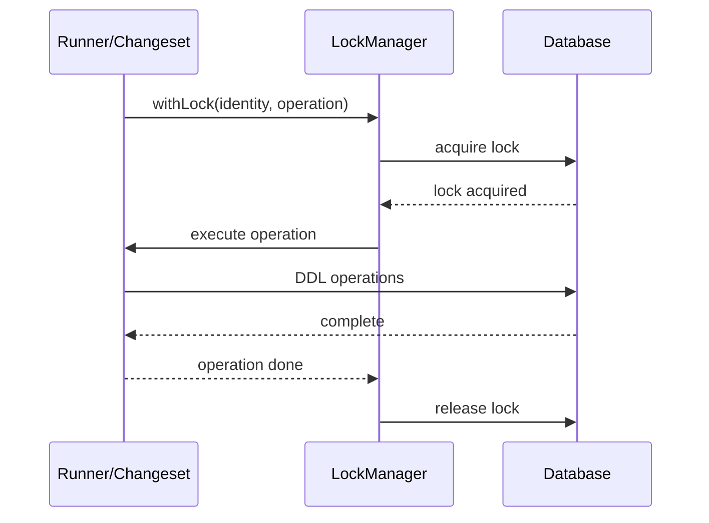

# Lock Manager


## Overview

The lock manager prevents concurrent noorm operations on the same database. This is critical when:

- Multiple developers run changesets simultaneously
- CI/CD pipelines overlap with manual operations
- Multiple instances of the same deployment run

Without locking, concurrent DDL operations can cause:

- Partial migrations leaving the database in an inconsistent state
- Race conditions in the `__noorm_*` tracking tables
- Conflicting schema changes being applied out of order


## Architecture



All databases use table-based locking via `__noorm_lock__`. Kysely handles dialect-specific SQL generation.

Each config gets its own lock scope—two developers can work on different configs simultaneously.


## Tracking Table

The `__noorm_lock__` table stores lock state. Kysely handles dialect differences in the SQL.

| Column | Type | Purpose |
|--------|------|---------|
| id | serial | Primary key |
| config_name | varchar | Which config/database this lock is for |
| locked_by | varchar | Identity string of holder |
| locked_at | timestamp | When acquired |
| expires_at | timestamp | Auto-expiry time |
| reason | varchar | Optional reason for acquiring |

**Lock lifecycle:**
- Acquired via INSERT (fails if lock exists and not expired)
- Released via DELETE
- Expired locks are cleaned up on acquire attempts


## Data Models

```
Lock
├── lockedBy      # Identity string of holder
├── lockedAt      # When acquired
└── expiresAt     # Auto-expiry time

LockOptions
├── timeout       # Lock duration
├── wait          # Block until available?
├── waitTimeout   # Max wait time
└── pollInterval  # Check interval when waiting
```


## Control Flow


### Lock Acquisition




### withLock Pattern

Ensures proper cleanup regardless of success or failure:

```
withLock(identity, operation):
    lock = acquire(identity)
    try:
        return operation()
    finally:
        release()
```


## Observer Events

| Event | When |
|-------|------|
| `lock:acquiring` | Starting acquisition |
| `lock:blocked` | Lock held by another |
| `lock:acquired` | Lock obtained |
| `lock:released` | Lock released |
| `lock:expired` | Lock timed out |


## Error Types

| Error | Cause |
|-------|-------|
| `LockAcquireError` | Another operation holds the lock |
| `LockExpiredError` | Lock expired during operation |
| `LockNotFoundError` | Tried to release non-existent lock |


## Integration Points

The runner and changeset modules wrap their operations in `withLock` to ensure exclusive access during DDL execution.




## Edge Cases

**Process Crash** — Locks expire after timeout and are cleaned up by the next acquire attempt. Stale locks can also be force-released via CLI.

**Network Partition** — Lock may expire while operation is in-flight. A validation check before critical commits throws `LockExpiredError` if stale.

**Multiple Configs** — Each config has its own lock scope, allowing parallel work across different configs.
