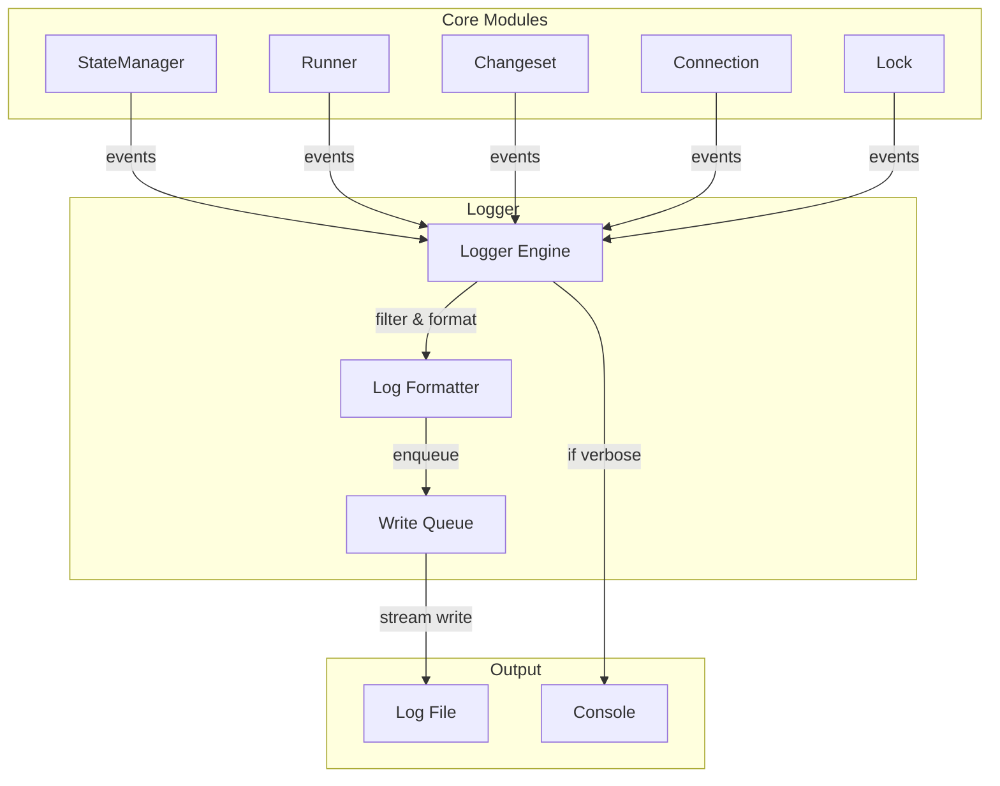
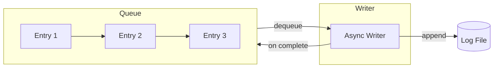
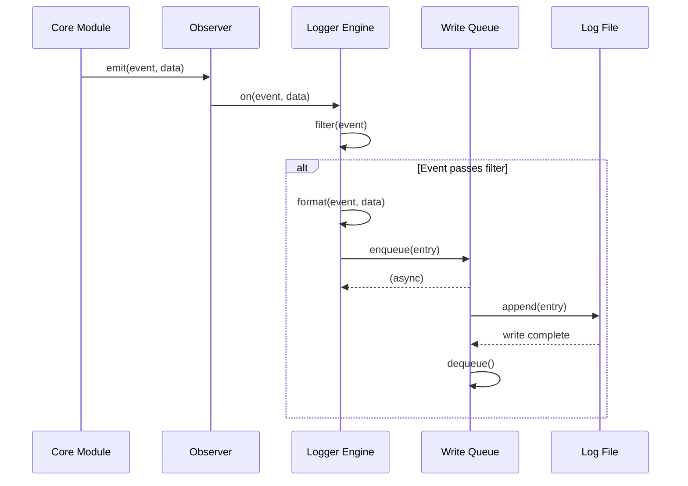

# Logger


## Overview

The Logger extends ObserverEngine to provide persistent file logging for noorm operations. It captures observer events and streams them to a log file using a queue-based write system that guarantees delivery.


## Architecture




## Logger Engine

The Logger extends the base ObserverEngine to intercept all events:

```
Logger extends ObserverEngine
├── subscribeAll()          # Listen to all events
├── filter(event)           # Determine if event should be logged
├── format(event, data)     # Convert to log entry
├── enqueue(entry)          # Add to write queue
└── flush()                 # Force queue drain
```


## Write Queue

The queue guarantees ordered, streaming writes to the log file:



**Queue behavior:**

- Entries enqueued immediately (non-blocking to caller)
- Writer processes entries sequentially
- Each write appends to file then dequeues
- Queue tracks pending count for shutdown checks


## Verbosity Levels

Settings control which events are captured:

| Level | Events Captured |
|-------|-----------------|
| `silent` | None |
| `error` | Errors only |
| `warn` | Errors + warnings |
| `info` | Errors + warnings + info (default) |
| `verbose` | All events |

**Verbose mode:**

When settings specify verbose logging:

```
on event:
    format entry with full payload
    include timestamp, event name, all data fields
    enqueue for file write
```


## Log Entry Format

Each log entry contains:

```
LogEntry
├── timestamp: ISO 8601
├── level: error | warn | info | debug
├── event: string              # Observer event name
├── message: string            # Human-readable summary
├── data: object               # Event payload (verbose only)
└── context: object            # Config name, identity, etc.
```

**File format (one JSON object per line):**

```
{"timestamp":"2024-01-15T10:30:00.000Z","level":"info","event":"build:start","message":"Starting schema build","context":{"config":"dev"}}
{"timestamp":"2024-01-15T10:30:01.234Z","level":"info","event":"file:after","message":"Executed 001_users.sql","data":{"filepath":"schema/001_users.sql","status":"success","durationMs":45}}
```


## Event Classification

Events are automatically classified by level:

| Pattern | Level | Examples |
|---------|-------|----------|
| `error` | error | `error`, `connection:error` |
| `*:failed`, `*:error` | error | `file:failed`, `changeset:error` |
| `*:warning` | warn | `version:warning` |
| `*:start`, `*:complete` | info | `build:start`, `build:complete` |
| Everything else | debug | `file:before`, `lock:acquiring` |


## Configuration

Logger settings in `.noorm/settings.yml`:

```yaml
logging:
    enabled: true
    level: info              # Minimum level to capture
    file: .noorm/noorm.log   # Log file path
    maxSize: 10mb            # Rotate when exceeded
    maxFiles: 5              # Keep N rotated files
```


## Data Flow




## Integration Points

| Module | Interaction |
|--------|-------------|
| Observer | Logger extends and subscribes to all events |
| Settings | Reads logging configuration |
| Lifecycle | Flushes queue before shutdown |
| Headless | Coordinates with JSON output mode |


## Observer Events

The logger itself emits events for its lifecycle:

| Event | Payload | When |
|-------|---------|------|
| `logger:started` | `{ file, level }` | Logger initialized |
| `logger:rotated` | `{ oldFile, newFile }` | Log file rotated |
| `logger:error` | `{ error }` | Write failure |
| `logger:flushed` | `{ entriesWritten }` | Queue drained |
