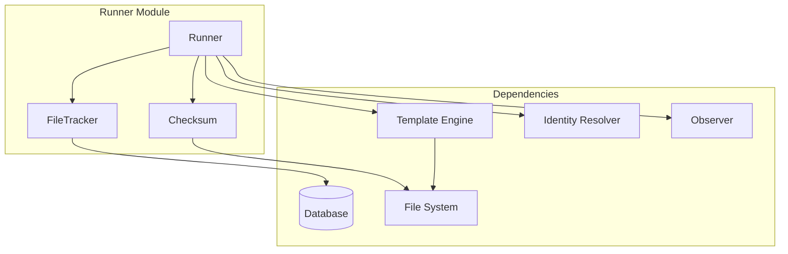
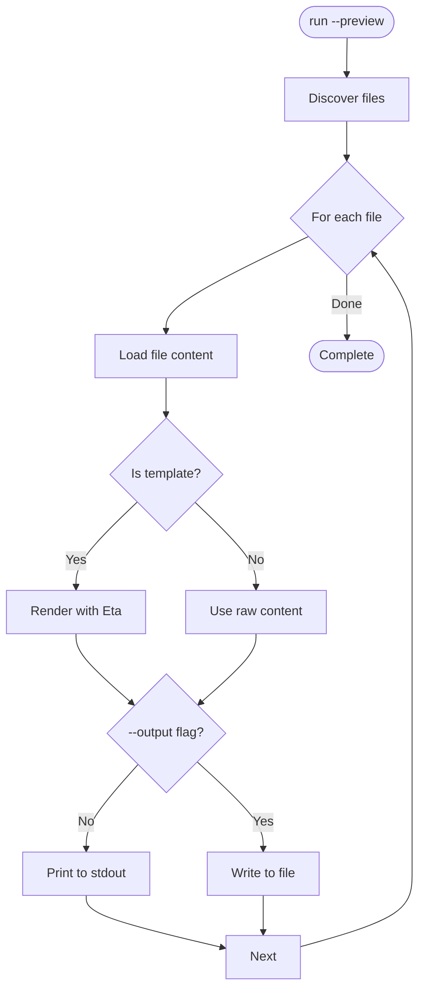
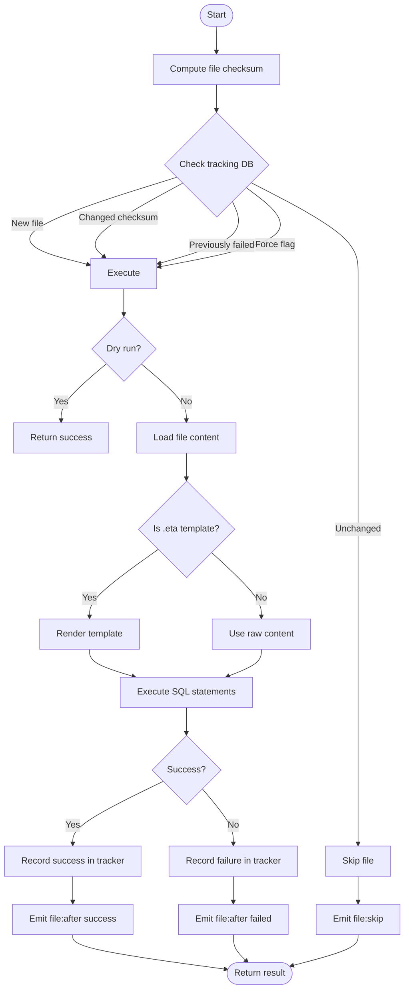
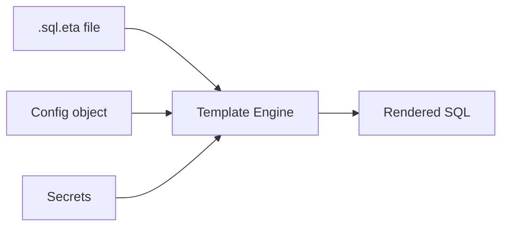

# Runner


## Overview

The Runner is responsible for executing SQL files against a database connection. It provides idempotent execution through checksum-based change detection and maintains an audit trail of all executions.


## Architecture




## Execution Modes

| Mode | Purpose | Input |
|------|---------|-------|
| **Build** | Execute all files in schema directory | Schema path from config |
| **File** | Execute a single SQL file | File path |
| **Dir** | Execute all SQL files in a directory | Directory path |

All modes follow the same execution pipeline per file, differing only in file discovery.


## File Structure

```
src/core/runner/
├── index.ts           # Public exports
├── runner.ts          # Main runner orchestration
├── tracker.ts         # Execution tracking (DB operations)
├── checksum.ts        # File hashing utilities
└── types.ts           # Shared interfaces
```


## Data Models


### File Result

Returned after executing a single file:

| Field | Description |
|-------|-------------|
| `filepath` | Absolute path to the file |
| `checksum` | SHA-256 of file contents |
| `status` | `success`, `failed`, or `skipped` |
| `skipReason` | Why skipped: `unchanged` or `already-run` |
| `durationMs` | Execution time in milliseconds |
| `error` | Error message if failed |


### Tracked File Record

Persisted in `__noorm_executions__` table (child of `__noorm_changeset__`):

| Field | Description |
|-------|-------------|
| `changeset_id` | FK to parent operation (build, run, or changeset) |
| `filepath` | File path |
| `file_type` | `'sql'` or `'txt'` |
| `checksum` | SHA-256 of file contents |
| `status` | `'success'`, `'failed'`, or `'skipped'` |
| `skip_reason` | Why skipped: `'unchanged'`, `'already-run'` |
| `error_message` | Error details if failed |
| `duration_ms` | Execution time |

**Parent operation record** (`__noorm_changeset__`):

| Field | Description |
|-------|-------------|
| `name` | Operation identifier (e.g., `build:2024-01-15T10:30:00` or `run:2024-01-15T10:30:00`) |
| `change_type` | `'build'` or `'run'` for runner operations |
| `checksum` | SHA-256 of sorted file checksums |
| `executed_by` | Identity string |
| `config_name` | Which config was used |

See [changeset.md](./changeset.md) for full schema.


### Run Options

| Option | Default | Description |
|--------|---------|-------------|
| `force` | `false` | Re-run even if unchanged |
| `concurrency` | `1` | Parallel file execution (1 for DDL safety) |
| `abortOnError` | `true` | Stop on first failure |
| `dryRun` | `false` | Report what would run without executing |
| `preview` | `false` | Output rendered SQL without executing |
| `output` | `null` | Write rendered SQL to file path |


## Preview Mode

The `--preview` flag renders SQL files (including templates) and outputs the result without executing against the database.

**Preview flow:**



**Use cases:**

| Scenario | Command |
|----------|---------|
| Preview single file | `noorm run file schema/001.sql --preview` |
| Preview all SQL to stdout | `noorm run build --preview` |
| Export rendered SQL to file | `noorm run build --preview --output build.sql` |
| Debug template rendering | `noorm run file seed.sql.eta --preview` |

**Output format:**

When writing to stdout or file, each SQL file is delimited:

```sql
-- ============================================================
-- File: schema/tables/001_users.sql
-- ============================================================

CREATE TABLE users (
    id SERIAL PRIMARY KEY,
    ...
);

-- ============================================================
-- File: schema/tables/002_posts.sql
-- ============================================================

CREATE TABLE posts (
    ...
);
```

**Integration with templates:**

Preview mode fully renders templates with the current config context, allowing verification of:

- Template syntax correctness
- Variable interpolation
- Conditional logic branches
- Data file loading


## Execution Flow




## Change Detection Logic

The tracker determines if a file needs to run:

```
needsRun(filepath, checksum, force):
    if force → run (reason: force)

    record = getTrackingRecord(filepath)

    if no record → run (reason: new)
    if record.status == 'failed' → run (reason: failed)
    if record.checksum != checksum → run (reason: changed)

    → skip (unchanged)
```

This ensures:
- New files always run
- Failed files are retried automatically
- Changed files are re-executed
- Unchanged successful files are skipped


## Tracking Tables

Runner operations use the unified tracking model. Every build or run creates a parent record in `__noorm_changeset__` with individual files in `__noorm_executions__`.

**Operation flow:**

```
1. Create parent record in __noorm_changeset__
   - name: "build:{timestamp}" or "run:{timestamp}"
   - change_type: 'build' or 'run'
   - direction: 'change'
   - status: 'pending'

2. For each file:
   - Create child record in __noorm_executions__
   - Execute SQL
   - Update child status (success/failed/skipped)

3. Update parent status based on children
```

**Change detection** queries `__noorm_executions__` to find the most recent execution of each file for the current config. Files are re-run if:
- No previous execution exists (new)
- Previous execution failed
- Checksum differs (changed)
- Force flag is set

See [changeset.md](./changeset.md) for full table schemas.


## Template Processing

Files ending in `.sql.eta` are processed through the template engine before execution:



Template context includes:
- `config` - Current configuration object
- `secrets` - Decrypted secrets from state
- `basePath` - Directory containing the template


## Observer Events

| Event | When | Data |
|-------|------|------|
| `build:start` | Beginning schema build | `{ schemaPath, fileCount }` |
| `build:complete` | Schema build finished | `{ status, filesRun, filesSkipped, durationMs }` |
| `run:file` | Single file execution started | `{ filepath, configName }` |
| `run:dir` | Directory execution started | `{ dirpath, fileCount, configName }` |
| `file:before` | About to execute a file | `{ filepath, checksum, configName }` |
| `file:after` | File execution completed | `{ filepath, status, durationMs, error? }` |
| `file:skip` | File skipped | `{ filepath, reason }` |
| `error` | Any error during execution | `{ source, error, context }` |


## SQL Execution

SQL files may contain multiple statements separated by semicolons. Each statement is executed sequentially within a single file.

For complex SQL with embedded semicolons (strings, procedures), use single-statement files.


## File Discovery

When scanning directories:
1. Recursively traverse subdirectories
2. Include files ending in `.sql` or `.sql.eta`
3. Sort alphabetically for deterministic order

Use numeric prefixes (`001_`, `002_`) to control execution order.


## Concurrency Model

Default concurrency is 1 (sequential) for DDL safety. Most schema operations require sequential execution due to dependencies.

Higher concurrency can be used for independent DML operations (seeds, data migrations).


## Error Handling

| Scenario | Behavior |
|----------|----------|
| File not found | Fail immediately, emit error |
| Checksum computation fails | Fail file, record in tracker |
| Template rendering fails | Fail file, record in tracker |
| SQL execution fails | Fail file, record in tracker |
| `abortOnError: true` | Stop batch on first failure |
| `abortOnError: false` | Continue with remaining files |

Failed files are automatically retried on subsequent runs (status-based detection).


## Best Practices

1. **Number files for ordering** - Use `001_`, `002_` prefixes
2. **One DDL per file** - Complex statements in separate files
3. **Use templates for dynamic content** - Seeds, environment-specific config
4. **Don't modify executed files** - Create new changesets instead
5. **Check tracking table** - Use CLI to inspect execution history
