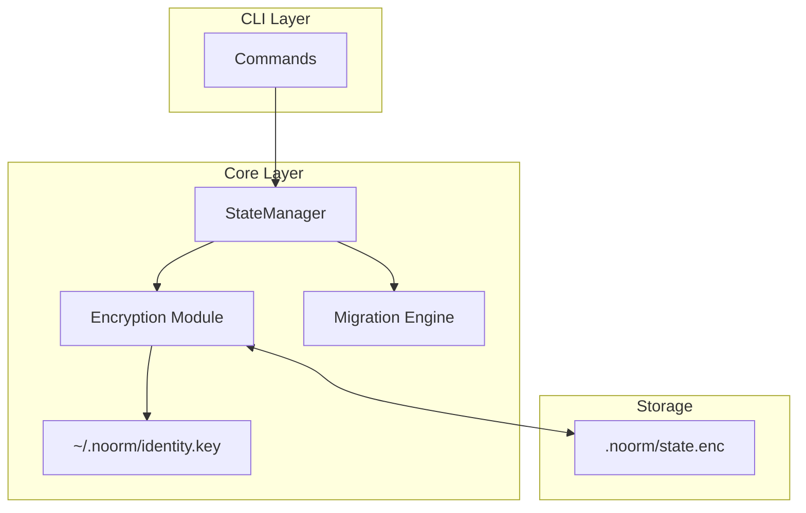
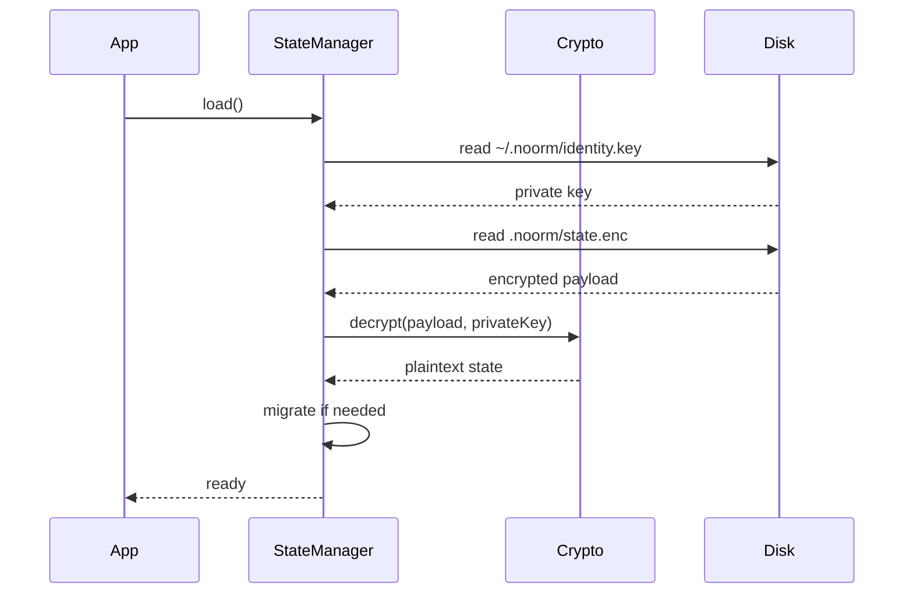
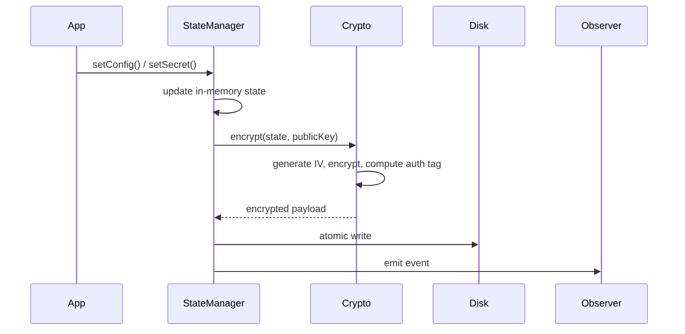
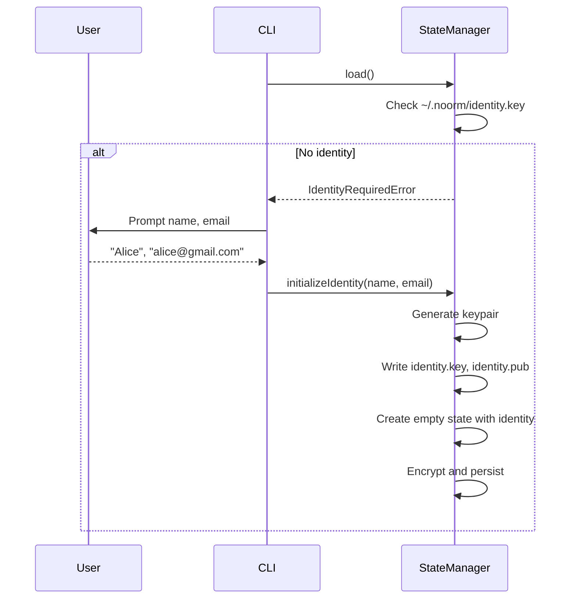

# State Management


## Overview

The StateManager is the foundation of noorm's persistence layer. It provides:

- **In-memory state** during program execution
- **Encrypted persistence** to disk using identity-based keys
- **Config storage** for database connection profiles
- **Secret management** at both config and global (app-level) scope
- **Identity storage** for cryptographic identity and known users
- **Schema migrations** when state structure evolves between versions


## Architecture


### Component Relationships




### Data Flow: Load State




### Data Flow: Persist State




## Data Model


### State Structure

```
State
├── version                     # Package version for migrations
├── identity                    # Cryptographic identity
│   ├── identityHash            # SHA-256(email + name + machine + os)
│   ├── name                    # "Alice Smith"
│   ├── email                   # "alice@gmail.com"
│   ├── publicKey               # X25519 public key (hex)
│   ├── machine                 # "alice-macbook-pro"
│   ├── os                      # "darwin 24.5.0"
│   └── createdAt               # ISO timestamp
├── knownUsers                  # Map<identityHash, KnownUser>
│   └── [identityHash]
│       ├── identityHash
│       ├── email
│       ├── name
│       ├── publicKey
│       ├── machine
│       ├── os
│       ├── lastSeen
│       └── source              # Config where discovered
├── activeConfig                # Currently selected config name (nullable)
├── configs                     # Map of config name -> Config
├── secrets                     # Map of config name -> (key -> value)
└── globalSecrets               # Map of key -> value (app-level)
```


### Config Summary

When listing configs, a lightweight summary is returned:

```
ConfigSummary
├── name
├── type                        # 'local' | 'remote'
├── isTest
├── protected
└── isActive
```


### Encrypted Payload

The on-disk format includes all cryptographic parameters needed for decryption:

```
EncryptedPayload
├── version                     # Payload format version
├── algorithm                   # 'aes-256-gcm'
├── iv                          # Initialization vector (hex)
├── authTag                     # Authentication tag (hex)
└── ciphertext                  # Encrypted state (hex)
```

Note: No salt needed. Key is derived from identity private key directly.


## Encryption Model


### Key Storage

The private key lives outside the encrypted state (bootstrap problem):

```
~/.noorm/
├── identity.key                # X25519 private key (hex, chmod 600)
└── identity.pub                # Public key for sharing
```


### Key Derivation

The encryption key is derived from the identity's private key:

```
key = HKDF(
    secret: privateKey,
    length: 32 bytes,
    info: 'noorm-state-encryption'
)
```

This ensures:
- State is **identity-bound** (whoever has the private key)
- Portable across machines (same user, different workstations)
- No passphrase needed (private key IS the secret)


### Encryption Process

```
encrypt(state, publicKey):
    # Derive key from public key's corresponding private key
    # (we encrypt with our own public key so we can decrypt with private)
    key = deriveStateKey(privateKey)

    iv = random(16 bytes)
    cipher = AES-256-GCM(key, iv)
    ciphertext = cipher.encrypt(JSON.stringify(state))
    authTag = cipher.getAuthTag()

    return { iv, ciphertext, authTag }
```


### Decryption Process

```
decrypt(payload, privateKey):
    key = deriveStateKey(privateKey)

    decipher = AES-256-GCM(key, payload.iv)
    decipher.setAuthTag(payload.authTag)

    plaintext = decipher.decrypt(payload.ciphertext)
    return JSON.parse(plaintext)
```


## First Run

When no identity exists, the first-run flow is triggered:




## Migration System

When the state schema changes between versions, migrations ensure users don't lose data.


### Migration Logic

```
migrateState(state, currentVersion):
    previousVersion = state.version

    # Apply defaults for any missing fields
    migrated = {
        version: currentVersion,
        identity: state.identity ?? null,
        knownUsers: state.knownUsers ?? {},
        activeConfig: state.activeConfig ?? null,
        configs: state.configs ?? {},
        secrets: state.secrets ?? {},
        globalSecrets: state.globalSecrets ?? {},
    }

    if previousVersion != currentVersion:
        emit('state:migrated', { from: previousVersion, to: currentVersion })

    return migrated

needsMigration(state, currentVersion):
    return state.version != currentVersion
        or missing required fields
```


## Operations


### Identity Operations

| Operation | Description |
|-----------|-------------|
| `getIdentity()` | Get current user's identity |
| `hasIdentity()` | Check if identity is set up |
| `initializeIdentity(name, email)` | First-time identity setup |
| `getKnownUsers()` | Get all known users |
| `addKnownUser(user)` | Add/update a known user |
| `getKnownUser(email)` | Get a specific known user |


### Config Operations

| Operation | Description |
|-----------|-------------|
| `getConfig(name)` | Retrieve a config by name |
| `setConfig(name, config)` | Create or update a config |
| `deleteConfig(name)` | Remove a config and its secrets |
| `listConfigs()` | Get summaries of all configs |
| `getActiveConfig()` | Get the currently active config |
| `setActiveConfig(name)` | Set which config is active |


### Secret Operations

Config-scoped secrets are tied to a specific config:

| Operation | Description |
|-----------|-------------|
| `getSecret(config, key)` | Get a secret for a config |
| `setSecret(config, key, value)` | Store a secret for a config |
| `deleteSecret(config, key)` | Remove a secret |
| `listSecrets(config)` | List secret keys for a config |


### Global Secret Operations

Global secrets are app-level, not tied to any config:

| Operation | Description |
|-----------|-------------|
| `getGlobalSecret(key)` | Get an app-level secret |
| `setGlobalSecret(key, value)` | Store an app-level secret |
| `deleteGlobalSecret(key)` | Remove an app-level secret |
| `listGlobalSecrets()` | List all global secret keys |


### Utility Operations

| Operation | Description |
|-----------|-------------|
| `getVersion()` | Get the package version |
| `exists()` | Check if state file exists |
| `exportConfig(name, recipientPubKey)` | Export config encrypted for recipient |
| `importConfig(payload)` | Import config from encrypted payload |


## Observer Events

| Event | Payload | When |
|-------|---------|------|
| `state:loaded` | `{ configCount, activeConfig, version }` | State loaded from disk |
| `state:persisted` | `{ configCount }` | State saved to disk |
| `state:migrated` | `{ from, to }` | State migrated to new version |
| `identity:created` | `{ identityHash, name, email, machine }` | First-time identity setup |
| `identity:updated` | `{ field }` | Identity field changed |
| `config:created` | `{ name }` | New config added |
| `config:updated` | `{ name, fields }` | Config modified |
| `config:deleted` | `{ name }` | Config removed |
| `config:activated` | `{ name, previous }` | Active config changed |
| `config:exported` | `{ name, recipient }` | Config exported for sharing |
| `config:imported` | `{ name, from }` | Config imported |
| `secret:set` | `{ configName, key }` | Config secret set |
| `secret:deleted` | `{ configName, key }` | Config secret removed |
| `global-secret:set` | `{ key }` | Global secret set |
| `global-secret:deleted` | `{ key }` | Global secret removed |
| `known-user:added` | `{ email, source }` | New user discovered |
| `error` | `{ source: 'state', error }` | Any error |


## Error Scenarios

| Error | Cause | Resolution |
|-------|-------|------------|
| Identity required | No ~/.noorm/identity.key | Run first-time setup |
| State not loaded | Called method before `load()` | Always call `load()` first |
| Decryption failed | Corrupted state or wrong key | Restore backup or re-init |
| Config not found | Referencing non-existent config | Create the config first |
| Invalid state format | Corrupted or tampered state | Restore from backup |


## Security Model


### Guarantees

1. **Identity-bound** - State encrypted with user's private key
2. **Tamper-evident** - Auth tag detects any modification
3. **No plaintext** - Secrets never touch disk unencrypted
4. **Portable** - Same identity works across machines


### Limitations

- **Private key loss** - If ~/.noorm/identity.key is lost, state is inaccessible
- **No key rotation** - Must export configs, re-init identity, re-import
- **Single user per state** - State file tied to one identity


## File Locations

| File | Purpose | Permissions |
|------|---------|-------------|
| `~/.noorm/identity.key` | Private key | 600 |
| `~/.noorm/identity.pub` | Public key (for sharing) | 644 |
| `.noorm/state.enc` | Encrypted state (project-local) | 644 |
