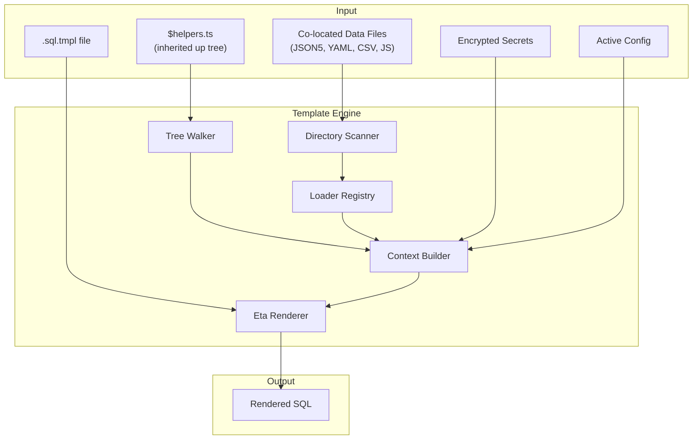
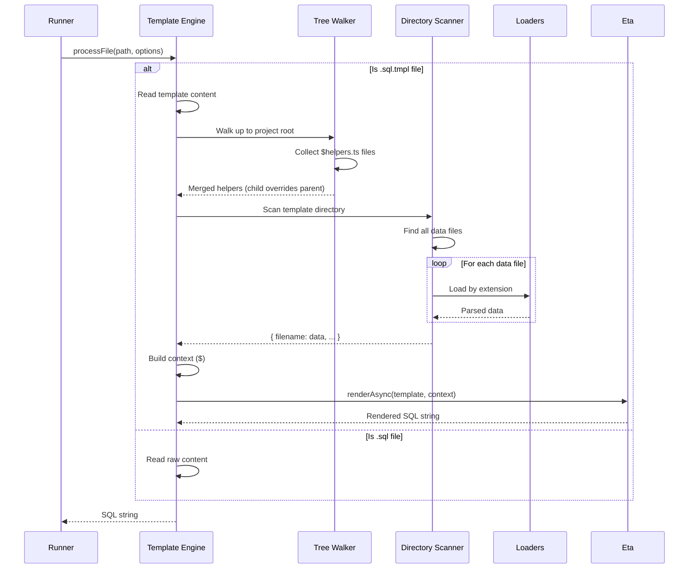

# Template Engine


## Overview

noorm uses [Eta](https://eta.js.org/) for dynamic SQL generation with a custom syntax and auto-loading data files. Templates enable:

- **Auto-loading** data files from the template's directory
- **Inherited helpers** via `$helpers.ts` files up the directory tree
- Accessing secrets and config values
- Including other SQL files
- Full JavaScript logic for complex generation


## Custom Syntax

noorm uses modified Eta delimiters for cleaner SQL templates:

| Syntax | Purpose |
|--------|---------|
| `` | JavaScript code block |
| `` | Output (escaped) |
| `` | Output (raw) |
| `$` | Context variable |

**Note:** Auto-escaping is disabled since SQL doesn't need HTML escaping. Use `` for all output.


## Architecture




## Data Flow




## Core Concepts


### File Detection

Templates are identified by the `.tmpl` extension suffix:

| Extension | Type | Processing |
|-----------|------|------------|
| `.sql` | Raw SQL | Returned as-is |
| `.sql.tmpl` | Template | Rendered then returned |


### Helper Inheritance

Helper files named `$helpers.ts` or `$helpers.js` are automatically loaded and inherited up the directory tree. Child helpers override parent helpers.

```
sql/
├── $helpers.ts                  # Project-wide helpers
├── users/
│   ├── $helpers.ts              # Overrides/extends parent
│   ├── 001_create.sql.tmpl      # Has access to both
│   └── roles.json5
└── products/
    └── 001_create.sql.tmpl      # Only has project-wide helpers
```

**Resolution order** (later overrides earlier):
1. Project root `$helpers.ts`
2. Parent directories `$helpers.ts`
3. Template's directory `$helpers.ts`

**Helper file format:**

```typescript
// sql/$helpers.ts
export function padId(id: number, length = 6): string {

    return String(id).padStart(length, '0')
}

export function formatDate(date: Date): string {

    return date.toISOString().split('T')[0]
}

export const constants = {
    MAX_RETRIES: 3,
    DEFAULT_TIMEOUT: 5000,
}
```

Helpers are available on the `$` context:

```sql
-- sql/users/001_create.sql.tmpl
INSERT INTO users (id, created_at) VALUES
    ('', '');
```


### Auto-Loading Data Files

Data files in the same directory as the template are automatically loaded and made available as `$.<filename>`:

```
sql/users/
├── 001_create_users.sql.tmpl    # Template
├── roles.json5                   # → $.roles
├── config.yml                    # → $.config
└── seed-data.csv                # → $.seedData (camelCase)
```

File names are converted to camelCase property names using [Voca.js](https://vocajs.com/):
- `my-config.json5` → `$.myConfig`
- `seed_data.yml` → `$.seedData`
- `API_KEYS.json5` → `$.apiKeys`


### Template Context

When rendering, templates receive a `$` context object with:

| Property | Description |
|----------|-------------|
| `$.<helper>` | Functions/values from inherited `$helpers.ts` files |
| `$.<filename>` | Auto-loaded data from co-located files |
| `$.config` | Active configuration object (if no config.* file exists) |
| `$.secrets` | Decrypted secrets for active config |
| `$.globalSecrets` | Decrypted global secrets (shared across configs) |
| `$.env` | Environment variables |
| `$.include(path)` | Include another SQL file |
| `$.escape(value)` | SQL-escape a string |
| `$.quote(value)` | Escape and wrap in quotes |
| `$.json(value)` | JSON stringify |
| `$.now()` | Current ISO timestamp |
| `$.uuid()` | Generate UUID |

**Note:** If a file named `config.json5` or `config.yml` exists in the template directory, it will override the active config. Use a different filename (e.g., `settings.yml`) to avoid conflicts.


### Loader Registry

The engine supports multiple data formats:

```
Extension → Loader → Parsed Result
─────────────────────────────────────
.json     → JSON5.parse     → any
.json5    → JSON5.parse     → any
.yaml     → yaml.parse      → any
.yml      → yaml.parse      → any
.csv      → csv-parse       → Record<string, string>[]
.js       → dynamic import  → module.default or module
.mjs      → dynamic import  → module.default or module
.ts       → dynamic import  → module.default or module
.sql      → read text       → string
```

**JSON5 features:**
- Comments (`//` and `/* */`)
- Trailing commas
- Unquoted keys
- Single-quoted strings
- Multi-line strings

Loaders are resolved by file extension and cached per render to avoid duplicate reads.


## Template Syntax


### Basic Output

```sql
-- sql/Types/TypesAndErrors.sql.tmpl

IF NOT EXISTS (SELECT 1 FROM sys.types WHERE [name] = '')
BEGIN
    CREATE TYPE [] FROM  NOT NULL;
END

```

With `sql/Types/custom.yml`:

```yaml
DataTypes:
    ShortString: "VARCHAR(50)"
    LongString: "VARCHAR(500)"
    Money: "DECIMAL(19,4)"
```


### Using Helpers

```sql
-- sql/users/002_seed.sql.tmpl


INSERT INTO users (id, name, created_at) VALUES

    ('', , ''),
;
```


### Conditionals

```sql
CREATE INDEX idx_users_email ON users(email);


CREATE INDEX idx_users_email_lower ON users(LOWER(email));

```


### Loops

```sql


INSERT INTO roles (name) VALUES

    (''),
;
```


### Loading External Data

With co-located `users.json5`:

```json5
// User seed data
[
    { email: "admin@example.com", name: "Admin" },
    { email: "user@example.com", name: "User" },  // trailing comma OK
]
```

Template:

```sql
INSERT INTO users (email, name) VALUES

    (, ),
;
```


### Using Secrets

```sql
INSERT INTO config (key, value) VALUES
    ('api_key', ''),
    ('api_url', '');
```


### Including SQL Fragments

```sql
-- Include common functions


-- Include triggers

```


## Integration


### With Runner

```
Runner requests SQL content
    ↓
Engine detects .tmpl extension
    ↓
Walk up directory tree for $helpers.ts
    ↓
Merge helpers (child overrides parent)
    ↓
Scan directory for data files
    ↓
Auto-load all data files into $
    ↓
Add config, secrets, built-in helpers to $
    ↓
Template rendered with Eta
    ↓
SQL returned to runner for execution
```


### Observer Events

| Event | Payload | Description |
|-------|---------|-------------|
| `template:helpers` | `{ filepath, count }` | Helper file loaded |
| `template:load` | `{ filepath, format }` | Data file loaded |
| `template:render` | `{ filepath, durationMs }` | Template rendered |
| `error` | `{ source: 'template', error, context }` | Render/load failure |


## Security Considerations

1. **SQL Injection** - Always use `$.quote()` or `$.escape()` for dynamic values
2. **Secret Exposure** - Secrets are available in templates; rendered SQL should not be logged
3. **JS Execution** - `$helpers.ts` and `.js`/`.mjs` loaders execute arbitrary code; only load trusted files
4. **Path Traversal** - `include()` resolves relative to template's directory; cannot escape project root


## Dependencies

```json
{
    "eta": "^3.5.0",
    "json5": "^2.2.3",
    "yaml": "^2.8.0",
    "csv-parse": "^5.6.0",
    "voca": "^1.4.1"
}
```


## File Structure

```
src/core/template/
├── index.ts           # Public exports
├── engine.ts          # Eta wrapper, render methods
├── context.ts         # Context builder with auto-loading
├── helpers.ts         # Tree walker for $helpers.ts inheritance
├── loaders/
│   ├── index.ts       # Loader registry
│   ├── json5.ts       # JSON5 loader
│   ├── yaml.ts
│   ├── csv.ts
│   ├── js.ts          # JS/TS dynamic import
│   └── sql.ts
├── utils.ts           # String transforms via Voca
└── types.ts
```
