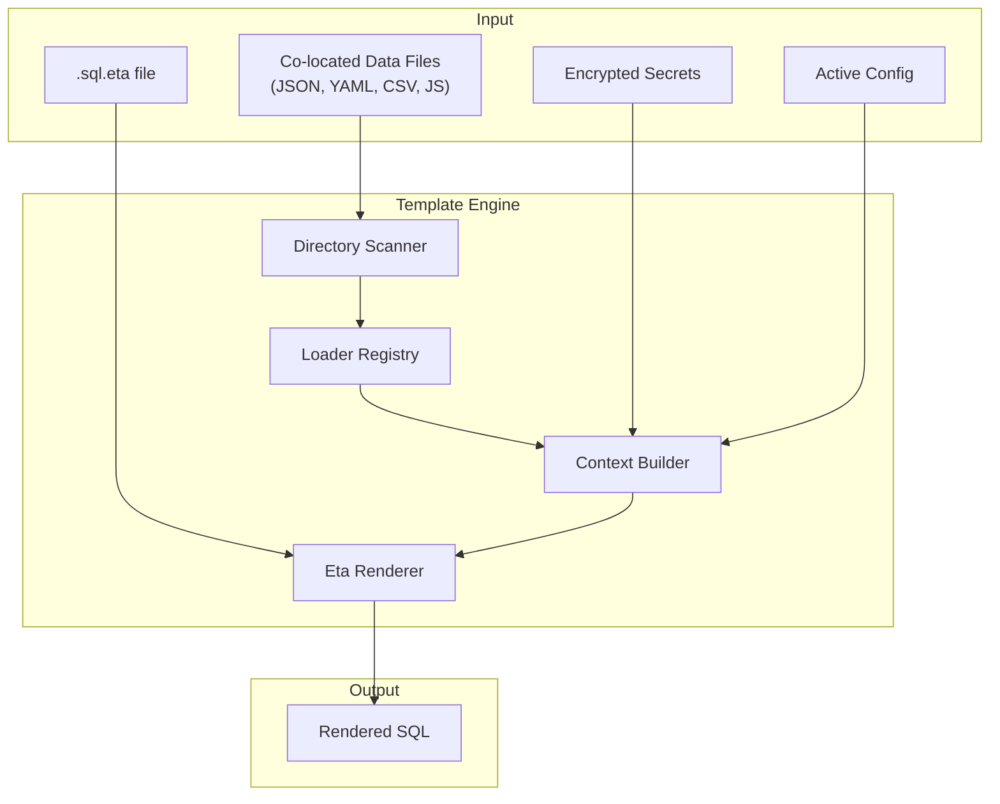
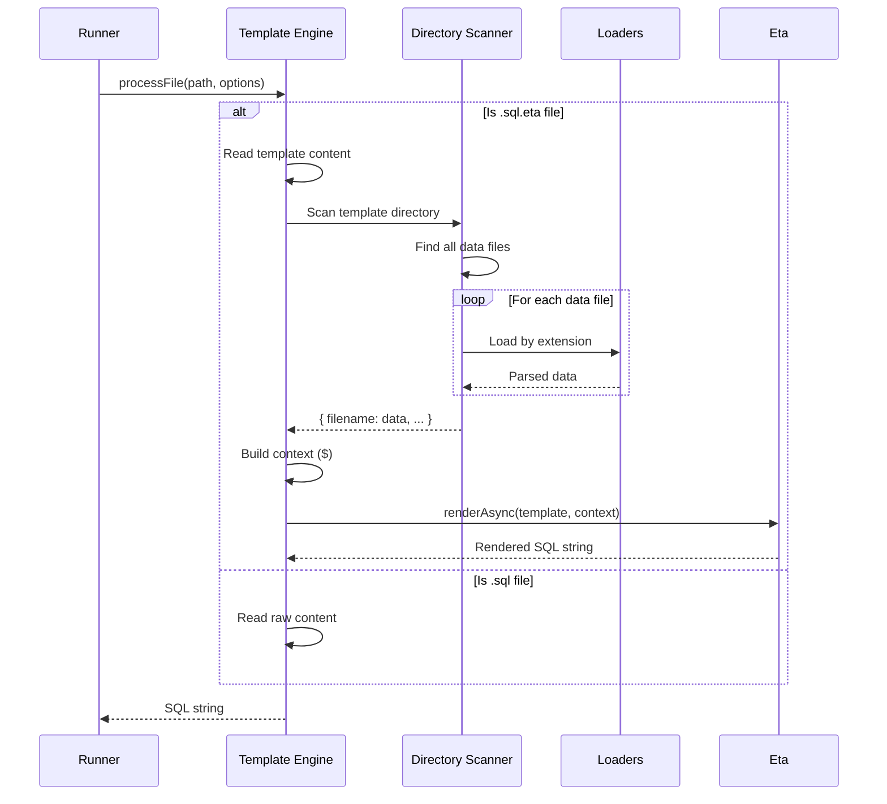

# Template Engine


## Overview

noorm uses [Eta](https://eta.js.org/) for dynamic SQL generation with a custom syntax and auto-loading data files. Templates enable:

- **Auto-loading** data files from the template's directory
- Accessing secrets and config values
- Including other SQL files
- Full JavaScript logic for complex generation


## Custom Syntax

noorm uses modified Eta delimiters to avoid confusion with default Eta syntax:

| Default Eta | noorm | Purpose |
|-------------|-------|---------|
| `<% %>` | `` | JavaScript code |
| `<%= %>` | `<%~ %>` | Output (escaped) |
| `<%~ %>` | `<%~ %>` | Output (raw) |
| `it` | `$` | Context variable |


## Architecture




## Data Flow




## Core Concepts


### File Detection

Templates are identified by the `.eta` extension suffix:

| Extension | Type | Processing |
|-----------|------|------------|
| `.sql` | Raw SQL | Returned as-is |
| `.sql.eta` | Template | Rendered then returned |


### Auto-Loading

Data files in the same directory as the template are automatically loaded and made available as `$.<filename>`:

```
sql/users/
├── 001_create_users.sql.eta    # Template
├── roles.json                   # → $.roles
├── config.yml                   # → $.config
└── seed-data.csv               # → $.seedData (camelCase)
```

File names are converted to camelCase property names:
- `my-config.json` → `$.myConfig`
- `seed_data.yml` → `$.seedData`
- `API_KEYS.json` → `$.apiKeys`


### Template Context

When rendering, templates receive a `$` context object with:

| Property | Description |
|----------|-------------|
| `$.<filename>` | Auto-loaded data from co-located files |
| `$.config` | Active configuration object (if no config.* file exists) |
| `$.secrets` | Decrypted secrets for active config |
| `$.globalSecrets` | Decrypted global secrets (shared across configs) |
| `$.env` | Environment variables |
| `$.include(path)` | Include another SQL file |
| `$.escape(value)` | SQL-escape a string |
| `$.quote(value)` | Escape and wrap in quotes |
| `$.json(value)` | JSON stringify |
| `$.now()` | Current ISO timestamp |
| `$.uuid()` | Generate UUID |

**Note:** If a file named `config.json` or `config.yml` exists in the template directory, it will override the active config. Use a different filename (e.g., `settings.yml`) to avoid conflicts.


### Loader Registry

The engine supports multiple data formats:

```
Extension → Loader → Parsed Result
─────────────────────────────────────
.json     → JSON.parse      → any
.yaml     → yaml.parse      → any
.yml      → yaml.parse      → any
.csv      → csv-parse       → Record<string, string>[]
.js       → dynamic import  → module.default or module
.mjs      → dynamic import  → module.default or module
.sql      → read text       → string
```

Loaders are resolved by file extension and cached per render to avoid duplicate reads.


## Template Syntax


### Basic Output

```sql
-- sql/Types/TypesAndErrors.sql.eta

IF NOT EXISTS (SELECT 1 FROM sys.types WHERE [name] = '<%~ name %>')
BEGIN
    CREATE TYPE [<%~ name %>] FROM <%~ value %> NOT NULL;
END

```

With `sql/Types/custom.yml`:

```yaml
DataTypes:
    ShortString: "VARCHAR(50)"
    LongString: "VARCHAR(500)"
    Money: "DECIMAL(19,4)"
```


### Conditionals

```sql
CREATE INDEX idx_users_email ON users(email);


CREATE INDEX idx_users_email_lower ON users(LOWER(email));

```


### Loops

```sql


INSERT INTO roles (name) VALUES

    ('<%~ role %>'),
;
```


### Loading External Data

With co-located `users.json`:

```json
[
    { "email": "admin@example.com", "name": "Admin" },
    { "email": "user@example.com", "name": "User" }
]
```

Template:

```sql
INSERT INTO users (email, name) VALUES

    (<%~ $.quote(user.email) %>, <%~ $.quote(user.name) %>),
;
```


### Using Secrets

```sql
INSERT INTO config (key, value) VALUES
    ('api_key', '<%~ $.secrets.API_KEY %>'),
    ('api_url', '<%~ $.env.API_URL || 'https://api.example.com' %>');
```


### Including SQL Fragments

```sql
-- Include common functions
<%~ await $.include('lib/uuid_function.sql') %>

-- Include triggers
<%~ await $.include('lib/audit_triggers.sql') %>
```


## Integration


### With Runner

```
Runner requests SQL content
    ↓
Engine detects .eta extension
    ↓
Scan directory for data files
    ↓
Auto-load all data files into $
    ↓
Add config, secrets, helpers to $
    ↓
Template rendered with Eta
    ↓
SQL returned to runner for execution
```


### Observer Events

| Event | Payload | Description |
|-------|---------|-------------|
| `template:load` | `{ filepath, format }` | Data file loaded |
| `template:render` | `{ filepath, durationMs }` | Template rendered |
| `error` | `{ source: 'template', error, context }` | Render/load failure |


## Security Considerations

1. **SQL Injection** - Always use `$.quote()` or `$.escape()` for dynamic values
2. **Secret Exposure** - Secrets are available in templates; rendered SQL should not be logged
3. **JS Execution** - `.js`/`.mjs` loaders execute arbitrary code; only load trusted files
4. **Path Traversal** - `include()` resolves relative to template's directory


## Dependencies

```json
{
    "eta": "^3.5.0",
    "yaml": "^2.8.0",
    "csv-parse": "^5.6.0"
}
```


## File Structure

```
src/core/template/
├── index.ts           # Public exports
├── engine.ts          # Eta wrapper, render methods
├── context.ts         # Context builder with auto-loading
├── loaders/
│   ├── index.ts       # Loader registry
│   ├── json.ts
│   ├── yaml.ts
│   ├── csv.ts
│   ├── js.ts
│   └── sql.ts
└── types.ts
```
