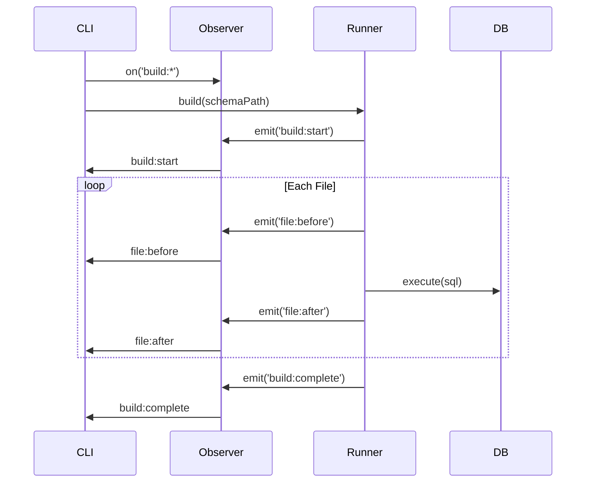
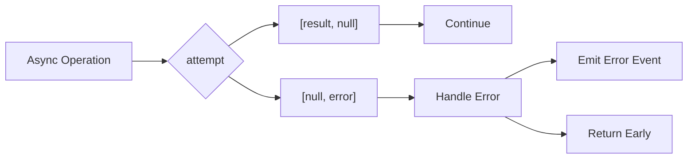
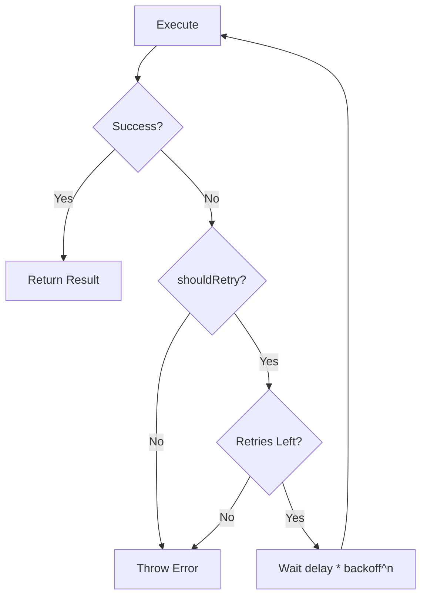
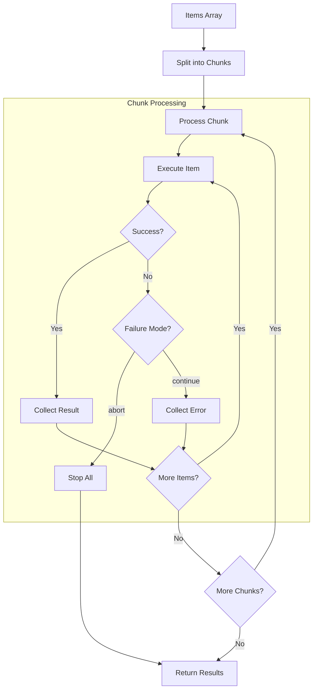
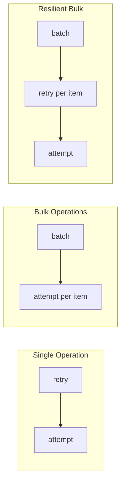

# Utils


## Observer


Central event system for noorm. Core modules emit events, CLI subscribes.


### Architecture

```
┌─────────────────────────────────────────────────────────────────┐
│                         Observer                                │
│                    (singleton instance)                         │
└─────────────────────────────────────────────────────────────────┘
        ▲                                           │
        │ emit()                                    │ on()
        │                                           ▼
┌───────┴───────────────────────┐   ┌─────────────────────────────┐
│         Core Modules          │   │        Subscribers          │
│  ┌─────────┐ ┌─────────────┐  │   │  ┌─────────┐ ┌───────────┐  │
│  │  State  │ │  Connection │  │   │  │   CLI   │ │  Headless │  │
│  └─────────┘ └─────────────┘  │   │  │ (React) │ │   (JSON)  │  │
│  ┌─────────┐ ┌─────────────┐  │   │  └─────────┘ └───────────┘  │
│  │ Runner  │ │    Lock     │  │   │  ┌─────────┐ ┌───────────┐  │
│  └─────────┘ └─────────────┘  │   │  │  Debug  │ │  Logging  │  │
│  ┌─────────┐ ┌─────────────┐  │   │  └─────────┘ └───────────┘  │
│  │Changeset│ │   Template  │  │   │                             │
│  └─────────┘ └─────────────┘  │   │                             │
└───────────────────────────────┘   └─────────────────────────────┘
```


### Event Categories

| Prefix | Source | Purpose |
|--------|--------|---------|
| `file:*` | Runner | Individual SQL file execution lifecycle |
| `build:*` | Runner | Schema build operations |
| `run:*` | Runner | Ad-hoc file/directory execution |
| `changeset:*` | Changeset | Changeset execution lifecycle |
| `lock:*` | Lock | Lock acquisition and release |
| `state:*` | State | State load/persist |
| `config:*` | State | Configuration CRUD |
| `secret:*` | State | Secret CRUD |
| `db:*` | DB Lifecycle | Database create/destroy |
| `template:*` | Template | Template rendering |
| `identity:*` | Identity | Identity resolution |
| `connection:*` | Connection | Database connection lifecycle |
| `error` | Any | Catch-all error events |


### Event Flow Example




### Subscription Modes

| Mode | Use Case |
|------|----------|
| Exact match | Subscribe to specific event: `on('file:after', ...)` |
| Pattern match | Subscribe by regex: `on(/^file:/, ...)` |
| Wildcard | Subscribe to everything: `on(/.*/, ...)` |


### Debug Mode

When `NOORM_DEBUG=1` is set, the observer logs all events to stderr for debugging.


---


## Error Tuples


Go-style error handling using `attempt()` from `@logosdx/utils`.


### Pattern

Instead of try-catch blocks, async operations return `[result, error]` tuples:

```
[result, null]  → success
[null, error]   → failure
```


### When to Use

| Scenario | Approach |
|----------|----------|
| I/O operations (file, network, DB) | Use `attempt()` |
| Business logic validation | Throw directly |
| Pure computation | Throw directly |


### Data Flow




### Composability

Error tuples compose with other patterns:

- **With Observer**: On error, emit event before returning
- **With Retry**: Wrap retryable operations, then use attempt on result
- **With Batch**: Each batch item can use attempt internally


---


## Retry


Automatic retry with backoff for flaky operations.


### Use Cases

| Operation | Retry Behavior |
|-----------|----------------|
| Database connection | Retry on connection refused, timeout |
| Lock acquisition | Retry when lock is held by another |
| External API calls | Retry on transient failures |


### Configuration

| Option | Purpose |
|--------|---------|
| `retries` | Maximum retry attempts |
| `delay` | Initial delay between retries |
| `backoff` | Delay multiplier (exponential backoff) |
| `jitterFactor` | Randomness to prevent thundering herd |
| `shouldRetry` | Conditional retry based on error type |


### Retry Flow




### Non-Retryable Errors

Some errors should fail immediately:
- Authentication failures
- Permission denied
- Invalid configuration
- Validation errors


---


## Batch


Controlled concurrent processing of arrays.


### Use Cases

| Operation | Concurrency | Failure Mode |
|-----------|-------------|--------------|
| Schema build (DDL) | Sequential (1) | Abort on first failure |
| Seed data loading | Parallel (10+) | Abort on first failure |
| Changeset execution | Sequential (1) | Abort on first failure |
| File validation | Parallel (10+) | Continue, collect errors |


### Configuration

| Option | Purpose |
|--------|---------|
| `items` | Array to process |
| `concurrency` | Max parallel operations |
| `failureMode` | `'abort'` or `'continue'` |
| `onError` | Error callback per item |
| `onChunkStart/End` | Progress callbacks |


### Batch Flow




### Result Shape

Each batch returns an array of results with:
- `result`: The successful return value (or null)
- `error`: The caught error (or null)
- `item`: The original input item
- `index`: Position in original array


---


## Pattern Composition


These utilities compose together for resilient async operations:




### Composition Guidelines

| Pattern | Composition |
|---------|-------------|
| Flaky single operation | `attempt(retry(operation))` |
| Bulk with error handling | `batch(items, item => attempt(process(item)))` |
| Resilient bulk | `batch(items, item => attempt(retry(process(item))))` |


### Observer Integration

All patterns should emit observer events at key points:

| Pattern | Events |
|---------|--------|
| attempt | Emit `error` event on failure |
| retry | Could emit retry attempt events (optional) |
| batch | Emit progress events via `onChunkStart/End` |


---


## CLI Integration


### React Hooks

The CLI provides React hooks that bridge observer events to component state:

| Hook | Purpose |
|------|---------|
| `useEvent(event)` | Subscribe to single event, returns latest data |
| `useEventPattern(regex)` | Subscribe to pattern, returns event history |
| `useProgress()` | Aggregate build/changeset progress |
| `useLockStatus(config)` | Track lock state for a config |

These hooks handle subscription cleanup automatically via `useEffect`.


### Headless Mode

For CI/CD, events stream as:
- **JSON mode**: One JSON object per line (machine-parseable)
- **Text mode**: Human-readable formatted output

Both modes subscribe to the same observer events, just with different formatters.
