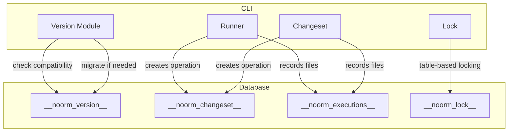
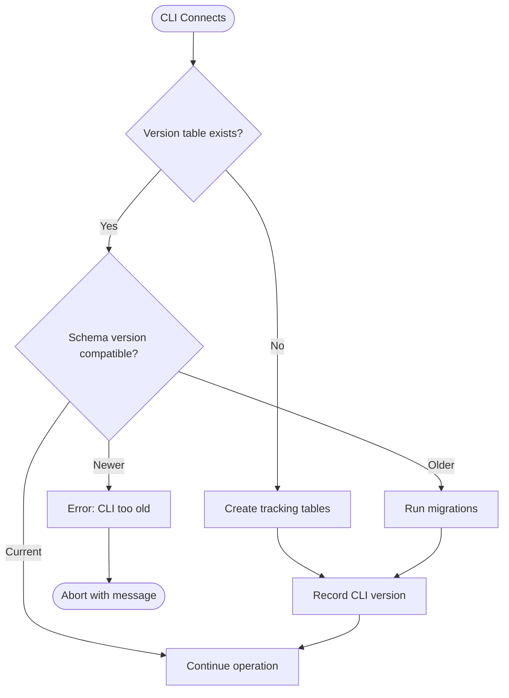

# Version Tracking


## Overview

noorm tracks CLI versions in the database to ensure compatibility between the tool and the schema it manages. This enables:

- Detection of version mismatches between CLI and tracking tables
- Safe migrations of tracking table schema when CLI is upgraded
- Audit trail of which CLI version applied each change


## Architecture




## Version Table

The `__noorm_version__` table stores CLI version information:

```
__noorm_version__
├── id: serial
├── cli_version: string        # semver (e.g., "1.2.3")
├── schema_version: integer    # Tracking table schema version
├── installed_at: timestamp
└── upgraded_at: timestamp     # Last upgrade time
```


## Compatibility Check Flow




## Version Recording

Each operation records the CLI version that performed it:

| Table | Field | Purpose |
|-------|-------|---------|
| `__noorm_changeset__` | `cli_version` | Version that created the operation |
| `__noorm_executions__` | `cli_version` | Version that executed the file |

This creates an audit trail showing exactly which CLI version performed each operation.


## Schema Migrations

When the CLI's tracking table schema evolves:

```
CLI Version → Schema Version
─────────────────────────────
1.0.0       → 1
1.2.0       → 2 (added cli_version columns)
2.0.0       → 3 (added new tracking fields)
```

**Migration flow:**

```
on connect:
    current_schema = get schema_version from __noorm_version__
    expected_schema = CLI's expected schema version

    if current_schema < expected_schema:
        for each migration from current_schema to expected_schema:
            apply migration
        update schema_version
        update upgraded_at

    if current_schema > expected_schema:
        error "CLI version too old for this database"
```


## Observer Events

| Event | Payload | When |
|-------|---------|------|
| `version:checked` | `{ cliVersion, schemaVersion }` | Version check completed |
| `version:migrating` | `{ from, to }` | Schema migration starting |
| `version:migrated` | `{ from, to, durationMs }` | Schema migration completed |
| `version:mismatch` | `{ cliVersion, dbVersion, required }` | Incompatible versions |


## Error Cases

| Scenario | Behavior |
|----------|----------|
| CLI newer than DB schema | Run migrations automatically |
| CLI older than DB schema | Error with upgrade instructions |
| Corrupted version table | Offer repair or re-bootstrap |


## Integration Points

| Module | Interaction |
|--------|-------------|
| Connection | Version check on first connect |
| Runner | Records CLI version on file execution |
| Changeset | Records CLI version on changeset apply |
| State | Stores expected schema version |
