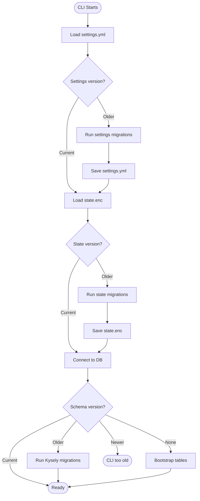

# Version & Migrations


## Overview

noorm tracks three independent version numbers for its persistence layers:

| Layer | Storage | Version Tracked In |
|-------|---------|-------------------|
| Schema | Database tracking tables | `__noorm_version__` table |
| State | `.noorm/state.enc` | Inside encrypted JSON |
| Settings | `.noorm/settings.yml` | Inside YAML file |

Each layer has its own version number, independent of the CLI package version. This allows:

- Stable state/settings while CLI evolves
- Targeted migrations (only upgrade what changed)
- Gradual rollout of changes across layers

For table schemas and data structures, see [Data Model Reference](./datamodel.md).


## Architecture

```
version/
├── index.ts                    # Unified version manager
├── types.ts                    # Shared types
│
├── schema/                     # Database tracking tables
│   ├── index.ts                # Schema version manager
│   ├── migrations/
│   │   ├── v1.ts               # Initial tables
│   │   ├── v2.ts               # Add column X
│   │   └── v3.ts               # Add table Y
│   └── tables.ts               # Table definitions (Kysely types)
│
├── state/                      # Encrypted state file
│   ├── index.ts                # State version manager
│   └── migrations/
│       ├── v1.ts               # Initial state shape
│       ├── v2.ts               # Add secrets field
│       └── v3.ts               # Add knownUsers field
│
└── settings/                   # Settings YAML file
    ├── index.ts                # Settings version manager
    └── migrations/
        ├── v1.ts               # Initial settings shape
        ├── v2.ts               # Add strict mode
        └── v3.ts               # Add logging config
```


## Version Numbers

Each layer maintains its own version, starting at 1:

```
Schema Version:   1 → 2 → 3  (database changes)
State Version:    1 → 2      (state.enc changes)
Settings Version: 1 → 2 → 3  (settings.yml changes)
```

These are **independent** of the package version. A CLI upgrade from 1.0.0 to 2.0.0 might:
- Keep schema at version 3
- Upgrade state from 1 to 2
- Keep settings at version 2

This decoupling means we only run migrations for what actually changed.


## Schema Migrations (Kysely)

Database migrations use Kysely's migration system. No raw SQL per dialect.

```typescript
// version/schema/migrations/v1.ts
import { Kysely, sql } from 'kysely'

export async function up(db: Kysely<unknown>): Promise<void> {

    await db.schema
        .createTable('__noorm_version__')
        .addColumn('id', 'serial', col => col.primaryKey())
        .addColumn('schema_version', 'integer', col => col.notNull())
        .addColumn('installed_at', 'timestamp', col => col.defaultTo(sql`now()`))
        .addColumn('upgraded_at', 'timestamp', col => col.defaultTo(sql`now()`))
        .execute()

    await db.schema
        .createTable('__noorm_changeset__')
        .addColumn('id', 'serial', col => col.primaryKey())
        .addColumn('name', 'varchar(255)', col => col.notNull())
        .addColumn('change_type', 'varchar(50)', col => col.notNull())
        // ... see datamodel.md for full schema
        .execute()

    // ... more tables per datamodel.md
}

export async function down(db: Kysely<unknown>): Promise<void> {

    await db.schema.dropTable('__noorm_executions__').execute()
    await db.schema.dropTable('__noorm_changeset__').execute()
    await db.schema.dropTable('__noorm_lock__').execute()
    await db.schema.dropTable('__noorm_identities__').execute()
    await db.schema.dropTable('__noorm_version__').execute()
}
```


## State Migrations

State migrations transform the decrypted JSON object:

```typescript
// version/state/migrations/v2.ts
import type { StateMigration } from '../types'

export const migration: StateMigration = {
    version: 2,
    description: 'Add globalSecrets field',

    up(state: Record<string, unknown>): Record<string, unknown> {

        return {
            ...state,
            globalSecrets: state['globalSecrets'] ?? {},
        }
    },

    down(state: Record<string, unknown>): Record<string, unknown> {

        const { globalSecrets, ...rest } = state
        return rest
    },
}
```


## Settings Migrations

Settings migrations transform the parsed YAML object:

```typescript
// version/settings/migrations/v2.ts
import type { SettingsMigration } from '../types'

export const migration: SettingsMigration = {
    version: 2,
    description: 'Add strict mode defaults',

    up(settings: Record<string, unknown>): Record<string, unknown> {

        return {
            ...settings,
            strict: settings['strict'] ?? {
                requireConfig: false,
                requireStage: false,
                requireIdentity: false,
            },
        }
    },

    down(settings: Record<string, unknown>): Record<string, unknown> {

        const { strict, ...rest } = settings
        return rest
    },
}
```


## Version Tracking

### Schema Version

Stored in the database itself (see `__noorm_version__` in [datamodel.md](./datamodel.md#__noorm_version__)):

```sql
SELECT schema_version FROM __noorm_version__ ORDER BY id DESC LIMIT 1
```

### State Version

Stored inside `state.enc` (after decryption):

```json
{
    "schemaVersion": 2,
    "configs": { ... },
    "secrets": { ... }
}
```

### Settings Version

Stored inside `settings.yml`:

```yaml
schemaVersion: 3

build:
    paths:
        - schema/**/*.sql
```


## Migration Flow




## Observer Events

| Event | Payload | When |
|-------|---------|------|
| `version:schema:checking` | `{ current }` | Checking schema version |
| `version:schema:migrating` | `{ from, to }` | Running schema migrations |
| `version:schema:migrated` | `{ from, to, durationMs }` | Schema migrations complete |
| `version:state:migrating` | `{ from, to }` | Running state migrations |
| `version:state:migrated` | `{ from, to }` | State migrations complete |
| `version:settings:migrating` | `{ from, to }` | Running settings migrations |
| `version:settings:migrated` | `{ from, to }` | Settings migrations complete |
| `version:mismatch` | `{ layer, current, expected }` | Version incompatibility |


## Error Cases

| Scenario | Behavior |
|----------|----------|
| Schema newer than CLI | Error: "Please upgrade noorm" |
| State newer than CLI | Error: "State file is from newer version" |
| Settings newer than CLI | Error: "Settings file is from newer version" |
| Migration fails | Rollback, emit error event |
| Corrupted version | Offer repair or re-initialize |


## API

```typescript
// Unified version manager
import { VersionManager } from './version'

const version = new VersionManager({
    projectRoot: process.cwd(),
})

// Check all versions (doesn't modify)
const status = await version.check(db)
// { schema: { current: 2, expected: 3, needsMigration: true }, ... }

// Ensure all layers are current (migrates as needed)
await version.ensureCompatible(db)

// Individual layer access
await version.schema.migrate(db)
await version.state.migrate(stateData)
await version.settings.migrate(settingsData)
```


## Integration Points

| Module | Interaction |
|--------|-------------|
| Lifecycle | Run version checks on startup |
| State | State migrations before loading |
| Settings | Settings migrations before loading |
| Connection | Schema migrations on first connect |
| Runner | Records operations in tracking tables |
| Lock | Uses `__noorm_lock__` table |
